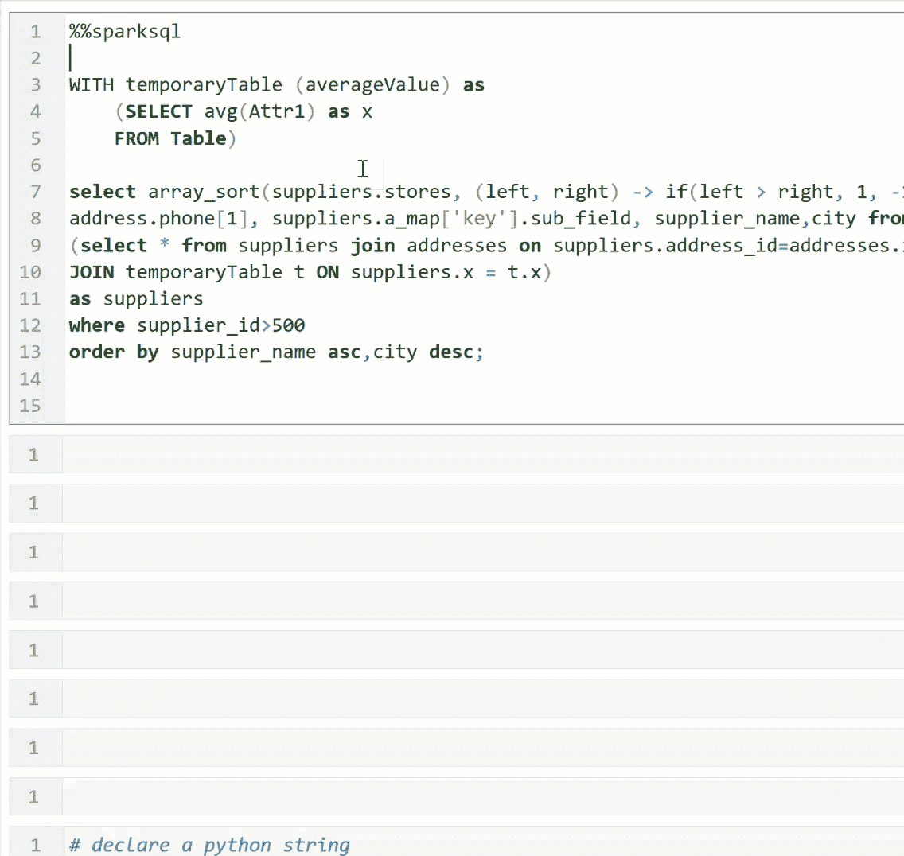
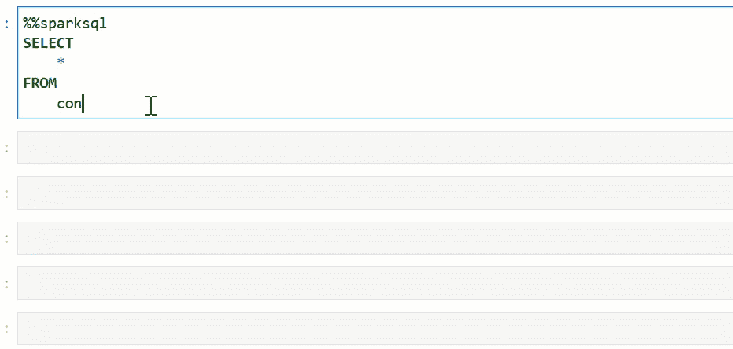
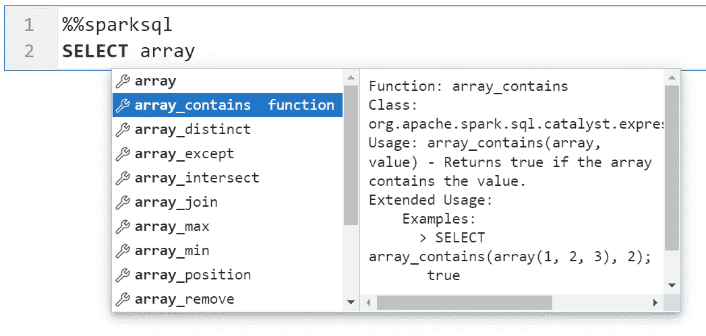
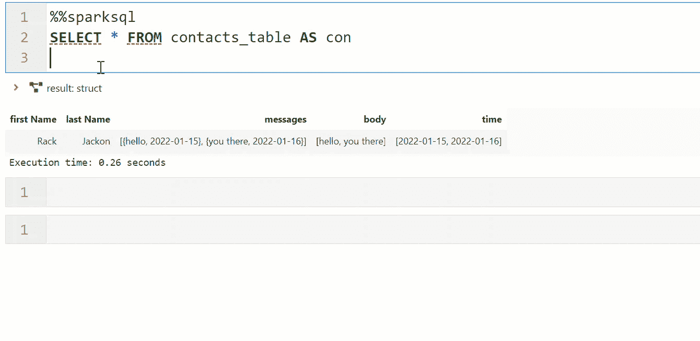
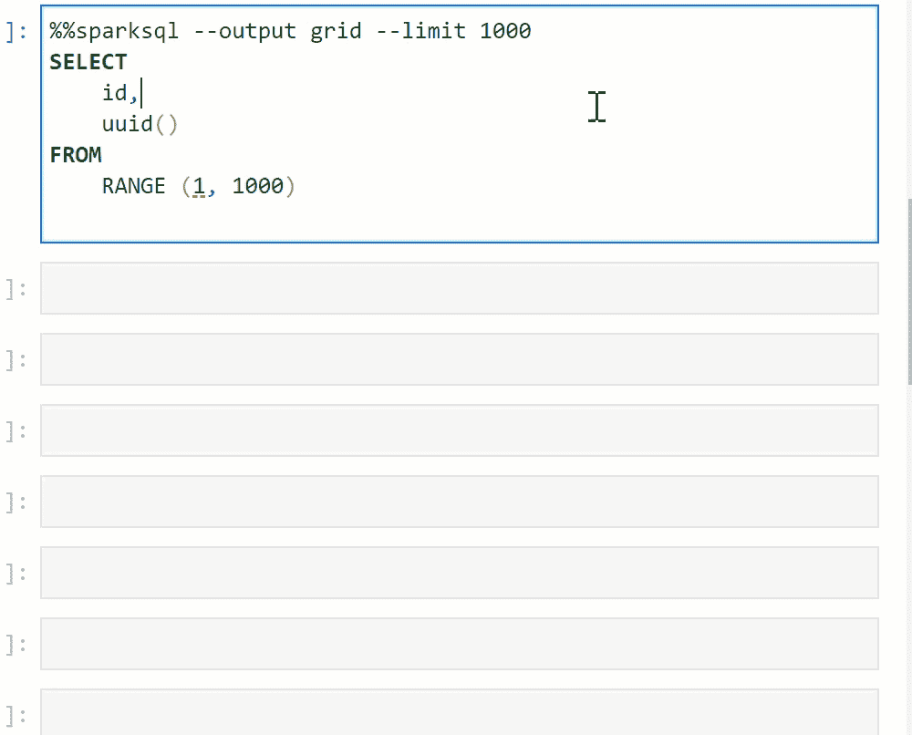
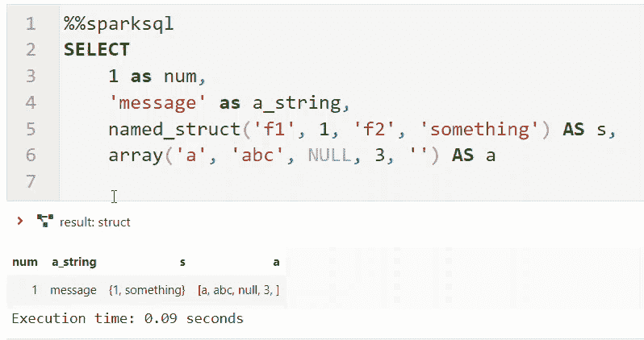
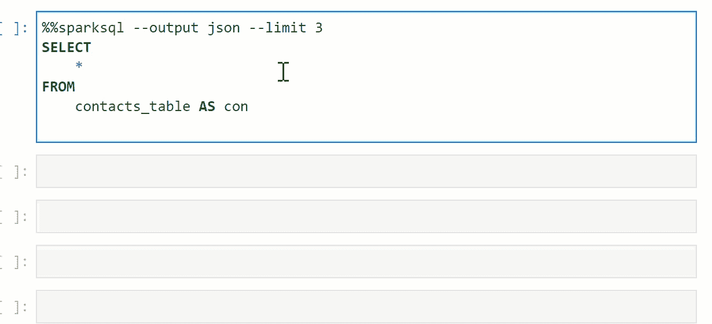
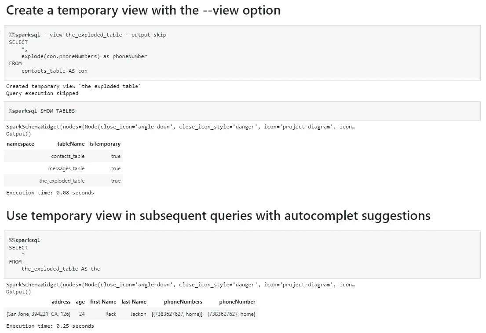
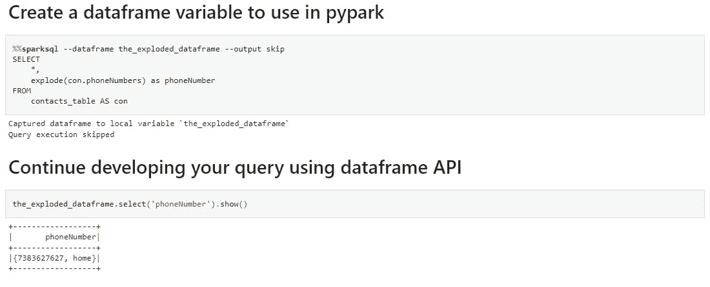

# 在 JupyterLab 中编写可组合的 Spark SQL 分析

> 原文：<https://towardsdatascience.com/jupyterlab-sql-cell-editor-e6ac865b42df>

## 使用 JupyterLab SQL cell magic editor 为您的 Spark SQL 笔记本增添一点魔力


Julia Kadel 在 Unsplash 上拍摄的照片

jupyterlab-sql-editor 是一个 ipython 魔术，它使您能够用 Spark SQL 编写可组合的分析。这个 jupyterlab 扩展有一组丰富的特性:

*   自动完成
    -表名、列名、嵌套子字段
    -表连接
    -函数
*   SQL 语法突出显示和格式化
*   多显示输出
    - html 和纯文本
    -交互式数据网格和 json 树
    -数据帧和视图的捕获

# 编辑 SQL 语句

jupyterlab-sql-editor 用 sql 格式和语法高亮扩展了 jupyterlab。



jupyterlab-sql-editor 还注册了一个提供自动补全功能的 LSP 服务器。按<tab>键触发自动完成表格和列名，包括嵌套子字段。使用`**%%sparksql --refresh all**`命令更新自动完成器使用的本地缓存文件。refresh 命令枚举在当前 spark 上下文中找到的函数、表和列。</tab>



自动完成 Spark SQL [函数](https://spark.apache.org/sql/)的文档和用法示例。



还有一些高级用户特性，比如自动填充 SELECT 语句中的所有列名，以及自动建议匹配列名的连接条件。



# 显示结果

sparksql magic 是一种执行 sparksql 语句的便捷方式。在本例中，我们执行一条语句，并将结果作为文本打印出来。

```
**%%sparksql** --output textSELECT * from range(1, 1000)
```

我们可以用 python 做同样的事情。

```
statement = 'select * from range(1, 1000)'
df = spark.sql(statement)
df.show()
```

如你所见，这不是真正的魔法。sparksql 魔术将单元格的主体作为语句，执行它并打印结果。该扩展简单地封装了样板 python 代码，并通过命令行选项使其随时可用。

Jupyterlab-sql-editor 支持一组丰富的输出格式，如交互式数据网格。我们使用彭博的 ipydatagrid，它可以对 Spark 查询返回的结果进行后处理(排序、过滤和搜索)。



树小部件显示结果的模式。这对于包含复杂嵌套数据结构的列特别有用。



使用 JSON 输出导航复杂嵌套列的内容。这个输出使用标准的 ipython 树小部件，它可以在任何嵌套字段中进行搜索。



到目前为止，我们已经看到了如何查询数据，但是您并不局限于查询。您可以执行 Spark SQL 支持的任何 SQL 语句。

```
**%%sparksql**
CREATE TABLE prod.db.sample (
    id bigint COMMENT 'unique id',
    data string)
USING iceberg**%%sparksql**
ALTER TABLE prod.db.sample
ADD COLUMNS (
    new_column string comment 'new_column docs'
  )
```

对简单的单行语句使用行魔法`**%sparksql**`

```
**%sparksql** SET spark.sql.variable.substitute=false
**%sparksql** DROP TABLE prod.db.sample
**%sparksql** CALL prod.system.set_current_snapshot('db.sample', 1)
```

# 使用 SQL 编写可组合分析

通用表表达式(CTE)是将大型 SQL 语句分成更易于管理的部分的标准方法。Jupyterlab-sql-editor 不仅支持 CTE，还允许您将 sql 语句捕获或别名为视图，然后可以在以后的单元格中重用。这种机制利用了 Spark dataframe 的`**createOrReplaceTempView**`功能。使用`**--view**`选项创建一个临时视图。要防止立即执行查询，请使用`**--output skip**`选项。使用此选项时，仅创建视图。



自动完成也适用于临时视图。使用`**%%sparksql --refresh local**`选项用您创建的任何本地视图更新您的自动完成缓存文件。

# 数据框架和 SQL 之间的互操作

到目前为止，我们已经看到了如何使用 SQL 视图来创建可组合的 SQL 分析。然而，您不仅限于 SQL，您可以在 SQL 和 dataframe 之间来回切换。您的部分分析可能更适合 dataframe API，因为其他部分可能更适合 SQL 方言。Jupyterlab-sql-editor 使方言之间的切换变得非常容易。使用`**--dataframe**`选项将 SQL 语句转换为数据帧。



给定任何数据帧，通过调用`**df.createOrReplaceTempView()**`切换回 SQL。例如，您可能使用 Spark ML、Spark GraphFrames，或者简单地使用像 CSV 这样的数据源。Spark 中的许多库都创建数据帧。

```
df = spark.read.csv(path)
df.createOrReplaceTempView(‘my_csv_table’)
```

然后参考您在`**%%sparksql**`中创建的视图

```
**%%sparksql**
SELECT * FROM my_csv_table
```

记得运行`**%%sparksql --refresh local**`来更新您的本地缓存，享受自动完成功能！

# 装置

jupyterlab-sql-editor 有两个主要的依赖项。 [jupyterlab-lsp](https://github.com/jupyter-lsp/jupyterlab-lsp) 和 [sql-language-server](https://github.com/joe-re/sql-language-server) 。安装扩展非常容易。

```
pip install jupyterlab-lsp jupyterlab-sql-editor
```

安装 sql-language-server 项目以提供自动完成功能。

```
sudo npm install -g sql-language-server
```

有关配置选项的完整列表，请参见[详细安装](https://github.com/CybercentreCanada/jupyterlab-sql-editor/blob/main/CONTRIBUTING.md)指南。

# 结论

在本文中，我们展示了如何利用`**%%sparksql**`在 Spark SQL 中轻松编写可组合的分析。我们关注的是 Spark，但是 jupyterlab-sql-editor 也包含了一个`**%%trino**`魔法！将来可能会添加更多的 SQL 引擎。欢迎投稿！这是我们的 git repo[cyber centre Canada/jupyterlab-SQL-editor](https://github.com/CybercentreCanada/jupyterlab-sql-editor)。

在[的后续文章](https://medium.com/p/1179e818fe17)中，我们将介绍 jupyterlab-sql-editor 对使用 Jinja 和 DBT 的 sql 模板的支持。

# 多谢

致这些项目的贡献者:

[krassowski/jupyterlab-LSP](https://github.com/jupyter-lsp/jupyterlab-lsp)
[Joe-re/SQL-language-server](https://github.com/joe-re/sql-language-server)
[zero turnaround/SQL-formatter](https://github.com/zeroturnaround/sql-formatter)
[cryeo/spark SQL-magic](https://github.com/cryeo/sparksql-magic)
[Bloomberg/ipydatagrid](https://github.com/bloomberg/ipydatagrid)