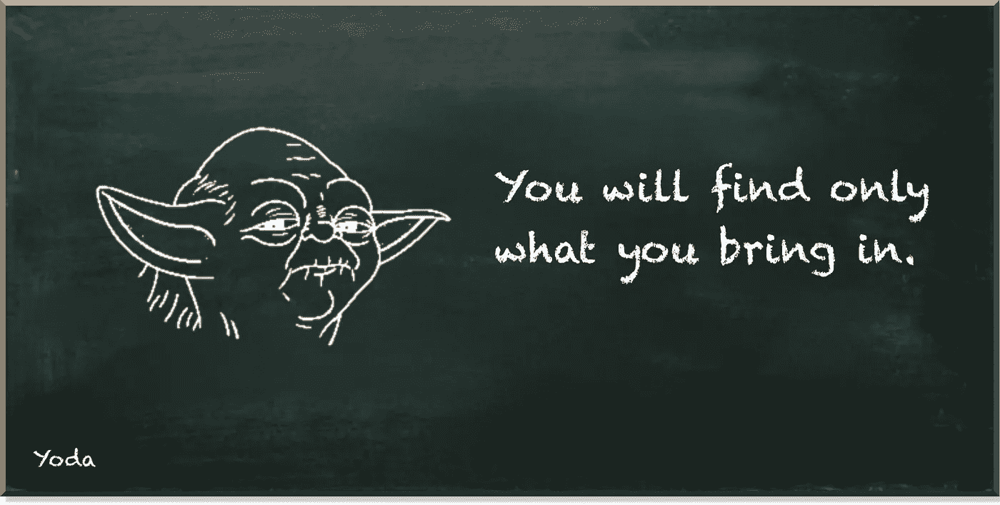

# 量子软件工程师生活中普通的一天

> 原文：<https://towardsdatascience.com/just-another-ordinary-day-in-the-life-of-a-quantum-software-engineer-24689cd962ff>

## 致力于 IBM 的量子开放科学奖

量子机器学习要不要入门？看看 [**动手量子机器学习用 Python**](https://www.pyqml.com/page?ref=medium_anotherday&dest=/) **。**

你看过这些关于工作和职业的真人秀吗？无论是警察、消防员、厨师，甚至是渔民，他们每天都经历着相当令人兴奋的事情。

不出所料，每个孩子都想在未来成为他们中的一员。没有孩子会梦想整天坐在电脑前喝咖啡。好吧，没有孩子，除了我两岁的儿子。每当他看到我坐在办公桌前，他都坚持要加入我，敲敲键盘，玩玩鼠标。

整天坐在电脑前的人不太适合演电视剧。但也许是为了一篇博文？

几周前，我写了一篇关于如何发现自己是否想从事量子计算职业的文章。我声称解决一个真正的问题是最好的方法。于是，我开始解剖 IBM 的量子开放科学奖，分享我的见解。首先，我们了解了[挑战实际上是关于](/a-first-glimpse-at-ibms-quantum-open-science-price-challenge-de4a2f41987e)的。它是关于应对一个天生不可靠的真实量子计算机。然后，我们研究了减少计算误差影响的方法。我们专注于 [Clifford 数据回归(CDR)](https://pyqml.medium.com/mitigating-quantum-errors-using-clifford-data-regression-98ab663bf4c6) 方法，该方法使用机器学习模型来预测和减轻噪声。最后，我们使用开源库 Mitiq 来减少模拟环境[和真实量子计算机](/how-to-implement-quantum-error-mitigation-with-qiskit-and-mitiq-e2f6a933619c)中的错误。

当然，我没有发明任何这些概念或工具。因此，我花了大量的时间阅读资料。令人惊讶的是，这些资料中的大部分并没有包含太多的数学或物理知识。但是源代码主要包括开发人员文档，事实上，还有 Python 源代码。我自己完成了 Mitiq 中的 CDR 实现和 Qiskit 中的状态层析实现。

通常，我会从主题的概念概述开始。如果你看了我关于 CDR 的第一篇[帖子](https://pyqml.medium.com/mitigating-quantum-errors-using-clifford-data-regression-98ab663bf4c6)，你会注意到它非常高级。它不包含一个数学公式。这是我感到舒服的理解水平。我不需要精确的数学来理解一个概念是什么。相比之下！当我第一次试图理解一个想法的本质时，我发现数学会让人分心。

因此，有了这个基本的理解，我继续重新创建一些现有的代码。在我的帖子[如何用 Qiskit 和 Mitiq](/how-to-implement-quantum-error-mitigation-with-qiskit-and-mitiq-e2f6a933619c) 实现量子错误缓解中，我使用了 Mitiq 提供的例子。然而，我没有复制和粘贴源代码。但是，我用 Qiskit 代替了 Cirq。

也许只有我。但是试图让一些现有的代码产生特定的行为是任何软件工程师的日常生活。这里没有任何量子物质。如果你试图剖析 CDR 或 React(一个 Javascript 库)，这并不重要。当然，比我更精通数学和物理的人可能会选择另一种方法来解决 IBM 的挑战。但是，我是【量子】**软件工程师**。它决定了我如何尝试解决问题。

作者图片

我尝试解决问题的方式不可避免地决定了我需要应对的斗争。这就像一个自我实现的预言。我决定遵循软件工程的方法。所以，我必须处理软件工程问题。

前一篇文章的结果显示误差减少了 60%以上。尽管这不如我们在[模拟环境](/practical-error-mitigation-on-a-real-quantum-computer-41a99dddf740)中实现的模拟测量的减轻效果好，但相对于未减轻的结果，这是一个相当不错的改进。但是我们从本质上减轻了什么呢？

CDR 方法减少了可观测值的测量值与其实际值(期望值)之间的偏差。在[这篇文章](/how-to-implement-quantum-error-mitigation-with-qiskit-and-mitiq-e2f6a933619c)中，我们更详细地观察了可观察到的现象。可观测值的期望值是一个单一的数字。它是实验测量的概率期望值。它类似于经典的期望值。例如，考虑投掷一枚公平的硬币，正面和反面着地的概率相等。如果将值 1 赋给正面，0 赋给反面，则期望值为 0.5*1+0.5*0=0.5。

因为期望值描述了测量值，它不描述内部量子态。而在量子计算中，内部量子态包含的信息比我们通过测量看到的要多得多。

这就是量子态断层成像发挥作用的地方。不可能在一个实验中确定一个量子态。让我们再想想硬币。假设你需要判断硬币在空中时是正面还是反面着地。你可能想看看它的转速。如果你知道它在下落一定距离时旋转了多少次，你就可以计算出剩下的距离。如果你愿意，量子实验可以告诉我们旋转速度。但它只告诉我们绕特定轴的速度。

但是，如果硬币也沿着它的边缘旋转呢？这是另一个轴。要知道边缘周围的旋转速度，我们需要从另一个角度来看硬币。我们需要从另一个角度来看。这就是我们在量子态层析成像中所做的。要重建单个量子位的状态，我们需要从三个不同的角度来看。这些是 X、Y 和 Z 轴。如果我们有两个量子位，就有九个角度:XX，XY，XZ，YX，YY，YZ，ZX，ZY 和 ZZ。我们必须从单量子位角度的每一个组合来看一个双量子位系统。原因就是纠结。纠缠量子位构建了一个量子系统，其分离的组成部分无法完全描述。但是我们需要全面地看待它。

如果我们的量子系统由三个量子位组成，就有 27 种不同的组合。有了 n 个量子比特，就有了 3^n 不同的视角。量子态层析成像只对小量子系统有效，比如 IBM 让我们模拟的三粒子海森堡模型哈密顿量。

幸运的是，Qiskit 提供了一个执行量子状态层析的函数。它包括三个步骤。

首先，我们从我们的初级电路(`qc`)导出一组 27 个量子电路(`st_qcs`)。这些电路中的每一个都以不同的方式“观察”初级电路。具体来说，这些电路中的每一个都将另一个可观察对象连接到主电路。

其次，我们用 Qiskit 创建一个`StateTomographyFitter`对象。我们提供了运行 27 个电路的测量结果和一种优化方法(这里是最小二乘法)。最后，我们使用 Qiskit 的`state_fidelity`函数来计算测量的量子态与期望态有多接近(这里是|110 >)

那么，我们如何使用 CDR 来减少误差并提高通过量子态层析成像评估的态保真度呢？

从概念上讲，这非常简单。我们用 27 个 CDR 实例替换 27 个状态层析成像电路。每一种都有不同的可观察性。然后，一旦我们运行电路，我们就可以使用 CDR 来降低测量误差。最后，我们重写了`StateTomographyFitter`类，以减轻期望值作为输入。

这听起来并不复杂。然而，重写这个类将是一项复杂的任务。

我正在谈论软件工程问题。

重写`StateTomographyFitter`类将花费大量的时间。不幸的是，时间是非常稀缺的资源。此外，我不相信 IBM 会接受基于重写他们的评估工具的提交。他们可能很难确保我重写的`StateTomographyFitter`不包含任何作弊。

因此，我将改进我的方法，使用默认的`StateTomographyFitter`。

量子机器学习要不要入门？看看 [**动手用 Python 学习量子机器**](https://www.pyqml.com/page?ref=medium_anotherday&dest=/) **。**

在这里免费获得前三章。