# k-均值聚类——简介

> 原文：<https://towardsdatascience.com/k-means-clustering-an-introduction-9825ea998d1e>

## 一种流行的无监督机器学习方法综述

照片由 Karolina Grabowska 拍摄，来自 Pexels.com。

当我们在项目的探索性数据分析阶段使用未标记的数据集时，我们可能会对根据相似性将数据分组感兴趣。这使我们能够轻松地识别数据中可能存在的任何模式，这些模式对于人眼来说可能并不明显。这是通过聚类的无监督学习过程实现的。

实现基于相似性的数据分组的最流行的聚类方法之一是 K 均值聚类。它是一种非常常用的无监督机器学习算法，相对容易理解，也容易在 Python 中实现。

在本文中，我们将介绍 K-means 聚类算法的基础知识。

# 什么是集群？

聚类是一种无监督的机器学习过程，旨在根据邻近点的相似性将未标记的数据集分成许多组。

具有相似特征的数据点被放在同一个聚类中，而具有不同特征的数据点被放在另一个聚类中。

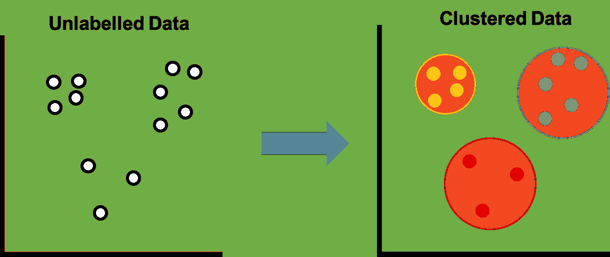

数据聚类前后。图片由作者提供。

有许多不同的算法可用于聚类数据，包括:

*   k 均值
*   基于密度的噪声应用空间聚类
*   高斯混合模型
*   病房
*   凝聚聚类
*   桦树

流行的 Scikit-Learn Python 库中可用的不同方法的示例可以在[这里](https://scikit-learn.org/stable/modules/clustering.html)查看。

# 什么是 K-means 聚类？

k 均值聚类是一种流行的无监督算法，它将数据分组为“k”个聚类，其中 k 由用户定义。该算法试图最小化每个聚类内所有平方距离的总和，并且还最小化数据点和称为质心的聚类中心点之间的距离。

质心在数据空间中的 k 个随机点处被初始化，并且基于到质心的距离，其周围的所有点被分配给相关的聚类。然后将质心调整到群集的中心点，并重新分配其周围的点。这种情况一直持续到质心没有变化或者这些点保持在同一个簇中，或者直到达到最大迭代次数。

K-means 是一种硬聚类方法，这意味着一个数据点要么属于一个聚类，要么不属于。

# K 均值聚类的应用

k-means 聚类的应用很多。

*   图象分割法
*   社会网络分析
*   客户细分
*   文件的分类
*   异常检测

在地球科学和岩石物理学领域:

*   基于测井测量的异常值检测
*   根据测井记录和/或岩心分析数据进行相分类

# k-均值聚类算法——工作原理

## K 均值聚类工作原理概述

以下工作流说明了 k-means 算法工作的整个过程。每个步骤将在后续章节中详细介绍。

k-means 聚类算法概述。图片由作者提供。

## K-Means 逐步聚类

让我们仔细看看每一个步骤。

## 第一步。收集我们的数据并确定“k”的值

第一步是将我们的数据收集在一起，并确定我们想要将数据分成多少个簇。对于这个数据集，我们将把它分成 3 个集群。

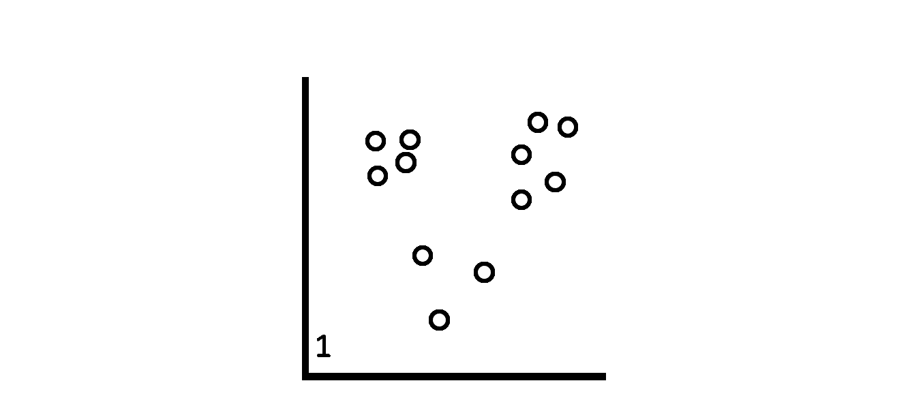

步骤 1，确定要将数据分组到的簇的数量。图片由作者提供。

有几种方法可以确定最佳集群数量，本节后面将介绍这些方法。

## 第二步。在数据中选择 k 个随机点

接下来，我们从数据中选择“k”个随机点。在这种情况下，k = 3，所以我们将选择 3 个随机点。这些是星团的质心。

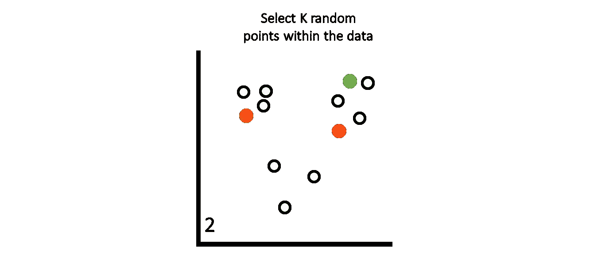

第二步:从数据集中随机选择 k 个点。图片由作者提供。

## 第三步。将点分配给最近的种子点

数据集中每个点与质心之间的距离是使用欧几里德距离计算的。

一旦计算出每个点的质心，我们就将每个点分配到最近的质心。这就形成了我们最初的聚类。

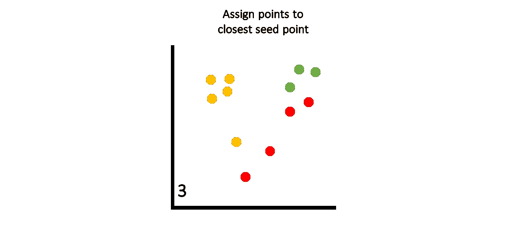

第三步:计算点和质心之间的欧氏距离。然后将这些点分配给最近的种子点(质心)。图片由作者提供。

## 第四步。确定新的中心点

然后，我们计算每个聚类的平均点。这些成为新的质心。

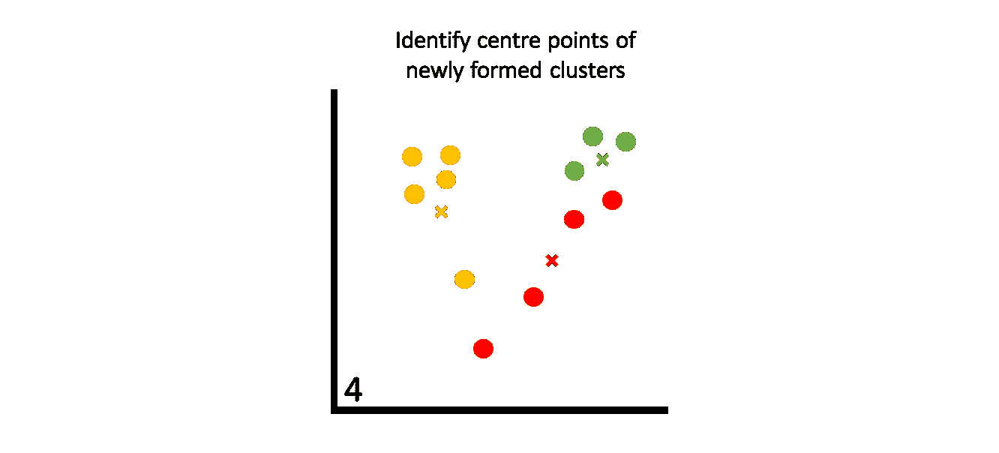

步骤 4:通过在每个聚类中寻找平均点来识别新的质心。图片由作者提供。

## 第五步。将点分配给最近的质心

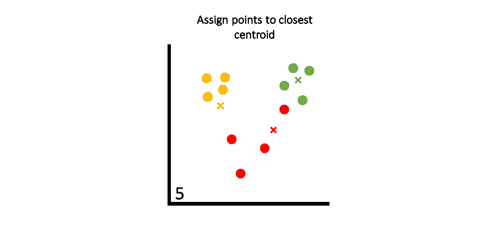

步骤 5:将点分配给新的簇形心。图片由作者提供。

然后，我们重复使用欧几里德距离将这些点分配给最近的聚类的过程。

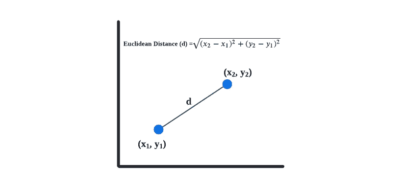

欧几里德距离的例子。图片由作者提供。

## 第六步。确定新的集群中心

然后重新计算质心。

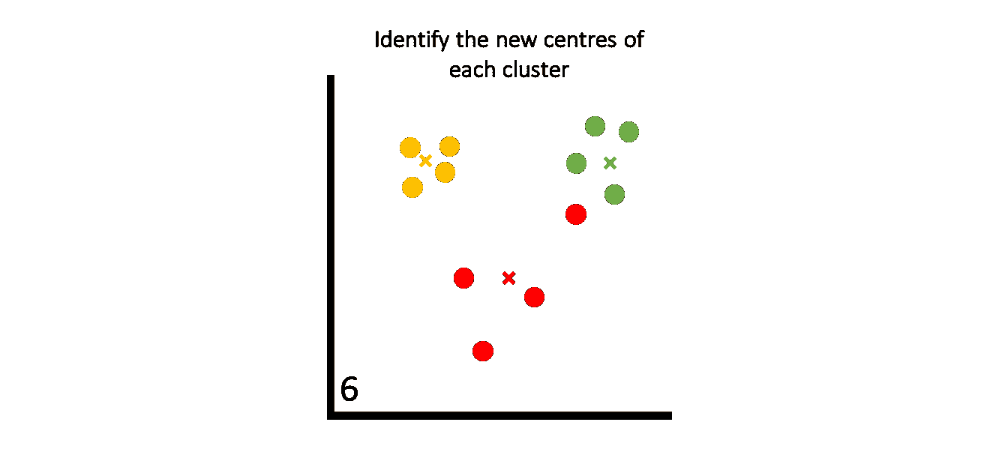

第六步:重新计算每个聚类的平均点，并调整质心。图片由作者提供。

## 第七步。重复步骤 4–6

将点分配到最近的质心并重新计算平均点的过程

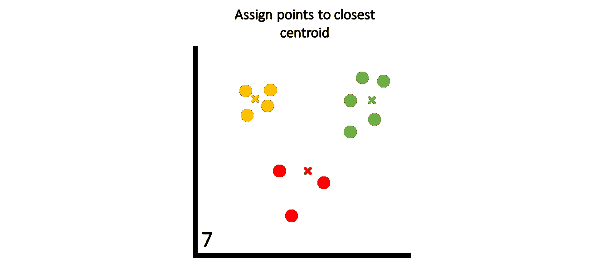

步骤 6:将点重新分配到最近的质心。图片由作者提供。

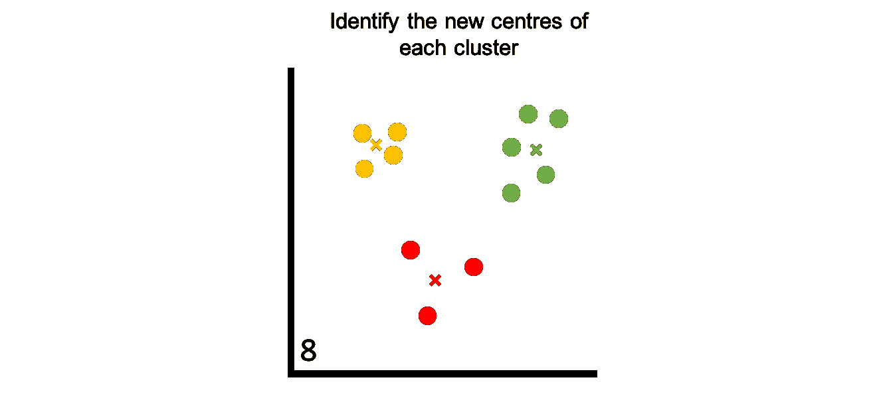

步骤 7:识别新的质心，重复这个过程，直到满足指定的条件。图片由作者提供。

# 聚类什么时候停止？

我们重复聚类的过程，直到我们达到某些条件:

*   已经达到最大迭代次数
*   质心位置或被聚类的点没有变化或变化很小的模型收敛

# 确定最佳聚类数

我们可以使用多种技术来为自己得出一个值，而不是猜测 k 的数字。这里讨论的两种方法是简单的手动方法，用于确定“k”的最佳值。

## 肘图

肘方法是确定最佳聚类数的最常用方法，因为它简单且易于可视化。

本质上，我们使用不同数量的 k 多次运行 k 均值算法，并计算误差平方和的类内和(WSS)。这个特性也被称为**惯性。**

一旦我们有了结果，我们就绘制出每个集群的惯性，并确定图表中数据开始“变平”的点。在下面的例子中，我们可以选择 5 到 10 之间的一个值作为 k 的最佳值。

请记住，对大量集群执行此操作会增加计算时间。

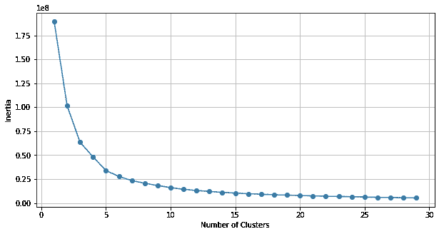

选择最佳聚类数的肘图。[作者的形象。](/how-to-use-unsupervised-learning-to-cluster-well-log-data-using-python-a552713748b5)

## 剪影法

剪影方法提供了一种测量方法，用于测量数据点在自己的聚类(内聚)中与其他聚类(分离)的相似程度。

它提供一个介于+1 和-1 之间的值，越接近+1 的值越合适，表示数据点位于正确的聚类内，并且远离其他聚类。

如果我们有多个负值，那么我们可能有太多或太少的集群。

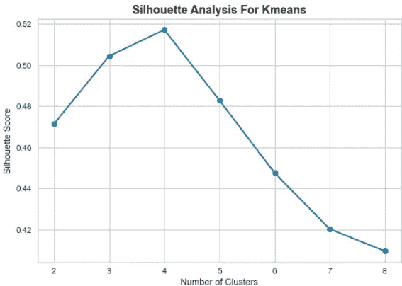

用于选择 k-means 聚类的最佳聚类数的剪影分析。图片由作者提供。

有关这两种方法的更多详细信息，请访问:

 [## K 均值| K 均值聚类|寻找 K 的最佳值的方法

### 对预测不感兴趣(因为我们没有目标/输出变量)。目标是发现…

www.analyticsvidhya.com](https://www.analyticsvidhya.com/blog/2021/05/k-mean-getting-the-optimal-number-of-clusters/) 

# 改进 K 均值结果

如果我们再次重复 K-means 聚类过程，并根据参数，我们可能会得到不同的结果。这是由于被选作初始质心的点的不同。此外，一旦这些点被初始化，它们就很难移动很大的距离或靠近已经相对稳定的集群。

改进结果的一种方法是重复 k-means 过程，并试图找到所有聚类中方差的最低和。

还有许多初始化技术可用于 k 均值聚类，包括:

*   选择随机点(示例中使用的点)
*   [k-means ++](http://ilpubs.stanford.edu:8090/778/1/2006-13.pdf)
*   [天真的分片](https://www.kdnuggets.com/2017/03/naive-sharding-centroid-initialization-method.html)
*   最远点启发式
*   启发式排序
*   基于投影

# K-均值聚类的优缺点

**优点:**

*   一种快速有效的算法
*   容易理解
*   易于在 Python 中实现
*   可以扩展到大型数据集
*   保证收敛

**缺点:**

*   在运行算法之前，需要指定 k 的数值
*   取决于质心的初始化方式。一旦质心被初始化，它们就不能被移动很大的距离，或者如果其他集群相对稳定
*   对异常值和噪声敏感-异常值会影响质心的初始化
*   对于大型数据集，速度可能会成为一个问题
*   随着维度数量的增加，可能会出现问题
*   [假设聚类是球形的，每个聚类具有相似数量的数据点](https://www.inovex.de/de/blog/disadvantages-of-k-means-clustering/#:~:text=The%20most%20important%20limitations%20of,roughly%20equal%20numbers%20of%20observations)

# Python 实现

我之前写了一篇文章，介绍了所需的步骤和代码示例。这个例子使用测井数据测量将数据分成不同的组，这些组可以解释为不同的岩性。

你可以在下面的链接中找到它。

 [## 如何使用 Python 使用无监督学习对测井数据进行聚类

towardsdatascience.com](/how-to-use-unsupervised-learning-to-cluster-well-log-data-using-python-a552713748b5) 

# 摘要

总之，K-means 算法是一种非常流行的无监督机器学习技术，易于理解和实现。这是根据相似性将数据点分组的有效解决方案，应该在数据分析的探索阶段将其作为一种选择。

*感谢阅读。在你走之前，你一定要订阅我的内容，把我的文章放到你的收件箱里。* [***你可以在这里做！***](https://andymcdonaldgeo.medium.com/subscribe)**或者，您可以* [***注册我的简讯***](https://fabulous-founder-2965.ck.page/2ca286e572) *免费获取更多内容直接发送到您的收件箱。**

*其次，通过注册会员，你可以获得完整的媒介体验，并支持我和其他成千上万的作家。它每个月只花你 5 美元，你可以完全接触到所有令人惊叹的媒体文章，也有机会用你的写作赚钱。如果你用 [***我的链接***](https://andymcdonaldgeo.medium.com/membership)**报名，你直接用你的一部分费用支持我，不会多花你多少钱。如果你这样做了，非常感谢你的支持！***