# K-means 聚类和主成分分析 10 分钟

> 原文：<https://towardsdatascience.com/k-means-clustering-and-principal-component-analysis-in-10-minutes-2c5b69c36b6b>

## 机器学习

## 通过实践案例研究演练


Julian Hochgesang 在 [Unsplash](https://unsplash.com?utm_source=medium&utm_medium=referral) 上拍摄的照片

这里有两种主要的机器学习模型:有监督的和无监督的。在监督学习中，你有 ***输入数据*** *X* 和 ***输出数据*** *y* ，然后模型从 *X* 到 *y* 找到一个 ***映射*** 。在无监督学习中，你只有 ***输入数据*** *X* 。无监督学习的目标各不相同:在 *X* 中对观察值进行聚类，降低 *X* 的维度，在 *X* 中进行异常检测等。

由于监督学习已经在本系列的 [***第一部分***](/understanding-3-classical-machine-learning-models-once-and-for-all-part-1-32a1ac52c0fd) 和 [***第二部分***](/k-nearest-neighbors-naive-bayes-and-decision-tree-in-10-minutes-f8620b25e89b) 中进行了广泛的讨论，所以本故事将重点讨论无监督学习。在许多其他无监督的学习任务中，您将遇到 k-means 聚类和主成分分析(PCA)的降维。

```
**Table of contents****·** [**K-means Clustering**](#ba75)
**·** [**Principal Component Analysis (PCA)**](#74ac)
  ∘ [Noise](#b83e)
  ∘ [Redundancy](#8ec4)
  ∘ [Case Study](#9c11)
**·** [**Conclusion**](#2d76)
```

# k 均值聚类

[***聚类***](https://en.wikipedia.org/wiki/Cluster_analysis) 的思想是对观察值进行分组，使得同一组内的观察值彼此相似(或相关)，而与其他组内的观察值不同(或无关)。有许多算法可以实现这一点，其中之一是 k-means。


梅尔·普尔在 [Unsplash](https://unsplash.com?utm_source=medium&utm_medium=referral) 上拍摄的照片

K-means 是一种基于质心的聚类算法，其工作原理如下。

1.  随机初始化:随机放置 k 个形心。
2.  分类指定:根据到质心的距离，将每个观测值指定到最近的分类。
3.  质心更新:将质心移动到同一个聚类的平均观测值。
4.  重复步骤 2 和 3，直到达到收敛。

用户在实现 k-means 聚类时必须确定两个超参数:质心数量 *k* ，以及所使用的距离度量(通常是 [***欧几里德距离***](https://en.wikipedia.org/wiki/Euclidean_distance) 或 [***曼哈顿距离***](https://en.wikipedia.org/wiki/Taxicab_geometry) )。在这个故事中，我们将使用欧几里德距离，它是由公式定义的

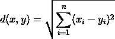

其中 *x* = ( *x₁* ， *x₂* ，…， *xₙ* )和 *y* = ( *y₁* ， *y₂* ，…， *yₙ* )为维度为 *n* 的观测值。因此，现在我们只需要确定 *k* 。

由于我们希望观察值组中的观察值彼此相似，因此好的聚类是平方和(WSS)最小的聚类，也就是说，每个观察值到其所属聚类的质心的二次距离之和最小。

此外，由于一个组中的观察值需要不同于其他组中的观察值，所以好的聚类具有更大的平方和(BSS)。这里，BSS 只是从每个质心到全局平均值的二次距离之和，由每个聚类中的观察值数量加权。

数学上，WSS 和盲源分离公式如下

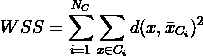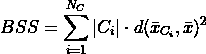

在哪里

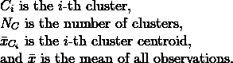

很容易看出，较高的 k 值对应于较低的 WSS。然而， *k* 必须从商业的角度来确定，或者更客观地使用所谓的肘方法。

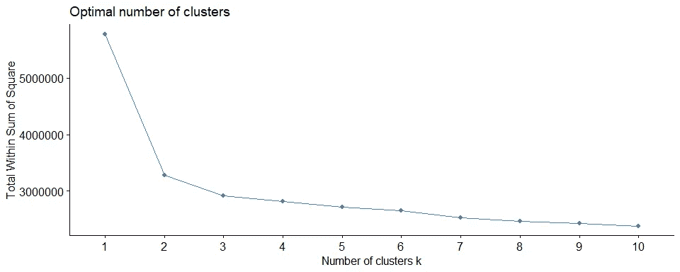

使用肘法确定 k |图片由[作者](http://dwiuzila.medium.com/membership)

肘方法说我们应该选择 *k* ，在那里增加它将不会导致 WSS 更明显的减少。因此从上面的图中，例如，我们选择 *k* = 2 或 *k* = 3。

下面是一个逐步 k-means 聚类过程的例子，用 *k* = 3 和“ **×** ”表示质心。

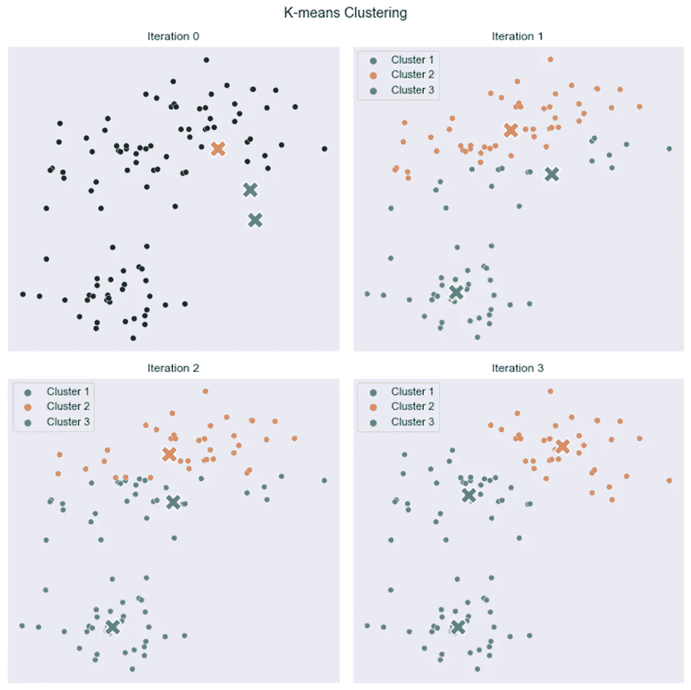

k-means 聚类的逐步过程。它从质心的**随机初始化**开始，并对[作者](http://dwiuzila.medium.com/membership)的每个迭代 1、2 和 3 |图像进行**聚类分配**和**质心更新**

给定足够的时间，k-means 总会收敛。然而，收敛可能是局部最小值。这高度依赖于质心的初始化。因此，计算通常要进行几次**，质心的初始化不同。**

**帮助解决这个问题的一个方法是 **k-means++** 初始化方案。这将初始化质心(通常)彼此远离，可能会比随机初始化产生更好的结果。**

**K-means 是*而不是*总是聚类的好选择。由于距离选择和 k-means 聚类所做的一些隐含假设，一些数据可能会利用 k-means 弱点。下图显示了其中的一些场景。**

**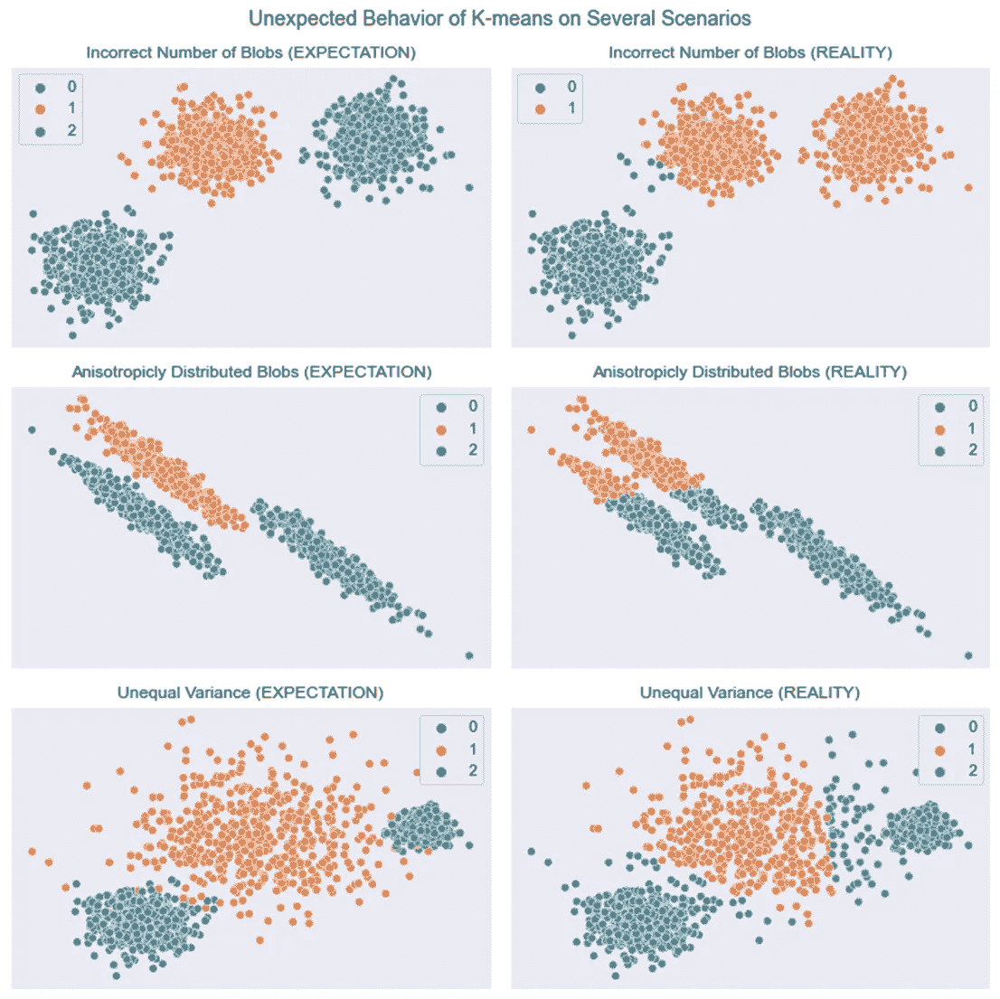**

**数据不符合 k-means 作出的一些隐含假设(**选择 k** 、**各向同性聚类**、**等方差**)，结果产生了不需要的聚类|图片由[作者](http://dwiuzila.medium.com/membership)**

**因此，首先对数据进行转换总是一个好的做法。还有很多其他的聚类算法来解决这个问题，比如谱聚类、凝聚聚类、ward 层次聚类、DBSCAN、BIRCH 等等。**

# **主成分分析**

**PCA 的目标是识别最有意义的基础来重新表达数据。希望这个新的基础能过滤掉噪音，揭示隐藏的结构。PCA 问:有没有另一个基，是原始基的*线性组合*，最好的重新表达你的数据？**

****

**照片由[西格蒙德](https://unsplash.com/@sigmund?utm_source=medium&utm_medium=referral)在 [Unsplash](https://unsplash.com?utm_source=medium&utm_medium=referral) 拍摄**

**设 *X* 是一个有 *m* 个观测值和 *n* 个特征的数据集，所以 *X* 是一个 *m* × *n* 矩阵。为了简化计算，我们将 *X* 标准化，使其平均值为零。**

**设 *Y* 为 *X* 的新表示，另一个 *m* × *n* 矩阵通过线性变换 *P* 与 *X* 相关(其本身就是一个 *n* × *n* 矩阵)。PCA 会找到将 *X* 转换成*Y*线性的 *P* ，也就是说，**

**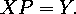**

**从这个方程中我们可以看出， *P* 的列是一组新的用于表示 *X* 中观测值(行)的基向量，称为 *X* 的 ***主成分*** 。现在，什么是基 *P* 的好选择？我们希望 *Y* 展示什么特征？要回答这些问题，考虑两个角度:*噪声*和*冗余*。**

## **噪音**

**记住，在 *Y* 中，我们希望过滤掉噪声。衡量噪声的标准是信噪比(SNR)，或方差比**

**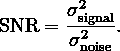**

**高信噪比(≫1)表示高精度数据，而低信噪比表示高噪声数据。我们假设感兴趣的维度存在于具有最大方差和大概最高 SNR 的方向上。**

**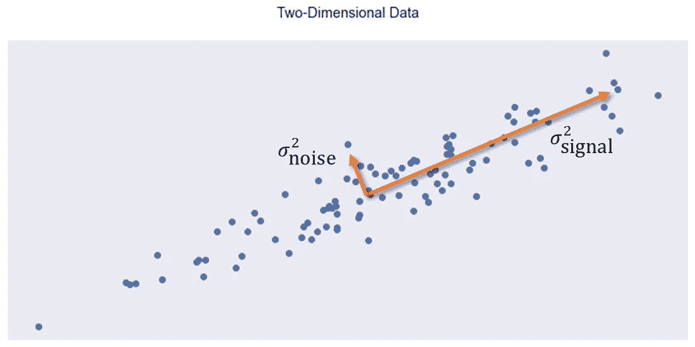**

**信号和噪声的变化用对着数据云的两条线来表示|图片作者[作者](http://dwiuzila.medium.com/membership)**

## **裁员**

**假设你的数据是二维的，有特征 *x* ₁和 *x* ₂.考虑下面的三个情节。**

**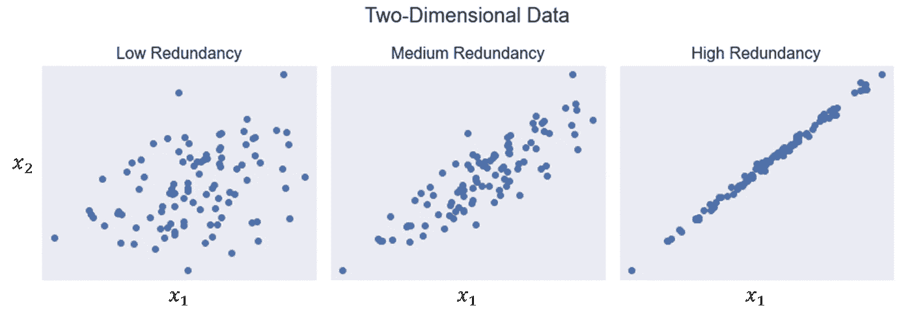**

**一系列可能的数据冗余。最右侧图中的特征高度相关，表明冗余度高。|图片由[作者](http://dwiuzila.medium.com/membership)**

**如果可以从 *x* ₁计算出 *x* ₂，我们就说数据具有高冗余度(反之亦然)。如果是这种情况(如上面最右边的图)，其中一个特征是冗余的，可以在不牺牲太多信息的情况下减少数据维数。事实上，这是降维背后的中心思想。**

**从这两个角度来看，PCA 都需要特征的*方差*(用于最大化信号)和特征对的*协方差*(用于最小化冗余) *X* 。这正是 *X* 的协方差矩阵的用途，根据定义可以写成**

**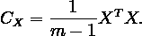**

***Cₓ* 是一个 *n* × *n* 矩阵，对角项代表特征的方差，非对角项代表特征对的协方差，反映了我们数据中的噪声和冗余:**

1.  **根据假设，对角线上的大值对应于**有趣的结构**。**
2.  **在非对角线术语中，大幅度对应于高**冗余**。**

**设 *Cᵧ* 为 *Y* 的协方差矩阵。那么当使用 *P* 将 *X* 转化为 *Y* 时，优化后的 *Cᵧ* 会是什么样子呢？**

1.  **在 *Y* 中的每个连续维度应该根据方差进行排序，以突出**有趣的结构**。**
2.  **在 *Cᵧ* 中的所有非对角线项应该为零。因此， *Cᵧ* 一定是对角矩阵，在 *Y* 中没有**冗余**。**

**有很多方法可以对角化 *Cᵧ* 。对于 PCA，它假设 *P* 是一个 [***正交矩阵***](https://en.wikipedia.org/wiki/Orthogonal_matrix) 。现在，常设仲裁法院的任务已经简化为:**

> **在 *XP* = *Y* 中找一些正交矩阵 *P* 使得*cᵧ*=*yᵀy*/(m1)是对角矩阵。 *P* 列是 *X* 的 ***主成分*** 。**

**由于 *Cₓ* 是对称的，所以存在矩阵 *D* 和 *E* 使得 *Cₓ* = *EDEᵀ* ，其中 *D* 是对角矩阵， *E* 是按列排列的 *Cₓ* 的特征向量矩阵。而且， *Cₓ* 和 *D* 有相同的特征值。由于 *D* 是对角矩阵，其特征值就是其主对角线的元素。**

**选择*P*≦*E*，然后**

**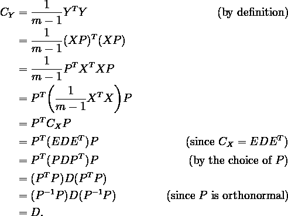**

**总而言之，到目前为止，我们已经成功地找到了一个矩阵 *P* ，其中它的列是 *X* 的协方差矩阵 *Cₓ* 的**特征向量。矩阵 *P* 满足 *XP* = *Y* 使得 *Y* 的协方差矩阵 *Cᵧ* 为对角矩阵，其中对角线由 *Cₓ* 的**特征值**组成。所以， *Y* 中没有**冗余**。****

**为了确保 *Y* 中的每个连续维度根据方差进行排序，以便突出显示**有趣的结构**，您可以对 *D* 中 *Cₓ* 的**特征值**进行重新排序，以便更大的特征值位于左上角(当然也可以通过重新排列 *P* 的列和 *Pᵀ* 的行来满足**

***PCA 可以通过只选择重排后 *P* 的前几列进行降维。要选择的列数是 PCA 的超参数。列数越多意味着原始数据中解释的差异越多 *X* 。这对于可视化、汇总大量数据或查找有区别的特征非常有用。***

***经过这么长时间的推导，我们终于能够编写 PCA 算法了:***

1.  ***将原始数据 *X* 标准化为零均值，其中 *X* 是一个 *m* × *n* 矩阵。***
2.  ***计算 *X* 的协方差矩阵 *Cₓ* 。***
3.  ***计算 *Cₓ* 的特征值和对应的特征向量。***
4.  ***将 *Cₓ* 的特征值按降序排序，并将 *Cₓ* 的特征向量按降序排序。***
5.  ***选择前 *k* 个特征向量，排列成 *P* 列。这样， *P* 就是一个 *n* × *k* 矩阵。***
6.  ***通过 *Y* = *XP* 计算缩减后的数据 *Y* 。因此， *Y* 是一个 *m* × *k* 矩阵。***

## ***个案研究***

***在本案例研究中，您将使用 [***虹膜数据集***](https://archive.ics.uci.edu/ml/machine-learning-databases/iris/iris.data) 。***

***该数据集包含 3 类，每类 50 个观察值，其中每类涉及一种鸢尾植物(鸢尾、杂色鸢尾或海滨鸢尾)。根据植物萼片和花瓣的测量结果，数据集中有四个特征。***

***您希望在散点图中显示数据集。然而，这是不可能的，因为不存在所谓的四维散点图。因此，您从数据集中提取尽可能多的信息以获得二维表示，并为此使用 PCA。***

****X* 是一个 150 × 4 的矩阵，其特征方式如下。***

```
*sepal length (cm)    5.843333
sepal width (cm)     3.057333
petal length (cm)    3.758000
petal width (cm)     1.199333*
```

***对于每个特征，从每个观察值中减去相应的平均值。现在你应该有了这个以零为中心的数据集。姑且称之为 *X_meaned* 。***

****X_meaned* 的协方差矩阵是一个 4 × 4 矩阵***

***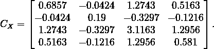***

***因此， *Cₓ* 有四个特征值和相应的特征向量。他们是***

***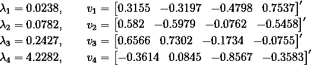***

***根据特征值降序排列特征向量。既然你想要一个 *X* 的二维表示，那就挑两个特征值最大的特征向量，表示可以提取的最大信息。他们是 v₄的*和 v₃的*。在考虑顺序的同时，将它们按列排列。你会得到一个 4 × 2 的线性变换矩阵***

***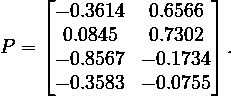***

***简化后的数据 *Y* 可以通过乘以 *X_meaned* 和 *P* 来计算。你得到 *Y* 如下。***

***有了这个双特征数据集，您现在可以如下可视化虹膜数据集的本质。***

***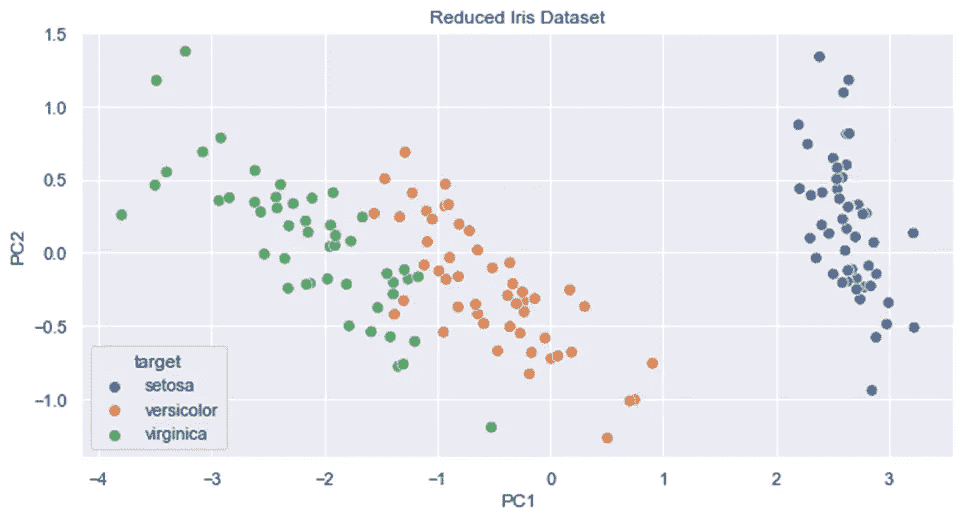***

***虹膜数据集前两个主要成分的散点图|图片作者[作者](http://dwiuzila.medium.com/membership)***

# ***结论***

***您已经非常详细地学习了 **K 均值聚类**并应用了**主成分分析**进行可视化。现在，您不仅可以使用已建立的库来构建它们，还可以自信地知道它们是如何从内到外工作的，使用它们的最佳实践，以及如何提高它们的性能。***

***恭喜你。***

******

***马库斯·斯皮斯克在 [Unsplash](https://unsplash.com?utm_source=medium&utm_medium=referral) 上拍摄的照片***

***🔥*谢谢！如果你喜欢这个故事，想支持我这个作家，可以考虑* [***成为会员***](https://dwiuzila.medium.com/membership) *。每月只需 5 美元，你就可以无限制地阅读媒体上的所有报道。如果你注册使用我的链接，我会赚一小笔佣金。****

***🔖想知道更多关于梯度下降和许多其他优化器的工作原理吗？继续阅读:***

***

[艾伯斯·乌兹拉](https://dwiuzila.medium.com/?source=post_page-----2c5b69c36b6b--------------------------------)*** 

## ***从零开始的机器学习***

***[View list](https://dwiuzila.medium.com/list/machine-learning-from-scratch-b35db8650093?source=post_page-----2c5b69c36b6b--------------------------------)******8 stories************************

[艾伯斯·乌兹拉](https://dwiuzila.medium.com/?source=post_page-----2c5b69c36b6b--------------------------------)*** 

## ***我最好的故事***

***[View list](https://dwiuzila.medium.com/list/my-best-stories-d8243ae80aa0?source=post_page-----2c5b69c36b6b--------------------------------)******24 stories*********************

***[1]主成分分析教程([arxiv.org/abs/1404.1100](https://arxiv.org/abs/1404.1100))***

***[2][sci kit-学习用户指南](https://scikit-learn.org/stable/modules/clustering.html)***