# k-均值聚类:把它解释给我听，就像我 10 岁一样

> 原文：<https://towardsdatascience.com/k-means-clustering-explain-it-to-me-like-im-10-e0badf10734a>

# k-均值聚类:把它解释给我听，就像我 10 岁一样

## 一个长期流行的聚类算法的友好介绍

这将是**向一个 10 岁的**系列解释机器学习算法的第二个*系列*(只是因为这一系列听起来比文章更有趣)。你可以在这里 找到 XGBoost 分类文章 [***。今天我将向一个 10 岁的孩子或者基本上是 ML 算法世界的任何新手解释 K-Means 聚类，一个非常流行的聚类算法。我将试图消除血淋淋的，数学细节，并解释背后的简单直觉。***](/xgboost-regression-explain-it-to-me-like-im-10-2cf324b0bbdb)

在开始学习算法之前，我们先了解一下什么是聚类。聚类包括自动发现数据中的自然分组。通常，当我们得到可以可视化的数据时(二维甚至三维数据)，人眼可以很容易地形成不同的集群。但是机器要做到这一点就有点难了。这就是聚类算法发挥作用的地方。这也可以推广到更高的维度来聚集数据，这甚至是人眼无法做到的。现在我们已经解决了这个问题，k 代表我们开始了！

假设我们有 19 个数据点，如下所示:

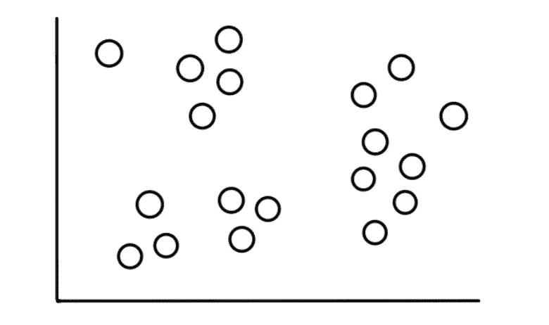

现在假设我们知道这些数据属于 3 个相对明显的类别，如下所示:

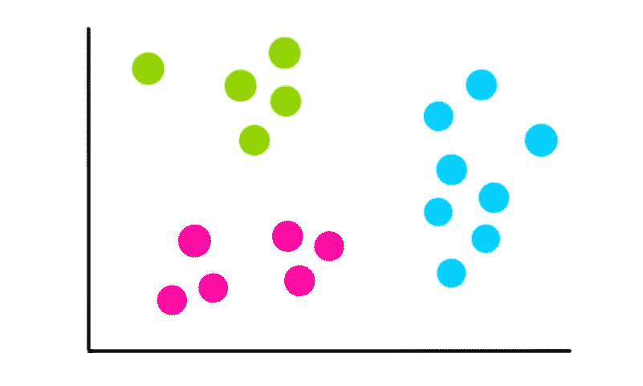

我们的任务是使用 k-means 聚类算法来进行分类。

# 步骤 1:选择聚类数 k

*我们要识别的聚类数就是 k-means 聚类中的 k*。在这种情况下，由于我们假设有 3 个集群，k = 3。

# 第二步:随机选择 k 个点

我们通过选择 3 个随机点(不一定是我们的数据点)开始寻找聚类的过程。这些点现在将作为*质心、*或中心，我们将制作:

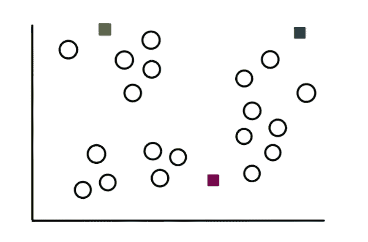

# 步骤 3:创建 k 个集群

为了形成聚类，我们从测量每个数据点到 3 个质心的距离开始。我们把这些点分配给离它最近的聚类。因此，对于一个样本点，距离如下所示:

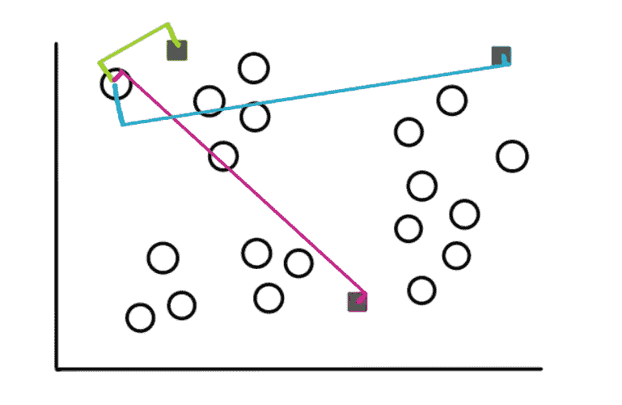

只看它，我们看到从该点到绿色质心的距离是最小的，所以我们将该点分配给绿色簇。

在二维空间中，计算两点间距离的公式是:

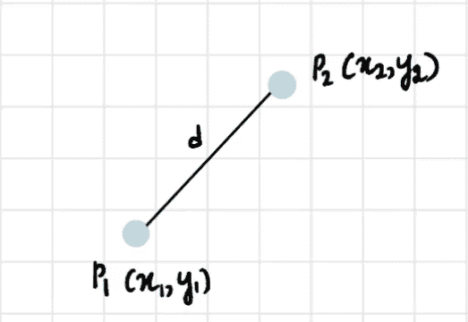

使用上面的公式，我们对其余的点重复这个过程，聚类将看起来像这样:

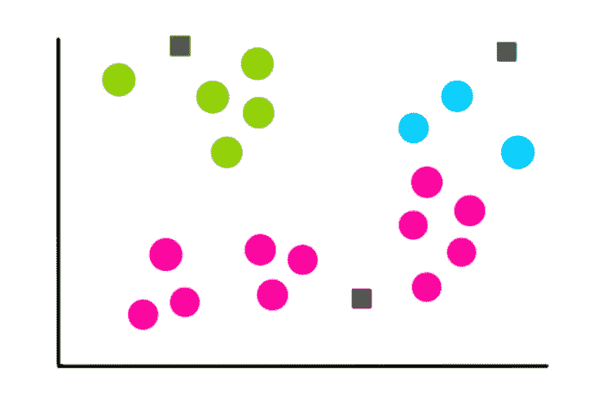

# 步骤 4:计算每个聚类的新质心

现在我们有了 3 个簇，我们找到了它们各自形成的新的质心。例如，我们计算蓝色星团质心坐标的方法是:

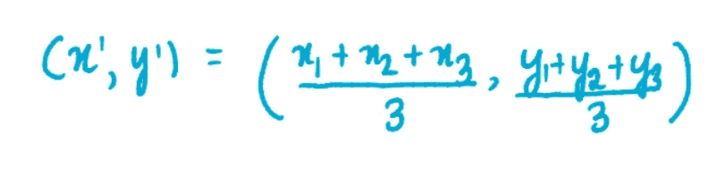

其中 x1、x2 和 x3 是蓝色簇中 3 个点的 x 坐标。y1、y2 和 y3 是蓝色群集的 3 个点中的每一个的 y 坐标。我们将坐标之和除以 3，因为蓝色集群中有 3 个数据点。类似地，粉色和绿色星团的质心坐标为:

新的质心看起来像这样:

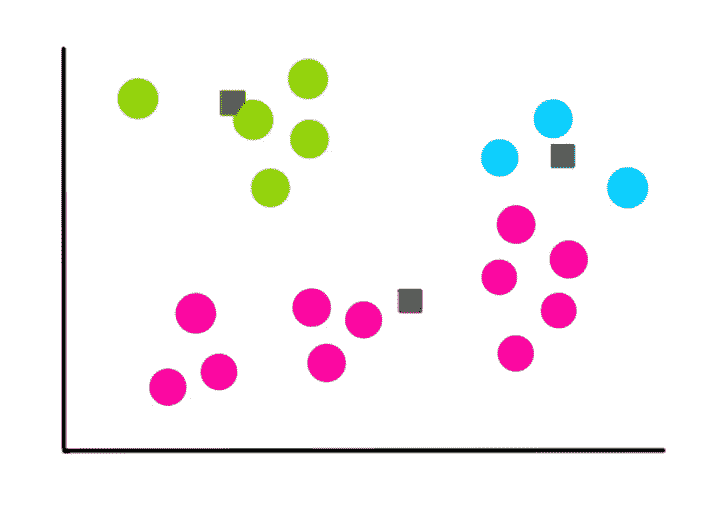

# 步骤 5:评估每个集群的质量

因为 k-means 不能像我们一样看到聚类，所以它通过找到所有聚类中的变化来测量质量。k-means 聚类背后的基本思想是定义聚类，以便最小化聚类内的变化。我们通过计算所谓的**(WCSS)来量化这个方差:**

**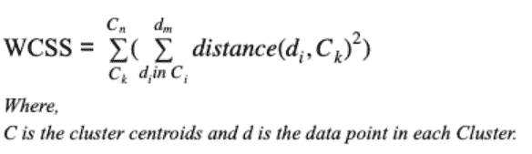**

> ***这是一个看起来很吓人的公式，所以如果你没有真正理解它，没关系；试着去理解背后的直觉就好。***

**出于简化的目的，让我们像这样直观地表示变化:**

****

# **步骤 6:重复步骤 3-5**

**一旦我们有了以前的聚类和存储的变化，我们就从头开始。但是只有这一次，我们使用先前计算的质心来生成 3 个新的聚类，重新计算新聚类的中心，并计算所有聚类内的变化的总和。**

**让我们假设接下来的 4 次迭代如下所示:**

**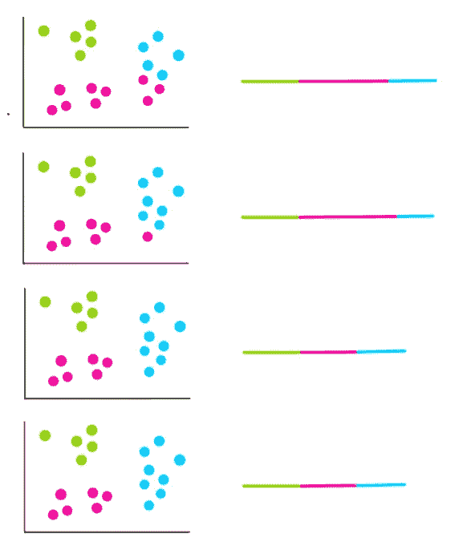**

**从最后两次迭代中，我们看到集群没有改变。这意味着算法已经*收敛*，我们停止聚类过程。然后，我们选择具有最小 WCSS 的集群。这也恰好是最后两次迭代的那些。因此，它们将是我们最后的集群。**

## **我们如何选择 k？**

**在我们的例子中，我们很方便地知道我们需要 3 个集群。但是如果我们不知道我们有多少个簇，那么我们如何选择 k 呢？**

**在这种情况下，我们尝试多个 k 值并计算 WCSS。**

**k=1:**

**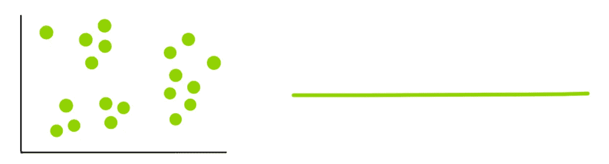**

**k=2:**

**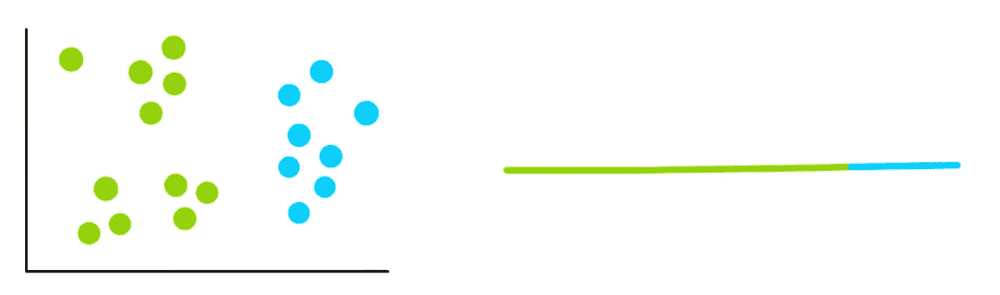**

**k=3:**

**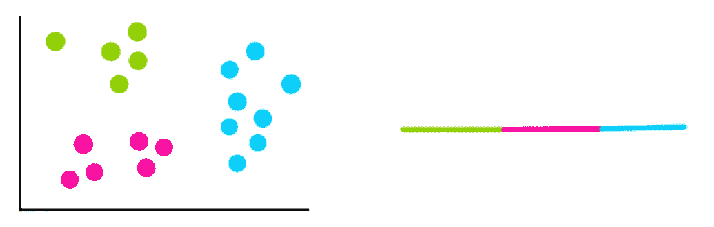**

**k=4:**

**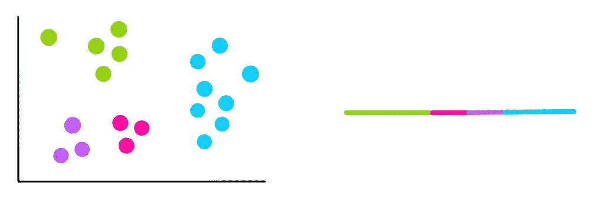**

**我们注意到，每次我们添加一个新的集群，每个集群内的总变化都比以前小。而当每个聚类只有一个点时，变差= 0。**

**因此，我们需要使用一种叫做*肘图*的东西来寻找最佳 k。它绘制了 WCSS 与聚类数或 k 的关系**

**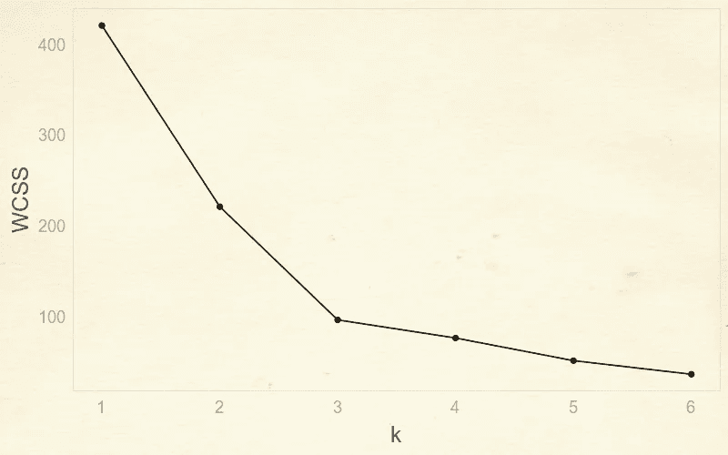**

**作者图片**

**这被称为肘形图，因为我们可以通过找到图的“肘”来找到最佳 k 值，即 3。直到 3，你可以注意到变化的巨大减少，但在那之后，变化不会很快下降。**

**大概就是这样。一个简单但有效的聚类算法！**

**如果你想支持我的工作，可以考虑使用[我的链接注册一个媒体订阅](https://medium.com/@shreya.rao/membership)！(每月 5 美元，随时取消)**

**如果你对 10 岁的孩子需要理解的其他算法有什么建议，请随时通过 LinkedIn 联系我，或者给我发电子邮件到 shreya.statistics@gmail.com。**