# k-意味着在 Excel 中从头开始

> 原文：<https://towardsdatascience.com/k-means-from-scratch-in-excel-bb60778d186e>

## 为了更好地理解劳埃德算法

K-Means 是最常见的无监督机器学习算法之一。在本文中，我将使用一个简单的数据集在 Excel 中实现一个算法来寻找质心。

您可能已经注意到，在一系列文章中，我使用 Excel/Google Sheet 来实现基本的机器学习算法，以便我们可以理解其中的基本原理:

*   [Excel 中带梯度下降的线性回归](/linear-regression-from-scratch-in-excel-3d8192214752) /Google Sheet
*   [Excel 中的梯度下降逻辑回归](/logistic-regression-with-gradient-descent-in-excel-52a46c46f704) /Google Sheet
*   [Excel 中的神经网络从无到有](/neural-network-from-scratch-in-excel-4774f6131cdb)

正如我的一位老师告诉我的:

> 除非你知道如何从零开始实现，否则你不会真正理解一个算法。

使用 Python 或 R 之类的编程语言，你必须了解编程的基础知识。所以你可能有借口不知道他们不能学习机器学习算法。

不过算你走运，我会用 Excel 做算法。所以让我们把手弄脏吧！

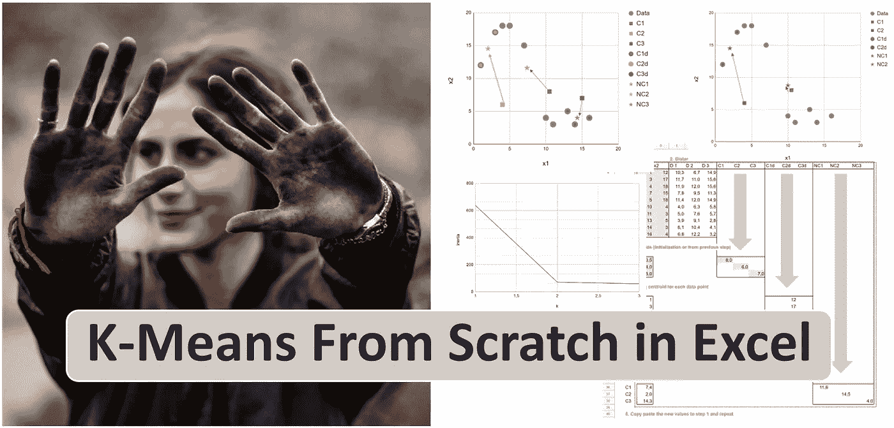

杰里米·毕晓普在 [Unsplash](https://unsplash.com?utm_source=medium&utm_medium=referral) 上拍摄的照片由作者编辑

# K-均值聚类的定义

## K-均值聚类原理

根据[维基百科](https://en.wikipedia.org/wiki/K-means_clustering)，

> ***k*-均值聚类**旨在将 *n* 个观测值划分为 ***k*** 个聚类，其中每个观测值属于具有最近均值(聚类中心或聚类质心)的聚类，作为该聚类的原型。

根据算法的输出，我们得到 k 个质心。而 **k** 是算法的超参数。我们将使用观察值和质心之间的欧几里德距离。

还有其他版本使用平方距离而不是欧几里德距离，中值而不是平均值，您可以作为练习编辑文件。

## 不同的算法

有不同的算法，我们可以在 k-means 的 [R 实现的文档中看到:Hartigan-Wong，Lloyd，Forgy 和
MacQueen。为简单起见，我们将实现劳埃德算法:](https://www.rdocumentation.org/packages/stats/versions/3.6.2/topics/kmeans)

*   **初始化**:我们随机选择初始质心
*   ****期望最大化**:计算每个质心和每个观测值之间的距离，这样我们就可以为每个观测值找到最近的质心。然后用分配给相同质心的观测值计算新的平均值。我们可以重复这个过程，直到收敛。**

# **Google 工作表/Excel 文件**

**我创建了一个可以与你分享的谷歌表单，请支持我在 [Ko-fi](https://ko-fi.com/angelashi) 上的工作。这里是 K-means Google sheet 支持页面的链接:[https://ko-fi.com/s/ea8faebbb5](https://ko-fi.com/s/4ddca6dff1)**

****

**[在高保真上支持我](https://ko-fi.com/s/ea8faebbb5) —作者图片**

## **表的展示**

**这些表的结构如下:**

*   ***数据*:我们试图聚类的数据集的可视化。这里我们试着用一个简单的数据集，这样可以直观的知道最终的解。**
*   ***型号*:在该表中，实现了劳氏算法。**
*   **对于以 *p* 开头的表单，我们尝试将算法的不同步骤可视化**
*   ***弯头*:弯头法选择一个最优 k 的绘图**

## **资料组**

**在数据表*数据*中，我们尝试呈现数据集。对于无监督学习，我们不必指定观察值的标签。如你所知，我使用最简单数据集的原则是，我们只能使用一个变量。但是不清楚，因为所有的数据都在一个轴上。所以我们将使用两个变量。**

**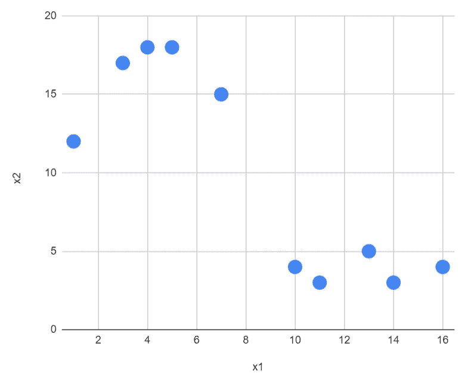**

**作者图片**

**通过一个简单的数据集，我们可以可视化所有的数据点，我们可以说质心的最佳数量是 2。**

**但是我们将首先实现 3 个质心的算法。然后我们将使用肘方法来验证 2 是更好的。**

# **劳氏 K 均值算法**

**在表模型中，我们将实现劳埃德算法。**

## **质心的初始化**

**开始时，我们会随机选择三个质心。**

**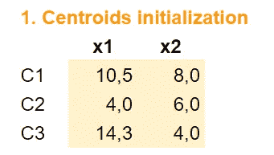**

**作者图片**

**正如我们已经可以想象的那样，没有必要选择远远超出 x1 和 x2 值范围的值。所以凭直觉，我们知道我们可以做更好的初始化。**

## **距离计算**

**选择质心后，我们可以计算数据点到每个质心的距离。**

**列 D1 将包含每个数据点和质心 1 之间的距离。因为有 3 个质心，我们有 D1，D2 和 D3。**

**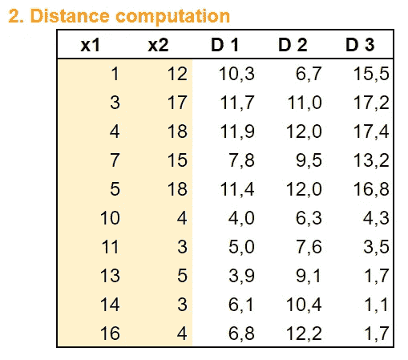**

**作者图片**

## **为每个数据点分配质心**

**对于每个数据点，我们找到质心。为了可视化的需要(我们将在下面的表格中看到)，我在不同的列中呈现了 x2 的三个不同的质心。**

**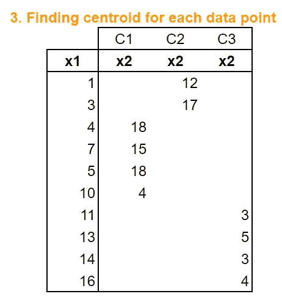**

**作者图片**

## **计算新质心**

**将每个观察值分配给质心后，我们可以计算每个质心的平均值。**

**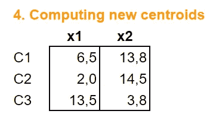**

**作者图片**

****重复直到收敛****

**使用 Excel，可以将值复制并粘贴到第一步。我们可以手动操作，直到收敛。**

# **质心移动图**

**为了可视化质心在哪里，与质心相关联的数据点在哪里，以及质心在每次迭代中如何移动，可视化非常有帮助。**

## **Excel 绘图策略**

**但是用 Excel，就不容易出图了。我定义了一个 C3 的绘图区域:P38。第 3 行定义了这些列，下面按照不同的计算步骤列出了这些值**

*   **x1 和 x2 包含原始数据集**
*   **D1、D2 和 D3 是从一个数据点到每个质心的距离**
*   **C1、C2 和 C3 包含质心的坐标**
*   **C1d、C2d 和 C3d 包含每个数据点被分配给哪个质心的信息**
*   **NC1、NC2 和 NC3 是新的质心。**

**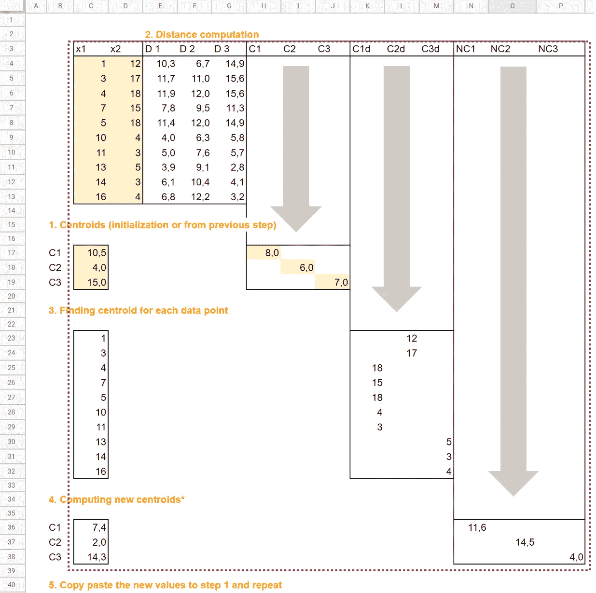**

**作者图片**

**然后我们可以得到这个图:**

*   **蓝点是原始数据集**
*   **这三种颜色分别代表三个质心**
*   **正方形代表初始质心，星形代表新的质心。**
*   **我手动添加了箭头来可视化质心的移动。**

**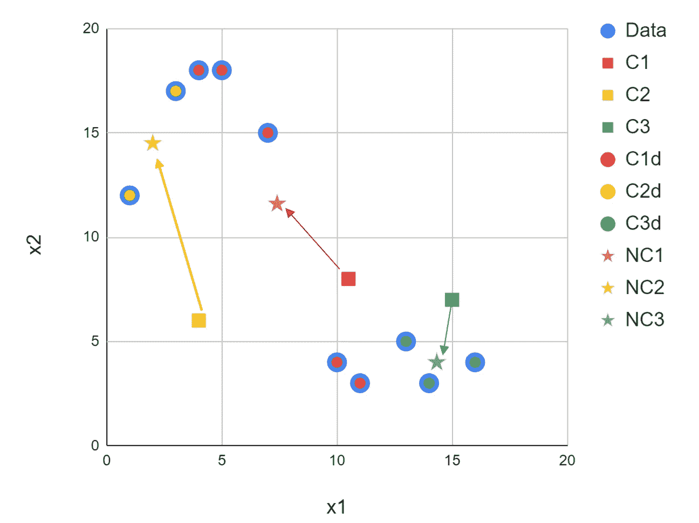**

**作者图片**

## **两个质心**

**我们可以用 k=2 创建相同的图。我们知道视觉上最好有两个质心。我们将在后面看到如何使用数学/统计/定量指标来确保它确实更好。**

**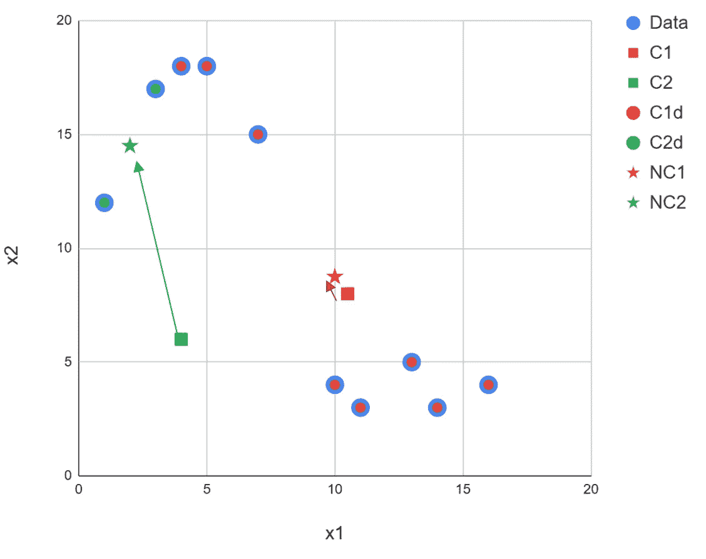**

**作者图片**

## **重复直到收敛**

**对于 k 的每个值，我们可以重复这个过程，直到收敛。由于只有很少的数据点，收敛将通过少量的迭代来实现。在实践中，当数据集较大时，应该采用更优的策略。**

******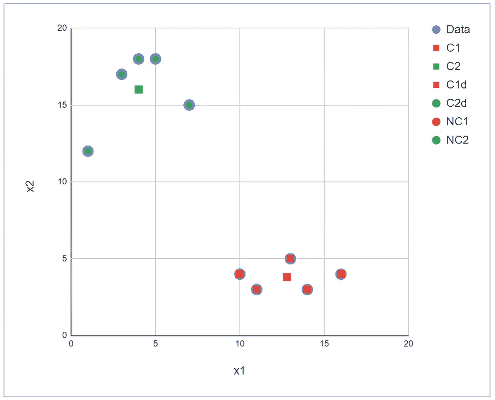**

**作者图片**

# **k 的最佳值**

**为了确定 k 的最佳值，一种常见的方法是肘法，该方法包括分析**惯性**如何随着不同的 k 值而变化**

> **根据 [sklearn 实现](https://scikit-learn.org/stable/modules/generated/sklearn.cluster.KMeans.html)，惯性是样本到其最近聚类中心的平方距离之和。**

**我们可以很容易地在 Excel 中计算出来。对于 k=2 或 3(在表 p2f 和 p3f 中)，当达到收敛时，我计算了惯性。**

**对于 k=1 的情况，这是微不足道的:质心由 x1 和 x2 的平均值组成。**

**然后，对于从 1 到 3 的 k，我们可以画出惯性。**

**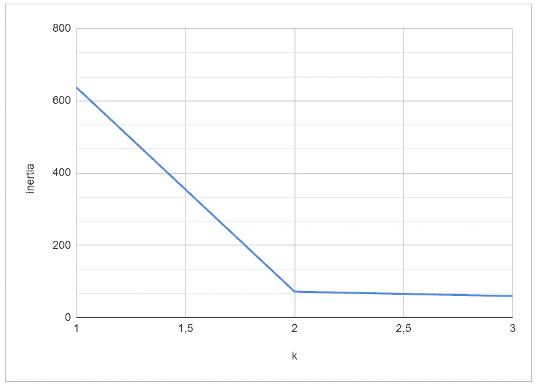**

**Kmeans 的肘方法(图片由作者提供)**

**我们可以看到，从 1 到 2，惯性的下降是巨大的。而从 2 到 3 几乎为零。**

**肘法包括确定 k 值，从这个值开始，惯性的减小就变得微不足道了。**

**因此，我们可以得出结论，k=3 是不必要的，因为惯性方面的改善是微不足道的。**

# **结论**

**再一次，我们可以看到 Excel 可以成为彻底理解机器学习算法的优秀工具。**

**至于线性回归、逻辑回归和神经网络中的**梯度下降**，有趣的是注意到这个**学习过程**是通过在 Excel 中手动实现和完成的。**

**让我们以一个哲学注解来结束:人类学习和机器学习是相似的，因为我们可以从不同的起点开始，但是在一个**耗时的过程**和**努力工作**中，我们都可以取得一些成功。实现它的速度和规模(无论是局部最优还是全局最优)也取决于更多的高级技能。**

**更进一步，还有更多算法可以测试:**

*   **[K-Means ++初始化](https://en.wikipedia.org/wiki/K-means%2B%2B)**
*   **[Elkan 算法](https://www.aaai.org/Papers/ICML/2003/ICML03-022.pdf)用于 Scikit learn 的实现。**
*   **在 [R 实现中，K-Means](https://www.rdocumentation.org/packages/stats/versions/3.6.2/topics/kmeans) 使用 Hartigan-Wong、Lloyd、Forgy 和
    MacQueen。这里有一些关于它的用法的信息。**
*   **为了选择最佳 k，除了具有惯性(或失真分数)的图之外，我们可以使用轮廓分数或戴维斯-波尔丁指数。**

**我写关于机器学习算法的文章，请通过下面的链接关注我，并完全访问我的文章:**

** [## 通过我的推荐链接加入 Medium-Angela Shi

### 作为一个媒体会员，你的会员费的一部分会给你阅读的作家，你可以完全接触到每一个故事…

medium.com](https://medium.com/@angela.shi/membership)**