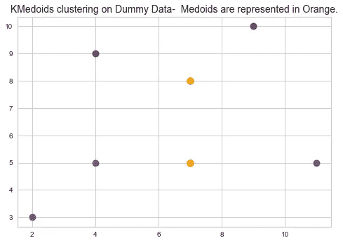
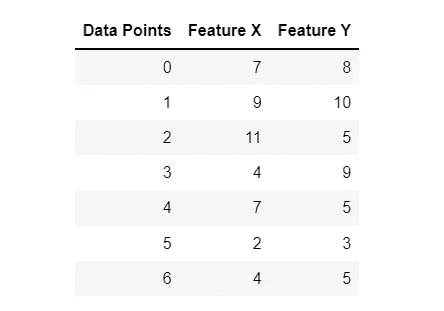
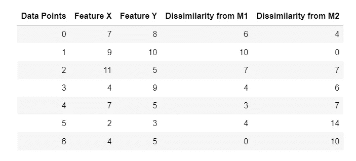
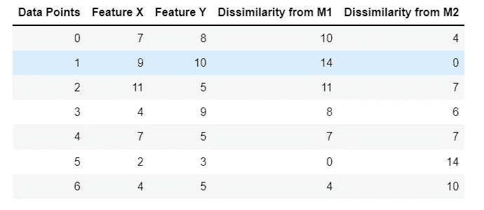

# Python 中的 K-Medoid 聚类算法

> 原文：<https://towardsdatascience.com/k-medoid-clustering-pam-algorithm-in-python-with-solved-example-c0dcb35b3f46>

## 一步一步的教程-有一个解决的例子



图片来源——由作者使用 Jupyter 笔记本准备。

# 1.介绍

## 1.1K-均值聚类与挑战

大规模数据的聚类是实现基于分段的算法的关键。细分可以包括识别客户群以促进有针对性的营销，识别处方者群以允许医疗保健参与者向他们传达正确的信息，以及识别数据中的模式或异常值。 *K* -Means 是跨不同问题领域采用的最流行的聚类算法，主要是由于它的计算效率和算法的易于理解性。 *K-* 意味着依赖于从数据中识别聚类中心。它使用欧几里德距离度量在向这些聚类中心分配点之间交替，并重新计算聚类中心，直到达到收敛标准。然而，*K*-均值聚类有一系列的缺点:

1.  *K*-表示聚类不使用除欧几里德距离之外的任何其他距离度量。在使用稀疏数据的推荐系统中，经常使用不同的距离度量，如余弦距离。
2.  在聚类中，最终中心不一定是来自数据的数据点，而是对不同应用领域(如计算机视觉中的图像)的可解释性的瓶颈。

# 2.水母周围的分区(PAM)

PAM 代表“围绕 Medoids 的分区”PAM 将 PAM 的每一步从确定性计算问题转化为统计估计问题，并将样本大小的复杂度从 *n* 降低到 *O(n log n)* 。 *Medoids 是选择作为聚类中心的数据点。K-* 表示聚类的目的是最小化类内距离(通常称为总平方误差)。相反，K-Medoid 最小化了聚类中的点和被认为是该聚类的中心的点之间的不相似性。

> 当且仅当数据集中的任意点与聚类中所有其他数据点的不相似性最小时，该点才可被视为 medoid。

PAM 的基本概念包括:

1.  从*大小 n* (n 为记录数)的数据点中找出一组 *k* 的 Medoids ( *k 为聚类数，M 为 medoids* 的集合)。
2.  使用任何距离度量(比如 d。)，可能是欧几里德，曼哈顿等。)，尝试定位使数据点到最近的 Medoid 的总距离最小的 med oid。
3.  最后，在所有可能的 *k(n-k)* 对中交换降低损失函数 L 的中值和非中值对。损失函数定义为:


图一。说明了 PAM 算法使用的损失函数。

更新质心:在 K-Means 的情况下，我们正在计算聚类中所有点的平均值。但是对于 PAM 算法，质心的更新是不同的。如果在一个聚类中有 m 个点，则用所有其他(m-1)个点交换先前的质心，并将该点最终确定为具有最小损失的新质心。最小损失由图 1 所示的成本函数计算得出。下面列出了一个相同的工作示例(GeeksforGeeks，2019)。

## 2.1 算法—数据集

让我们考虑一组数据点和特征。



图二。显示了 7 个数据点的一组假设特征。作者使用 Jupyter 和 Markdown 制作的图像。

## 2.2 初始化步骤

1.  让我们随机选择两个 medoids，所以选择𝐾= 2，让 M1 =(4，5)，M2 =(9，10)是这两个 medoids。注释聚类算法从数据中选择数据点作为中间点
2.  计算所有点到 M1 和 M2 的距离。注:相异度的计算方法是将 medoids 和数据点之间的绝对差值进行**求和。例如 D=|Mx —特征 X| + |My —特征 Y|**



图 3。说明了相异度计算。作者使用 Jupyter 和 Markdown 制作的图像。

## 2.3 分配步骤

将数据点分配给具有较低相异度(成本)的 Medoids。数据点 0 和 2 指向 M2，数据点 3、4 和 5 指向 M1。**总成本=成本/分配给 M1 的积分差异+成本/分配给 M2 的积分差异。**

总成本=(4+3+4)+(4+7)= 22；M1 的成本=点 3 与 M1 的差异(4) +点 4 与 M1 的差异(3)+点 5 与 M1 的差异(4)。对 M2 重复同样的计算。

## 2.4 质心重新编译步骤

随机选择一个非 medoid 点并重新计算成本。现在，让我们选择数据点 5 M1 as (2，3)作为中间点，并重新计算成本。



图 4。示出了使用更新的质心的相异度计算，即，使用数据点 5 (2，3)作为 M1。作者使用 Jupyter 和 Markdown 制作的图像。

现在只有 4 分和 6 分去了 M1，其余的分都去了 M2。总成本=(7+4)+(4+7+6)=28，交换成本=新成本-以前的成本= 28–22 = 6。

我们将取消交换，因为交换成本大于 0。这个过程一直持续到满足收敛标准。

# 3.使用 Python 实现

我们将使用来自 scikit-learn-extra 的 [K-Medoid 算法来模拟上面的例子。很少代码和概念，灵感来自软件包文档(scikit-learn-extra，2019)](https://scikit-learn-extra.readthedocs.io/en/stable/generated/sklearn_extra.cluster.KMedoids.html)

```
# — — — — — — -Importing Packages — — — — — — — — — — — -import matplotlib.pyplot as plt
import numpy as npfrom sklearn_extra.cluster import KMedoids# — — — — — — -Assigning Initial Centers — — — — — — — — — — — -
centers = [[4, 5], [9, 10]]# — — — — — — -Assigning Data: Dummy Data used in example above — — — — — — — — — — — — — — — — — — 
df=np.array([[7,8], [9,10], [11,5], [4,9], [7,5], [2,3], [4,5]])# — — — — — — -Fit KMedoids clustering — — — — — — — — — — — -
KMobj = KMedoids(n_clusters=2).fit(df)# — — — — — — -Assigning Cluster Labels — — — — — — — — — — — -
labels = KMobj.labels_
```

可视化集群。

```
# — — — — — — -Extracting Unique Labels — — — — — — — — — — — -unq_lab = set(labels)# — — — — — — -Setting Up Color Codes — — — — — — — — — — — -
colors_plot = [
 plt.cm.Spectral(each) for each in np.linspace(0, 1, len(unq_lab))
]for k, col in zip(unq_lab, colors_plot):class_member_mask = labels == k

 # — — — — — — -Setting datapoint Feature X and Feature Y — — — — — — — — — — — -xy = df[class_member_mask]

 # — — — — — — -Plotting Feature X and Feature Y for each cluster labels — — — — — — — — — — — -

 plt.plot(
 xy[:, 0],
 xy[:, 1],
 “o”,
 markerfacecolor=tuple(col),
 markeredgecolor=”white”,
 markersize=10,
 );# — — — — — — -Annotate Centroids — — — — — — — — — — — -plt.plot(
 KMobj.cluster_centers_[:, 0],
 KMobj.cluster_centers_[:, 1],
 “o”,
 markerfacecolor=”orange”,
 markeredgecolor=”k”,
 markersize=10,
);# — — — — — — -Add title to the plot — — — — — — — — — — — -plt.title(“KMedoids clustering on Dummy Data- Medoids are represented in Orange.”, fontsize=14);
```


图 5。使用 K-Medoids 演示了最终的簇形心。图片由作者使用 Jupyter 笔记本制作。

# **参考**

1.  scikit-learn-extra。(2019). *KMedoids 演示— scikit-learn-extra 0.2.0 文档*。sci kit-Learn-extra . readthedocs . io .[https://sci kit-Learn-extra . readthedocs . io/en/stable/auto _ examples/plot _ kmedoids . html # sphx-glr-auto-examples-plot-kmedoids-py](https://scikit-learn-extra.readthedocs.io/en/stable/auto_examples/plot_kmedoids.html#sphx-glr-auto-examples-plot-kmedoids-py)
2.  极客之福。(2019 年 5 月 17 日)。 *ML | K-Medoids 聚类与求解实例*。极客之福。[https://www . geeks forgeeks . org/ml-k-med OIDs-clustering-with-example/](https://www.geeksforgeeks.org/ml-k-medoids-clustering-with-example/)

*关于作者:高级分析专家和管理顾问，通过对组织数据的业务、技术和数学的组合，帮助公司找到各种问题的解决方案。一个数据科学爱好者，在这里分享、学习、贡献；可以和我在* [*上联系*](https://www.linkedin.com/in/angel-das-9532bb12a/) *和* [*推特*](https://twitter.com/dasangel07_andy)*；*