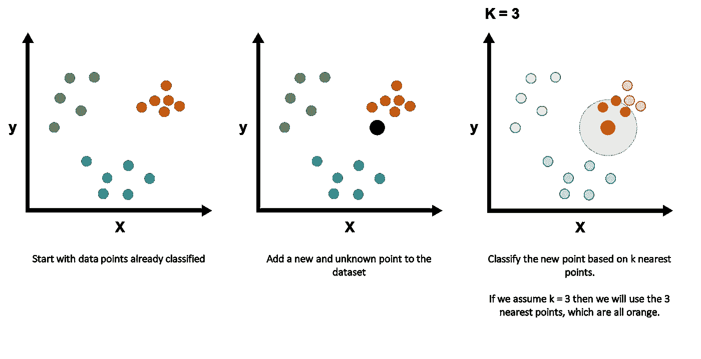
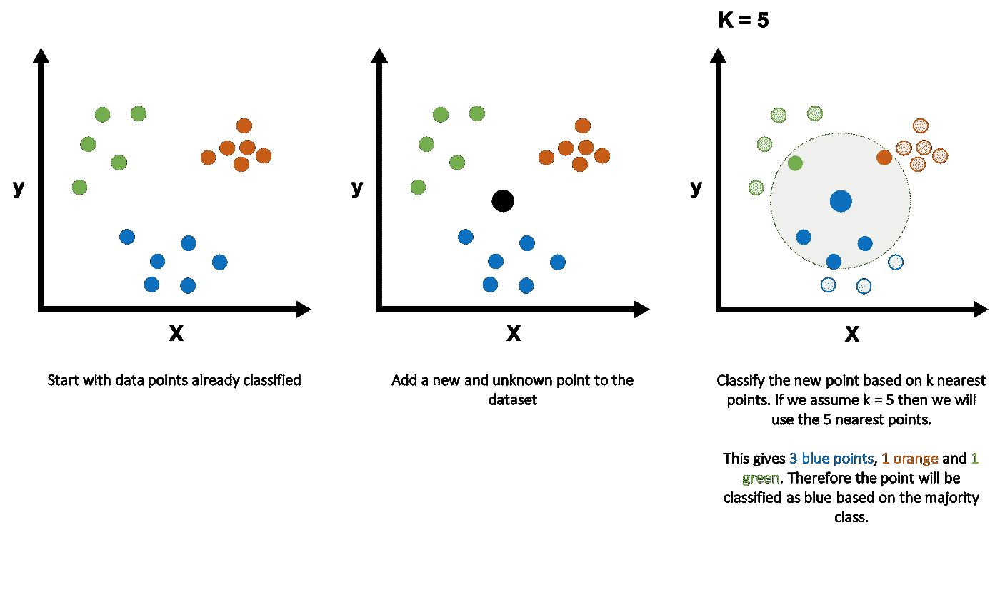
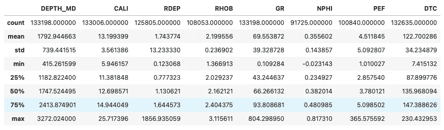
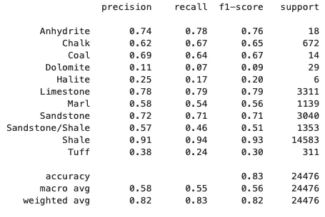
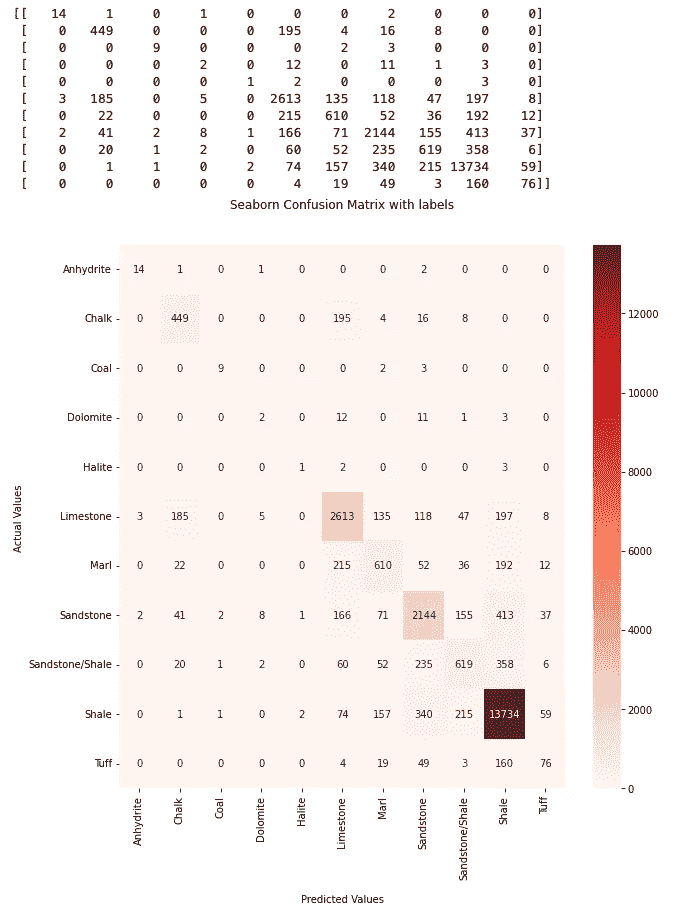

# 使用 Python 对测井记录进行岩性分类的 k-最近邻

> 原文：<https://towardsdatascience.com/k-nearest-neighbors-for-lithology-classification-from-well-logs-using-python-a13ac69367ce>

## 基于测井测量细分地下


[王占山](https://unsplash.com/@jdubs?utm_source=medium&utm_medium=referral)在 [Unsplash](https://unsplash.com?utm_source=medium&utm_medium=referral) 上拍照

k-最近邻(kNN)是一种流行的非参数监督机器学习算法，可以应用于分类和基于回归的问题。它很容易用 Python 实现，也很容易理解，这使得它成为一个很好的算法，可以在您开始机器学习之旅时开始学习。

在本文中，我们将介绍 kNN 算法如何工作，以及如何使用 Python 的 Scikit-Learn 库将其应用于测井数据。

## kNN 算法是如何工作的？

对数据进行分类是机器学习的主要应用之一。因此，有许多算法可用。kNN 算法就是其中之一。

kNN 背后的想法非常简单。彼此靠近的点被认为是相似的。

当一个新的数据点被引入到一个训练数据集中时，发生以下步骤

1.  确定 k 值-用于分类新数据点的点数
2.  计算待分类数据点与 k 个最近点之间的距离(欧几里德或曼哈顿)
3.  识别 k 个最近邻
4.  在这些 k 个最近邻中，我们计算每个类中数据点的数量
5.  使用多数表决，将新数据点分配给出现次数最多的类别

下面这个简单的例子展示了这个过程，我们假设 k 是 3，最近的点都是一个类。



k-最近邻应用于新数据点的示例，其中 k=3。图片由作者提供。

在 k-最近邻是混合类的情况下，我们可以使用多数表决，如下所示。



k-最近邻应用于新数据点的示例，其中 k=5，最近点是类的混合。图片由作者提供。

## k 近邻(kNN)的应用

*   推荐系统
*   模式检测—例如欺诈检测
*   文本挖掘
*   气候预测
*   信用评级分析
*   医学分类
*   岩性预测

## k 近邻(kNN)的优势

*   简单易懂
*   使用 Sci-kit Learn 通过 Python 轻松实现
*   可以快速处理小型数据集
*   无需调整多个参数
*   不需要对数据做出假设
*   可以应用于二元和多类问题

## **缺点**k-最近邻(kNN)

*   使用大型数据集进行分类可能会很慢
*   受到维数灾难的影响-随着要素数量的增加，算法可能难以做出准确的预测
*   可能对数据比例敏感，即使用不同单位测量的特征
*   受到噪音和异常值的影响
*   对不平衡的数据集敏感
*   在使用算法之前，需要处理缺失值

# 用 Scikit 实现 KNN-学习相分类

## 导入所需的库

对于本教程，我们需要一些 Python 库和模块。

首先，我们将把`pandas`作为`pd`导入。这个库允许我们从 csv 文件中加载数据，并将数据存储在内存中以备后用。

此外，我们还有许多来自 sci-kit 学习库中的模块:

*   `KNeighborsClassifer`进行 kNN 分类
*   `train_test_split`用于将我们的数据分成训练和测试数据集
*   `StandardScaler`用于标准化特征的比例
*   `classification_report`、`confusion_matrix`和`accuracy_score`用于评估模型性能

最后，为了可视化我们的数据，我们将混合使用`matplotlib`和`seaborn`。

```
import pandas as pd
from sklearn.neighbors import KNeighborsClassifier
from sklearn.model_selection import train_test_split
from sklearn.preprocessing import StandardScaler
from sklearn.metrics import classification_report, confusion_matrix, accuracy_score
import seaborn as sns
import matplotlib.pyplot as plt
```

## 导入所需的数据

下一步是加载我们的数据。

我们在本教程中使用的数据集是作为 Xeek 和 FORCE 2020 *(Bormann et al .，2020)* 举办的机器学习竞赛的一部分使用的训练数据集的子集。它是在挪威政府的 NOLD 2.0 许可下发布的，详细信息可以在这里找到:[挪威开放政府数据许可(NLOD) 2.0](https://data.norge.no/nlod/en/2.0/) 。

完整的数据集可以通过以下链接获得:[https://doi.org/10.5281/zenodo.4351155](https://doi.org/10.5281/zenodo.4351155)。

为了读取数据，我们可以调用`pd.read_csv()`并传入训练文件的相对位置。

```
df = pd.read_csv('Data/Xeek_train_subset_clean.csv')
```

一旦加载了数据，我们就可以调用`describe()`方法来查看数据集中的数字列。这为我们提供了特性的概述。

```
df.describe()
```



Xeek Force 2020 测井岩性竞赛数据统计。图片由作者提供。

# 数据准备

## **处理缺失数据**

在我们继续 kNN 算法之前，我们首先需要进行一些数据准备。

由于 kNN 算法不处理丢失的值，我们需要首先处理这些。最简单的方法是执行列表式删除。如果行中的任何要素有缺失值，这将删除该行。

强烈建议您对数据集进行全面分析，以了解丢失数据的原因以及是否可以修复。

尽管这种方法看起来是一种快速的解决方案，但它可以显著减少数据集。

```
df = df.dropna()
```

## 选择培训和测试功能

接下来，我们需要选择哪些特性将用于构建 kNN 模型，以及哪些特性将成为我们的目标特性。

对于这个例子，我使用一系列测井测量来建立模型，并使用岩性描述作为目标特征。

```
# Select inputs and target
X = df[['RDEP', 'RHOB', 'GR', 'NPHI', 'PEF', 'DTC']]
y = df['LITH']
```

与任何机器学习模型一样，我们需要将数据分成一个训练集和一个测试集，前者用于训练/构建我们的模型，后者用于验证我们的模型在未知数据上的性能。

```
X_train, X_test, y_train, y_test = train_test_split(X, y, test_size=0.3)
```

## 标准化特征值

当使用不同比例和范围的测量时，标准化它们是很重要的。这有助于减少模型训练时间，并减少对依赖基于距离的计算的模型的影响。

标准化数据本质上包括计算特征的平均值，从每个数据点中减去它，然后除以特征的标准偏差。

在[**scikit-learn**](https://scikit-learn.org/stable/index.html)**中，我们可以使用[**standard scaler**](https://scikit-learn.org/stable/modules/generated/sklearn.preprocessing.StandardScaler.html)类来转换我们的数据。**

**首先，我们使用训练数据来拟合模型，然后使用`fit_transform`函数对其进行转换。**

**当涉及到测试数据时，我们不想让 StandardScaler 适应这些数据，因为我们已经这样做了。相反，我们只是想应用它。这是使用`transform`方法完成的。**

**值得注意的是，在训练测试分割之后应用标准缩放器，并且它仅适合于训练数据集。一旦定标器模型被拟合，它就被应用于测试数据集。这有助于防止数据从测试数据集泄漏到 kNN 模型中。**

```
scaler = StandardScaler()

#Fit the StandardScaler to the training data
X_train = scaler.fit_transform(X_train)

# Apply the StandardScaler, but not fit, to the validation data
X_test = scaler.transform(X_test)
```

# **构建 kNN 分类器**

**创建 KNeighborsClassifier 时，我们可以指定几个参数。这些的全部细节可以在 [**这里**](https://scikit-learn.org/stable/modules/generated/sklearn.neighbors.NearestNeighbors.html) 找到。当然，我们不必提供任何东西，将使用默认参数。**

**默认情况下，用于分类新数据点的点数设置为 5。这意味着这 5 个最近点的类别将用于对该新点进行分类。**

```
clf = KNeighborsClassifier()
```

**一旦分类器被初始化，我们接下来需要使用我们的训练数据来训练模型(`X_train` & `y_train`)。为此，我们调用`clf`，然后调用`fit`方法。**

**在`fit`方法中，我们传递我们的训练数据。**

```
clf.fit(X_train, y_train)
```

# **使用 kNN 模型进行预测**

**一旦模型被训练，我们现在可以通过从分类器调用`predict`方法来对我们的测试数据进行预测。**

```
y_pred = clf.predict(X_test)
```

# **评估模型性能**

## **使用模型精度**

**为了理解我们的模型在测试数据上的表现，我们可以使用一些度量标准和工具。**

**如果我们想要快速评估我们的模型表现如何，我们可以调用准确性评分方法。这为我们提供了相对于预测总数有多少预测是正确的指示。**

```
accuracy_score(y_test, y_pred)
```

**这将返回值 0.8918532439941167，并告诉我们我们的模型已经正确预测了 89.2%的标签。**

**请注意，这个值可能会产生误导，尤其是在我们处理不平衡的数据集时。如果有一个阶级占优势，那么这个阶级比少数阶级有更高的机会被正确预测。占主导地位的类将通过提高准确度分数来影响准确度分数，从而给人一种我们的模型做得很好的假象。**

## **使用分类报告**

**我们可以进一步评估，看看分类报告。这提供了额外的度量以及每个类的预测程度的指示。**

**其他指标包括:**

*   ****precision:** 指示该类中有多少值被正确预测。值介于 0.0 和 1.0 之间，1 表示最好，0 表示最差。**
*   ****recall:** 提供了分类器能够为该类找到所有阳性案例的程度的度量。**
*   ****f1-score:** 精度和召回率的加权调和平均值，生成 1.0(好)和 0.0(差)之间的值。**
*   ****支持:**这是数据集中该类的实例总数。**

**为了查看分类报告，我们可以调用下面的代码，并将`y_test`和`y_pred`传递给`classification_report`函数。**

```
print(classification_report(y_test, y_pred))
```

****

**在 Scikit-learn 中使用 k 最近邻进行岩性预测的分类报告。图片由作者提供。**

**如果我们仔细观察结果，我们会发现我们正在处理一个不平衡的数据集。我们可以看到页岩、砂岩和石灰岩类占主导地位，因此具有相对较高的精确度和召回分数。而石盐、凝灰岩和白云石的精度和召回率相对较低。**

**在这一点上，我会考虑回到原始数据集，并确定我可以处理这种不平衡的方法。这样做应该会大大提高模型性能。**

## **混淆矩阵**

**我们可以使用另一个工具来查看我们的模型表现如何，这就是混淆矩阵。此工具总结了我们的分类模型在对每个类别进行预测时的表现。**

**生成的混淆矩阵有两个轴。一个轴包含模型预测的类，另一个轴包含实际的类标签。**

**我们可以在 Python 中生成两个版本。第一个是一个简单的混乱矩阵的打印读数，可能很难阅读或向他人展示。第二个是使用 seaborn 生成的热图版本**

```
# Simple Printed Confusion Matrix
cf_matrix = confusion_matrix(y_test, y_pred)
print(cf_matrix)

# Graphical version using seaborn and matplotlib
# Prepare the labels for the axes
labels = ['Shale', 'Sandstone', 'Sandstone/Shale', 
        'Limestone', 'Tuff', 'Marl', 'Anhydrite', 
        'Dolomite', 'Chalk', 'Coal', 'Halite']
labels.sort()

# Setup the figure
fig = plt.figure(figsize=(10,10))
ax = sns.heatmap(cf_matrix, annot=True, cmap='Reds', fmt='.0f',
                xticklabels=labels, 
                yticklabels = labels)
ax.set_title('Seaborn Confusion Matrix with labels\n\n')
ax.set_xlabel('\nPredicted Values')
ax.set_ylabel('Actual Values ');
```

**当我们运行上面的代码时，我们得到了下面的打印表格和图表。**

****

**测井测量岩性 kNN 分类预测结果的混淆矩阵。图片由作者提供。**

**由此产生的混淆矩阵为我们提供了模型正确和错误预测的类别的指示。我们可以开始识别模型可能预测错误岩性的任何模式。**

**例如，如果我们看看石灰石类。我们可以看到 2613 个点被正确预测，然而，185 个点被预测为白垩，135 个点被预测为泥灰。这两种岩性都具有方解石性质，并具有与石灰石相似的性质。因此，我们可以回过头来看看我们的功能，以确定是否需要其他功能，或者是否需要删除一些功能。**

# **摘要**

**k-最近邻算法是一种功能强大但易于理解的监督机器学习算法，可应用于基于分类的问题，尤其是在地球科学领域。**

**本教程展示了我们如何进行一系列预先分类的测井测量，并对新数据进行预测。然而，在预处理数据和处理不平衡数据集时应该小心，这在地下应用中是常见的。**

***感谢阅读。在你走之前，你一定要订阅我的内容，把我的文章放到你的收件箱里。* [***你可以在这里做！***](https://andymcdonaldgeo.medium.com/subscribe)**或者，您也可以* [***注册我的简讯***](https://fabulous-founder-2965.ck.page/2ca286e572) *免费将更多内容直接发送到您的收件箱。****

***其次，你可以通过注册成为会员来获得完整的媒介体验，并支持我和成千上万的其他作家。每月只需花费你 5 美元，你就可以接触到所有精彩的媒体文章，也有机会通过写作赚钱。如果你用 [***我的链接***](https://andymcdonaldgeo.medium.com/membership) ***，*** *报名，你直接用你的一部分费用支持我，不会多花你多少钱。如果你这样做了，非常感谢你的支持！****