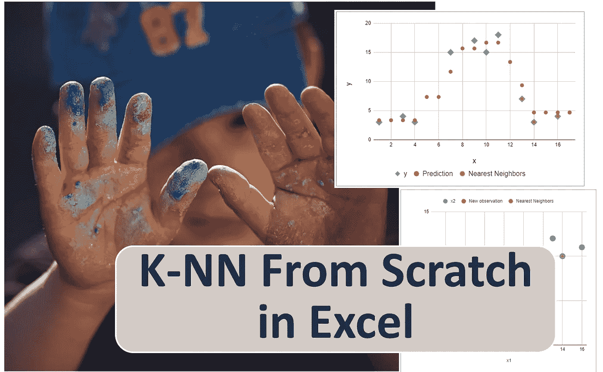
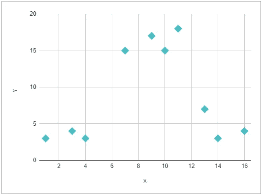
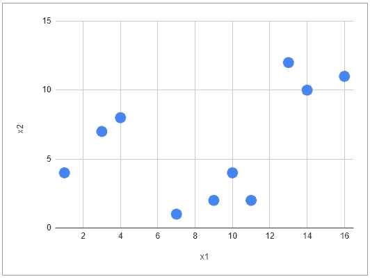
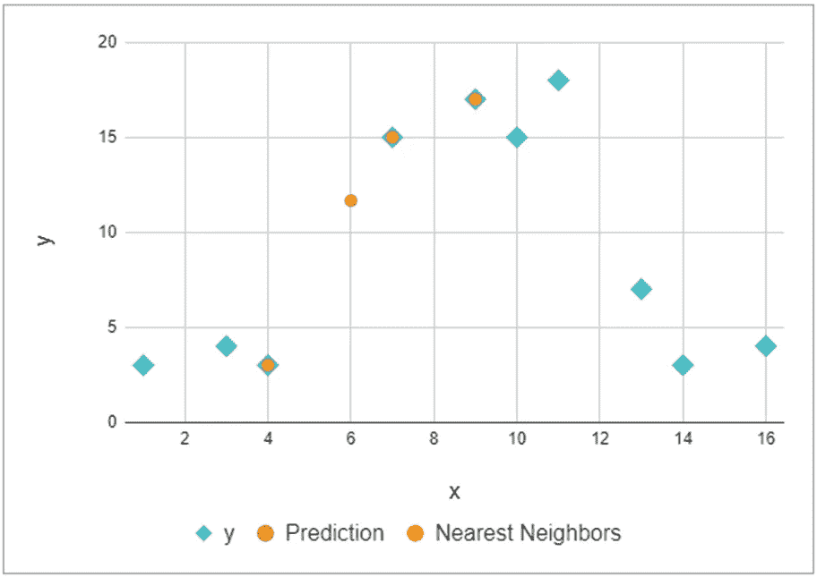
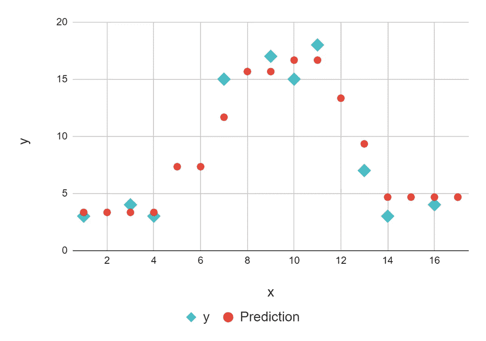
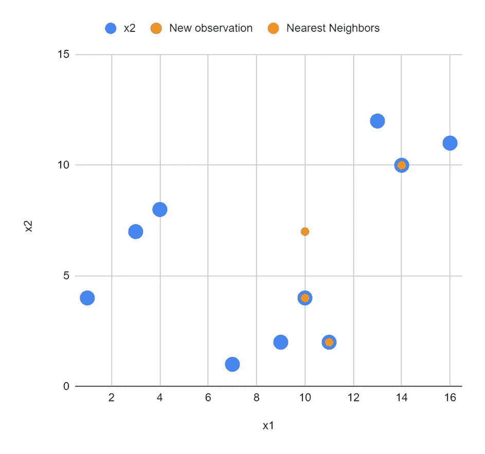
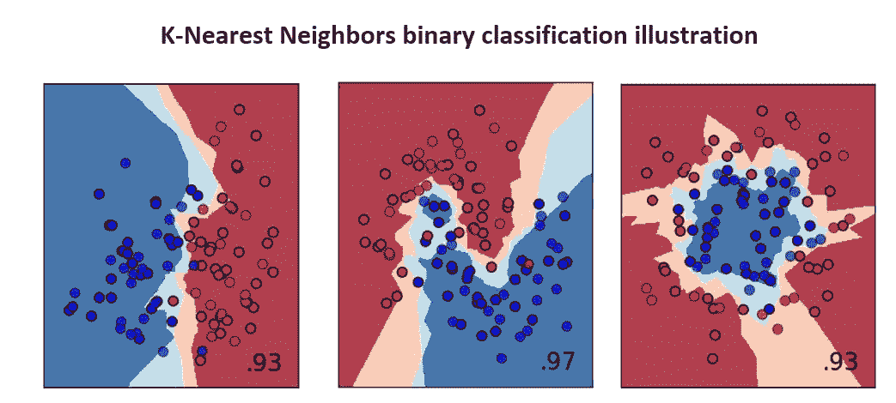
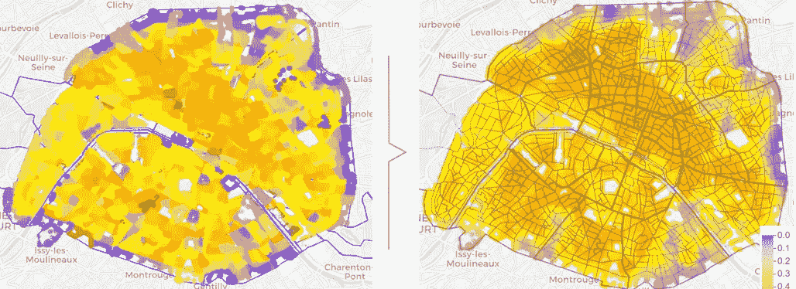

# Excel 中的 k-最近邻

> 原文：<https://towardsdatascience.com/k-nearest-neighbors-in-excel-76edd4102a5b>

在一系列文章中，我使用 Excel/Google Sheet 来实现基本的机器学习算法，以便我们可以理解其中的基本原理:

*   [Excel 中带梯度下降的线性回归](/linear-regression-from-scratch-in-excel-3d8192214752) /Google Sheet
*   [Excel 中的梯度下降逻辑回归](/logistic-regression-with-gradient-descent-in-excel-52a46c46f704) /Google Sheet
*   [Excel 中的神经网络从无到有](/neural-network-from-scratch-in-excel-4774f6131cdb)
*   [K-Excel 中从头开始的意思](/k-means-from-scratch-in-excel-bb60778d186e)

在这篇文章中，我将解释 K 近邻是如何工作的。为了全面理解机器学习算法是如何工作的，你可以阅读我关于监督学习算法的[完整概述](/overview-of-supervised-machine-learning-algorithms-a5107d036296)的文章。

与大多数机器学习算法相反，没有针对 KNN 的训练。更准确地说，如果我们区分所有机器学习算法的以下步骤:

*   **训练**的算法，找到**模型的参数**
*   **超参数调整**通过网格搜索找到最佳超参数，避免过拟合和欠拟合

那么对于 KNN，只有超参数调整这一步，包括找到最佳超参数 **k** 。

对于**模型**部分，KNN 的原理是利用整个数据集寻找 k 个最近邻。欧几里得距离经常被使用。预测阶段包括

*   对于**回归**，计算所选邻居的目标变量的平均值
*   对于**分类**，计算所选最近邻的每一类目标变量的比例

让我们开始在 Excel 中实现吧！我们将演示如何用 KNN 解决回归问题。作为练习，您可以修改分类任务的文件。

作者图片

# 从零开始为 ML 的谷歌表

如果你想得到谷歌表，请在 Ko-fi 上支持我。

你可以得到我创建的所有谷歌表单(梯度下降的线性回归，逻辑回归，神经网络，KNN，k-means，等等)。)和下面的链接。

[https://ko-fi.com/s/4ddca6dff1](https://ko-fi.com/s/4ddca6dff1)

# 资料组

我们可以只使用一个特征变量 x，一个连续的目标变量 y。然后我们可以绘制 x 为横轴，y 为纵轴。

作者图片

我们可以使用两个特征变量 x1 和 x2。那么我们将无法绘制 y。使用 Python 或 R 包，我们将创建 3D 图，或将 y 的值表示为点的大小，但使用 Excel，我不知道如何做到这一点。但正如我们将会看到的，这仍然很有趣。

作者图片

# 新观测的预测

对 KNN 来说，没有可以训练的模式。对于超参数 k，我们将使用 k=3，因为数据集非常小。

预测阶段由以下步骤组成:

*   对于一个给定的新观察值，计算该新观察值与训练数据集中所有观察值之间的距离。
*   找出距离最短的 k 个观察值。在 Excel 中，我们将使用筛选器对训练数据集进行手动排序
*   计算预测值。对于回归任务，我们计算目标变量的平均值。

## 一个特征变量

对于一个特征变量，欧几里德距离变成新观测值和其他观测值之间的差值的绝对值。

在工作表 *algo1* 中，您可以更改新观察值，并使用距离列 C 的过滤器对数据集进行升序排序，3 个最近邻将被自动绘制。

在剧情中，

*   浅蓝色的点代表数据集
*   黄色圆点用红色表示新观测值的 3 个最近邻
*   红点表示具有预测 y 值的新观测值

作者图片

在工作表 *algo1f* 中，我绘制了新观测值的预测，范围从 1 到 17。有了编程语言，我们可以在一个循环中很容易地做到这一点，对于大量的新观察，所以表示可以更密集。

使用 Excel，我手动重复了以下步骤:

*   输入 x 的值
*   对距离列进行排序
*   复制粘贴预测

作者图片

## 两个特征变量

当我们有两个特征变量时，由于我无法使用 Excel 进行 3D 绘图，因此我将只表示一个给定新观测值的相邻要素。

作者图片

对于一个**二元分类**任务，我们可以用背景上的某种颜色(由许多点组成)来表示概率。我们在 [*sklearn 的分类器比较*](https://scikit-learn.org/stable/auto_examples/classification/plot_classifier_comparison.html) 中有一个图解。

作者编辑自 [*sklearn 的分类器对比*](https://scikit-learn.org/stable/auto_examples/classification/plot_classifier_comparison.html)

# 结论

KNN 是最简单的机器学习，而且非常容易理解。使用 Excel，我们可以演示它如何为业务人员工作，以便他们可以对这种方法以及它是否适合于业务问题有良好的直觉。

邻居的概念很容易理解，在某些情况下，他们可以是地理距离上的真实邻居。因此它可用于平滑空间数据。

在下图中，您可以看到原始值适用于巴黎市的小区域。所以从一个四分之一到它相邻的四分之一，变量可能是不连续的。

在这种情况下，KNN 可以这样使用:对于巴黎的每个地址，我们找到其最近的邻居并计算平均值。这将导致该目标变量的更加平滑的版本。

作者图片

如果你想获得一个监督机器学习算法的完整概述，你可以我的文章:

  

我写关于机器学习算法的文章，请通过下面的链接关注我，并完全访问我的文章:

 