# 10 分钟内 k 近邻、朴素贝叶斯和决策树

> 原文：<https://towardsdatascience.com/k-nearest-neighbors-naive-bayes-and-decision-tree-in-10-minutes-f8620b25e89b>

## 机器学习

## 通过实践案例研究演练


在 [Unsplash](https://unsplash.com?utm_source=medium&utm_medium=referral) 上由 [Fabrice Villard](https://unsplash.com/@fabulu75?utm_source=medium&utm_medium=referral) 拍摄的照片

Un 像线性模型和 SVM(见 [***Part 1***](/understanding-3-classical-machine-learning-models-once-and-for-all-part-1-32a1ac52c0fd) )，一些机器学习模型真的很复杂，要从它们的数学公式中学习。幸运的是，通过在一个小的虚拟数据集上执行一步一步的过程，可以理解它们。这样，你可以在没有“数学瓶颈”的情况下发现机器学习模型。

在 [***第一部分***](/understanding-3-classical-machine-learning-models-once-and-for-all-part-1-32a1ac52c0fd) 之后你会在这个故事里学到更多的三个*模型:K-最近邻(KNN)、朴素贝叶斯、决策树。*

```
**Table of contents****·** [**K-Nearest Neighbors (KNN)**](#164f)
  ∘ [Classification](#fd00)
  ∘ [Case study](#a6da)
  ∘ [Regression](#c483)
**·** [**Naive Bayes**](#c71a)
  ∘ [Bayes’ Theorem](#2c11)
  ∘ [Case study](#fb64)
  ∘ [Laplace smoothing](#552e)
**·** [**Decision Tree**](#f091)
  ∘ [Objective](#d971)
  ∘ [Impurity function](#909b)
  ∘ [Case study](#ea8f)
**·** [**Conclusion**](#4bbe)
```

# k-最近邻(KNN)

## 分类

KNN 是一个*非一般化*机器学习模型，因为它只是“记住”所有的训练数据。它并不试图构建一个通用的内部模型，而是简单地存储训练数据的实例。KNN 没有真正的训练阶段。所以，我们直接去测试吧。

给定来自测试数据的新观察值 *x* ，KNN 将从距离最接近 *x* 的列车数据中找到预定义数量的观察值，并根据这些预测类别。最近列车观察值(也称为最近邻居)的数量是用户定义的常数，并成为模型的超参数 *k* 。一般来说，距离可以是任何度量单位，但标准欧几里得距离是最常见的选择。

从 *x 的最近邻居的简单多数投票计算分类，*即 *x* 被分配在 *x* 的最近邻居中具有最多代表的类别。通过这种方法，KNN 支持多类分类。

好，现在让我们把手弄脏。

## 个案研究

假设你有以下数据。您将把 KNN 应用到有 10 个观测值的数据集中，其中 7 个用于训练，另外 3 个用于测试。

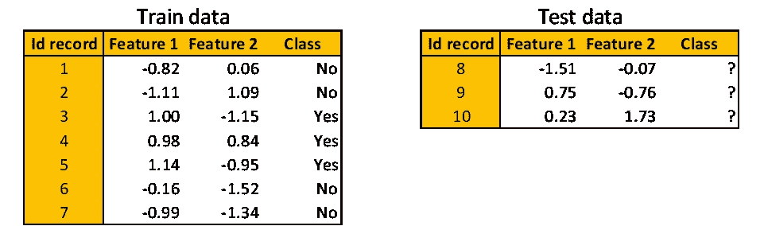

KNN 案例研究数据集|图片由[作者](http://dwiuzila.medium.com/membership)提供

对于 k = 3，KNN 将考虑三个最近的邻居，其工作原理如下所示。

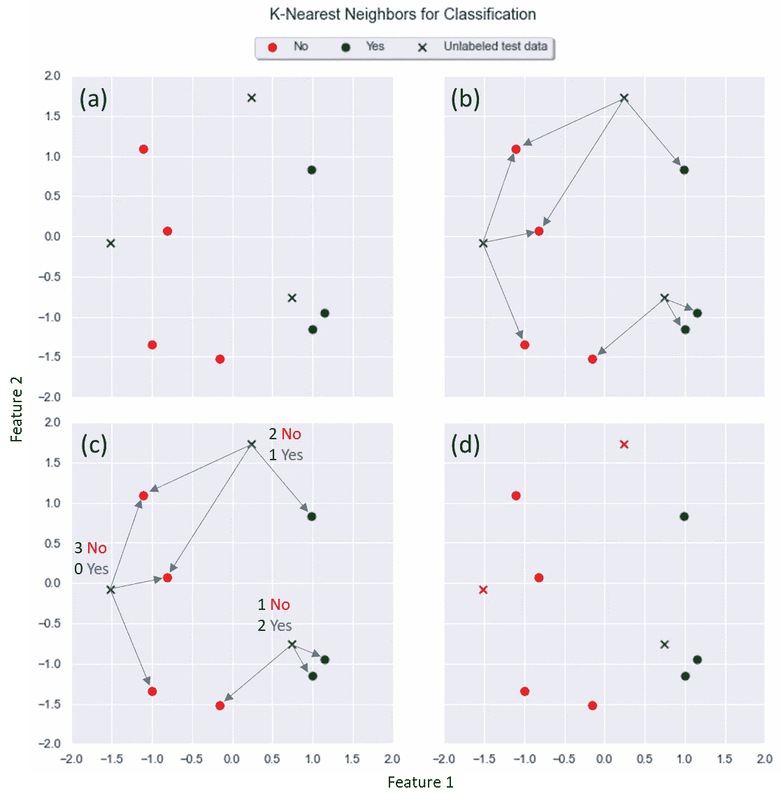

**(a)** 绘制所有训练和测试数据| **(b)** 对于每个测试数据，KNN 在训练数据中找到它的 k 个最近邻居| **(c)** 在每 k 个最近邻居中，计算有多少属于哪个类| **(d)** 给每个测试数据分配最主要的类|图片由[作者](http://dwiuzila.medium.com/membership)

这很容易理解。问题是:如果有一个测试观测，它的最近邻有两个同样占优的类，你该怎么办？你把哪一类分配给测试观察？

当然，如果只有两个类，可以通过选择奇数的 *k* 来完全避免这个问题。但是，如果有两个以上的类，或者如果您坚持使用偶数 k，您可以为每个最近的邻居分配一个权重，这样最近的邻居对拟合的贡献更大。分配的权重应该与测试观察距离的倒数成比例。这样，两个同样占主导地位的阶级几乎不存在了。

值 *k* 的最佳选择高度依赖于数据:通常，较大的 *k* 会抑制噪声的影响，但会使分类边界不太明显。

## 回归

对于回归问题，分配给测试观测值的值是根据其最近邻值的平均值*计算的。一个用 k =* 5 进行回归的 KNN 的例子看起来像这样。

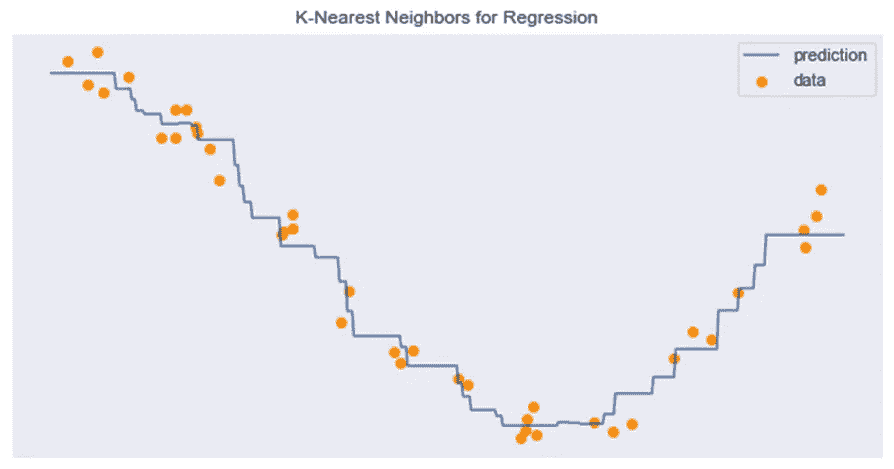

KNN 为回归|图片由[作者](http://dwiuzila.medium.com/membership)

尽管简单，KNN 已经在大量的分类和回归问题上取得了成功。作为一种非参数方法，它通常在判定边界非常*不规则的分类情况下是成功的。*

*KNN 的一个缺点是它非常依赖于距离，因此您需要非常小心地预处理分类特征，找到一个适用于您的数据的 ***距离函数*** 。出于同样的原因，如果某些特征的比例明显大于其他特征，您也需要 ***标准化*** 您的数据。*

# *朴素贝叶斯*

## *贝叶斯定理*

*先来个脑筋急转弯:*

> *医生知道 50%的情况下脑膜炎会导致颈部僵硬。任何患者患脑膜炎的概率为 1/50000，任何患者患落枕的概率为 1/20。如果患者颈部僵硬，他/她患脑膜炎的可能性有多大？*

**

*照片由[亚历山大·巴甫洛夫·波德瓦尔尼](https://unsplash.com/@freestockpro?utm_source=medium&utm_medium=referral)在 [Unsplash](https://unsplash.com?utm_source=medium&utm_medium=referral) 上拍摄*

*这个问题不仅仅是文字游戏。暂时抛开原来的问题，让我们问另一个问题:一个病人患脑膜炎*和*落枕的概率有多大？*

*我们可以一步一步来计算。我们知道病人患脑膜炎的概率是 1/50000。并且知道他/她患有脑膜炎，有 50%的可能性患者也有落枕。所以，一个患者得脑膜炎*和*落枕的概率是 50% × 1/50000 = 1/100000。*

*脑膜炎和落枕没有先后顺序，可以翻转逻辑。我们知道患者落枕的概率是 1/20。并且知道他/她有落枕，病人也有可能患有脑膜炎。所以，一个病人得脑膜炎*和*落枕的概率是 *x* × 1/20。*

*原问题问的是 *x* 的值。但是从前面的论证我们知道 *x* × 1/20 = 1/100000。因此，我们发现，如果患者颈部僵硬，他/她患脑膜炎的概率为 *x* = 0.0002。*

*用简单的数学公式表达这个逻辑就简单多了。让*

*   *P 是病人患脑膜炎的概率，而*
*   *P 是患者落枕的概率。*

*我们以上所做的实际上只是*

*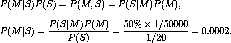*

*这就是所谓的 [***贝叶斯定理***](https://en.wikipedia.org/wiki/Bayes%27_theorem) 。在机器学习设置中，你可以用你想要预测的目标变量 *y* 代替 *M* ，用特征向量 *x₁、…、xₙ* 代替 *S* 。这个定理变成了*

*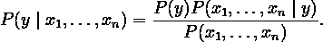*

*计算 *P* ( *x₁，x₂，…，xₙ* | *y* )很难。所以，你做了一个*天真的*假设，在给定目标变量的值的情况下，每对特征之间存在条件独立性。因此对于每个*，i = 1，2，…，n* ，*

*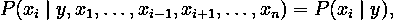*

*朴素贝叶斯模型变成了*

*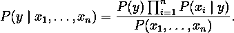*

*由于 *P* ( *x₁、x₂、…、xₙ* )是常数，所以可以简化如下进行预测 *ŷ* 。*

*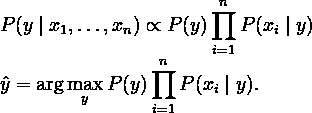*

## *个案研究*

*假设你有以下逃税数据。你的任务是根据应税收入(以美元计)和婚姻状况等特征，预测一个人是否愿意纳税。*

*您将使用 10 个观察值将朴素贝叶斯拟合到训练数据中，然后根据测试数据预测一个看不见的观察值。*

*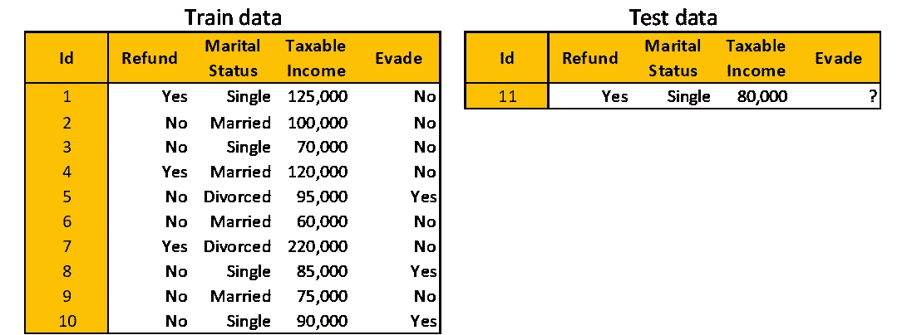*

*朴素贝叶斯案例研究数据集|图片作者[作者](http://dwiuzila.medium.com/membership)*

*马上，您会看到有两个分类特征(退款和婚姻状况)和一个数字特征(应税收入)。当然，计数概率会因人而异。*

*为方便起见，我们将退款、婚姻状况和应税收入分别称为 *x₁、*x₂和 *x₃* 。你可能还想用 1000 除 x₃，这样你就不会处理太大或太小的数字了。另外，通过 *y* 调用规避。*

*朴素贝叶斯做了很多代数运算。对于分类特征，您有*

*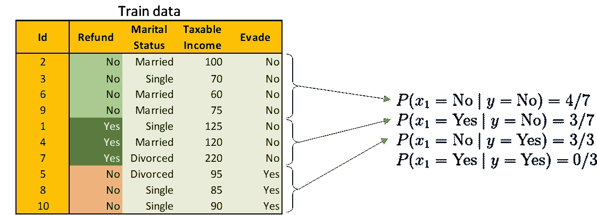*

*计算退款的条件概率给定逃避|图片作者[作者](http://dwiuzila.medium.com/membership)*

*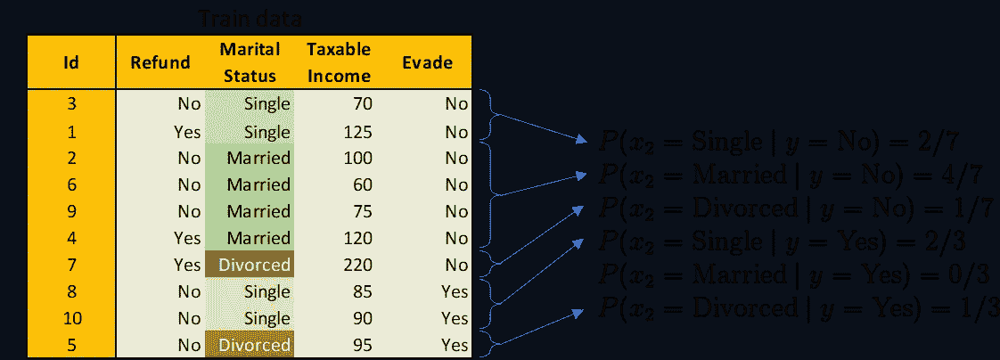*

*计算婚姻状况的条件概率*

*为了方便起见，我们对上面的训练数据进行了分类和颜色编码。*

*对于数字特征，事情变得有点激动人心。您需要为每个特性假设一个基础分布。假设你假设 x₃是正态分布的，那么*

*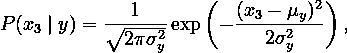*

*其中 *μ* 和 *σ* 分别代表均值和方差。让我们根据试验数据计算出 *x₃* = 80。*

*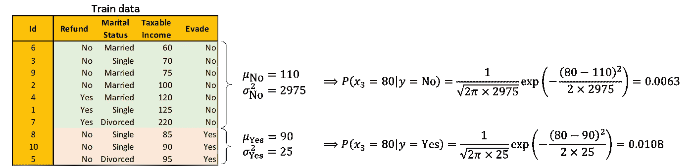*

*给定逃避|图片由[作者](http://dwiuzila.medium.com/membership)计算应税收入的条件概率*

*现在，您已经准备好根据测试观察进行预测了。*

*   **y* =否*

*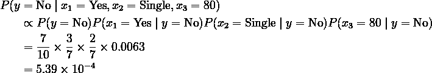*

*   *y =是*

*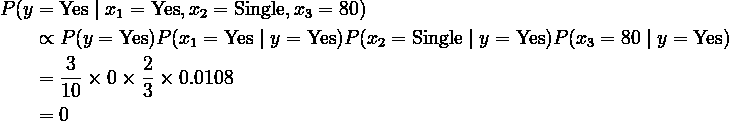*

*既然 5.39 × 10⁻⁴ > 0，那么预测 *ŷ* =否*

## *拉普拉斯平滑*

*在这个案例研究中，对于 *y* =是的，产品链中有一个术语的值为 0。这是不好的，因为在产品链中可能还有另一个大到足以推翻 *y* = No 的术语，但是当乘以 0 时，类 *y* = Yes 总是输。*

*为了减轻这一点，可以使用 [***拉普拉斯平滑***](https://en.wikipedia.org/wiki/Additive_smoothing) 。规定*

*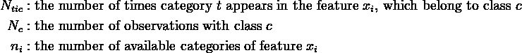*

*代替像以前一样计算分类概率*

**

*将拉普拉斯平滑应用为*

*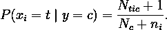*

*让我们最后一次预测测试观察，现在平滑。*

*   **y* =否*

*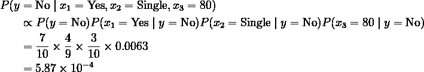*

*   **y* =是*

*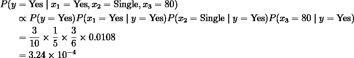*

*既然 5.87 × 10⁻⁴ > 3.24× 10⁻⁴，那么朴素贝叶斯还是预测 *ŷ* =否*

*尽管朴素贝叶斯的假设明显过于简化，但它在许多现实世界的情况下工作得相当好，著名的是文本分类。即使具有强依赖性，朴素贝叶斯仍然工作得很好，即当那些依赖性相互抵消时，对分类没有影响。*

# *决策图表*

## *目标*

*决策树的目标是创建一个模型，通过学习从特征中推断出的简单决策规则来预测目标变量的值。一棵树可以被看作是一个分段常数近似。*

*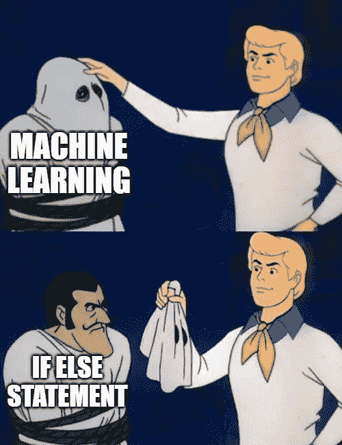*

*从未有过更真实的迷因|图片作者[作者](http://dwiuzila.medium.com/membership)*

*决策树划分特征空间，使得具有相同类别或相似目标值的观察值被分组在一起。由于对树的每个节点递归地进行划分，所以通过理解决策树在节点上的工作方式就足以理解决策树的工作方式。*

*所以，考虑一个节点 *m* 。让节点 *m* 处的列车数据由具有 *n* 个观测值的 *Q* 表示。对于每个候选分裂 *θ* (这是一个特征)，将数据划分为左右两个子集， *Qₗ* ( *θ* )和 *Qᵣ* ( *θ* )，观测数分别为 *nₗ* 和 *nᵣ* 。*

*然后，使用杂质函数 *H* 计算节点 *m* 的候选分裂的质量，其选择取决于被解决的任务(分类或回归)。最佳分割 *θ** 是基于 *nₗ* 和 *nᵣ* 最小化加权杂质的分割，即*

*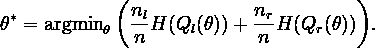*

*对子集 *Qₗ* ( *θ** )和 *Qᵣ* ( *θ** )进行递归，直到达到最大允许深度， *n* 小于某个正阈值，或者 *n* = 1。*

*现在唯一剩下的就是定义杂质函数 *H* 用于分类和回归。*

## *杂质函数*

*如果目标变量 *y* 是取值为 *k* ∈ {0，1，…，*K*1 }的分类结果，设 *I* 为 [***指示函数***](https://en.wikipedia.org/wiki/Indicator_function) 和*

*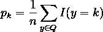*

*成为节点 *m* 中类 *k* 观测值的比例。常见的杂质分类方法如下。*

*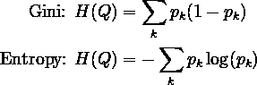*

*如果目标变量 *y* 是回归的连续结果，让*

*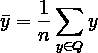*

*是节点 *m* 中所有目标变量的平均值，中位数( *y* )是它们的中位数。常见的回归杂质测量如下。*

*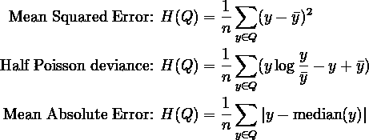*

*如果您的目标变量是计数或频率(每单位的计数)，泊松偏差可能是一个不错的选择。*

*要有很好的理解感，你会看到为什么这些杂质函数的定义有意义，特别是对于分类。假设目标变量 *y* 有两个类，节点 *m* 中类 1 的比例为 *p₁* = *p* 对于某些 0 ≤ *p* ≤ 1。然后*p₀*= 1*p*，您可以为每个 *p* 绘制如下杂质函数。*

*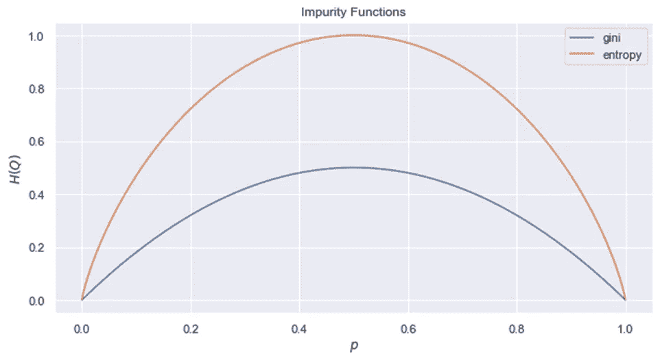*

*二元分类的杂质函数|图片作者[作者](http://dwiuzila.medium.com/membership)*

*杂质函数的思想是当决策树的划分导致最纯粹的分裂时，使其值最小。另一方面，如果分裂不纯(许多类仍然混在一个分裂中)，那么杂质函数应该给出一个高值。*

*这正是上图中发生的情况。当 *p* = 0 或 *p* = 1 时，出现最纯粹的分裂，此时 *H* 的值为零。当在最坏情况下分配不纯时 *p* = 0.5，则 *H* 给出其最大值。*

## *个案研究*

*我们用之前的逃税数据。您将使用 10 个观察值将决策树拟合到训练数据中，然后根据测试数据预测一个看不见的观察值。*

**

*决策树案例研究数据集|图片作者[作者](http://dwiuzila.medium.com/membership)*

*您将使用 Gini 杂质函数，并将树的最大深度设置为 2，以避免过度拟合(两者都是模型的超参数)。由于在训练数据中有 7 个“否”观察值和 3 个“是”观察值，基尼系数的原始值为*

*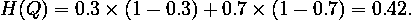***

*决策树的根|图片作者[作者](http://dwiuzila.medium.com/membership)*

*您将使用候选分割 *θ* 分割这些观察值，并找到最佳分割。*

*   ****θ* =退款**。那么，加权基尼系数的值为*

*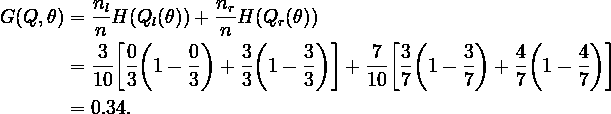*

*   ****θ* =婚姻状况**。那么，有三种可能的拆分:*

*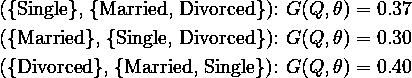*

*   ****θ* =应纳税所得额**。由于这是一个连续的特征，你需要确定几个分割位置(在我们的例子中是随机的)并计算每个分割的基尼系数。我们看到最低的加权基尼系数是在分离位置 97 获得的。*

*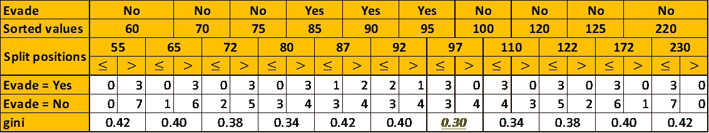*

*计算应税收入的基尼系数|图片作者[作者](http://dwiuzila.medium.com/membership)*

*在所有这些候选分割中，最好的分割给出了最低的加权基尼系数，它要么是***【θ】*=婚姻状况**({已婚}、{单身、离婚})分割，要么是 ***θ* =分割位置为 97 的应税收入**。为了简单起见，我们选择前者。决策树如下图所示。*

*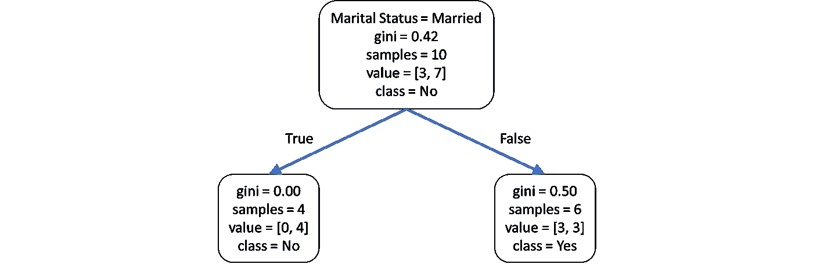*

*深度为 1 的决策树|图片作者[作者](http://dwiuzila.medium.com/membership)*

*左边的节点已经是纯规避=否，那么现在只需要拆分右边的节点。对其余的列车观测数据进行与之前相同的操作。*

*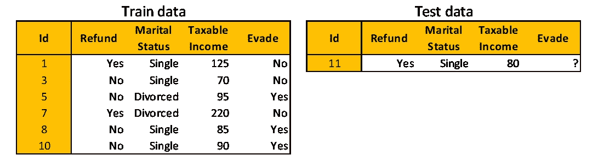*

*决策树右侧节点的数据集|图片作者[作者](http://dwiuzila.medium.com/membership)*

*   ****θ* =退款**。加权基尼系数为 0.25。*
*   ****θ* =婚姻状况**。只剩下两类，所以很容易计算:加权基尼系数是 0.50。*
*   ****θ* =应纳税所得额**。*

*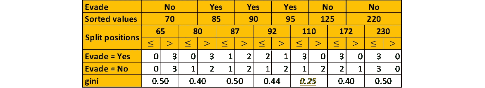*

*计算应税收入的基尼系数|图片作者[作者](http://dwiuzila.medium.com/membership)*

*我们将选择 ***θ* =退款**作为最佳选择，因为它在加权基尼系数最低的候选分割中非常简单。决策树如下图所示。*

*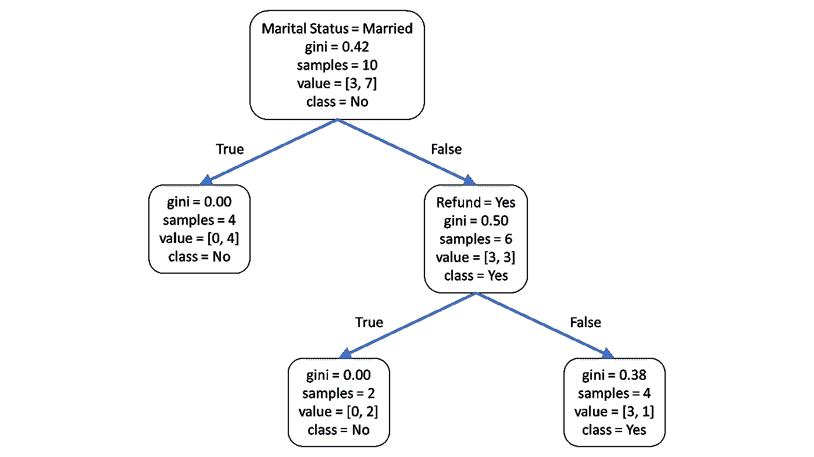*

*深度为 2 的决策树|图片作者[作者](http://dwiuzila.medium.com/membership)*

*您将在这里停止，因为树的最大深度已经达到(设置为 2)。*

*要进行预测，只需使用测试数据遍历树即可。在你的测试数据中，**婚姻状况=单身**，**退款=是**，所以预测为**逃避=否**如下图橙色决策路径所示。*

*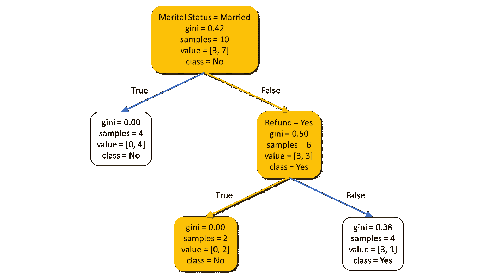*

*对测试数据|图片进行决策树预测[作者](http://dwiuzila.medium.com/membership)*

*决策树因为可以可视化，所以 ***理解******解释*** 很简单。需要 ***少量数据准备*** :不需要数据归一化或虚拟变量。就像 KNN 和朴素贝叶斯一样，决策树能够处理 ***多类*** 问题。*

*然而，决策树往往会对具有大量特征的 ***数据进行过度拟合。诸如修剪、设置叶节点所需的最小样本数或设置树的最大深度之类的机制对于避免这个问题是必要的。也可以考虑事先进行 ***降维*** 。****

*决策树也可能不稳定，因为数据的微小变化可能导致生成完全不同的树。这个问题通过在 ***集合*** 中使用决策树得以缓解。*

# *结论*

**

*照片由[希瑟·王尔德](https://unsplash.com/@heather_wilde?utm_source=medium&utm_medium=referral)在 [Unsplash](https://unsplash.com?utm_source=medium&utm_medium=referral) 拍摄*

*你已经非常详细地学习了三个最基本的机器学习模型:**K-最近邻**、**朴素贝叶斯**和**决策树**。现在，您不仅可以使用已建立的库来构建它，还可以自信地知道它们是如何从内到外工作的，使用它们的最佳实践，以及如何提高它们的性能。*

*恭喜你。*

**

*🔥你好！如果你喜欢这个故事，想支持我这个作家，可以考虑 [***成为会员***](https://dwiuzila.medium.com/membership) *。每月只需 5 美元，你就可以无限制地阅读媒体上的所有报道。如果你注册使用我的链接，我会赚一小笔佣金。**

*🔖*想了解更多经典机器学习模型的工作原理，以及它们是如何优化参数的？或者 MLOps 大型项目的例子？有史以来最优秀的文章呢？继续阅读:**

*

[艾伯斯·乌兹拉](https://dwiuzila.medium.com/?source=post_page-----f8620b25e89b--------------------------------)* 

## *从零开始的机器学习*

*[View list](https://dwiuzila.medium.com/list/machine-learning-from-scratch-b35db8650093?source=post_page-----f8620b25e89b--------------------------------)**8 stories********

[艾伯斯·乌兹拉](https://dwiuzila.medium.com/?source=post_page-----f8620b25e89b--------------------------------)* 

## *高级优化方法*

*[View list](https://dwiuzila.medium.com/list/advanced-optimization-methods-26e264a361e4?source=post_page-----f8620b25e89b--------------------------------)**7 stories********

[艾伯斯·乌兹拉](https://dwiuzila.medium.com/?source=post_page-----f8620b25e89b--------------------------------)* 

## *MLOps 大型项目*

*[View list](https://dwiuzila.medium.com/list/mlops-megaproject-6a3bf86e45e4?source=post_page-----f8620b25e89b--------------------------------)**6 stories********

[艾伯斯·乌兹拉](https://dwiuzila.medium.com/?source=post_page-----f8620b25e89b--------------------------------)* 

## *我最好的故事*

*[View list](https://dwiuzila.medium.com/list/my-best-stories-d8243ae80aa0?source=post_page-----f8620b25e89b--------------------------------)**24 stories********

[艾伯斯·乌兹拉](https://dwiuzila.medium.com/?source=post_page-----f8620b25e89b--------------------------------)* 

## *R 中的数据科学*

*[View list](https://dwiuzila.medium.com/list/data-science-in-r-0a8179814b50?source=post_page-----f8620b25e89b--------------------------------)**7 stories*******

*[1][《sci kit-learn:Python 中的机器学习》](http://jmlr.csail.mit.edu/papers/v12/pedregosa11a.html)，佩德雷戈萨，*等著*，JMLR 12，第 2825–2830 页，2011 年。*

*[2][sci kit-学习用户指南](https://scikit-learn.org/stable/user_guide.html)*