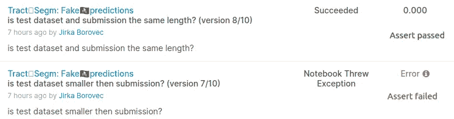
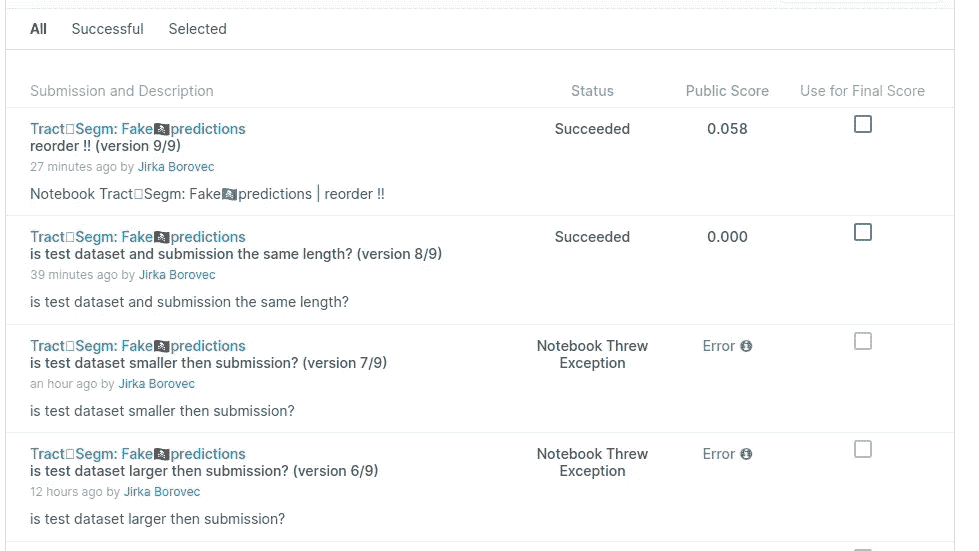

# Kaggle hacking:针对隐藏数据集验证一个简单的假设

> 原文：<https://towardsdatascience.com/kaggle-hacking-validate-a-simple-hypothesis-against-a-hidden-dataset-4cf02bb16510>


马体·米罗什尼琴科摄于 Pexels 。

## 这篇文章将分享如何创造性地调试你的 Kaggle 提交，特别是提交格式，以及我如何对一个机密/受保护的数据集进行简单的假设测试。

Kaggle 是一个很棒的地方，建立了一个奇妙的机器学习(ML)实践者和爱好者社区，他们愿意分享他们的学习和经验。我很惊讶这个平台是如何随着时间的推移而增长的，而且似乎有永无止境的新竞争。不幸的是，我也注意到一些竞争，甚至是财务价格，提供了纯粹或部分误导的描述和正确提交格式的解释；看两个例子[这里](https://www.kaggle.com/competitions/birdclef-2022/discussion/309001)或者[这里](https://www.kaggle.com/competitions/uw-madison-gi-tract-image-segmentation/discussion/320908)。

> 我向所有酷的竞争对手道歉，没有任何冒犯的意思，把这篇文章看作是对可能的平台漏洞的学习。

# 关于卡格尔将军的快速提交

Kaggle 主办了几种类型的比赛，但是为了简单起见，让我们只假设数据共享/访问的观点。所以有完全开放的数据集和隐藏测试分数的数据集。

完全开放的竞赛提供训练和测试数据集，如果需要，用户可以将它们下载到本地机器上。他们还允许通过上传提交 CSV 文件来提交。我天真的猜测是，数据集是众所周知的(如泰坦尼克号)，或者没有期望任何用户/竞争对手将能够执行手动预测。

另一个故事是激烈的竞争，组织者通过不共享测试数据集来加强正确性。他们将它暴露在一个受限/隔离的环境中:用户必须提交一个能够离线处理测试数据并提供预测的内核。使用离线内核，你不能在任何地方上传/分享数据，而且所有额外连接的数据集也是只读的。这太棒了，我喜欢！

就可用性而言，最好至少提供测试数据集的某个最小子集(例如，10k 中的 5 个样本图像)，这不会影响提交分数，但仍能给出数据的含义，并允许用户调试其提交过程。Kaggle 甚至要求正确/有效的提交才能被允许/有资格使用您的内核进行提交(内核需要离线运行而不出错，并产生一个提交文件)。然后在评估阶段，虚拟测试数据集与实际测试数据集进行交换，并最终提交用于评分。

## 竞争对手的可用性问题

让我分享一下我在开发和/或调试有效提交管道时遇到的两种挑战:

1.  测试数据和样品提交完全缺失，描述具有误导性(如评估页面上呈现的扫描图像[缺乏索引)。](https://www.kaggle.com/competitions/uw-madison-gi-tract-image-segmentation/discussion/320908)
2.  提供的样本测试数据不映射提供的样本提交(例如，[提供的样本提交引用不存在的文件，并且测试数据集包括另一个文件](https://www.kaggle.com/competitions/birdclef-2022/discussion/309001))。

所有这些导致用户需要花费数小时或数天的调试时间来找出最小的有效解决方案，而不是从一开始就关注解决方案(参见示例投诉[此处](https://www.kaggle.com/competitions/uw-madison-gi-tract-image-segmentation/discussion/320541)和[此处](https://www.kaggle.com/competitions/uw-madison-gi-tract-image-segmentation/discussion/319265))。


Andrea Piacquadio 摄于 [Pexels](https://www.pexels.com/photo/photo-of-a-woman-thinking-941555) 。

# 黑客 Kaggle

我参加了一个比赛，阅读了数据和评估说明，并准备了一个最小的提交来理解格式。但是即使第四次提交也出错了，尽管我确信它们都是正确的。为什么它不起作用？！我花了一整天的时间阅读讨论和检查一些产生有效提交的内核，以提炼提交格式…

这是相当棘手的，其他内核很长，包括许多其他的训练步骤，对我的最小提交是不需要的！

## 准备舞台

然后我想，当我需要对有效内核进行逆向工程时，为什么不尝试直接用 Kaggle 进行调试。在这个特殊的比赛中，组织者提供了`sample_submission.csv`,它实际上是一个空的提交模板，后来只在评估期间填充了有效数据，所以不可见！

我准备了一个虚拟内核，在执行结束时，它会将这个`sample_submission.csv`复制为`submission.csv`，给出 0 分，但是它通过了所有检查！此外，我必须区分在公共模式和评估模式下运行——在公共模式下,`sample_submission.csv`是一个空表，所以添加`if not df.empty`会导致流程只在评估阶段被调用。

[](https://www.kaggle.com/code/jirkaborovec/tract-segm-fake-predictions)  

虽然内核通常几乎是空的，但我可以将一个或多个资产注入到真实测试数据集存在时执行的评估子过程中。瞧啊。当`assert` 不正确时的简单信号——内核在提交给竞争对手后会出错。



用户用断言发信号。

# 实验

在特定的比赛中，我对提交索引有些怀疑。这是在[竞赛](https://www.kaggle.com/competitions/uw-madison-gi-tract-image-segmentation)中提供的提交样本:

```
id,class,predicted
1,large_bowel,1 1 5 1
1,small_bowel,1 1
1,stomach,1 1
2,large_bowel,1 5 2 17
etc.
```

但图像(如描述中所述)应具有与列车图像相同的格式，因此数据被组织在文件夹`<case>/<case_day>/<scans>`中，特定图像名称为`slice_height_width_y-space_x-space.png`。因此，我通过在`test`文件夹中列出所有 PNG 图像并乘以三个预测标签来创建我的提交:

```
id,class,predicted
case36_day14_slice_0006,large_bowel,
case36_day14_slice_0006,small_bowel,
case36_day14_slice_0006,stomach,
case36_day14_slice_0082,large_bowel,
case36_day14_slice_0082,small_bowel,
…
```

我如何能得到图像名称配对和一个特定的索引？

## 陈述假设

我用[tract🩻segm: fake🏴‍☠️predictions](https://www.kaggle.com/code/jirkaborovec/tract-segm-fake-predictions)创建了一组实验，其中`df_ssub`直接从`sample_submission.csv`文件加载，而`df_pred`是通过在`test`文件夹中列出所有 PNG 图像创建的…

如前所述，我只能从评估中得到二元答案，所以我不能一开始就问太复杂的问题。所以我简化了关于`df_ssub`和`df_pred`之间关系的问题:

1.  它们的大小相同吗(例如，如果`df_ssub`是`df_pred`的子集)？
2.  如果长度相同，所有的键/id 是否都出现在两个表上？

## 结果

从问题 1)开始，我通过改变断言条件连续提交了三次:

*   `assert len(df_pred) > len(df_ssub)` > >错误
*   `assert len(df_pred) < len(df_ssub)` > >错误
*   `assert len(df_pred) == len(df_ssub)` > >好吧

在下一轮中，我通过检查`df_ssub`中没有会在`df_pred`中丢失的键(注意，这些键由两列组成:`id`和`class`):


回应是肯定的——提交通过，正如您在我的问题提交的完整序列中看到的:



用户提交

我的实验结论是，提交的样本包括了所有出现在`test`文件夹中的图片，但是它们的排序方式必须和`sample_submission.csv`一样。

# 结论

我分享了纯粹竞争的描述是如何引导我开始第一次黑客行为的...特别是，我描述了一个简单的过程，通过在正常流和评估流之间分流内核执行来验证针对受保护数据集提出的二元假设。

值得注意的是，它不会导致数据集或其任何部分的泄露，因为每个用户每天提交的数量有限。

**敬请关注，关注我了解更多！**