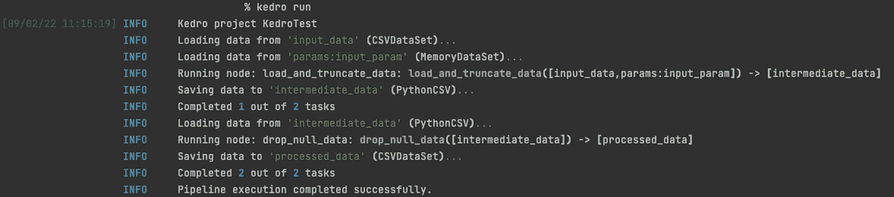

# 10 分钟后 Kedro 成为数据管道

> 原文：<https://towardsdatascience.com/kedro-as-a-data-pipeline-in-10-minutes-21c1a7c6bbb>

## 开发工作流框架变得简单——用 Python 示例解释


罗曼·达维德科在 [Unsplash](https://unsplash.com?utm_source=medium&utm_medium=referral) 上拍摄的照片

在数据科学项目中，各种编码组件可以被认为是一个数据流——从源到特征工程、建模、评估等的数据流。训练、评估和评分管道使这一流程变得更加复杂，因为每个管道的流程可能有很大的不同。

Kedro 是一个 Python 框架，它帮助将代码组织成模块化的数据管道。Kedro 允许可复制的和容易的(一行命令！)运行不同的流水线，甚至临时重新运行一小部分流水线。本文将涉及 Kedro 和 Python 示例中使用的组件和术语，以及如何设置、配置和运行 Kedro 管道。

***更新*** *:本文是系列文章的一部分。查看其他“10 分钟内”话题* [*此处*](https://medium.com/@kayjanwong/list/in-10-minutes-eeaa9aa67055) *！*

# 目录

*   [Kedro 概述](https://medium.com/p/21c1a7c6bbb/#eca7)
*   [Kedro 设置](https://medium.com/p/21c1a7c6bbb/#09aa)
*   [Kedro 文件夹结构](https://medium.com/p/21c1a7c6bbb/#9d4c)
*   [与 Kedro 合作](https://medium.com/p/21c1a7c6bbb/#2d6e)
*   [将 Kedro 与编码最佳实践相结合](https://medium.com/p/21c1a7c6bbb/#8189)
*   [高级:使用外部数据库](https://medium.com/p/21c1a7c6bbb/#1b64)

# Kedro 概述

Kedro 是麦肯锡开发的第一个开源软件工具，最近捐赠给了 Linux 基金会。它是一个 Python 框架，用于创建可复制、可维护和模块化的代码。

> Kedro 将软件工程的最佳实践与数据科学世界结合起来

该组织有几个组成部分，即

*   **节点**:函数包装器；将函数的输入、函数本身和函数输出包装在一起(定义 ***应该运行什么*** 代码)
*   **管道**:将节点连接在一起；解析依赖关系并确定函数的执行顺序(定义代码应该运行的*顺序)*
*   ***DataCatalog** :数据的包装器；将节点中指定的输入和输出名称链接到文件路径*
*   ***Runner** :决定管道如何运行的对象，例如顺序或并行(定义 ***代码应该如何运行****

# *Kedro 设置*

*Kedro 可以作为 Python 包安装，并用以下命令进行实例化，*

```
*pip install kedro
kedro new*
```

*请注意，此设置只需运行一次。该程序将提示您输入项目名称，并在您的存储库中创建一个文件夹结构。*

*要从现有的 Kedro 项目实例化，我们可以使用命令`kedro new --starter=https://github.com/your-repo.git`来代替。*

*现在，让我们编写一些管道代码！*

**

*Jesse Echevarria 在 [Unsplash](https://unsplash.com?utm_source=medium&utm_medium=referral) 上拍摄的照片*

# *Kedro 文件夹结构*

*实例化 Kedro 后，几个文件夹和文件被添加到项目中。该项目应该具有以下文件夹结构，*

```
*project-name
├── conf                 (configuration files)
│   ├── base
│   └── local
├── data                 (project data)
│   ├── 01_raw
│   ├── 02_intermediate
│   ├── 03_primary
│   ├── 04_feature
│   ├── 05_model_input
│   ├── 06_models
│   ├── 07_model_output
│   └── 08_reporting
├── docs                 (project documentation)
│   └── source
├── logs                 (project output logs)
├── notebooks            (project jupyter notebooks)
└── src                  (project source code)
    ├── project_name
    │   └── pipelines
    └── tests
        └── pipelines*
```

## *会议*

*`conf`文件夹用于存储配置文件。`base`子文件夹存储共享的项目相关配置，而`local`子文件夹存储用户相关或机密的配置。在`local`子文件夹中的配置不应该被提交到代码库中，这个设置在`.gitignore`文件中处理。*

*在`base`子文件夹中为 ***数据目录*** 、日志记录和参数创建示例配置文件，而`local`子文件夹中的示例配置文件用于存储凭证。*

## *数据*

*`data`文件夹存储在不同数据管道阶段创建的输入、中间和输出数据。与本地配置类似，`data`文件夹中的文件不应该提交给代码库。*

*由于 Kedro 是作为数据科学框架创建的，默认的文件夹结构对应于数据科学项目的各个阶段，如果需要，您可以进一步定制。*

## *科学研究委员会*

*文件夹是存储大量代码的地方。它包含项目代码、 ***节点*** 和 ***管道*** 代码、 ***流道*** 代码等等。*

# *与 Kedro 合作*

*高级 Kedro 工作流遵循以下顺序，*

1.  ***定义配置**:指定 ***数据目录*** 和参数*
2.  ***编写函数**:将项目代码包装到函数中*
3.  ***定义节点**:将函数包装成节点*
4.  ***定义管道**:将节点链接在一起*
5.  ***定义管道**:指定管道应该如何运行*
6.  ***运行管道**:读取 conf，使用 runner，运行管道！*

*我们将更详细地介绍每个步骤，以分解工作流程。*

## *№1: **定义形态***

****数据目录*** 将文件名与其对应的文件类型和位置联系起来，并在`conf/base/catalog.yml`文件中定义。它可以这样定义，*

```
*input_data:
  type: pandas.CSVDataSet
  filepath: data/01_raw/iris.csv

intermediate_data:
  type: pandas.CSVDataSet
  filepath: data/02_intermediate/iris_small.csv

processed_data:
  type: pandas.CSVDataSet
  filepath: data/03_primary/iris_processed.csv*
```

*注意，我们不需要在`data`文件夹中存在所有的文件路径，只需要输入数据，因为在管道运行时会创建中间数据。*

*参数被输入到函数中，并在`conf/base/parameters.yml`文件中被定义为嵌套字典。*

```
*input_param:
  n_rows: 100*
```

## *№2:编写函数*

*功能是在`src`文件夹中定义的项目特定代码。自动处理前面步骤中定义的 ***DataConfig*** 和参数，使得函数的输入分别为 pandas 数据帧和 dictionary 类型，输出为 pandas 数据帧。我们不需要执行任何文件读取或保存操作——这抽象出了文件 I/O 代码！*

*在高级部分，我们将编写自定义 I/O 代码来指定自定义读取和保存方法，以帮助连接到外部数据库。*

*对于这个演示，让我们假设我已经用签名编写了两个函数*

*   *`load_and_truncate_data(data: pd.DataFrame, input_param: Dict[str, Any]) -> pd.DataFrame`*
*   *`drop_null_data(data: pd.DataFrame) -> pd.DataFrame`*

## *№3:定义节点*

*Node 对象将函数的输入和输出(在步骤 1 中)包装到函数本身(在步骤 2 中)。指定节点名称是可选的，但是节点名称有助于运行特定节点的功能，而不是运行整个管道。为了最小化导入的数量，我更喜欢在同一个文件中定义节点和管道。*

## *第 4 项:定义管道*

*管道对象将几个节点链接在一起，这是在`src/project_name/pipelines`文件夹中定义的。流水线和节点可以这样定义，*

*`kedro.pipeline.Pipeline`(第 10 行)将多个`kedro.pipeline.node`对象链接在一起，每个节点将函数包装为`func`，输入数据和参数为`inputs`，输出为`outputs`，节点名为`name`。*

*最后，管道必须在`pipeline_registry.py`文件中注册。大部分代码已经给出，我们可以在 return 语句中将管道添加到字典中，*

```
*def register_pipelines() -> Dict[str, Pipeline]:
    return {
        "pipeline1": pipeline([processing_pipeline()]),
        "__default__": pipeline([processing_pipeline()])
    }*
```

*从管道定义中，我们观察到代码是可扩展的——我们可以很容易地定义一个训练、验证和评分管道，它调用运行不同节点序列的不同管道！*

## *№5:定义流道*

*Runner 对象指定管道如何运行。默认情况下，选择`SequentialRunner`按顺序运行节点。还有`ParallelRunner`(多处理)`ThreadRunner`(多线程)。*

*例如，还可以使用自定义运行器，通过跳过节点或允许重试来处理节点故障。*

## *№6:运行管道*

*可以使用代码或命令行界面(CLI)运行管道。建议使用 CLI 运行 kedro，因为它确保没有变量泄漏，而且也很简单；可以用命令`kedro run`运行管道！*

**

*图 1:运行管道的终端输出——作者提供的图片*

*在上面运行的示例中，我们观察了 Kedro 如何运行管道的序列；它在运行节点之前加载数据和参数，之后保存数据，然后报告它已经完成了任务。日志还允许我们轻松地识别数据名称、数据类型、节点名称、函数名称和函数签名。*

*对于运行管道的更多变化，我们可以添加选项，*

```
*$ kedro run --pipeline=pipeline1
$ kedro run --node=load_and_truncate_data
$ kedro run --from-nodes=node1 --to_node=node2
$ kedro run --runner=ParallelRunner*
```

# *将 Kedro 与编码最佳实践相结合*

> *添加文档组件、单元测试和林挺功能*

*正如在概述中提到的，Kedro 使得从软件工程中实现编码最佳实践变得容易。*

*命令`kedro test`运行项目中的所有单元测试，遵循 Python `unittest`或`pytest`框架。而命令`kedro lint`使用`flake8`、`isort`和`black` Python 包执行林挺。这些 CLI 命令无缝地工作，除了编写测试用例之外，用户不需要额外的工作。*

*</unit-testing-with-mocking-in-10-minutes-e28feb7e530>  </pytest-with-marking-mocking-and-fixtures-in-10-minutes-678d7ccd2f70>  

为您的源代码编写文档字符串和文档也是一个很好的实践，这样技术和非技术受众都可以理解这个存储库。命令`kedro build-docs`自动为您的项目生成文档。这是建立在 Sphinx 框架之上的，它可以用漂亮的 HTML 格式显示文档。

</advanced-code-documentation-beyond-comments-and-docstrings-2cc5b2ace28a>  

# 高级:使用外部数据库

kedro[***data catalog***](https://kedro.readthedocs.io/en/stable/data/data_catalog.html)支持读取和保存本地或网络文件系统、Hadoop 文件系统(HDFS)、亚马逊 S3、谷歌云、Azure 和 HTTP(s)上的数据集。诸如`fs_args`、`load_args`和`save_args`之类的附加参数可以作为键传递给 ***DataCatalog*** 以指定与文件系统交互时的参数。

如果用户需要更多的读/写操作，可以在`project_name/io`文件夹中编写自定义的 I/O 类。这些定制类使用 Kedro 抽象类，比如`AbstractDataSet`和`AbstractVersionedDataSet`作为基类。实现从 CSV 文件中读写 pandas DataFrame 的示例自定义 I/O 类可以这样编写，

相应的数据目录可以这样定义，

```
intermediate_data:
  type: project_name.io.python_csv.PythonCSV
  filepath: data/02_intermediate/iris_small.csv
  save_args:
    index: false
```

这种使用 Kedro 的抽象类作为基类来编写定制 I/O 类的方式是扩展 Kedro 功能以提供定制选项的一种简洁方式——如果您想要定制 runner 函数，也可以用同样的方式完成！

希望您对 Kedro 作为一个开发工作流框架有了更好的理解。Kedro 提供了更多的功能，比如数据版本控制、数据代码转换、编写钩子、编写 CLI 来调用自定义命令，比如`kedro <command>`，等等。

> 我发现 Kedro 的美妙之处在于它在严格性和允许定制化之间的平衡

例如，Kedro 实施了一个文件夹结构，但是给用户在`src`文件夹中构建代码的自由。Kedro 抽象出了处理 I/O 操作的复杂性，还允许用户在需要时轻松扩展和编写定制的 I/O 类。

> Kedro 如何在引擎盖下工作的复杂性也令人惊讶

处理流道、管道和配置的方式无需明确说明它们应该如何相互交互，从而改善了编码体验。然而，这种抽象不可避免地导致对组件如何运行的控制和可见性降低。

> 就可用性而言，Kedro 强制源代码模块化

因为节点对象引用直接起作用，所以在代码库中不会有松散的代码。这使得代码库更容易维护，并以可重现的方式运行完整、部分或不同的管道。但是，由于每个节点都要加载和保存一个数据集，这可能会占用大量空间和时间，与编写几个函数并将一个函数的输出直接传递给下一个函数而不必每次都保存和加载相比，这会导致大量 I/O 操作。这将是对检查点和可再现性的需求与对效率的需求之间的权衡。

这是演示中使用的 [GitHub 库](https://github.com/kayjan/test-kedro)的链接。

**感谢您的阅读！**如果你喜欢这篇文章，请随意分享。

# 相关链接

Kedro 文档:[https://kedro . readthedocs . io](https://kedro.readthedocs.io)

Kedro 官方 GitHub:[https://github.com/kedro-org/kedro](https://github.com/kedro-org/kedro)*