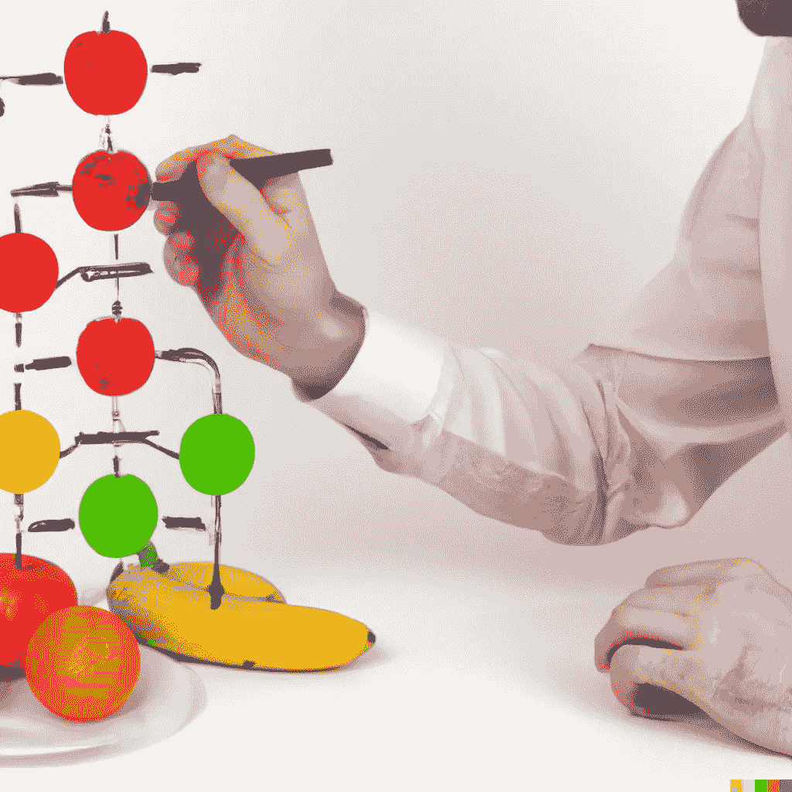
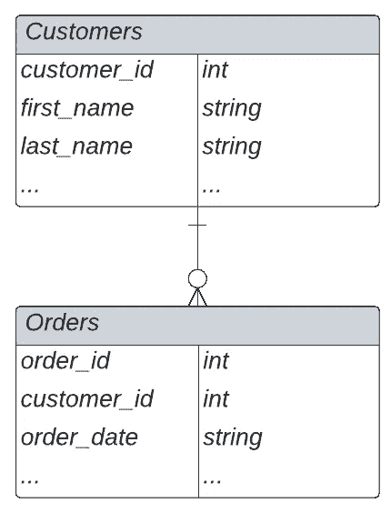
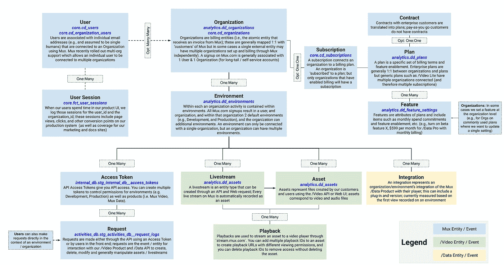
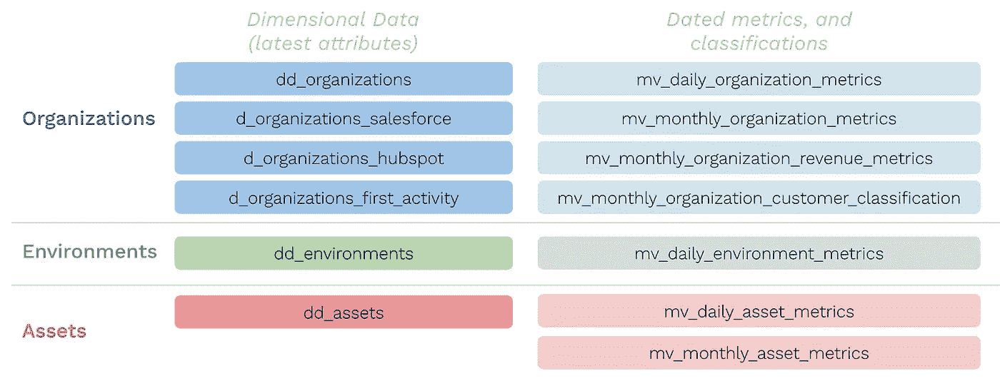

# 亲近你的朋友，亲近你的实体

> 原文：<https://towardsdatascience.com/keep-your-friends-close-keep-your-entities-closer-ae216b02da1e>

## 实体关系图:不酷，不现代，但仍然非常有价值

苹果、橘子和香蕉(由 DALL-E 生成)

最纯粹的数据仓库是一面镜子。如果做得好，这个镜像反映了来自您的业务或领域的真实世界的实体和事件，并以少量的表格、指标和维度来表达它们。做得非常正确——你的内部利益相关者和其他分析师可以在这个生态系统中导航，而不用担心细微差别或错误——实现这一点从最底层的实体关系图开始(ERD)。

# 考虑一下贾夫勒商店

dbt 的 [Jaffle Shop](https://github.com/dbt-labs/jaffle_shop/tree/main/models) 演示项目是一个虚构的电子商务业务，有两个核心实体:`customers`和`orders`。每一个`customer`都是一个独特的个体(一个人)，每一个`order`都反映了其中一个客户的交易。因此，我们可以说`Customers` : `Orders`是一:多，并且每个`order`都继承了那些进行交易的上游`customers`的属性。这样，我们可以很容易地回答诸如“姓`Smith`的客户的交易金额是多少？”

ERD 看起来如下所示:

dbt 的谢夫尔商店的示范 ERD；作者图片

这是一个有意简化的模型，有助于启动和运行 dbt——它太简单了，以至于不值得制作一个 ERD。然而，真实世界的例子会产生指数级的更高的复杂性，这也是实体关系图开始赢得市场的地方。

# 信息民主化和减少认知开销

在我在 YouTube 从事数据工作的这些年里，我的一位同事经常提到正确使用我们内部数据仓库所需的**认知开销**。这种认知开销——为了理解或理解你正在看的东西，你的大脑必须进行多少逻辑连接或跳跃——是由它试图反映的业务、实体和事件的复杂性驱动的。

在工作过程中，分析师需要浏览各种实体，如`channels`、`content owners`、`videos`、`digital assets`、`copyright claims`、`partners`、`viewers`、`users`等……看似简单的问题，如“我们上个月在德国的值班时间是多少？”如果没有连接到正确的实体，可能是不显眼的地雷(例如，我们关心`viewer`的国家吗？`channel`的申报国？`content owner`的国家？).这些实体之间的多对多关系和不可加总的指标使得分析更加棘手。

有少数分析师知道所有这些部分是如何协同工作的，并且能够提出正确的问题(以 SQL 查询的形式)——其他人的查询要承担风险。

回想起来，如果有一个清晰的语义层来帮助我们的分析师在这个生态系统中导航，而不用担心没有意义，我们会受益匪浅。但是我们缺少一个更简单的解决方案:一个清晰的实体关系图。

拼图块(DALL-E)

即使您有一个语义层，您也需要弄清楚如何将这些部分组合在一起——这就是为什么这种低技术，特别是非现代的数据建模方法在今天仍然如此重要。它充当创作者的**强制功能，要求他们批判性地思考他们试图建模的现实世界事件和实体(以及它们之间的关系)。**对于** **数据消费者来说，ERD 是一个强大的使能器，可以立即使知识民主化**，否则这些知识在许多成熟的组织中是封闭的。**

# ERD 奖给你的烦恼

当我在 2021 年第一次加入 Mux 时，我们从零开始构建我们的数据仓库。这意味着我们需要找出哪些核心实体和事件需要在数据仓库中表示。我花了几个小时在我们的数据湖和我们的公共 API 参考和文档中处理原始数据，试图让我的头脑了解这个生态系统——这些时间是我在这里任职期间投资回报率最高的时间。当时的结果是下面的原始文档:

Mux 核心产品实体(示范)，图片由作者提供

这个演示视图捕捉了我们生态系统不到一半的复杂性(即，它没有考虑更新的产品、发票、观众会话、GTM 系统等。)—仍然将这些都写在纸上帮助我们快速了解我们的最终状态数据仓库将会是什么样子，以便反映现实，以及如何在我们的语义层中连接这些点。

有了 ERD，我们开始构建我们的 dbt 模型和 LookML，并且已经有了一组稳定的表来反映我们的核心实体和事件，同时我们继续构建更新的边界。

Mux DWH 围绕核心实体组织，图片由作者提供

# 结束语

总之，如果你的数据团队还没有，花时间做一个完整的实体关系图(ERD)。虽然这可能比编写 SQL 或 dash-boarding 效率低，但在这里花费的时间将是您最宝贵的时间。