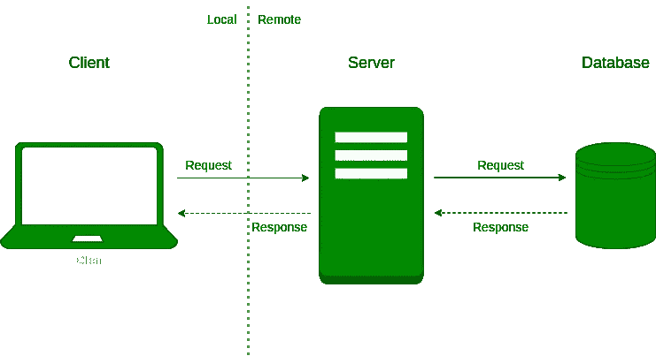

# 让您的 ML 模型远离您的应用服务器

> 原文：<https://towardsdatascience.com/keep-your-ml-models-out-of-your-application-servers-9fe58f9c91a5>

## 如何将一个有前途的 ML 模型变成一个有用的 ML 驱动的产品

安德烈·泰森在 [Unsplash](https://unsplash.com?utm_source=medium&utm_medium=referral) 上拍摄的照片

部署您的机器学习(ML)模型从来都不是一项轻松的工作。当然，一些很棒的工具可以帮助你快速地与世界分享你的模型，比如 [Gradio](https://gradio.app/) 和 [Streamlit](https://streamlit.io/) ，但是如果我们谈论的不仅仅是概念验证，你必须做出一些决定！

Gradio 和 Streamlit 在这方面做得很好，但提供的前端灵活性有限。你能做的只有这么多，你的 ML 应用程序的前端看起来就像很多其他的原型一样。此外，它们不能扩展到许多并发请求。你的模型会成为瓶颈，蚕食服务器的资源。

在这个故事中，我会给你一个很好的理由让你的模型保持在你的应用服务器中，然后告诉你哪里会失败，为什么你不应该这样做。

> [学习率](https://www.dimpo.me/newsletter?utm_source=medium&utm_medium=article&utm_campaign=model-in-server)是为那些对 AI 和 MLOps 的世界感到好奇的人准备的时事通讯。你会在每个月的第一个星期六收到我关于最新人工智能新闻和文章的更新和想法。在这里订阅！

# 建筑

首先，让我们看看典型的 web 应用程序是如何构造的。下图描述了参与用户与 web 应用程序交互的常见场景的实体:

一个通用的 web 服务架构——作者图片

客户端是您的用户。您的用户可以是现实生活中的人，也可以是发出请求的应用程序。服务器通常是大多数代码运行的地方。它接受请求，处理请求，并响应客户端。数据库存储应用程序的数据。它可以采取许多形式和形状，但这不是我们目前关心的问题。

在这种情况下，客户端(例如，用户或应用程序)通过网络向服务器发出请求。服务器查看数据库系统以收集必要的信息，并向用户返回响应。

我简要描述的过程是一个非常简单的场景，有许多备选方案。然而，这可能是客户端发出请求时最常见的步骤。

现在，如果您选择使用服务器中的模型体系结构，您的服务器将负责加载您的模型、处理请求的数据、运行您的模型的正向传递、转换预测，并将响应返回给用户。如果看起来工作量很大，那是因为它确实很大！

## 为什么要从那里开始呢？

目睹服务器不得不做的工作令人沮丧。然而，有一个非常好的理由来使用这种方法；你必须失败得快，失败得多。

当您正在构建一个新的 ML 应用程序的原型时，最好准备好一些东西:

*   拥有一个基本的用户界面，让用户更容易与应用程序交互
*   将您的应用程序放在 URL 后面，这样更容易与您的朋友和测试人员共享

像 Streamlit 和 Gradio 这样的工具可以帮你完成繁重的工作。因此，在早期，您应该尽早并经常部署，您肯定应该利用它们的特性。此外，当你开发你的模型时，你的焦点应该停留在这上面。所以，保持简单，以后再增加复杂性。

如果你在一家公司工作，重用现有的基础设施是遵循这种方法的另一个好理由。因此，您的公司可能已经建立了可靠地将代码部署到服务器的流程，您可以搭顺风车。

## 为什么你不能就此打住

话虽如此，但在生产环境中部署时，有许多原因会让您不想遵循这种架构。

首先，web 服务器可以用不同的语言编写(例如，ruby 或 javascript)。现在，您必须以某种方式将您的模型加载到这种语言中，虽然有这样做的方法，但它们很有挑战性并且容易出错。

然后，你在生产中的模型会经常改变。性能下降、概念漂移问题和新数据将使您经常更新您的模型。另一方面，您的 web 服务器代码不会经常更改。如果您遵循服务器中的模型架构，那么每当您必须更新您的模型时，您将不得不从头开始部署整个系统。您会同意我的观点，对于您的应用程序来说，这不是一个好的、优化的推广过程。

其次，您的服务器硬件可能没有针对 ML 工作负载进行优化。例如，它可能无法访问您的模型可以用来更快进行预测的 GPU 设备。现在，你可以争辩说在推理过程中你可能不需要 GPU 设备，但是在后面的文章中，我们将讨论性能优化，你可能会发现你确实需要它们，这取决于你的用例。

最后，您的模型和 web 服务器很可能会有所不同。如果您的模型很复杂或很大，您可能希望将它托管在 GPU 上，并将负载分布在许多机器上。你不会想让你的网络服务器变得如此复杂。此外，您的模型会消耗您的 web 服务器的资源，这将使用它所有的能力来使模型运行。

# 结论

在这个故事中，我们看到了为什么您想要使用像 Streamlit 和 Gradio 这样的工具来部署快速且常用的 ML 应用程序版本。我们看到了服务器模型架构的优点和缺点，以及为什么您不想在生产中采用这种方式。

那么，你能做什么？在下一个故事中，我们将看到如何将您的模型从您的 web 服务器中分离出来，最后，使用一个众所周知的工具在一个生产就绪的环境中服务您的模型。

阅读这个故事的第二部分:

 [## 将您的 ML 模型从服务器中拉出:数据库解决方案

### 何时将模型放入数据库，如何放置，为什么

towardsdatascience.com](/pull-your-ml-model-out-of-your-server-the-database-solution-a00b212f5e0d) 

# 关于作者

我叫[迪米特里斯·波罗普洛斯](https://www.dimpo.me/?utm_source=medium&utm_medium=article&utm_campaign=model-in-server)，我是一名为[阿里克托](https://www.arrikto.com/)工作的机器学习工程师。我曾为欧洲委员会、欧盟统计局、国际货币基金组织、欧洲央行、经合组织和宜家等主要客户设计和实施过人工智能和软件解决方案。

如果你有兴趣阅读更多关于机器学习、深度学习、数据科学和数据运算的帖子，请关注我的 [Medium](https://towardsdatascience.com/medium.com/@dpoulopoulos/follow) 、 [LinkedIn](https://www.linkedin.com/in/dpoulopoulos/) 或 Twitter 上的 [@james2pl](https://twitter.com/james2pl) 。

所表达的观点仅代表我个人，并不代表我的雇主的观点或意见。