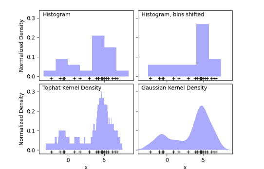
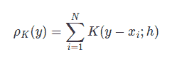
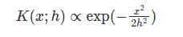
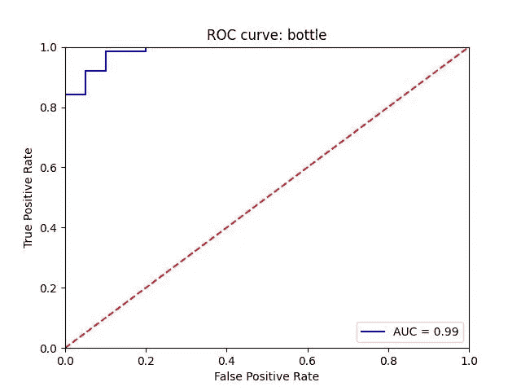
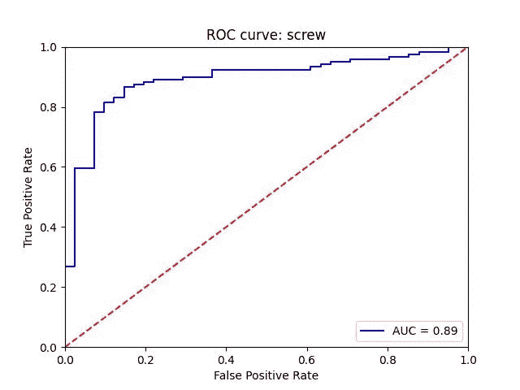

# Python 中异常检测的核密度估计:第 1 部分

> 原文：<https://towardsdatascience.com/kernel-density-estimation-for-anomaly-detection-in-python-part-1-452c5d4c32ec>

# Python 中异常检测的核密度估计:第 1 部分

## 将经典方法与深度学习相结合以获得更好的表示

[穆利亚迪](https://unsplash.com/@mullyadii?utm_source=medium&utm_medium=referral)在 [Unsplash](https://unsplash.com?utm_source=medium&utm_medium=referral) 上的照片

金融数据集中的欺诈检测、网络流量中的罕见事件检测、建筑物和道路监控的视觉图像检查以及生产线中的缺陷检测:这些都是非常常见的问题，在这些问题中，用于异常检测的机器学习技术会有所帮助。

> 简而言之，异常检测是一个研究领域，旨在发现数据集中的异常观察。

对于这个问题设置，我们假设我们有两种类型的数据点:**正常**和**异常**。大多数情况下，这是一个高度不平衡的数据集，因为异常数据点比正常数据点积累得少。在不同的场景中，变态这个词可以有不同的含义。例如，当我们得到的数据点不同于以前所有其他类型的异常时，它可以被称为**新颖性**，或者当它是非常罕见但已知的原因时，我们可以将其称为**异常值**[1]。

尽管有定义和用例，我们可以将所有这些类型的问题归纳为异常检测。

PCA、SVM 或核密度估计是用于发现异常观察的经典机器学习技术。如今，许多深度学习技术被用于异常检测，如 GANs、自动编码器等。

图像中异常检测的一种非常常见的方法是*一类分类结合自监督学习*。它被称为一类分类，因为我们只使用正态数据来拟合模型。粗略地说，我们强迫模型学习正常数据点的良好表示。当我们使用正常和异常数据点组合的测试集时，这可能有助于看到微小的差异。这些技术成为异常检测的最新技术。

本文的第一部分将介绍使用核密度估计检测异常数据的经典方法，接下来我们将深入探讨用于改进 KDE 的自我监督技术。为了更实际的描述，我们将更深入地研究谷歌最近的一篇论文 CutPaste [2],它结合了一种新颖的自我监督技术和 KDE。

## **核密度估计**

核密度估计(KDE)是一种无监督学习技术，有助于以非参数方式估计随机变量的 PDF。它与直方图有关，但使用了数据平滑技术。

直方图和 KDE 可视化:[图像源](https://scikit-learn.org/stable/modules/density.html)

正如我们在上面的例子中看到的，我们使用相同的数据来绘制直方图。然而，移动直方图中的柱会导致可视化的巨大差异。为了平滑分布，可以使用不同的内核。在上面的例子中，使用了 Tophat 和 Gaussian 核。输出是平滑的密度估计。那么，如何得到这个分布呢？

KDE 的通用公式如下:

其中 *K* 是核， *h* 是负责平滑度的带宽参数。如果我们为 *h* 选择一个更高的数字，我们将得到更平滑的分布。 *y* 是给定的估计值，而 *xi* 是样本数据集中的一个点。

如上所述，K 是一个内核，我们有多种选择，如高斯，托法特，Epanechnikov 等。对于异常检测，我们将使用高斯核估计，其中我们使用以下公式计算密度:

根据剪贴纸[2]，我们使用上面的公式计算异常分数。

以下步骤描述了使用高斯密度估计的异常检测过程:

步骤 1:拟合从火车分裂到 GDE 的正常数据点

代码来自:[https://github.com/LilitYolyan/CutPaste](https://github.com/LilitYolyan/CutPaste)

步骤 2:从测试数据集中计算异常分数

代码来自:[https://github.com/LilitYolyan/CutPaste](https://github.com/LilitYolyan/CutPaste)

步骤 3:如果异常分数小于预定义的阈值，则您有一个异常数据点，否则，您没有异常

## **异常检测的 ROCAUC 指标**

在基准测试中，ROCAUC 用于比较不同的模型。MVTec 数据集是最常见的异常检测基准数据集。

为了计算模型的准确性，绘制**接收器工作特性(ROC)曲线**并计算曲线下面积(AUC)。为了计算 ROC 和 AUC，我们使用异常和正常示例的测试数据，如果我们在 AUC 上获得更高的结果，我们可以更好地检测缺陷。

训练模型后的 ROC 曲线示例:图片来自作者

要计算 ROC 曲线和 AUC *可使用 sklearn* 软件包:

代码来自:[https://github.com/LilitYolyan/CutPaste](https://github.com/LilitYolyan/CutPaste)

## **自我监督设置**

我们看到了如何实现用于异常检测的 GDA。然而，很难在图像上得到好的结果。如果我们从图像中检索到好的表示，我们可以在 GDE 上得到更好的结果。为了达到这一点，在文章的第二部分，我们创建了一个自我监督的模型，它具有独特的预处理任务，可以改善 GDE 的结果。

## 参考

[1]拉夫、卢卡斯&考夫曼、雅各布&范德穆伦、罗伯特&蒙塔冯、格雷瓜尔&萨梅克、沃伊切赫&克洛夫特、马里乌斯&迪特里希、托马斯&穆勒、克劳斯-罗伯特。(2021).[深浅异常检测的统一综述](https://arxiv.org/abs/2009.11732)。IEEE 会议录。第 1-40 页。10.1109/jproc . 20221 . 386386363636

[2]李、孙春良、基赫和尹、金松和普菲斯特、托马斯。(2021).用于异常检测和定位的自我监督学习。

## [来自 Github 的代码](https://github.com/LilitYolyan/CutPaste)