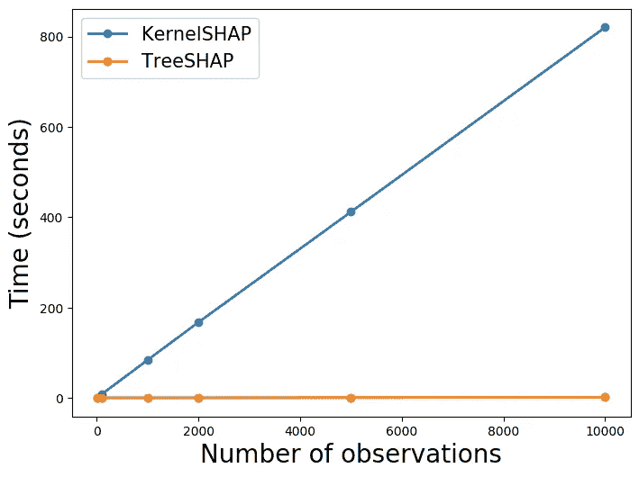
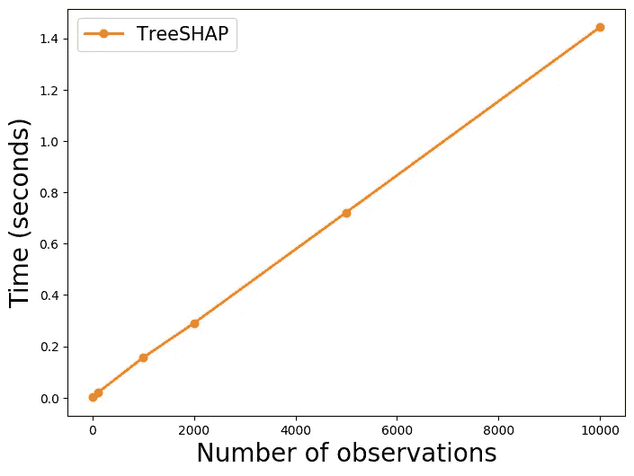
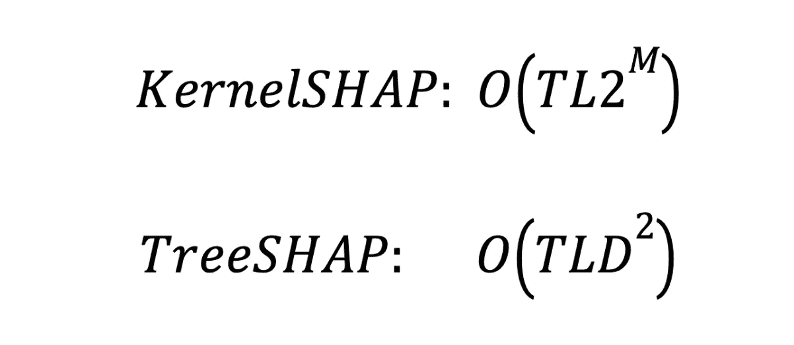
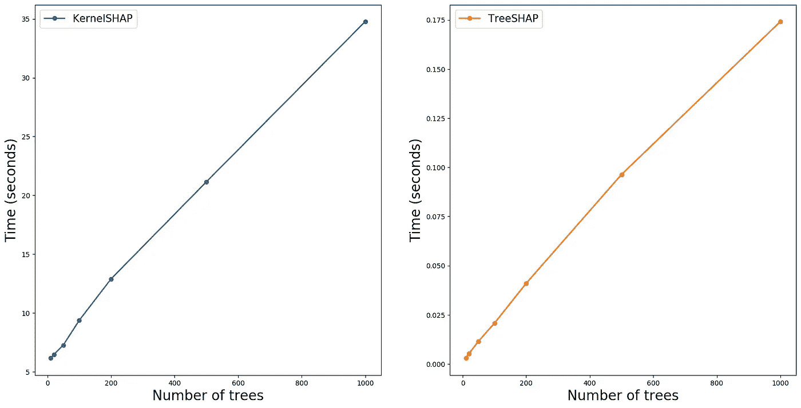
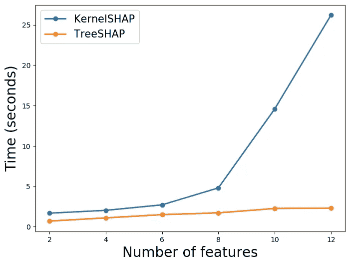
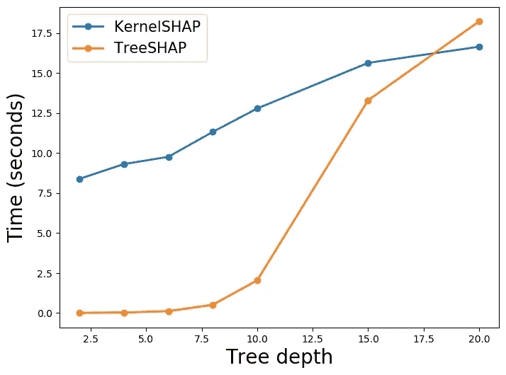
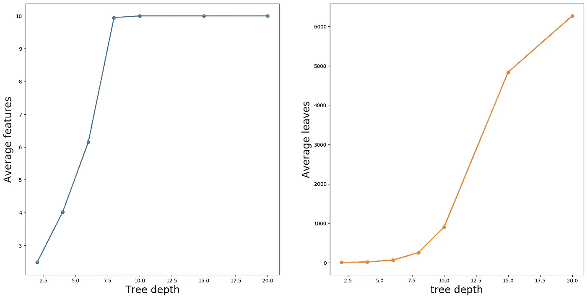

# KernelSHAP vs TreeSHAP

> 原文：<https://towardsdatascience.com/kernelshap-vs-treeshap-e00f3b3a27db>

## 基于速度、复杂性和其他考虑因素比较 SHAP 近似方法

(来源: [flaticon](https://www.flaticon.com/premium-icon/corn_1680550) )

KernelSHAP 和 TreeSHAP 都用于近似 Shapley 值。 **TreeSHAP** 快多了。缺点是它只能和基于树的算法一起使用，比如 random forests 和 xgboost。另一方面， **KernelSHAP** 是模型不可知的。这意味着它可以用于任何机器学习算法。我们将比较这两种近似方法。

为此，我们将做一个实验。这将向我们展示 TreeSHAP 实际上有多快。我们也将探索树算法的参数如何影响时间复杂度。这些包括**数量的树、** **深度**和**数量的特征**。在使用 TreeSHAP 进行数据探索时，这些知识非常有用。最后，我们将讨论像特性依赖这样的其他考虑如何影响方法。

如果你是第一次来 SHAP，那么看看下面的视频。如果你想要更多，那就来看看我的 [**SHAP 课程**](https://adataodyssey.com/courses/shap-with-python/) **。**注册我的 [**简讯**](https://mailchi.mp/aa82a5ce1dc0/signup) :)即可免费获取

# 每次观察时间

对于第一个实验，我们想知道计算 SHAP 值的方法需要多少时间。我们不会讨论用来获得结果的代码，但是你可以在 GitHub 上找到它。总而言之，我们从模拟回归数据开始。这有 **10000 个**样本、 **10 个**特征和 **1 个**连续目标变量。利用这些数据，我们训练了一个随机森林。具体来说，模型有 **100** 棵树，最大深度 **4** 。

我们现在可以用这个模型来计算 SHAP 值。我们使用 KernelSHAP 和 TreeSHAP 方法来实现这一点。对于每种方法，我们计算 **10** 、 **100** 、 **1000** 、 **2000** 、 **5000** 和 **10000** SHAP 值。对于每一笔金额，我们都记录了计算花费的时间。我们确保每笔金额重复这一过程 3 次。然后我们取平均值作为最终时间。

你可以在图 1 中看到这个过程的结果。你可以看到 TreeSHAP 明显更快。对于**10000 个** SHAP 值，该方法花费了 **1.44 秒**。相比之下，KernelSHAP 用了 **13 分 40.56 秒**。这是 **570 倍**那么长。这些计算的速度将取决于你的设备，但你应该期待类似的差异。

图 1:每次观察的时间(来源:作者)

上面的树形线看起来是平的。这是因为它被 KernelSHAP 线矮化了。在**图 2** 中，我们有一条仅用于 TreeSHAP 的线。你可以看到它也随着观察次数的增加而线性增加。这告诉我们，每个 SHAP 值需要相似的时间来计算。我们将在下一节探讨原因。

图 TreeSHAP 的每次观察时间(来源:作者)

# 时间复杂度

两种方法的时间复杂度如下所示。这就是在树算法中计算要素的 SHAP 值时的复杂性。 **T** 是单棵树的数量。 **L** 是每棵树的最大叶子数。 **D** 是每棵树的最大深度。最后， **M** 是每棵树的最大特征数。对于这些方法，这些参数将以不同的方式影响近似时间。

(来源:作者)

只有 TreeSHAP 的复杂度受到深度的影响( **D** )。另一方面，只有 KernelSHAP 受到特征数量的影响( **M** )。不同的是 KernelSHAP 复杂度是**指数** w.r.t **M** 而 TreeSHAP 是**二次** w.r.t **D** 。考虑到我们还拥有比树深度(D= 4)更多的特征(M = 10 ),我们可以理解为什么 KernelSHAP 要慢一些。

为了清楚起见，这是每个 SHAP 值的时间复杂度。我们应该预料到每个值都需要相似的计算时间。这就是为什么我们看到了时间和观察次数之间的线性关系。我们现在将探索时间和其他参数 **T** 、 **L** 、 **D** 和 **M** 之间的关系。然后我们将讨论这些结果对模型验证和数据探索的意义。

## 树木数量(吨)

对于这两种方法，复杂度与树的数量(T)成线性关系。我们预计这个参数会以类似的方式影响近似时间。为了看到这一点，我们执行了一个与之前类似的实验。这一次，我们通过增加树的数量来训练不同的模型。我们使用每个模型来计算 100 个 SHAP 值。

您可以在图 3 中看到结果。对于这两种方法，时间随着树的数量线性增加。这是我们在考虑时间复杂度时所预期的。这告诉我们，通过限制树的数量，我们可以减少计算 SHAP 值的时间。

图 3:每棵树的时间(来源:作者)

## 特征数量(M)

只有 KernelSHAP 受到特性数量的影响( **M** )。这次我们在不同数量的特征上训练模型。同时，我们保持其他参数( **T，L** 和 **D** 不变。在**图 4** 中，我们可以看到 KernelSHAP 的时间随着我们增加 **M** 而呈指数增长。相比之下，TreeSHAP 的时间没有受到太大影响。

图 4:每个特征的时间(来源:作者)

你可能已经注意到 TreeSHAP 的时间逐渐增加。这可能会令人困惑，因为我们看到复杂度不依赖于 m。要清楚的是，这是计算单个 特征的***SHAP 值时的复杂度。随着 M 的增加，我们需要为每次观测计算更多的 SHAP 值。***

## 树深度(D)

最后，我们改变树的深度。我们确保森林中每棵树的深度始终是最大深度。在图 5 中，你可以看到当我们增加深度时会发生什么。TreeSHAP 的时间增加得更快。甚至有一点 TreeSHAP 变得比 KernelSHAP 的计算量更大。我们可能已经预料到了这一点，因为我们看到只有树形复杂度是 d 的函数。

图 5:每棵树深度的时间(来源:作者)

你可能会问为什么内核时间也会增加。这是因为特征(M)和叶子(L)的数量根据树的深度而变化。随着深度的增加，会有更多的裂缝，所以我们会有更多的叶子。更多的分割也意味着树可以使用更多的功能。你可以在**图 6** 中看到这一点。这里我们计算了森林中所有树木的特征和叶子的平均数量。

图 6:每棵树深度的特征和叶子(来源:作者)

## 模型验证和数据探索的收获

通过改变深度，我们看到在某些情况下 TreeSHAP 的计算开销更大。然而，这些情况不太可能发生。我们看到只有当树深度为 20 时才会发生这种情况。在这么深的地方工作是不常见的。实际上，我们通常会有比树深度(D)更多的特征(M)。

这意味着，在用 SHAP 验证树模型时，TreeSHAP 通常是更好的选择。我们能够更快地计算 SHAP 值。尤其是当你需要比较多个模型的时候。对于模型验证，我们对参数 **T** 、 **L** 、 **D** 和**m**没有太多选择，因为我们只想验证性能最佳的模型。

对于数据探索，我们有更多的灵活性。树算法可用于发现重要的非线性关系和相互作用。要做到这一点，我们的模型只需要好到足以捕捉数据中的潜在趋势。我们可以通过减少树的数量和深度来加速这个过程。同时，我们能够探索许多模型特征(M ),而无需大幅提高速度。

# 其他考虑

在选择方法时，时间复杂度是一个重要因素。在做出选择之前，您可能需要考虑其他一些差异。这些问题包括 KernelSHAP 是模型不可知的，这些方法受特征依赖性的影响，并且只有 TreeSHAP 可以用于计算交互影响。

## 模型不可知

在开始，我们提到 TreeSHAP 的最大限制是它不是模型不可知的。如果你正在使用非基于树的算法，你将不能使用它。神经网络也有自己的逼近方法。这些算法可以使用 DeepSHAP。然而，KernelSHAP 是唯一可以用于所有算法的方法。

## 功能依赖关系

特性依赖会扭曲 KernelSHAP 所做的近似。该算法通过随机采样特征值来估计 SHAP 值。问题是，当要素相关时，采样值可能不太可能。这意味着，当使用 SHAP 值时，我们可能会对不太可能的观察结果赋予太多的权重。

TreeSHAP 没有这个问题。然而，由于特征依赖性，该算法具有不同的问题。也就是说，对预测没有影响的特征可以获得非零的 SHAP 值。当一个要素与另一个影响预测的要素相关时，可能会发生这种情况。在这种情况下，我们可能会得出一个错误的结论，即某个特征有助于预测。

## 分析相互作用

SHAP 互动价值观是 SHAP 价值观的延伸。它们的工作原理是将一个特征的贡献分解成主要的和交互的效果。对于一个给定的特性，交互效应是它与其他特性的所有联合贡献。当突出显示和可视化数据中的交互时，这些会很有用。我们将在下面的文章中深入探讨这个问题。

 [## 分析与 SHAP 的互动

### 使用 SHAP Python 包来识别和可视化数据中的交互

towardsdatascience.com](/analysing-interactions-with-shap-8c4a2bc11c2a) 

如果你想使用 SHAP 交互值，你必须使用 TreeSHAP。这是因为这是唯一一种实现了相互作用值的近似方法。这与 SHAP 互动价值观的复杂性有关。估计这些可能需要更长的时间。

最后，您应该尽可能使用 TreeSHAP。它速度快得多，让你有能力分析互动。对于数据探索，您可能希望坚持使用树算法来获得这些好处。如果你正在使用其他类型的算法，那么你必须坚持使用 KernelSHAP。它仍然是一种比蒙特卡罗抽样等其他方法更快的近似方法。

 [## 通过我的推荐链接加入 Medium 康纳·奥沙利文

### 作为一个媒体会员，你的会员费的一部分会给你阅读的作家，你可以完全接触到每一个故事…

conorosullyds.medium.com](https://conorosullyds.medium.com/membership) 

你可以在|[Twitter](https://twitter.com/conorosullyDS)|[YouTube](https://www.youtube.com/channel/UChsoWqJbEjBwrn00Zvghi4w)|[时事通讯](https://mailchi.mp/aa82a5ce1dc0/signup)上找到我——注册免费参加 [Python SHAP 课程](https://adataodyssey.com/courses/shap-with-python/)

## 图像来源

所有图片都是我自己的或从[www.flaticon.com](http://www.flaticon.com/)获得。在后者的情况下，我拥有他们的[保费计划](https://support.flaticon.com/hc/en-us/articles/202798201-What-are-Flaticon-Premium-licenses-)中定义的“完全许可”。

# 参考

南伦德伯格、 **SHAP 蟒包** (2021) *、*[https://github.com/slundberg/shap](https://github.com/slundberg/shap)

南 Lundberg & S. Lee，**解释模型预测的统一方法** (2017)，[https://arxiv.org/pdf/1705.07874.pdf](https://arxiv.org/pdf/1705.07874.pdf)

南 Lundberg，S.M .，G. Erion，G.G .和 Lee，s . I .(2018 年)。树集成的一致个性化特征属性。 *arXiv 预印本 arXiv:1802.03888* 。

C.Molnar，**可解释机器学习***【2021】[https://christophm . github . io/Interpretable-ml-book/shap . html](https://christophm.github.io/interpretable-ml-book/shap.html)*

*南 Masís，**用 Python 进行可解释的机器学习** (2021)*