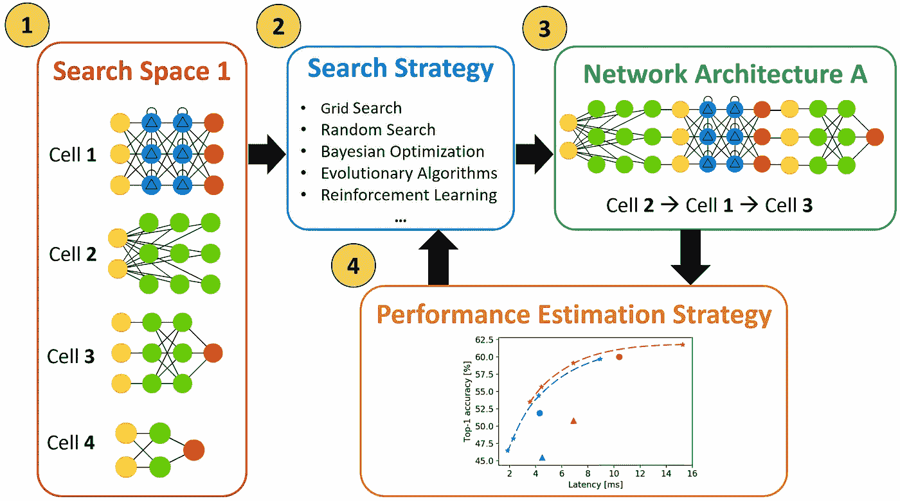
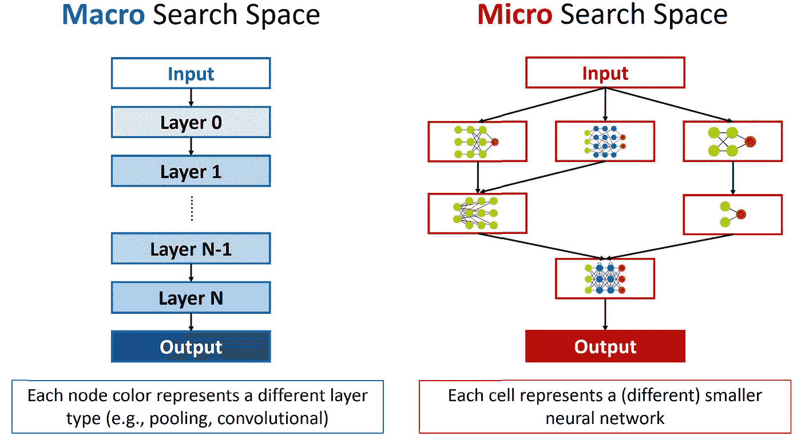
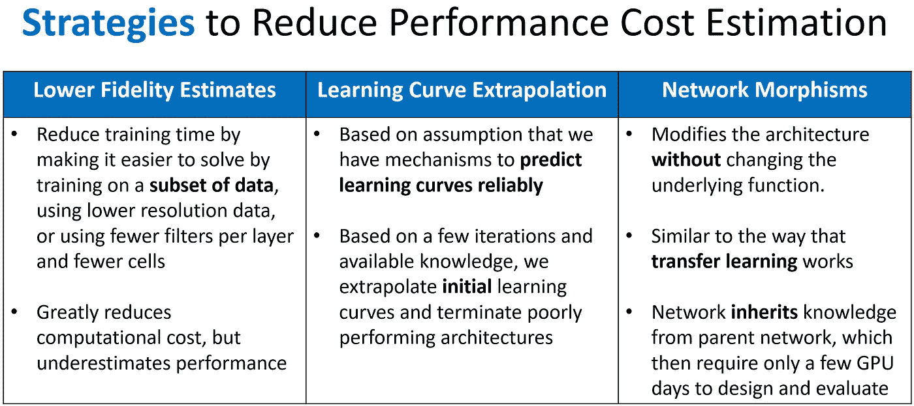
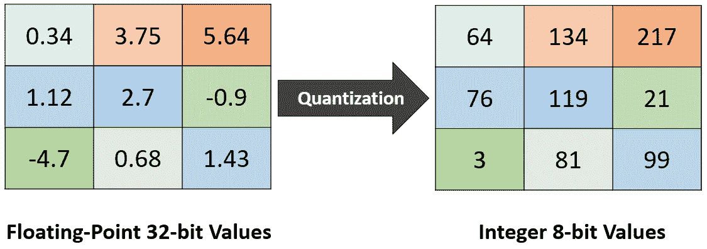
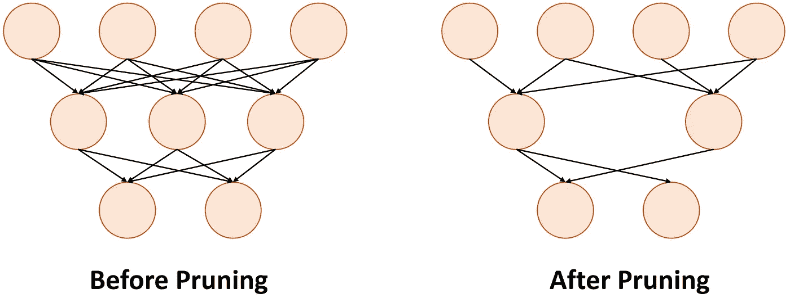
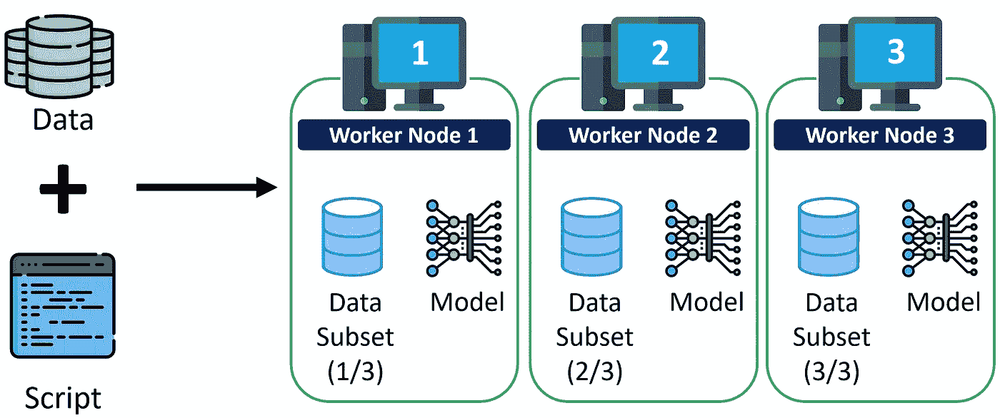
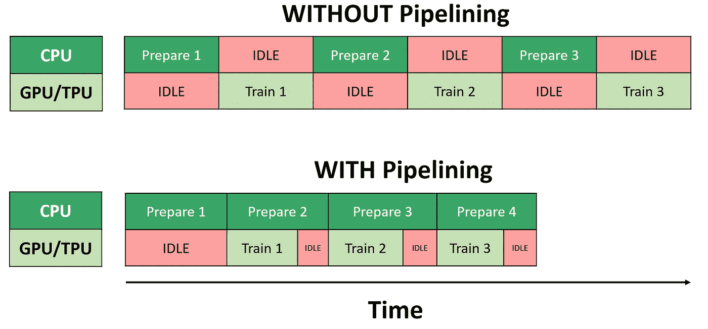
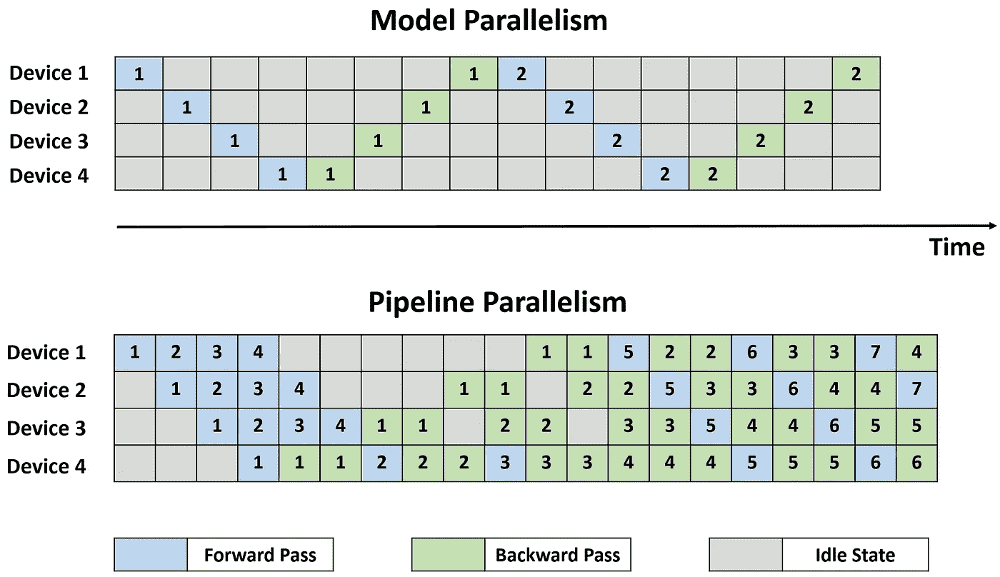
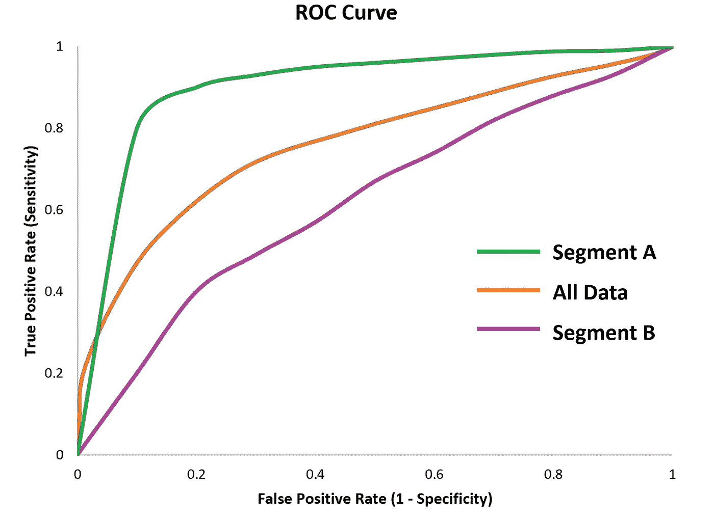
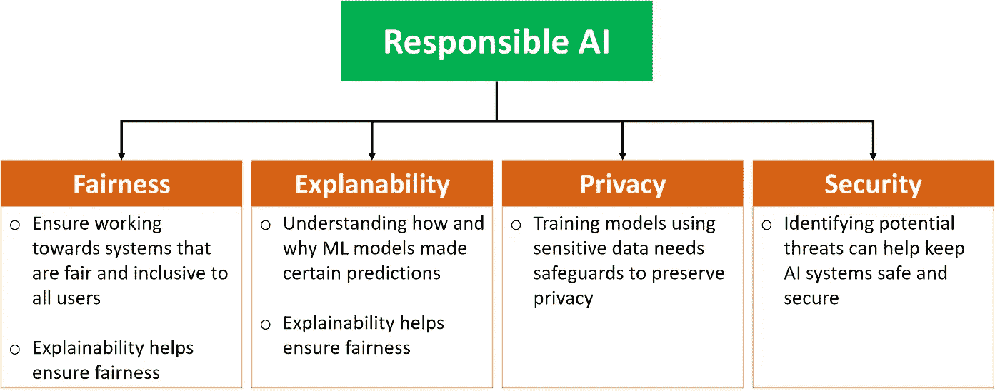

# MLOps 专业化认证的关键学习点—课程 3

> 原文：<https://towardsdatascience.com/key-learning-points-from-mlops-specialization-course-3-9e67558212ee>

## MLOPS 专业化系列

## DeepLearning 的面向生产的机器学习工程(MLOps)课程的主要见解(含课堂讲稿)。艾&吴恩达

里卡多·戈麦斯·安吉尔在 [Unsplash](https://unsplash.com?utm_source=medium&utm_medium=referral) 上的照片

虽然机器学习(ML)和深度学习概念是必不可少的，但在用数据科学解决现实世界的问题时，拥有生产工程技能同样(如果不是更多)重要。

深度学习。AI 开发了 [**MLOps 专业化课程**](https://www.deeplearning.ai/program/machine-learning-engineering-for-production-mlops/) 来分享在生产中构建和维护 ML 系统的实践经验。

在这篇文章中，我总结了经验教训，这样你就可以跳过几个小时的在线视频，同时仍然可以收集关键的见解。

# 内容

> ***(1)*** [*概述*](#5555)***(2)***[*重点课*](#0652)***(3)***[*讲义*](#ffd1)

*本文涵盖了* ***3*** *的****4-课程*** *的 MLOps 专业化。* [*跟随本页*](https://kennethleungty.medium.com/) *了解后续课程的最新内容。*

# (1)概述

在 MLOps 专业化的第三个课程中，我们重点关注为**不同的服务环境**构建模型，同时管理建模资源以实现最佳模型推断。

我们还探索了解决**模型分析、公平性和可解释性**的技术和指标。

[维克多](https://unsplash.com/@victor_g?utm_source=medium&utm_medium=referral)在 [Unsplash](https://unsplash.com?utm_source=medium&utm_medium=referral) 上拍摄的照片

# (2)主要经验教训

> 第 1 部分——神经结构搜索

## 什么是神经架构搜索？

*   神经架构搜索( **NAS** ) **自动化**神经网络**架构**的设计(例如，层数、激活类型和连接)
*   这个概念类似于超参数调优，其目标是找到对数据表现良好的**最优架构。**
*   NAS 是自动化机器学习的**子领域**(**AutoML**)。
*   用 NAS 设计的模型与手工制作的模型不相上下，甚至更好。
*   我们可以使用像 [**Keras Tuner**](https://www.tensorflow.org/tutorials/keras/keras_tuner) 这样的库来运行 NAS。

神经结构搜索(NAS)概述|作者图片

*   NAS 有三个部分 **:** 一个**搜索空间**，一个**搜索策略**，一个**性能评估策略**。

## 搜索空间

*   搜索空间定义了构建不同架构的可能组件。
*   有两种类型的架构搜索空间:**宏观**和**微观**。

两种主要类型的搜索空间|作者图片

*   **宏** **搜索空间**包括单个层(例如卷积、池化)和连接类型，通过顺序堆叠层以形成链式结构空间来找到最佳模型。
*   相比之下，在**微搜索** **空间**中，NAS 从细胞构建神经网络，其中每个细胞都是一个更小的神经网络。
*   **微观**方法已被证明比宏观方法具有显著的性能优势。

## 搜索策略

*   NAS 基于**特定策略**在搜索空间中搜索，以找到要测试的架构，从而找到性能最佳的架构。
*   **五种常用策略**包括网格搜索、随机搜索、贝叶斯优化、进化算法和强化学习。

## 性能评估

*   NAS 依赖于测量它所尝试的不同体系结构的性能。
*   评估性能最直接的方法是评估每个架构的**验证准确性**。
*   然而，考虑到大的搜索空间和复杂的网络，计算验证准确性可能是计算量很大的。
*   降低计算成本的策略包括使用**较低保真度估计**、**学习曲线外推**和**网络态射。**

降低架构性能成本估算的策略|作者图片

> 第 2 部分—模型资源管理

## 高维度问题

*   虽然神经网络**忽略了**的特征，但是**而不是**具有预测信息，这确实**而不是**意味着我们应该用**所有**的特征来训练我们的模型。
*   不需要的特征消耗计算资源，提高存储成本，增加解释的复杂性，将噪声引入数据，并增加过度拟合的风险。
*   随着我们添加更多的功能，我们增加了训练所需的处理能力和训练数据(其中所需的训练示例的数量随着每个添加的功能而呈指数增长)。
*   一个拥有高质量特性的差模型会比一个拥有低质量特性的好模型表现得更好。

## 维度缩减技术

*   我们希望用尽可能少的特征保留尽可能多的预测信息。
*   **手动降维** **降维**涉及理解数据和业务上下文，并利用领域知识来执行特征工程和选择。
*   除了手工技术，还有**算法途径**进行降维，如线性判别分析 **(LDA)** 、**、**偏最小二乘法**、【PLS】、**、**主成分分析 **(PCA)** 。**

## 模型优化的需求

照片由[本斯·博罗斯](https://unsplash.com/@benceboros?utm_source=medium&utm_medium=referral)在 [Unsplash](https://unsplash.com?utm_source=medium&utm_medium=referral) 上拍摄

*   随着移动、物联网和边缘设备变得无处不在，有必要将 ML 功能从云转移到设备上。这意味着我们需要优化模型的性能和资源需求。
*   设备上的模型推断包括将训练好的模型加载到设备应用中，这提供了**改进的速度**和**独立于网络连接**。
*   将模型部署到移动应用的框架有 [**ML Kit**](https://developers.google.com/ml-kit) ，**[**CoreML**](https://developer.apple.com/documentation/coreml)，[**tensor flow Lite**](https://www.tensorflow.org/lite)。**

## **量化**

*   **量化是一种优化 ML 模型的技术，它使用较低精度的参数和计算将模型转换成一种等效的表示形式。**
*   **一个例子是使用较少的比特来表示图像的像素。**
*   **虽然量化可能会降低模型精度，但它通过缩小神经网络规模，减少计算资源，降低延迟**提高执行性能和效率**。**
*   **我们可以通过将浮点 **32** 位值转换为 **8** 位整数来量化神经网络中的**权重参数**和**激活计算。****

****

**量化后精度降低|图片由作者提供**

*   **量化可以在 ( **量化感知**训练)期间**完成，也可以在**模型训练(**后训练**量化)之后**完成。****

## **最佳型号选择**

*   **如果不需要高精度，最好使用更小、更简单的模型，因为嵌入式设备的计算资源有限。**
*   **为移动设备优化的模型的一个例子是为计算机视觉应用而设计的 MobileNets。**

## **修剪**

*   **修剪是一种优化技术，通过删除对产生准确结果没有实质性贡献的部分来提高模型效率。**

****

**网络剪枝示例|作者图片**

*   ****TensorFlow** 有一个 [**权重剪枝 API**](https://www.tensorflow.org/model_optimization/guide/pruning/pruning_with_keras) 设计用于在训练期间基于幅度迭代移除连接。**
*   **权重修剪与量化兼容，在模型优化中产生复合效益。**

> **第 3 部分—高性能建模**

## **分布式培训**

*   **当我们处理更大的数据集和更大的模型时，我们需要模型训练中的分布式方法。**
*   **两种类型的分布式训练是**数据**并行和**模型**并行。**
*   ****数据并行**将模型复制到不同的加速器(GPU 或 TPU)上，并在它们之间拆分数据。**
*   ****模型并行**将一个大型模型(太大而无法在单个设备上安装)划分为多个分区，并将它们分配给不同的加速器。**
*   **数据并行**比模型并行**更容易实现，并且与模型无关，适用于任何神经架构。**

****

**数据并行性图解|作者图片**

*   **数据并行可以分为**同步**(所有工人同步训练并完成更新)或**异步**训练。**
*   **要执行分布式训练，我们可以使用 TensorFlow 的 [tf.distribute.Strategy](https://www.tensorflow.org/guide/distributed_training) 库。**

## **高效摄入**

*   **加速器(GPU/TPU)对于高性能建模至关重要，但它们价格昂贵，必须高效使用。**
*   **这种效率是通过**以足够快的速度向加速器提供数据来保持的**，以避免保持空闲并改善训练时间。**
*   **我们可以使用诸如**预取**、**缓存**、**内存减少**和**数据提取和转换的并行化**等方法来优化输入管道(即 ETL 过程)的性能。**

****

**Pipeline 有助于高效利用可用硬件，减少加载和预处理数据所需的时间|作者图片**

*   **通过**流水线**，我们可以通过重叠加速器的 CPU 预处理和模型执行来克服 CPU 瓶颈。**

## **流水线并行性**

*   **近年来，我们已经看到模型尺寸(例如，比根、伯特、GPT-3)越来越大，以提高性能。**
*   **模型增长和硬件改进之间的差距增加了并行性的重要性。**
*   **这些更大的模型在数据并行性(加速器的内存有限)和模型并行性(加速器计算能力的利用不足)方面带来了**新问题**。**
*   **这些问题导致了流水线并行的发展。**
*   ****流水线并行**通过在多个加速器上划分一个模型，并自动将一个**小**批次的训练数据分割成更小的**微**批次，从而实现大型模型的高效训练。**
*   **一些管道并行框架(整合数据和模型并行)有 Google 的 [GPipe](https://ai.googleblog.com/2019/03/introducing-gpipe-open-source-library.html) 和微软的 [PipeDream](https://www.microsoft.com/en-us/research/blog/pipedream-a-more-effective-way-to-train-deep-neural-networks-using-pipeline-parallelism/) 。**

****

**流水线并行支持更高效的培训|作者图片**

## **知识蒸馏**

*   **知识提炼背后的想法是创建一个简单的“学生”模型，从更复杂的“**教师**”模型中学习。**
*   **目标是将复杂模型的性能复制到更简单、更高效的模型中。**
*   **例如， [DistilBERT](https://arxiv.org/abs/1910.01108) 是 BERT 的**提炼**版本，它使用的参数少了 40%，运行速度快了 60%，同时保留了 BERT 97%的性能(GLUE 语言理解基准)。**

> **第 4 部分—模型分析**

## **聚合指标与切片指标**

*   **在训练和部署模型之后，下一个阶段是评估它的性能。**
*   **我们通常监控**顶级的聚合指标**，这些指标评估整个数据集的性能(例如，整体准确性)，但这通常隐藏了性能和公平性方面的具体问题。**
*   **需要**分割**数据，以了解它在单个数据子集的粒度级别上的表现。**
*   **选择重要切片进行分析通常基于**领域知识。****

****

**平均性能良好的模型可能会表现出从聚合指标|作者图片中看不出来的故障模式**

*   **例如，不同年龄组的客户对模型输出的体验可能非常不同。**
*   **[**TensorFlow 模型分析(TFMA)**](https://www.tensorflow.org/tfx/tutorials/model_analysis/tfma_basic) 是一个开源的框架，用于模型性能的深度分析，包括在数据切片上分析性能。**

## **模型稳健性**

*   **除了模型性能，我们还应该评估模型的健壮性。**
*   **如果一个模型的结果始终准确，即使一个或多个特征发生了相对剧烈的变化，该模型也被认为是健壮的。它不应该随着数据的变化而产生非常不同和不可预测的结果。**
*   **用于评估稳健性的**指标**与我们用于培训的指标相同，例如，用于回归模型的 RMSE 和用于分类的 AUC。**

## **模型调试**

*   **模型调试是一门新兴的学科，专注于发现和修复模型中的问题，并提高模型的健壮性。**
*   **它的目标包括提高模型透明度，防止有害的社会歧视，减少对抗性攻击**或隐私伤害**的脆弱性，避免模型衰退。**
*   **三种最流行的**调试技术**是**基准模型、敏感性分析和残差分析**。**
*   **用于评估对抗性攻击漏洞的两个开源库是 [Cleverhans](https://github.com/cleverhans-lab/cleverhans) 和 [Foolbox](https://github.com/bethgelab/foolbox) 。**

## **持续评估和监控数据漂移和偏移**

*   **当收集和标记数据时，训练数据仅表示世界的快照，因此模型性能会随着世界的变化而受到影响。**
*   **当数据漂移和偏移发生时，**持续**监控数据和模型性能以获得**早期警告**是至关重要的。这些漂移和转移包括**概念漂移**、**概念涌现**、**协变量转移**和**先验概率转移**。**
*   ****监督**监控技术包括统计过程控制、顺序分析(使用线性四比率)和误差分布监控(自适应窗口)。**
*   ****无监督**技术包括聚类/新奇检测(如 OLINDDA、MINAS)、特征分布监控和模型相关监控(如边缘密度漂移检测)。**
*   **领先的云提供商提供持续评估的服务，如微软 Azure 机器学习 **DataSense** ，亚马逊 SageMaker **模型监视器**，谷歌云 AI **持续评估。****

> **第 5 部分—可解释性和可解释性**

## **可解释人工智能的重要性**

*   **模型**可解释性**和**可解释性**在生产 ML 中至关重要，原因包括公平性、监管和法律要求，以及更好地理解我们的模型以改进它。**
*   **可解释性和可解释性是被称为负责任的人工智能的更大领域的一部分。**

****

**负责任的人工智能包含几个部分|作者图片**

## **模型可解释性**

*   **如果我们可以通过查询模型来回答以下问题，那么模型就是可解释的:**

1.  **为什么模型会以某种方式运行？**
2.  **我们如何相信模型做出的预测？**
3.  ****模型可以提供哪些**信息来避免预测错误？**

*   **虽然复杂的模型(例如神经网络)可以产生高精度，但它通常以可解释性为代价(也称为**可解释性与精度的权衡**)。**
*   **固有的可解释模型是经典的模型，如基于**树的**(例如决策树)和**线性**模型(例如线性回归)。**
*   **尽管我们不能总是使用本质上可解释的模型，但是有**模型不可知的方法**来解释任何模型的结果。**

****

**模型不可知的可解释性方法示例|作者图片**

*   **流行的方法包括部分相关图( **PDP** )、排列特征重要性、沙普利加法解释( **SHAP** )和局部可解释模型不可知解释(**莱姆**)。**

# **(3)课堂讲稿**

**为了表示感谢，下面是从幻灯片和抄本中编译的 PDF 讲义 的 [***GitHub repo。给回购打一颗星，以便随时了解后续课程的最新信息。***](https://github.com/kennethleungty/MLOps-Specialization-Notes/tree/main/3.%20Machine%20Learning%20Modeling%20Pipelines%20in%20Production)**

**准备好了吗？点击此处查看下一期课程总结:**

** [## MLOps 专业化认证的关键学习点—课程 4

### 来自面向生产的机器学习工程(MLOps)课程的主要见解(附课堂讲稿)

towardsdatascience.com](/key-learning-points-from-mlops-specialization-course-4-ee39bbd2864b) 

您可以在此处找到前两个课程的总结:

 [## MLOps 专业化认证的关键学习点—课程 1

### 面向生产的机器学习工程课程 1 的主要内容

towardsdatascience.com](/key-learning-points-from-mlops-specialization-course-deeplearning-ai-andrew-ng-5d0746605752)  [## MLOps 专业化认证的关键学习点—课程 2

### 面向生产的机器学习工程课程的见解摘要

towardsdatascience.com](/key-learning-points-from-mlops-specialization-course-2-13af51e22d90) 

# 在你走之前

欢迎您**加入我的数据科学学习之旅！**点击此[媒体](https://kennethleungty.medium.com/)页面，查看我的 [GitHub](https://github.com/kennethleungty) ，了解更多精彩的数据科学内容。同时，享受构建生产 ML 系统的乐趣！**