# 温柔地杀死我…权力 Bi 中的双向关系

> 原文：<https://towardsdatascience.com/killing-me-softly-bi-directional-relationships-in-power-bi-b6b0b9e150f4>

## 你听说过双向关系是“邪恶”的吗？是真的吗？检查为什么它不是(100%)真实的，以及如何避免潜在的“地狱之路”


[凯西·霍纳在 Unsplash 上拍摄的照片](https://unsplash.com/photos/wqAuyugJIeU)

如果您仔细阅读了我的“数据建模”系列，您可能会想起我曾用一个剧院来说明角色扮演维度的概念。然而，在这篇文章中，没有演员，也没有剧院…但是，具有双向关系的模型，或者如果你喜欢的话，双向过滤器，可以很快变成悲剧！

# 简而言之，双向关系

在我们深入解释为什么双向关系会回来破坏您的数据模型之前，让我们先简要解释一下什么是双向关系。如果您正确地准备了星型模式模型，一旦在模型中建立了两个表之间的关系，关系基数应该是 1:M(除了这个基数类型，还有 1:1 和 M:M 类型，但这将在下一篇文章中讨论)。

让我们快速了解一下这个 1 和 M 是什么意思……在设计良好的星型模式模型中，维度表会在关系的“ ***1*** ”这一边——简单地说，系统中只有一个特定的产品、一个特定的客户、一个特定的日期等等……另一边是“ ***M*** ”，这意味着很多。某个产品可以多次购买，某个客户可以进行多次交易，某一天的交易可能多达数百万笔。

我将使用一个非常基本的数据模型来展示这个 1:M 故事在现实中的样子:

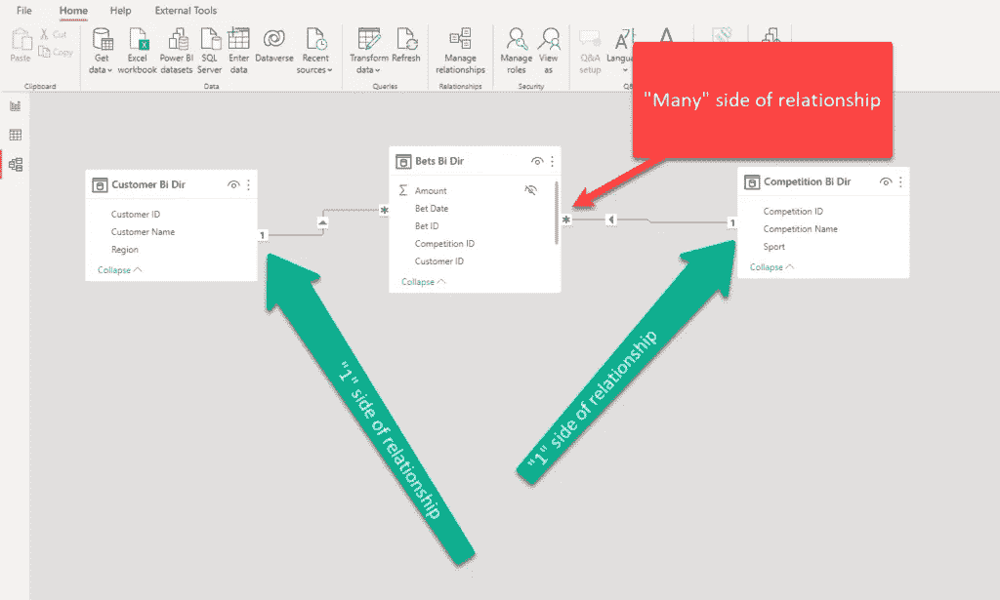

作者图片

在上图中，我在中间有一个事实表(Bets)和两个维度表(Customer 和 Competition)。客户表中只有一个特定的客户，竞争表中只有一个特定的竞争，但是一个客户可以下多注，就像一个竞争可以有很多注一样。

如果您来自传统的关系数据建模世界，那么这个“关系基数”的故事应该已经结束了，对吗？然而，在 Power BI 中，还有更多(谁说的扩展表)…

如果您更仔细地观察这个图，您可能会注意到连接两个表的线上有一个小箭头。而且，不仅仅是箭头本身很重要——更重要的是箭头的方向！**箭头本身意味着过滤发生在表之间，而箭头方向显示了过滤器传播的方式！**

这一点非常重要，在我们的示例中，这意味着—如果我筛选 Customer 表，并选择 ID 为 1 的客户，该筛选器将应用于 Bets 表，我将只看到 ID 为 1 的客户下的那些赌注。但不是相反，因为过滤器从关系的“1”侧传播到“M”侧。

我敢说，这是默认的也是期望的行为，因为 Power BI 引擎是为以最佳方式将滤波器从“1”移动到“M”而设计的。这就是所谓的 ***单向*** 过滤:

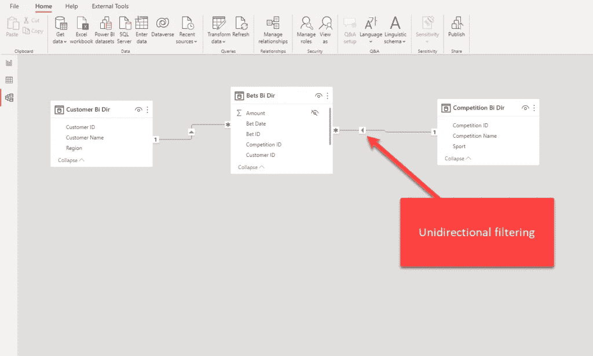

作者图片

但是，您可能希望更改此默认行为，并启用双向筛选器传播。做到这一点相当简单—只需转到关系属性，并在交叉筛选方向下拉列表中选择两者:

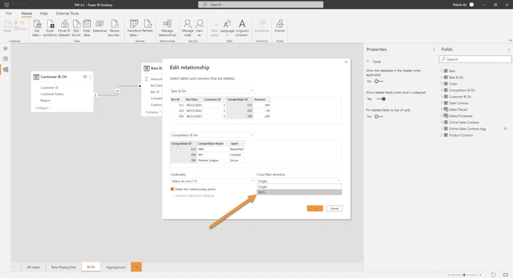

作者图片

一旦你选择了这个选项，你就把你的关系从单向的**变成了*双向的*** ！而且，这里是聚会开始的地方…只是要明确，双向过滤器没有什么固有的错误！但是，像任何其他非默认行为一样，这种行为也需要仔细评估和熟练的数据建模师。

# 如果双向关系本身并不坏，我为什么要在乎呢？！

这是一个公平的问题！

虽然双向关系本身并不“邪恶”,但是它们不仅会将您引向报表中不可预测的结果，还会在某些情况下降低报表的性能，这也是事实。虽然性能方面的考虑超出了本文的范围，但是让我快速地向您展示一下启用双向过滤是如何在报告中产生一些奇怪的和意想不到的数字的。

比方说，我也想分析客户存款的数据，而不仅仅是赌注。因此，我将导入一个包含存款数据的非常基本的表。如您所见，竞争和存款之间没有关系，因为客户的存款与任何特定的竞争都没有关系:

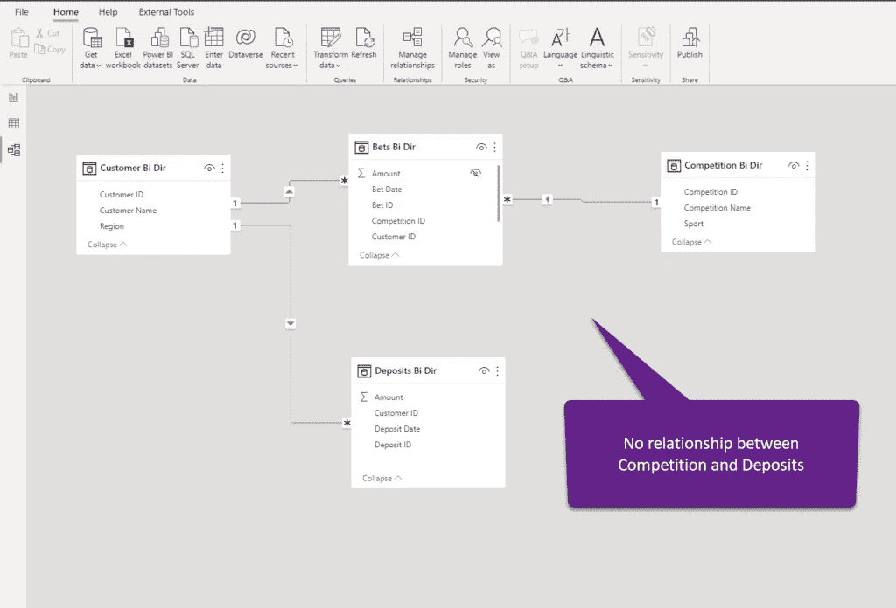

作者图片

在这样一份简单的报告中:

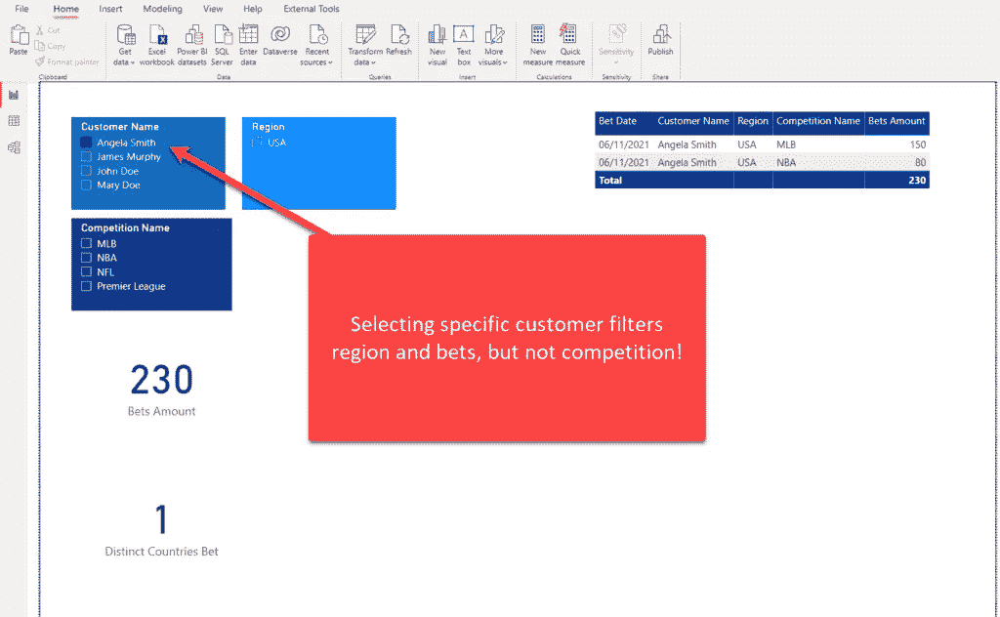

作者图片

如果我选择位于美国的 Angela Smith，则除了竞争之外的所有内容都会被过滤。这是因为过滤器从客户传播到投注，而不是进一步从投注传播到竞争。

现在，让我们假设业务请求是同步切片器，并且只显示 Angela 真正下注的那些比赛。在我们的示例中，比赛名称切片器应该只显示 MLB 和 NBA 的值。我们如何实现这一点？是的，启用双向过滤是最快最简单的方法！让我展示给你看:

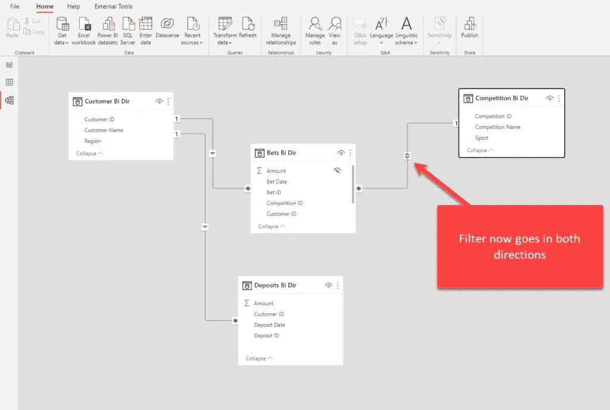

作者图片

我们的箭头现在看起来不同了，它显示过滤器将向两个方向传播，简单地说，从客户表过滤将影响下注，从那里，下注将过滤竞争表。让我们回到我们的报告，看看它现在是什么样子:

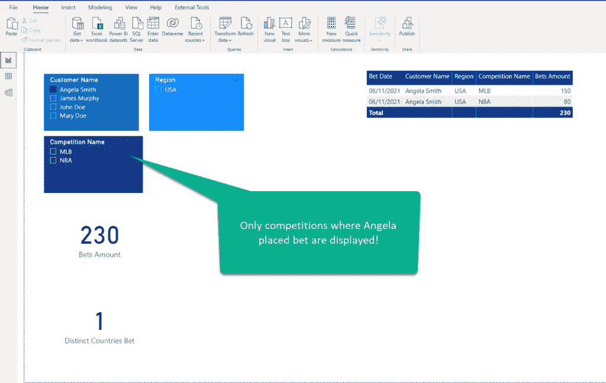

作者图片

是啊！我们完成了业务要求，每个人都很高兴，对吗？嗯，在这种情况下，它没有伤害，即使有一个更方便的方法来达到同样的结果，而不是“玩火”。在我向您展示这个解决方案之前，让我们想象一下，我们快乐的业务用户现在要求我们随着时间的推移来分析数据。很公平，谁见过没有日期维度的星型模式:)！

因此，让我们创建一个简单的日期维度，并在这个表和我们的两个事实表(Bets 和 Deposits)之间建立关系。

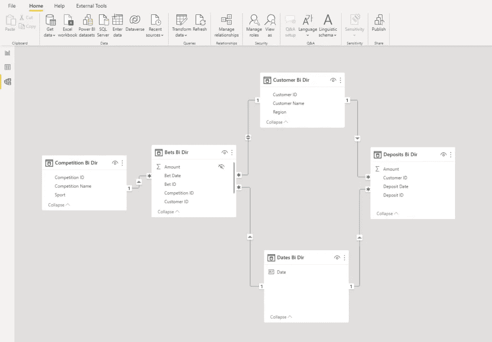

作者图片

一切看起来都很好，除了一个“小”问题——这个数据模型不明确！我不会详细解释什么是数据模型中的模糊性，因为来自 SQLBI 的 Marco 和 Alberto 有一篇完美的[文章解释了这个“特性”](https://www.sqlbi.com/articles/bidirectional-relationships-and-ambiguity-in-dax/)

如果您不想阅读整篇文章，我可以告诉您:模糊性意味着引擎可能会使用多个不同的路径在表之间传播过滤器。这种处理筛选器传播的不确定方式可能会导致报告中出现不可预测的结果。

在我们的例子中，通过过滤日期表，我们可以通过两种不同的路径“到达”存款表:

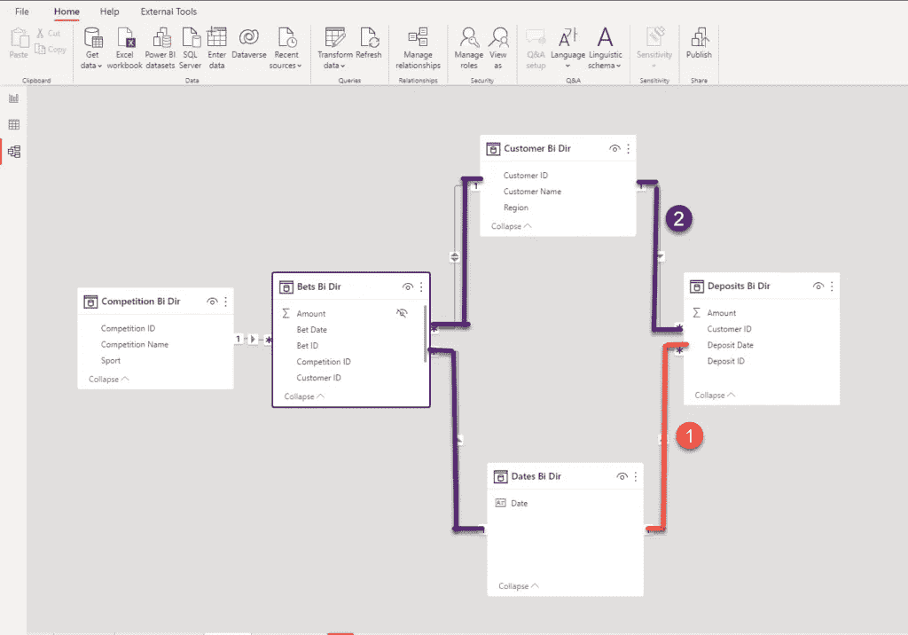

作者图片

请记住，这是一个相当简单的数据模型。你可以想象在更复杂的情况下可能的含义。

# 为什么如此多的数据模型中存在双向关系？

是的，我听到了，我听到了……尼古拉，在某些情况下，我们无法避免使用双向关系。我可以接受，但我不认为这是理所当然的！

好的，对于 1:1 和 M:M 关系，你**有**使用双向过滤器。然而，首先要问自己的问题是:为什么我的数据模型中有这些类型的关系？！尤其是 1:1！！！

但是，回到我们之前的例子，当时我承诺为您提供一个更方便的解决方案来满足我们的业务请求。首先，我将双向过滤恢复为默认的单向过滤:

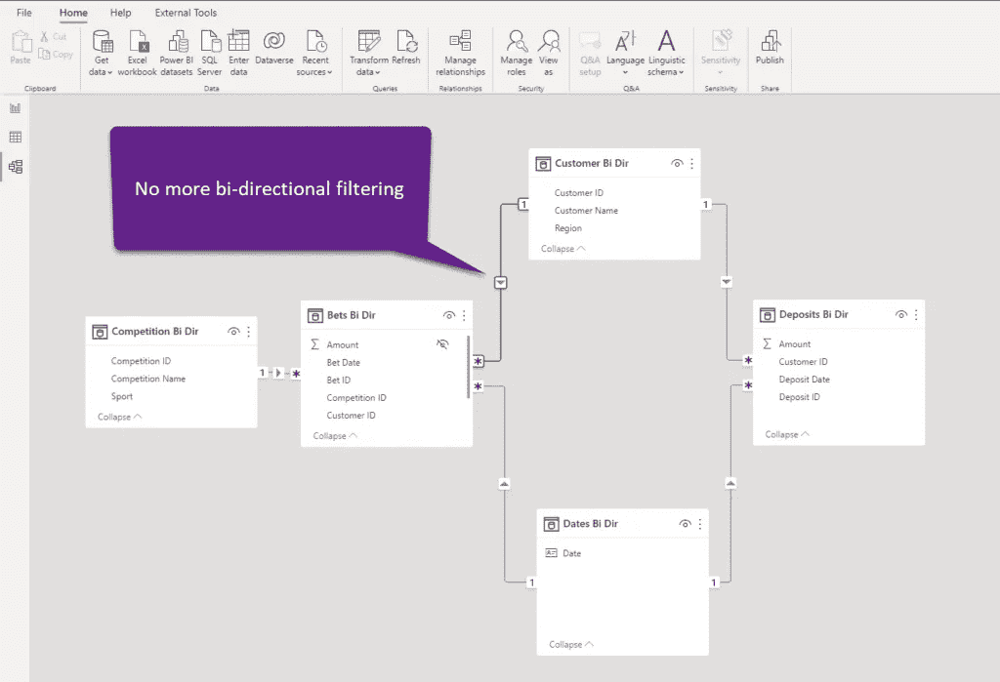

作者图片

我将简单地返回到我的报告，选择 Competition Name slicer，并在此视图上为下注金额设置非空白的过滤器:

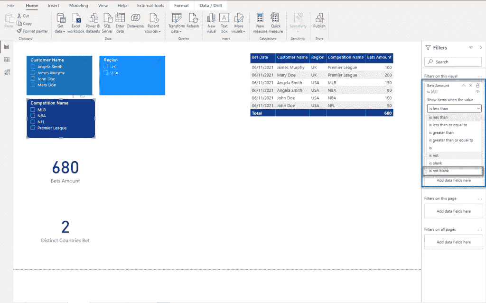

作者图片

一旦我应用了这个过滤器，结果应该与我们启用双向过滤时的情况完全相同:

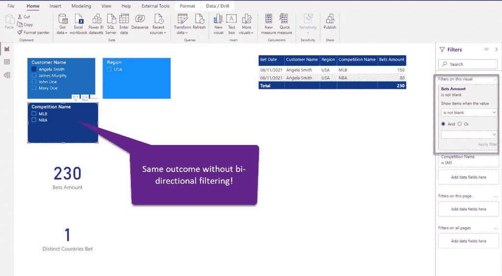

作者图片

很好，谢谢你，Nikola，但是如果我需要执行维到维分析，我该怎么做呢？例如，我想看看有多少不同的国家对 MLB 下注…这是一个有趣的场景，因为在这种情况下，您将使用事实表作为维度表之间的桥表，并启用双向筛选，就像在“经典”M:M 关系中一样…

再说一遍，请不要那样做！我听到了:你的用户需要在他们的报告中看到这个数字。你想给你的用户留下深刻印象，对吗？我有一个解决方案给你:创建一个合适的数据模型！我的意思是，你应该遵循这个建议，尽管这个特殊的挑战。但是，回到这个特定的需求，你可以(也应该)做的是利用 DAX 的能力，使用*交叉过滤*功能，而不是启用双向关系。

通过使用 CROSSFILTER，您可以仅在两个方向上启用过滤器传播，并且仅针对这一次计算，而不是将其永久保持活动状态。交叉过滤是一个强大的功能，因为它修改过滤器的方向，甚至完全禁用关系！但是，它只发生在特定表达式的求值过程中。

计算不同国家下注数量的基本方法如下:

```
Distinct Countries Bet No CROSSFILTER = DISTINCTCOUNT('Customer Bi Dir'[Region])
```

由于 Competition 不筛选 Customer 表(因此也不能筛选 countries ),所以无论您在 Competition Name slicer 中选择什么，该度量都将返回相同的结果:

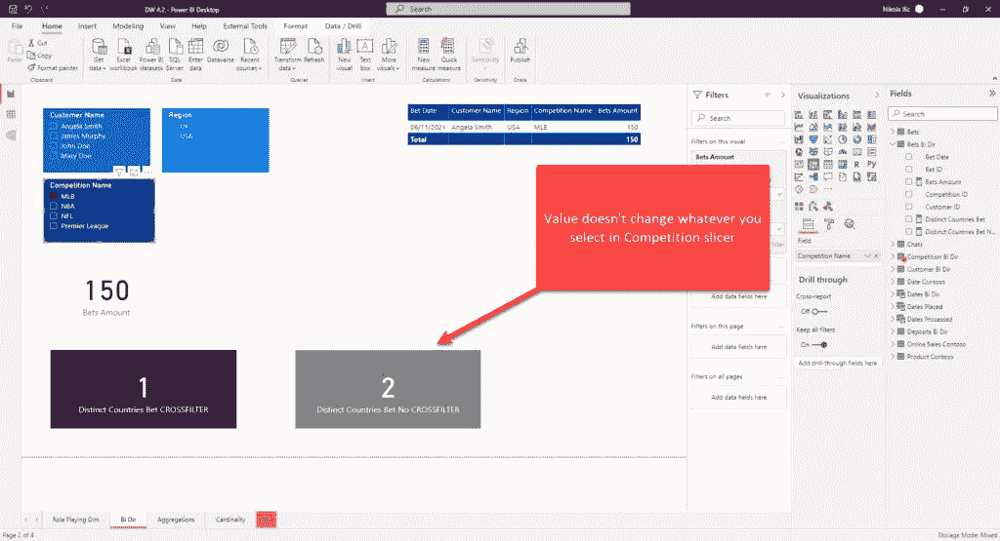

作者图片

但是，如果我重写我的度量，使用 CROSSFILTER 函数在两个方向上启用过滤，但只针对这个特定的计算，我将得到正确的结果，同时保持我的数据模型安全，不受双向关系产生的潜在警告的影响:

```
Distinct Countries Bet = 
CALCULATE(
    DISTINCTCOUNT('Customer Bi Dir'[Region]),
    CROSSFILTER(
        'Customer Bi Dir'[Customer ID],
        'Bets Bi Dir'[Customer ID],
        BOTH
    )
)
```

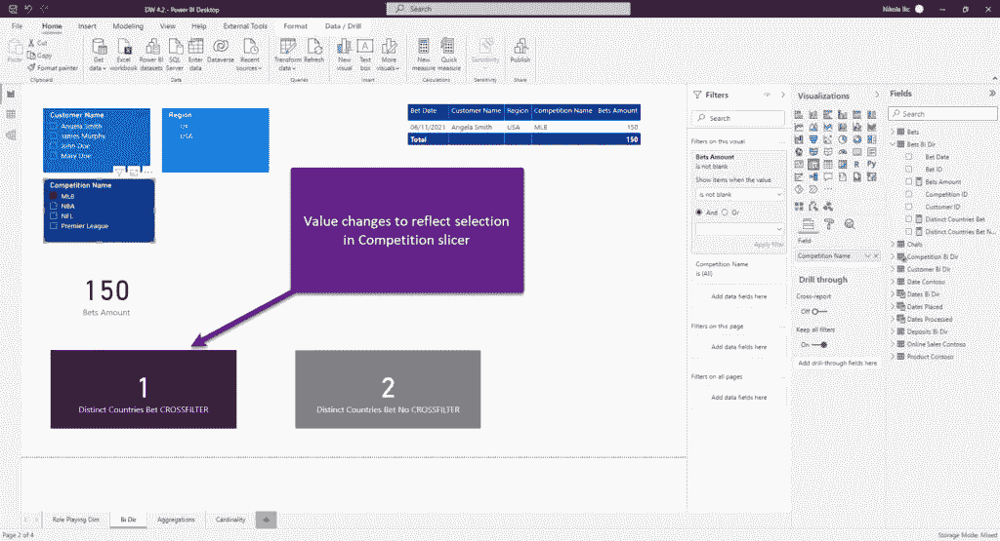

作者图片

如您所见，我们设法满足了业务请求，而没有在数据模型中引入双向关系！

# 结论

我莫名其妙地感觉到，对双向关系的普遍看法是，它们是不好的，是“邪恶的”。也许这听起来太苛刻了，但像任何强大的功能一样，这个功能也有使用不当的风险。虽然双向关系本身并不讨厌，但它们可能产生的后果是你应该意识到的。

总之，尽量减少数据建模中双向关系的使用，除非你真的知道自己在做什么！

感谢阅读！

[成为会员，阅读媒体上的每一个故事！](https://datamozart.medium.com/membership)