# 国王死了，国王万岁！

> 原文：<https://towardsdatascience.com/king-is-dead-long-live-the-king-95201b81242c>

## 快速开始你的汽车之旅


在 [Unsplash](https://unsplash.com/?utm_source=unsplash&utm_medium=referral&utm_content=creditCopyText) 上拍摄的 [ThisisEngineering RAEng](https://unsplash.com/@thisisengineering?utm_source=unsplash&utm_medium=referral&utm_content=creditCopyText)

传统的机器学习模型开发过程已经死亡，新的流行词是 AutoML。AutoML 已经将机器学习带到了甚至不太懂技术的商业用户也能接触到的范围内。一些数据科学家使用 AutoML 工具来创建他们的机器学习模型。这些工具出色地为您的数据集提供了性能最佳的模型。AutoML 工具允许您基于经典方法和人工神经网络方法设计模型，创建有效的数据管道，使用集成优化模型的准确性，等等。

选择工具并不简单。在本文中，我将介绍我对一些工具的评估，并总结它们的优缺点。我希望，这有助于你决定你的目的的工具。这项研究也将帮助初学者或非数据科学家在 AutoML 领域快速起步。

# 我们是如何测试的？

尽管所有工具的 AutoML 过程或多或少是相同的，但它们对数据准备的要求不同。它们产生的输出也不同。我们对所有工具使用相同的数据集，以便您了解它们的数据准备要求。我们使用了两个数据集，一个专门用于回归任务，另一个用于分类任务。我从 UCI 资料库中获取了这两个数据集。

回归[数据集](https://archive.ics.uci.edu/ml/datasets/Superconductivty+Data)包含 81 个决定超导体临界温度(目标)的数字特征。考虑到这个数据集的高维性，我选择它进行回归。该数据集包含 21263 个实例，足以测试回归问题。

用于分类的[数据集](https://archive.ics.uci.edu/ml/datasets/QSAR+biodegradation)包含 41 个属性(分子描述符),这些属性决定了该化学品是否可生物降解。这是一个带有两个目标值的标记数据集(就绪和未就绪，可生物降解)。因此，这是一个二元分类任务。数据集包含 1055 个实例。

我已经将两个数据集上传到我们的 GitHub 库。因此，您不必将数据集上传到您的 Google drive。您使用 *wget* 将代码下载到项目中。下载完数据集后，通常需要通过删除空值等操作来清理数据集。

所有的 autoML 工具都有内置的数据清理工具，因此您没有必要进行数据清理。你需要提取特征和目标。您还需要创建训练/测试数据集。对于分类任务，我已经平衡了数据集，因为一些工具在不平衡的数据集上不能正常工作。

由于这些是为模型训练准备数据的常见操作，所以我不在文章中描述数据准备代码；有关详细信息，您可以随时参考每个相关的可下载项目。对于某些工具，需要对数据集进行额外的准备。我将在文章中描述这些步骤。

我先从 auto-sklearn 说起。

# 自动 sklearn

这是该领域的早期启动者之一(2017 年 11 月)，基于流行的 sklearn 机器学习库。最后一次发布是在 2021 年 11 月，因此该产品正在积极维护中。

要将此库添加到您的项目中，请运行以下代码片段:

```
!sudo apt-get install build-essential swig!pip install auto-sklearn==0.14.3
```

首先，我将向您展示如何使用自动回归器，然后是分类器。

# 自动回归器

要使用自动回归器，请使用以下代码:

```
import autosklearn
from autosklearn.regression import AutoSklearnRegressor
model_auto_reg = AutoSklearnRegressor(time_left_for_this_task=10*60,
                                      per_run_time_limit=30,
                                      n_jobs=-1)
model_auto_reg.fit(X_train_regressor,label_train_regressor)
```

由于 AutoML 工具可能需要很长时间才能找到最佳模型，auto-sklearn 库允许您指定代码执行的时间限制。我们将参数*设置为 10 分钟。这是分配给每个算法的时间。该库测试许多算法，设置这个参数将结束那些算法花费太长时间来执行。*

我们将参数*每运行时间*限制为 30 分钟。如果这个库没有在这个时间段内完成所有它想要的算法的测试，它将停止这个过程，并给你它已经完成的输出。

值为-1 的 *n_jobs* 参数告诉机器使用所有可用的内核。

如您所料， *fit* 方法将特性和目标作为参数。在它完成对所有算法的评估后，您可以打印其执行的统计数据:

```
print(model_auto_reg.sprint_statistics())
```

我在运行中得到以下输出:

```
auto-sklearn results:
  Dataset name: 646225b0–8422–11ec-8195–0242ac1c0002
  Metric: r2
  Best validation score: 0.909665
  Number of target algorithm runs: 80
  Number of successful target algorithm runs: 18
  Number of crashed target algorithm runs: 33
  Number of target algorithms that exceeded the time limit: 5
  Number of target algorithms that exceeded the memory limit: 24
```

正如您所观察到的，它成功运行了 80 个测试算法中的 18 个，33 个崩溃，5 个超出了 10 分钟的时间限制，24 个超出了内存限制。它仅用 10 分钟就完成了全部评估。

要查看最终模型，调用它的 *show_models* 方法。

```
model_auto_reg.show_models()
```

这显示了所创建的包括最高性能模型的集合模型。除非您希望进一步微调模型，否则您不必深入细节。在考虑之前，先检查一下误差指标。

```
y_pred_reg = model_auto_reg.predict(X_val_regressor)
error_metrics(y_pred_reg,label_val_regressor)
```

这给了我以下输出:

```
MSE: 89.62974521966439
RMSE: 9.467298728764419
Coefficient of determination: 0.9151071664787114
```

如果 R-2 得分高于 91%，您可能不想做进一步的调优。我现在将向您展示如何使用自动分类器。

# 自动分类器

您使用以下代码片段在我们的分类器数据集上应用自动分类器:

```
from autosklearn.classification import AutoSklearnClassifier
model_auto_class =   AutoSklearnClassifier(time_left_for_this_task=10*60,
                               per_run_time_limit=30,
                               n_jobs=-1)
model_auto_class.fit(X_train_classifier,label_train_classifier)print(model_auto_class.sprint_statistics())
```

功能参数与自动回归的情况相同。

这是我得到的统计数据:

```
auto-sklearn results:
  Dataset name: fa958b64–8420–11ec-8195–0242ac1c0002
  Metric: accuracy
  Best validation score: 0.899729
  Number of target algorithm runs: 81
  Number of successful target algorithm runs: 59
  Number of crashed target algorithm runs: 16
  Number of target algorithms that exceeded the time limit: 3
  Number of target algorithms that exceeded the memory limit: 3
```

如你所见，在它测试的 81 个算法中，59 个成功运行，只有 3 个超过了时间限制。同样，您可以通过调用 model 的 *show_models* 方法来检查生成的模型。使用以下代码片段打印分类报告:

```
y_pred_class = model_auto_class.predict(X_val_classifier)
print(classification_report(label_val_classifier,y_pred_class))
```

这是我运行的输出:

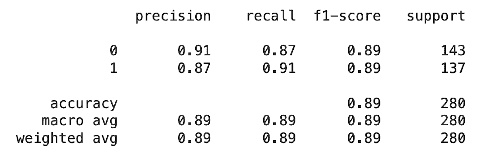

作者图片

你可以看到集合模型在我们的数据集上产生了很好的结果。

这个项目的[源代码](https://github.com/abcom-mltutorials/ml/blob/main/AutoML_auto_sklearn.ipynb)可以在我们的 GitHub 库中找到。

现在，我将向您展示如何在这两个数据集上使用 AutoKeras。

# AutoKeras

AutoKeras 采用神经网络的方法进行模型开发。它将设计一个包含最佳层数和节点数的网络。

# 装置

使用以下代码片段安装 AutoKeras:

```
!sudo pip install git+https://github.com/keras-team/keras-tuner.git@1.0.2rc1!pip install autokeras!pip show autokeras
```

# 自动回归器

我定义了一个回调，用于调整网络训练时的学习速率。

```
from tensorflow.keras.callbacks import ReduceLROnPlateau 
lr_reduction = ReduceLROnPlateau(monitor=’mean_squared_error’,
                                patience=1,
                                verbose=1,
                                factor=0.5,
                                min_lr=0.000001)
```

使用以下代码应用自动回归:

```
from autokeras import StructuredDataRegressorregressor = StructuredDataRegressor(max_trials=3,   
                                   loss=’mean_absolute_error’)
regressor.fit(x=X_train_regressor, y=label_train_regressor,
            callbacks=[lr_reduction],
            verbose=0, epochs=20)
```

正如您在上面的代码中看到的，您只需要设置试验次数和回归损失函数。

创建模型后，您可以进行预测并打印误差指标。在我的运行中，我得到了以下输出:

```
MSE: 163.16712072898235
RMSE: 12.7736886109292
Coefficient of determination: 0.8515213997277571
```

# 自动分类器

使用以下代码创建分类器的模型:

```
from autokeras import StructuredDataClassifierclassifier = StructuredDataClassifier(max_trials=5,num_classes=2)classifier.fit(x=X_train_classifier, y=label_train_classifier, 
             verbose=0, epochs=20)
```

您将类的数量设置为 2，因为我们正在解决一个二元分类问题。

与前面一样，在创建模型之后，您进行推理并打印分类报告。这是我运行的输出:

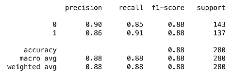

作者图片

这个项目的[源代码](https://github.com/abcom-mltutorials/ml/blob/main/AutoML_AutoKeras.ipynb)可以在我们的 GitHub 库中找到。

我们的下一个图书馆是 TPOT

# TPOT

您可以使用 pip 安装来安装 TPOT:

```
!pip install tpot
```

# 自动回归器

使用以下代码应用回归量:

```
from sklearn.model_selection import RepeatedKFold
cv = RepeatedKFold(n_splits=2, n_repeats=2, random_state=1)from tpot import TPOTRegressor
model_reg = TPOTRegressor(generations=5, population_size=50, scoring=’neg_mean_absolute_error’, cv=cv, verbosity=2, random_state=1, n_jobs=-1)model_reg.fit(X_train_regressor,label_train_regressor)
```

这是我的测试运行的评估指标

```
MSE: 78.55015022333929
RMSE: 8.862852262299045
Coefficient of determination: 0.9260222950313017
```

R-2 系数为 0.925，相当不错。

# 自动分类器

使用以下代码应用分类器:

```
from sklearn.model_selection import RepeatedStratifiedKFold
cv = RepeatedStratifiedKFold(n_splits=2, n_repeats=2, random_state=1)from tpot import TPOTClassifier
model_class = TPOTClassifier(generations=3, population_size=50, cv=cv, scoring=’accuracy’, verbosity=2, random_state=1, n_jobs=-1)
model_class.fit(X_train_classifier, label_train_classifier)
```

这是我测试运行的分类报告:

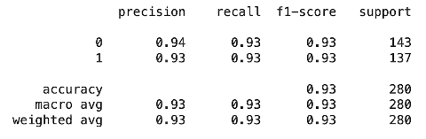

作者图片

这个项目的[源代码](https://github.com/abcom-mltutorials/ml/blob/main/AutoML_TPOT.ipynb)可以在我们的 GitHub 资源库中找到。

# MLBox

和前面的例子一样，使用 *pip* 命令安装 MLBox:

```
!pip install mlbox
```

# 数据准备

与早期工具相比，MLBox 需要额外的数据准备和一些设置。它从 CSV 文件中获取由要素和标注组成的训练数据集。因此，与您通常在其他工具中使用的 dataframe 不同，您需要创建 CSV 文件来训练该模型。像训练数据集一样，它从 CSV 文件中提取测试数据集。当您进行推理时，模型将结果保存在一个 CSV 文件中，因此您需要将它加载到您的程序中来解释结果。就其他要求而言，您需要设置超参数。它为您提供了一个优化器来确定这些参数的最佳值。

有了这样的认识，我现在给你详细的数据准备步骤。让我们首先从回归开始。

# 自动回归器

如前所述，将超导体 CSV 文件加载到数据框中并提取特征和标签:

```
regressor_df=pd.read_csv(‘/content/superconductors.csv’)features_regressor = regressor_df.iloc[:,:-1]
label_regressor = regressor_df.iloc[:,-1]
```

然后，创建训练/测试数据集:

```
X_train_regressor, X_test_regressor, label_train_regressor, label_test_regressor = train_test_split(features_regressor, label_regressor, test_size=0.2, random_state=42)
```

我们通过向训练数据添加标签，然后将数据框转换为 CSV 文件来创建训练数据集 CSV 文件。

```
training1 = pd.concat([X_train_regressor, label_train_regressor], axis=1)training1.to_csv(‘training1_file.csv’)
```

同样，我们创建测试数据集文件，这一次没有添加标签数据。

```
testing1 = X_test_regressortesting1.to_csv(‘testing1_file.csv’)
```

现在，我们需要创建一个数据框，使用我们创建的训练文件来训练我们的模型。我们将把训练数据分成训练集和验证集。

```
paths=[‘training1_file.csv’, ‘testing1_file.csv’]
rd = Reader(sep = ‘,’)
df = rd.train_test_split(paths, target_name=’critical_temp’)
```

Reader 函数在完成后会生成一些统计数据，如下所示:

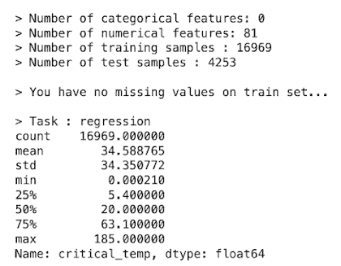

作者图片

请注意，它将任务检测为具有 81 个数字特征的回归类型，并将 critical_temp 作为目标。它将整个数据分成 16969 个训练点和 4253 个验证数据点。

接下来，通过调用 *Drift* 转换来检查列中的差异，这将自动删除不需要的列。

```
dft = Drift_thresholder()
df = dft.fit_transform(df)
```

这是我运行的输出:

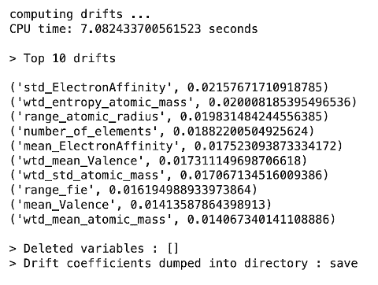

作者图片

在我们的例子中，它没有丢弃任何变量。

接下来，我们将找到超参数的最佳值。我们指定每个参数的范围:

```
space = {‘ne__numerical_strategy’:{“space”:[0]},
‘fs__strategy’:{“search”:”choice”,
               “space”:[‘l1’,’variance’,’rf_feature_importance’]},
‘fs__threshold’:{“search”:”uniform”,
                “space”:[0.01,0.3]},
‘est__strategy’ : {“search”:”choice”,
                 “space” : [‘LightGBM’, ‘RandomForest’, 
                           ‘ExtraTrees’, ‘AdaBoost’]},
‘est__max_depth’:{“search”:”choice”,
                  “space”:[3,4,5,6]},
‘est__n_estimators’:{“search”:”choice”,
                     “space”:[250,500,700]}}
```

我们创建了一个优化器，它具有我们想要试验的折叠数，并运行了 20 个时期:

```
opt=Optimiser(n_folds=3)
best=opt.optimise(space,df,20)
```

过一会儿，您将获得最佳的超参数，如下图所示:

```
{‘est__max_depth’: 5, ‘est__n_estimators’: 700, ‘est__strategy’: ‘LightGBM’, ‘fs__strategy’: ‘l1’, ‘fs__threshold’: 0.290701184999186, ‘ne__numerical_strategy’: 0}
```

将构建的模型和微调的超参数分配给我们指定的*最佳*变量。您可以使用这个模型变量来进行推断。

```
prd = Predictor()
prd.fit_predict(best, df)
```

它将推理结果保存到 CSV 文件中。 *fit_predict* 方法显示前 10 个数据点的预测目标值，如下图所示:

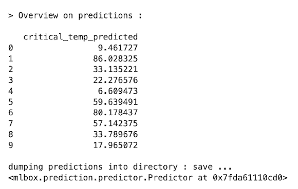

作者图片

您读取生成的 CSV 文件来创建一个错误指标，如下所示:

```
class_predicted_mlbox=pd.read_csv(‘/content/save/critical_temp_predictions.csv’)error_metrics(label_test_regressor, class_predicted_mlbox[‘critical_temp_predicted’])
```

这是我运行的输出:

```
MSE: 87.77266825021174
RMSE: 9.36870686115281
Coefficient of determination: 0.9237475817171334
```

我们得到了大约 0.93 的 R-2 分数。现在让我们检查分类器。

# 自动分类器

分类器任务的数据准备与回归器的情况相同。创建一个包含特征和目标的训练 CSV 文件。您创建了一个只有特性而没有目标的测试文件。你用*阅读器*准备数据帧。

```
paths=[‘training2_file.csv’, ‘testing2_file.csv’]
rd = Reader(sep = ‘,’)
df2 = rd.train_test_split(paths, target_name=’label’)
```

这是我运行中的部分输出:

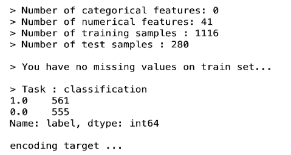

作者图片

你看，这次的任务是分类，有 41 个特征。我们有 1116 个数据点用于训练，280 个数据点用于测试。

您可以像前面一样使用漂移变换来检查方差。

```
dft = Drift_thresholder()
df2 = dft.fit_transform(df2)
```

您像前面一样声明了*空间*变量，用于设置您想要测试的参数值。您创建一个以*精确度*作为评分标准的优化器，并运行它 20 个时期，就像回归器的情况一样。

```
best=opt.optimise(space,df2,20)
```

最后，您将获得带有微调参数的*最佳*模型，您可以直接将其用于预测:

```
prd = Predictor()
prd.fit_predict(best, df2)
```

如前所述，预测存储在 CSV 文件中，您可以读取该文件来创建分类报告:

```
reg_predicted_mlbox=pd.read_csv(‘/content/save/label_predictions.csv’)print(classification_report(reg_predicted_mlbox[‘label_predicted’], label_test_classifier))
```

这是我运行的输出:

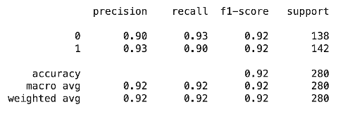

作者图片

如果我们有更多的数据点，准确性会更好。

这个项目的[源代码](https://github.com/abcom-mltutorials/ml/blob/main/AutoML_MLBox.ipynb)可以在我们的 GitHub 资源库中找到。

与早期的库相比，你会发现 MLBox 使用起来更复杂，但它确实创建了一个优秀的模型。让我们现在去下一个图书馆。

# 密封罐

这是最容易使用的工具之一。您只需要设置期望的执行时间，并为其提供训练/测试数据集。要安装该工具，您将使用常用的 *pip* 命令:

```
!pip install mljar-supervised
```

# 自动回归器

要在我们的回归数据集上应用模型，您需要像在 auto-sklearn 案例中那样创建训练/测试数据框。使用以下代码应用模型:

```
automl_reg = AutoML(total_time_limit=2*60)
automl_reg.fit(X_train_regressor, label_train_regressor)
```

注意，我们刚刚设置了执行的时间上限。这是我运行的输出:

```
Linear algorithm was disabled.
AutoML directory: AutoML_1
The task is regression with evaluation metric rmse
AutoML will use algorithms: [‘Baseline’, ‘Decision Tree’, ‘Random Forest’, ‘Xgboost’, ‘Neural Network’]
AutoML will ensemble available models
AutoML steps: [‘simple_algorithms’, ‘default_algorithms’, ‘ensemble’]
* Step simple_algorithms will try to check up to 2 models
1_Baseline rmse 34.418723 trained in 0.95 seconds
2_DecisionTree rmse 18.711229 trained in 13.32 seconds
* Step default_algorithms will try to check up to 3 models
3_Default_Xgboost rmse 9.894658 trained in 85.39 seconds
* Step ensemble will try to check up to 1 model
Ensemble rmse 9.894658 trained in 0.24 seconds
AutoML fit time: 149.47 seconds
AutoML best model: 3_Default_Xgboost
AutoML(total_time_limit=120)
```

正如您所观察到的，在短短两分钟的时间内，它已经测试了所有指定的算法——基线、决策树、随机森林和 Xgboost。它创造了这些模型的集合。对于每个模型，记录 rmse 和执行时间。执行之后，它会将所有结果存储在一个特定的文件夹中，以供您随时使用。它还生成一个包含比较矩阵的 CSV 文件。

使用以下语句对测试数据集进行预测:

```
prediction_reg_ml = automl_reg.predict_all(X_test_regressor)
```

您可以使用以下命令打印错误度量:

```
error_metrics(prediction_reg_ml, label_test_regressor)
```

这是我运行的输出:

```
MSE: 85.32699931235351
RMSE: 9.237261461729526
Coefficient of determination: 0.920540531168528
```

您可以通过阅读 CSV 文件来打印生成的排行榜:

```
pd.read_csv(‘/content/AutoML_1/leaderboard.csv’)
```

这是输出:

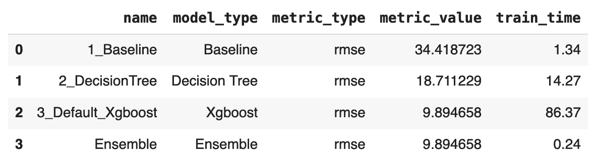

作者图片

接下来，我们看看分类器。

# 自动分类器

分类器数据的准备方式与 auto-sklearn 中的准备方式相同。使用以下代码应用分类器:

```
automl_class = AutoML(total_time_limit=2*60)
automl_class.fit(X_train_classifier, label_train_classifier)
```

这是输出:

```
AutoML directory: AutoML_2
The task is binary_classification with evaluation metric logloss
AutoML will use algorithms: [‘Baseline’, ‘Linear’, ‘Decision Tree’, ‘Random Forest’, ‘Xgboost’, ‘Neural Network’]
AutoML will ensemble available models
AutoML steps: [‘simple_algorithms’, ‘default_algorithms’, ‘ensemble’]
* Step simple_algorithms will try to check up to 3 models
1_Baseline logloss 0.693124 trained in 0.7 seconds
2_DecisionTree logloss 0.526573 trained in 6.5 seconds
3_Linear logloss 0.321759 trained in 5.9 seconds
* Step default_algorithms will try to check up to 3 models
4_Default_Xgboost logloss 0.234433 trained in 15.61 seconds
5_Default_NeuralNetwork logloss 0.813183 trained in 3.01 seconds
6_Default_RandomForest logloss 0.367987 trained in 17.92 seconds
* Step ensemble will try to check up to 1 model
Ensemble logloss 0.234019 trained in 0.81 seconds
AutoML fit time: 80.51 seconds
AutoML best model: Ensemble
AutoML(total_time_limit=120)
```

如您所见，在短短 2 分钟内，它已经测试了所有指定的型号。最好的模式是合奏。您对测试数据集进行预测，并打印分类报告:

```
prediction_class = automl_class.predict(X_val_classifier)
print(classification_report(label_val_classifier, prediction_class))
```

这是输出:

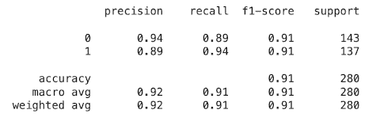

作者图片

如前所述，您可以通过读取生成的 CSV 文件来打印排行榜:

```
pd.read_csv(‘/content/AutoML_2/leaderboard.csv’)
```

这是输出:

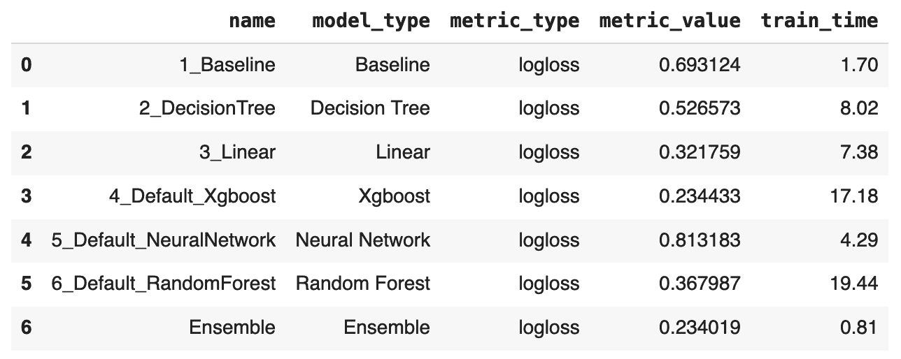

作者图片

这个项目的[源代码](https://github.com/abcom-mltutorials/ml/blob/main/AutoML_MLJAR.ipynb)可以在我们的 GitHub 资源库中找到。

这个工具非常容易使用，并且在很短的时间内产生了很好的效果。

我们的下一个工具是 H2O。

# H2O

这是一个被广泛认可的开源机器学习平台。它是强大的；开发高性能回归和分类模型，但需要额外的数据准备。我将详细介绍使用这个库的所有步骤。

要安装 H2O，只需 *pip* 安装以下软件包:

```
! apt-get install default-jre!java -version!pip install h2o
```

成功安装后，您需要启动 H2O 服务器:

```
import h2o
from h2o.automl import H2OAutoML
h2o.init()
```

服务器启动后，您就可以进行模型开发了。

# 自动回归器

首先，你需要准备数据。您可以像在 auto-sklearn 中那样创建训练/测试数据集。H2O 需要特殊格式的数据。使用以下命令将您的数据帧转换为*H2 of frame*:

```
h2o_train1=h2o.H2OFrame(pd.concat([X_train_regressor, label_train_regressor], axis=1))
```

你分离出特征和目标:

```
x1 = h2o_train1.columns
y1 = ‘critical_temp’
x1.remove(y1)
```

同样，将测试数据转换为 H2O 数据框:

```
h2o_test1=h2o.H2OFrame(pd.concat([X_test_regressor, label_test_regressor], axis=1))
```

您为选定数量的模型应用 autoML。以下代码片段测试了 5 个模型:

```
model_reg = H2OAutoML(max_models=5, seed=1)
model_reg.train(x=x1, y=y1, training_frame=h2o_train1)
```

即使是几个模型也需要相当长的时间。培训过程完成后，您可以打印排行榜。

```
lb = model_reg.leaderboard
lb.head(rows=lb.nrows)
```

这是我运行的输出:

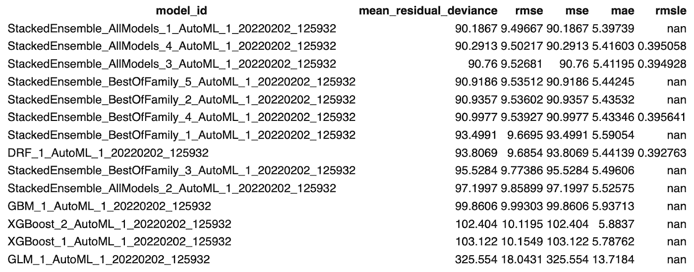

作者图片

遗憾的是，它没有透露型号配置。使用排行榜中的顶级模型，您可以根据您的测试数据进行推断:

```
preds = model_reg.leader.predict(h2o.H2OFrame(X_test_regressor))
```

预测采用 H2O 数据框格式，因此您必须将其转换为 numpy 数组来打印误差度量。将 H2O 数据框转换成如下所示的 numpy 数组:

```
np.array(preds[‘predict’].as_data_frame())
```

然后，打印误差指标:

```
error_metrics(np.array(preds[‘predict’].as_data_frame()), label_test_regressor)
```

这是我运行的输出:

```
MSE: 77.42394821724238
RMSE: 8.79908791962226
Coefficient of determination: 0.9281053116039564
```

接下来，我们将看看分类器。

# 自动分类器

最初，您将像在 auto-sklearn 中一样创建数据框。然后将它们转换成 H2O 数据框。

```
h2o_train2=h2o.H2OFrame(pd.concat([X_train_classifier, label_train_classifier], axis=1))
```

您将特征和目标分开:

```
x2 = h2o_train2.columns
y2 = ‘label’
x2.remove(y2)
```

将测试数据帧转换为 H2O 数据帧格式:

```
h2o_test2=h2o.H2OFrame(pd.concat([X_val_classifier, label_val_classifier], axis=1))
```

对于分类，我们需要一个额外的步骤将标签转换成特殊的格式。我们通过在目标变量上调用 *asfactor* 方法来做到这一点。

```
h2o_train2[y2] = h2o_train2[y2].asfactor()
h2o_test2[y2] = h2o_test2[y2].asfactor()
```

然后，我们在 5 个基本模型上运行 autoML。

```
model_class = H2OAutoML(max_models=5, seed=1)
model_class.train(x=x2, y=y2, training_frame=h2o_train2)
```

培训结束后，您可以查看排行榜:

```
lb = model_class.leaderboard
lb.head(rows=lb.nrows)
```

如前所述，使用排行榜中的顶级模特进行推断:

```
preds = model_class.leader.predict(h2o.H2OFrame(X_test_classifier))
```

将结果转换成 numpy 数组并打印分类报告:

```
np.array(preds[‘predict’].as_data_frame())print(classification_report(label_test_classifier.values, np.array(preds[‘predict’].as_data_frame())))
```

这是我运行的输出:

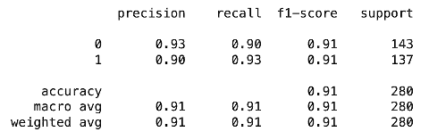

作者图片

虽然它产生了良好的结果，但它没有给出模型配置及其超参数值。

这个项目的[源代码](https://github.com/abcom-mltutorials/ml/blob/main/AutoML_H2O.ipynb)可以在我们的 GitHub 资源库中找到。

最后，我将介绍另一个最近发布的 AutoML 工具，它具有数据科学家一直期待的一些额外功能。

# BlobCity AutoAI

这是最近在 AutoML 空间中增加的内容(2021 年 10 月发布)。一些对数据科学家来说很珍贵的特性，可以在这个库中看到。它泄露了完整的项目源代码——这对数据科学家来说是一大福音。也很好用。要安装库，再次使用 *pip* install。

```
!pip install blobcity
```

此外，您需要安装 AutoKeras。很可能，它使用 AutoKeras 为你生成 ANN 模型。

```
!sudo pip install git+https://github.com/keras-team/keras-tuner.git@1.0.2rc1!pip install autokeras
```

安装完库之后，重新启动运行时并将其导入到项目中

```
import blobcity as bc
```

数据准备阶段与 auto-sklearn 的情况相同。首先，我们将在回归数据集上尝试模型拟合。

# 自动回归

```
model_reg = bc.train(df=pd.concat([X_train_regressor, label_train_regressor], axis=1), target=”critical_temp”)
```

在模型被训练之后，我可以生成一个特征重要性的图表。

```
model_reg.plot_feature_importance()
```

这是输出:

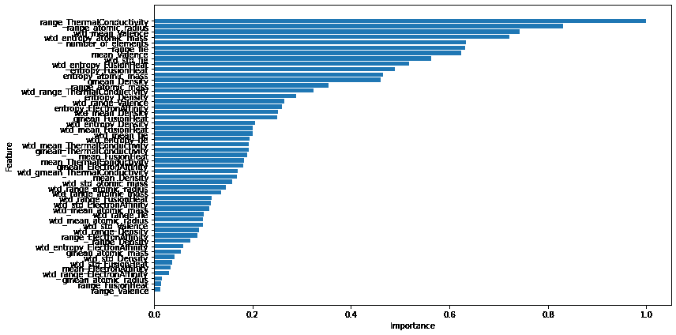

作者图片

了解要素的重要性有助于数据科学家为最终的模型开发准备数据集。

我可以绘制实际值与预测值的关系图:

```
model_reg.plot_prediction()
```

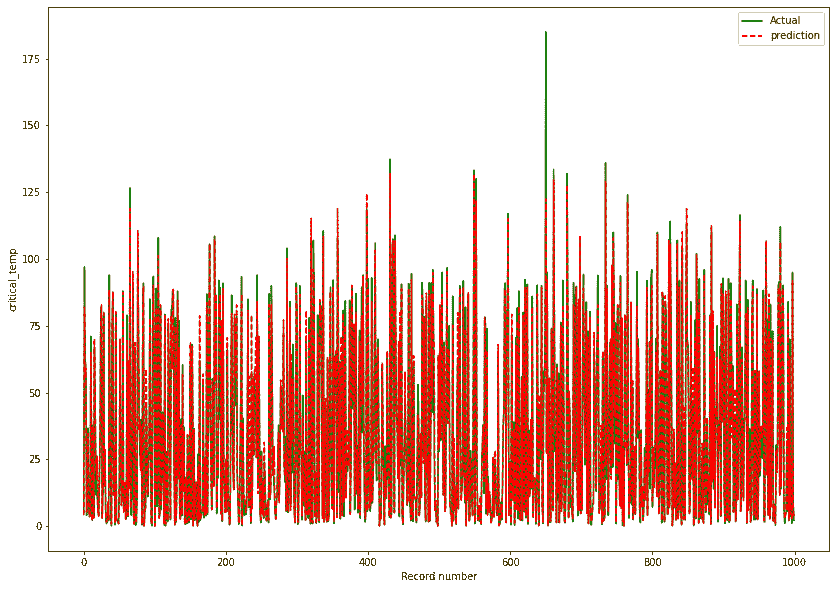

作者图片

最后，我生成了错误指标:

```
prediction_reg=model_reg.predict(X_val_regressor)
error_metrics(label_val_regressor, prediction_reg)
```

这是输出:

```
MSE: 77.74966208588508
RMSE: 8.817576882901848
Coefficient of determination: 0.9324550583579856
```

与我们到目前为止测试的所有模型相比，该模型给了我们极好的 R-2 分数。现在，让我们在分类器数据集上检查它的性能。

# 自动分类器

数据准备和我们为 auto-sklearn 做的一样。您可以使用以下命令应用该工具:

```
model_class = bc.train(df=pd.concat([X_train_classifier,label_train_classifier], axis=1), target=”label”)
```

这是分类报告:

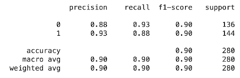

作者图片

它通过调用模型的*溢出*方法，在 Jupyter 笔记本中溢出全部源代码和文档:

```
model_class.spill("my_code.ipynb");
```

它也能产生。py 文件，您可以将它加载到您喜欢的 IDE 中。

您还可以将生成的模型保存到. pkl 文件中。auto-sklearn 和 mljar 中也有类似的功能。

```
model_class.save('./my_model.pkl')
```

您可以通过调用 load 方法来加载先前保存的模型文件，以便进行进一步的推断。

```
model = bc.load('./my_model.pkl')
```

它还支持用于 ANN 的. h5 格式和自定义 TensorFlow 文件系统。

这个项目的[源代码](https://github.com/abcom-mltutorials/ml/blob/main/AutoML_BlobCity.ipynb)可以在我们的 GitHub 库中找到。

我现在将综合所有的观察结果。

# 合并报告

下表显示了分类器任务的整合。

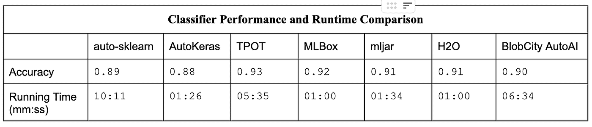

作者图片

所有工具的精确度几乎相同。创建模型的执行时间显示出很大的差异。

下表合并了回归任务的报告。

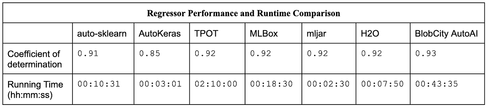

作者图片

同样，所有工具的模型精度或多或少是相同的。在分类器的情况下，执行时间变化很大。

请注意，执行时间的差异是由于每个工具生成的细节和报告的差异。

最后，在下面的表格中，我总结了一些特性，这些特性将有助于您选择合适的工具。

## **自动 ML 特征比较**

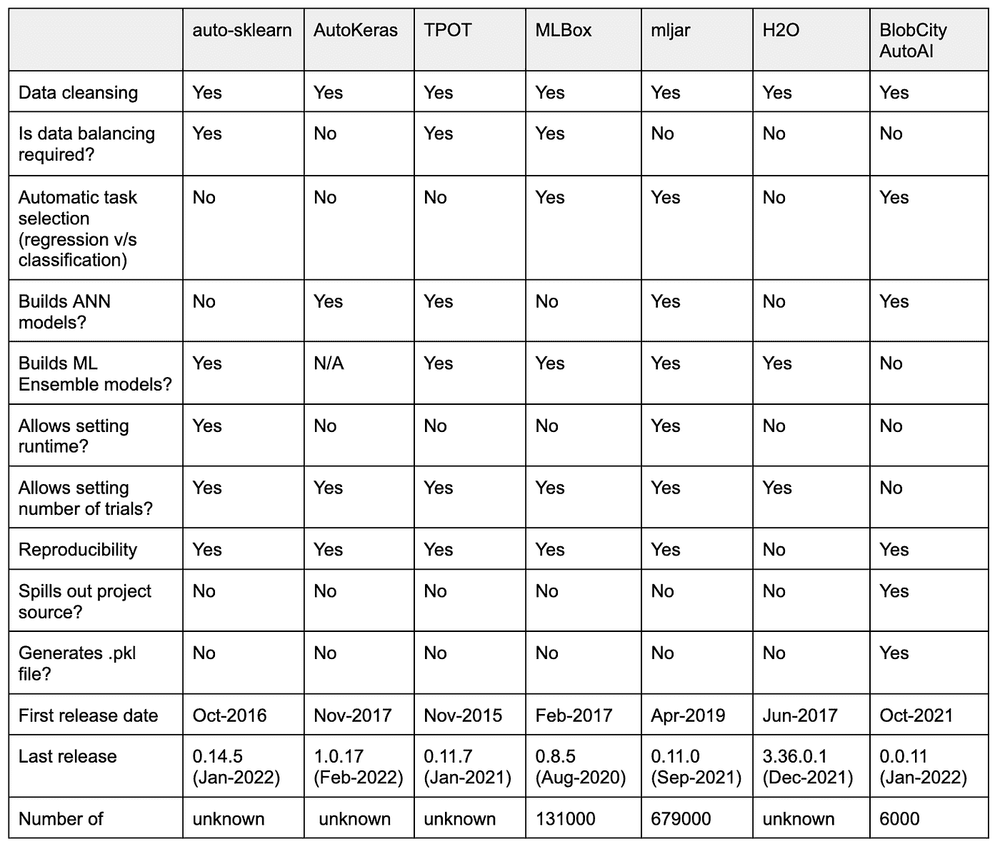

作者图片

# 摘要

随着对 AutoML 认识的增加，甚至非数据科学家也使用它来开发 ML 模型。本文提供了我们对一些广泛使用的工具进行测试的综合报告。市场上可用的工具数量非常多，我们无法囊括其中的许多工具。这个报告可以让你快速开始你的 AutoML 之旅，并帮助你选择工具。所有测试工具都有免费版本，其中一些是开源的。这些工具在模型生成和报告能力上有所不同。在该报告测试的所有内容中，BlobCity AutoAI 是详细说明该项目的完整源代码的一个，这是一个数据科学家非常想要的功能。

# 参考资料:

1.  **超导体数据集** : Hamidieh，Kam，预测超导体临界温度的数据驱动统计模型，计算材料科学，第 154 卷，2018 年 11 月，第 346–354 页，[【网页链接】](https://doi.org/10.1016/j.commatsci.2018.07.052)
2.  **QSAR 生物降解数据集:**曼苏里，k .，林斯特德，t .，巴拉比奥，d .，托代西尼，r .，康索尼，V. (2013)。化学物质快速生物降解的定量结构-活性关系模型。化学信息与建模杂志，53，867–878

# 信用

[Pooja Gramopadhye](https://pub.towardsai.net/@poojagramo) —文字编辑
[乔治·萨维德拉](https://medium.com/@georgesaavedra) —程序开发

> 免责声明:本文中的信息仅用于教育目的。作者对本文内容中的任何错误或遗漏不承担任何责任或义务。本文包含的信息按“原样”提供，不保证完整性、准确性、有用性或及时性。

[](https://medium.com/subscribe/@profsarang) [## 每当 Poornachandra Sarang 发布内容时，都会收到一封电子邮件。

### 每当 Poornachandra Sarang 发布内容时，都会收到一封电子邮件。通过注册，您将创建一个中等帐户，如果您没有…

medium.com](https://medium.com/subscribe/@profsarang) [](https://medium.com/@profsarang/membership) [## 通过我的推荐链接加入 Medium

### 作为一个媒体会员，你的会员费的一部分会给你阅读的作家，你可以完全接触到每一个故事…

medium.com](https://medium.com/@profsarang/membership)