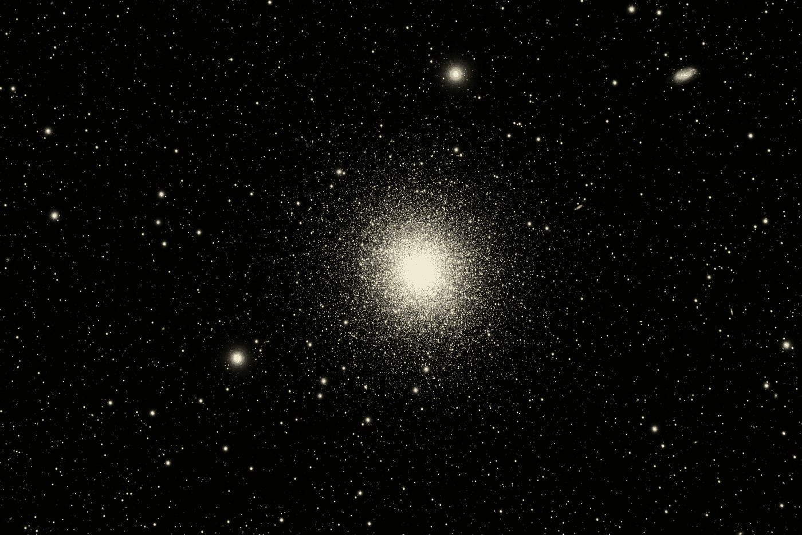
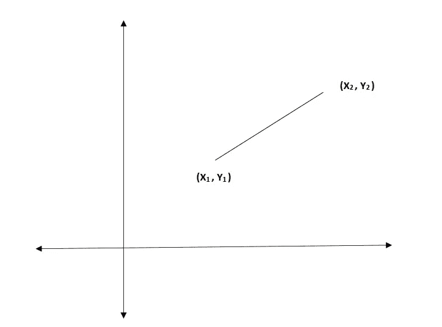
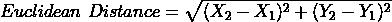
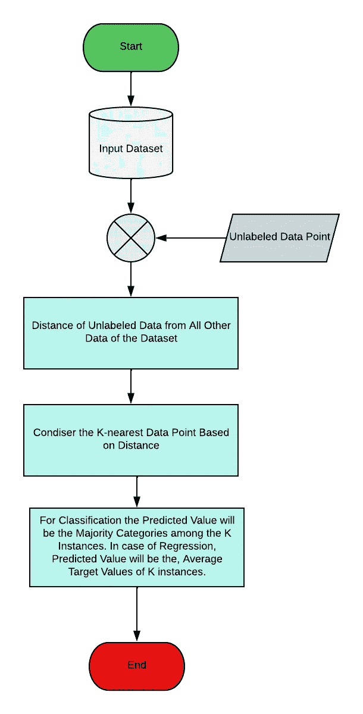
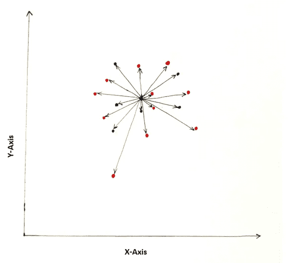
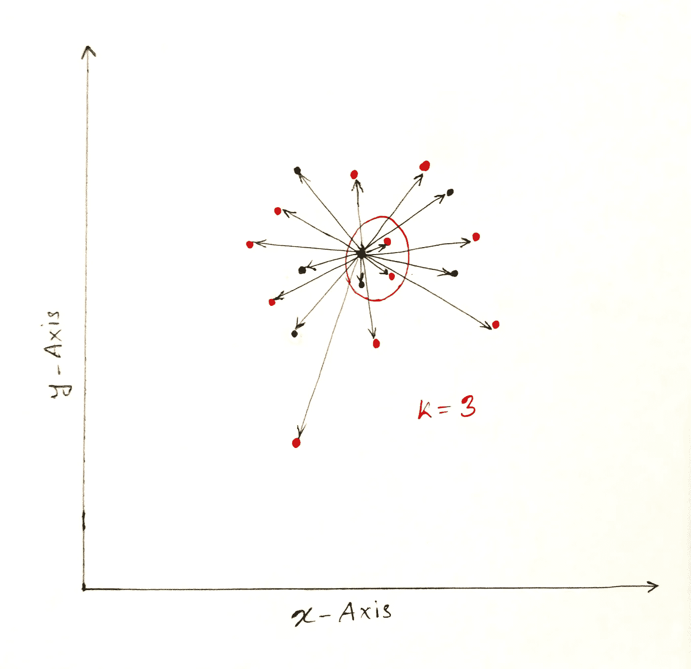

# KNN 算法从零开始

> 原文：<https://towardsdatascience.com/knn-algorithm-from-scratch-37febe0c15b3>

## KNN 算法的实现和细节解释

Guillermo Ferla 在 [Unsplash](https://unsplash.com?utm_source=medium&utm_medium=referral) 上拍摄的照片

## KNN 的背景

KNN 代表 K 近邻。名字本身表明它考虑最近的邻居。它是一种有监督的机器学习算法。有趣的是，我们可以用该算法解决分类和回归问题。它是最简单的机器学习模型之一。虽然这是一个简单的模型，但有时它扮演着重要的角色，基本上是当我们的数据集很小，问题很简单的时候。该算法也称为懒惰算法。这些是 KNN 算法的总结。

我将从 KNN 最基本的东西开始解释，这样你就能用心理解这篇文章了。文末可以自己实现算法(不需要任何机器学习库)。

## 目录

1.  `[**Euclidean Distance**](#5bee)`
2.  `[**Overview of the KNN Algorithm**](#43fe)`
3.  `[**Why is KNN a Lazy Algorithm?**](#143a)`
4.  `[**Step-by-Step Implementation of KNN**](#143a)`

## 欧几里得距离

作者图片

这里，`***(X1, Y1)***`和 `***(X2, Y2)***`是图像中显示的两个点。我们可以用下面的公式计算两点之间的距离。

如果我们有两个以上的特征，我们需要将距离的平方加到上面的公式中来得到距离。

## KNN 算法概述

该名称表明该算法考虑最近的元素来预测新数据的值。流程图显示了 KNN 的步骤。

KNN 算法流程图(图片由作者提供)

*我来解释一下。*

**第一步:计算距离**

首先，我们需要加载带标签的数据集，因为 KNN 算法是一种监督学习算法。看下图。

与数据点的距离(图片由作者提供)

假设我们的数据集只有两个要素，我们绘制的数据如图所示。蓝点和红点表示两个不同的类别。让我们拥有新的未标记的数据，这些数据需要基于给定的数据集进行分类。

在图像中，需要对中心点进行分类。现在，我们将计算所有数据与未标记数据之间的距离。从中心点开始的箭头代表距离。

**步骤 2:选择 K-最近邻**

在上一步中，我们计算了新点与所有其他数据的距离。我们将根据距离对数据点进行升序排序。最后，我们将考虑来自未标记数据的最近点的数量 ***K*** 。

作者图片

在上图中，我已经考虑了 **3** 最近的数据点 ***(K=3)*** 。观察形象；在**的 3 个**最近点**中，2 个**数据属于红色类别，1 个属于蓝色类别。所以，红色是多数阶级。根据 ***KNN*** 算法，新的数据点将被归类为红色。

***遇到回归问题，我们会考虑 K 个最近数据点的平均值。***

## 为什么 KNN 是一个懒惰的算法？

KNN 没有训练期。对于每个预测，算法需要经历相同的过程。在训练期间没有可以优化的参数。所以，这是一个懒惰的算法。当数据集很大时，预测需要更长的时间。

## 从零开始实施 KNN

让我们写几行代码来实现算法。

*导入模块。*

创建计算距离的函数。

`**euclidean**` 函数有两个参数，即`p1`和`p2`。根据`**Euclidean Distance**` 部分解释的公式，该函数将计算从`p1`点到`p2`点的距离。

下一步，我们将编写一个函数，用于保存数据集的每个点与新数据点的距离，并整理数据。最后，我们将选择具有多数类的新数据点的类。

我们已经创建了`**‘predict’**` 函数来查找一组新数据点的预测。让我们使用我们的 `‘predict’`函数来获得`**iris**` 数据集的预测。

这里，我们已经手动选择了训练和测试数据。我们首先将数据随机化以防止偏差。然后我们选择 80%的数据进行训练，剩下的进行测试。最后，我们针对 7 个最近邻居(k=7)测试了我们的模型。

文章[1]帮助我实现了 KNN 算法。

***大功告成。我们从零开始实施 KNN。我们喝杯咖啡，思考一下算法。如果有任何困惑，不要忘记发表评论(或联系我)。***

照片由[凯尔·格伦](https://unsplash.com/@kylejglenn?utm_source=medium&utm_medium=referral)在 [Unsplash](https://unsplash.com?utm_source=medium&utm_medium=referral) 上拍摄

## 结论

KNN 算法似乎非常简单。但有时，它在解决重要的机器学习问题方面发挥着重要作用。当我们的数据有噪音时，我们需要解决简单的问题。总是跑向深度学习模型是不可取的，因为它需要巨大的计算能力和数据。如果我们总是盲目地跳过深度学习模型，我们不会得到一个好的结果。良好的实践是对所有的 ML 模型有深入的直觉，并通过分析问题做出适当的决策。

此处提供了完整的实现。

 [## 深度笔记

### 面向数据科学家和研究人员的托管笔记本电脑。

deepnote.com](https://deepnote.com/workspace/zubair063-9767-9eddd116-b682-475a-9479-3807be1e71db/project/KNN-from-Scratch-87efde85-a815-4ac6-9936-9818d283592d/notebook/Notebook%201-58df07ed20a54f0d971497c24bbc9eef) 

## 参考

1.  [K-从零开始与皮索最近的邻居](https://www.askpython.com/python/examples/k-nearest-neighbors-from-scratch) n

*阅读关于数据科学统计的热门文章(完整指南)*

 [## 数据科学统计终极指南

### 数据科学统计一瞥:标准指南

towardsdatascience.com](/ultimate-guide-to-statistics-for-data-science-a3d8f1fd69a7)