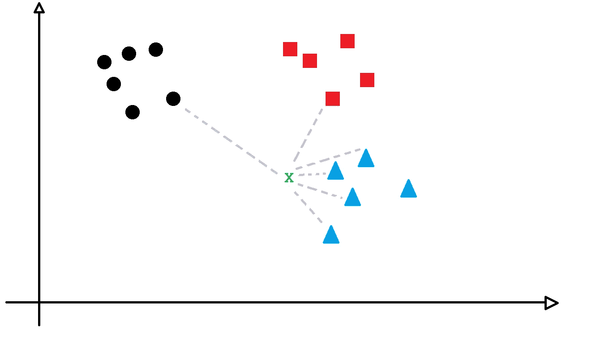
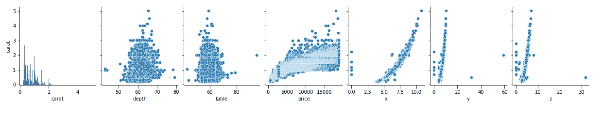
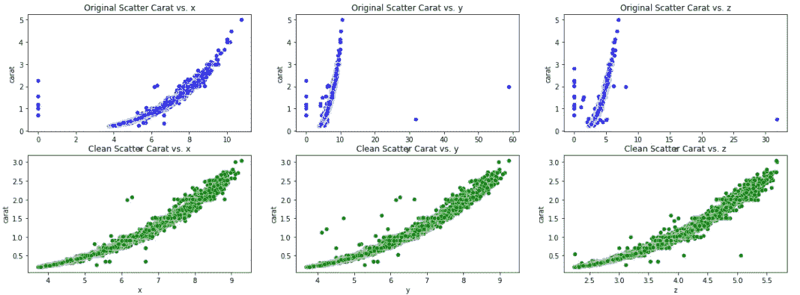
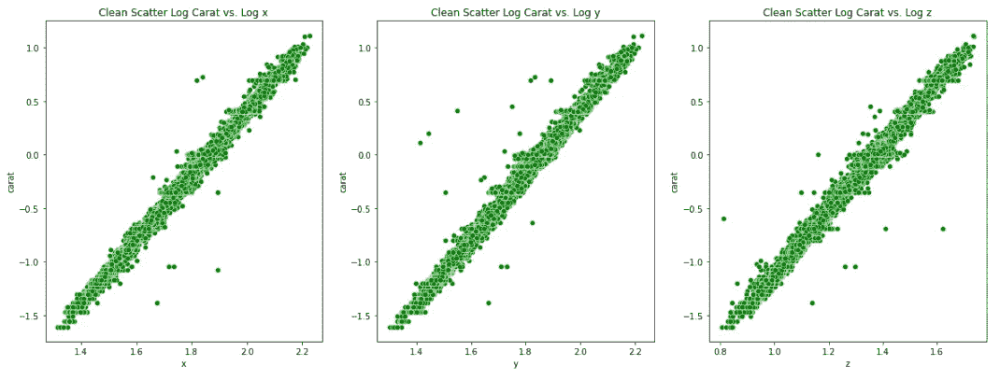
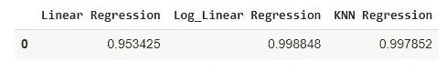
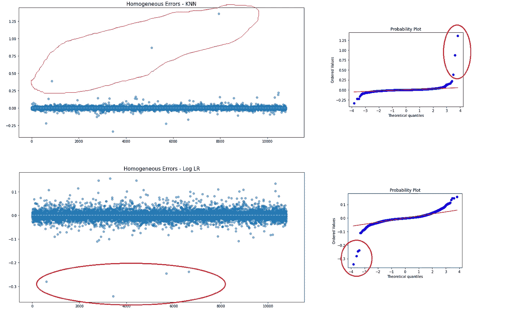

# Python 中的 KNN 回归模型

> 原文：<https://towardsdatascience.com/knn-regression-model-in-python-9868f21c9fa2>

## 将线性模型的简单性与 K 近邻的强大功能相结合


照片由[吴镇男·麦金尼](https://unsplash.com/@derickray?utm_source=unsplash&utm_medium=referral&utm_content=creditCopyText)在 [Unsplash](https://unsplash.com/s/photos/neighbor?utm_source=unsplash&utm_medium=referral&utm_content=creditCopyText) 拍摄

## 回归

回归是一种非常简单的算法。在 Medium 中快速搜索一下，你会发现数百个关于线性回归的帖子。

因此，我不会花太多时间来定义它。我只想说

> 线性回归是一种统计建模工具，它帮助我们根据解释变量和响应变量之间的线性关系来预测值。

## k-最近邻

K-最近邻(或简称为 KNN)算法通过获取给定点并评估其“K”个邻居来寻找相似性。它可用于分类或回归。

这个想法是基于这样一个事实:在空间中，相似的数据点比彼此差异很大的数据点更接近。所以，如果你观察下面的图片，它非常有意义。让我们选择点 **X** 并查看它的 5 个最近的邻居，然后我可以更好地确定那个点是什么。



点 X 很可能是另一个三角形。你同意吗？图片由作者提供。

请注意，这些最近的点中有 4 个是三角形，只有一个是正方形。圆“集群”是太远的方式来考虑。所以，根据 KNN 逻辑，我们可以断定 X 点是一个三角形。

## KNN 回归

KNN 回归逻辑与上面图片中解释的非常相似。唯一的区别是，它与数字打交道。因此，来自`sklearn`库的`KNeighborsRegressor()`算法将做的是计算数据集的回归，然后用选择的数字获取`n_neighbors`参数，检查那些邻居的结果并对结果取平均，给你一个估计的结果。

文献以一种奇特的方式说。看:

> 通过对与训练集中的最近邻居相关联的目标进行局部插值来预测目标。

## 示例代码

以下是使用 KNN 回归器的模型代码。

本练习中使用的数据集是来自 seaborn 的拥有知识共享许可的 [Diamonds](https://github.com/mwaskom/seaborn-data/blob/master/diamonds.csv) 。我会根据切割来模拟钻石的克拉。

首先，让我们创建一个 pairplot 来检查最佳线性关系。



将解释变量与目标变量配对。图片由作者提供。

从这个图中，我们可以看到好的变量是 *x，y* 和 *z，*，因为它们的散点图显示那里有一个可能的线性回归。

所以我隔离了他们。

```
X **=** df[['x', 'y', 'z']]
y **=** df**.**carat# Train test split 
X_train, X_test, y_train, y_test **=** train_test_split(X, y, test_size**=** 0.2, random_state**=**12)
```

然后我检查缺失值。根本没有。

我继续移除离群值。



包含和不包含异常值的数据集。图片由作者提供。

我们可以看到，没有异常值的数据集显示了一条轻微的指数曲线。所以我也尝试了对数转换，以查看更好的线性关系。



对数变换后。图片由作者提供。

下一步是建立数据模型。

我已经创建了 3 个不同的模型。无对数变换的线性回归。对数变换线性回归和 KNN 回归。

这是结果。



车型对比。图片由作者提供。



KNN vs 对数转换回归。图片由作者提供。

结果对 KNN 来说相当不错。它在右端有几个高估的值，但可以接受。好的方面是，它甚至不需要变量转换就给了我这么好的改进(几乎比标准 LR 高 5%)。所以，你能看出 KNN 平均线对于线性回归有多有意思吗？这听起来像是“回归的装袋模型”的简单版本。

对于对数变换 LR，当它在左端显示最大误差时，发生相反的情况。

## 在你走之前

我鼓励你看看 KNN 回归，看看它适合你的项目。

这是另一种回归，你可以将它添加到你的工具箱中，以便能够建立更强大和更准确的模型，而不一定比它需要的更复杂。

数据科学不是关于复杂的事情，而是能够解决问题。

完整代码:

如果你想订阅 Medium，这里有一个[推荐代码](https://gustavorsantos.medium.com/membership)。

另外，我的博客有更多的内容。

<https://gustavorsantos.medium.com/>  

Git Hub 代码:完整的代码[可以在这里找到](https://github.com/gurezende/Studying/blob/master/Python/Linear%20Regression/KNN_Regression.ipynb)。

## 参考

<https://scikit-learn.org/stable/modules/generated/sklearn.neighbors.KNeighborsRegressor.html> 