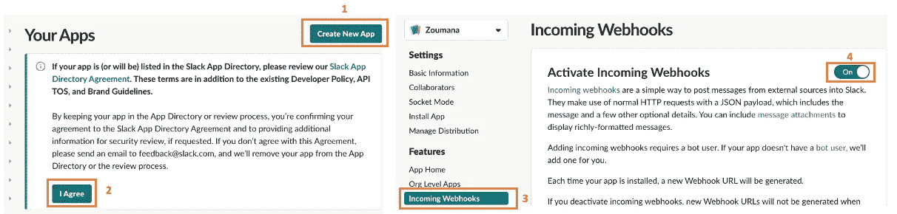
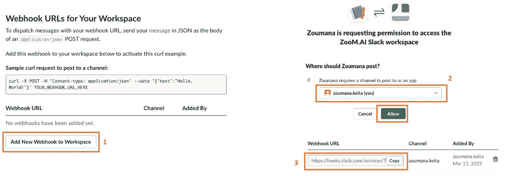
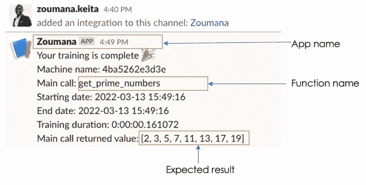
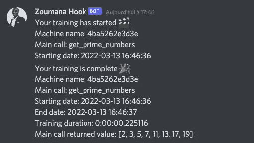

# knock knock——可能是最好的通知 Python 库

> 原文：<https://towardsdatascience.com/knockknock-probably-the-best-python-library-for-notifications-136bdf788f8a>

## 获得 Python 任务通知的简单而有效的方法！


照片由[乔纳斯·李](https://unsplash.com/@1eemingwell)在 [Unsplash](https://unsplash.com/photos/o6elTKWZ5bI) 上拍摄

# 介绍

有些任务需要时间来完成，对于机器学习模型训练来说尤其如此，因为很难准确估计训练何时结束。此外，在整个培训过程完成之前，您可能会处理不同的故障诊断，这可能会使您难以专注于其他任务，从而降低工作效率。

如果你能建立一个自动通知系统来获得任务状态的通知，不管它是崩溃还是成功完成，这不是很好吗？`**knockknock**`就是在这个视角下运作的。

在本文中，你将通过一些例子来理解什么是`knockknock`及其说明。

# 什么是叩叩？

`knockknock`是一个来自[抱脸](https://github.com/huggingface)的通知开源库。它旨在向用户发送通知，告知他们其功能的状态(例如，如前所述的模型训练状态)。在撰写本文时，通知设置可以在十二个不同的平台上执行，如 Slack、Email、Telegram、Microsoft Teams、Discord、SMS 等。整个列表可以在[这里](https://pypi.org/project/knockknock/)找到。

此外，安装可以通过一个 pip 命令来完成，如下所示。

```
pip install knockknock
```

# 开始

我们将举例说明`knockknock`在不和谐和懈怠中的应用，我相信这是许多团队讨论和分享信息时最常用的平台之一。

为了能够使用特定平台的服务，您需要在被跟踪的函数之上添加相应的装饰器。例如，对应于电子邮件服务的装饰者是`@email_sender`。

下面的函数是我们将要使用的一个例子。这是一个简单的函数，它将一个数字作为参数，并返回从 0 到该数字的所有质数的列表。

get_prime_numbers.py

## 松弛的

为了能够使用 Slack，第一件事就是按照这三个步骤获取你的 slack room [webhook URL](https://api.slack.com/messaging/webhooks#create_a_webhook) 。

**#1 & #2 —传入 webhook 激活**

通过前面的链接，您可以在创建新应用程序后或从现有应用程序中激活 webhook。选择**我同意**按钮后，我创建了一个名为 Zoumana 的应用程序。从那里我可以激活网络钩子。



创建一个新的应用程序后进入 Webhook 激活(图片由作者提供)

**# 3——获取你的网页挂钩网址**

确保在完成前面的步骤后刷新页面。然后，在选择**向工作区添加新的 web hook**按钮以最终获得 URL 之后，您应该能够回答关于在哪里发布通知的问题。在我的情况下，我会直接收到它。



传入的 Webhook URL 生成(图片由作者提供)

现在，我们已经为分析做好了一切准备。

装饰器`@slack_sender`的可选参数`user_mentions`使得添加您正在使用的那些的一个列表[slack id](https://api.slack.com/methods/users.identity)成为可能。如果您想标记它们的通知结果，这是非常有趣的。

为了简单起见，我决定不使用该参数，最终实现如下:

slack_notification.py

在**行第 18** 调用了`get_prime_numbers(20)`之后，我从 Slack 得到了以下通知，提供了关于执行的信息，比如函数名、执行日期、时间、持续时间以及返回值。



运行该功能后的松弛通知(图片由作者提供)

## 不调和

与 Slack 类似，您还需要一个不和谐的 Webhook URL，这可以在下面的页面中完成。获取 URL 的细节我就不多说了，因为这个过程很简单，比 Slack 需要的步骤少。

不和谐 _ 通知. py

正如你所看到的，这和 Slack 上的结果是一样的。



运行该功能后的不一致通知(图片由作者提供)

# 结论

恭喜你！🎉 🍾你刚刚学会了如何使用**敲门**来获得任务状态的通知。你可以把时间投入到其他活动中，让`knockknock` 在必要的时候照顾更新你。

如果你喜欢阅读我的故事，并希望支持我的写作，可以考虑成为的灵媒成员。每月支付 5 美元，你就可以无限制地阅读媒体上的故事。通过使用我的注册链接，我会收到一点佣金。

此外，您可以随时在 [LinkedIn](https://www.linkedin.com/in/zoumana-keita/) 、 [Medium](http://zoumanakeita.medium.com/) 和 [YouTube](https://www.youtube.com/channel/UC9xKdy8cz6ZuJU5FTNtM_pQ) 上添加我，或者在 [Twitter](https://twitter.com/zoumana_keita_) 上关注我。讨论人工智能，人工智能，数据科学，自然语言处理的东西总是令人愉快的！

[Google Colab 上文章的源代码](https://colab.research.google.com/drive/1GLGEPT0qTwdBfDPrc-u0DQfznbK_izk1?usp=sharing)

[knockknock 文档页面](https://github.com/huggingface/knockknock#discord)

再见🏃🏾