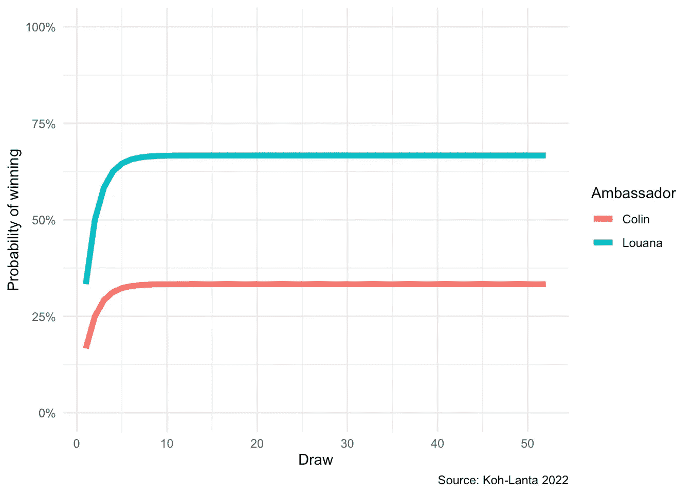
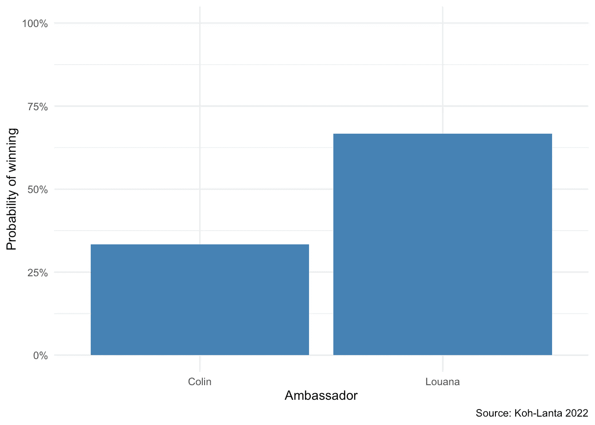

# Koh-Lanta 2022:大使概率问题

> 原文：<https://towardsdatascience.com/koh-lanta-2022-the-ambassadors-probability-problem-ebe0208d45a8>

## 在电视节目《Koh-Lanta 2022》中，每位大使获胜的概率有多大？通过模拟和例子学习如何在 R 中计算它


蒂莫西·梅恩伯格的照片

# 介绍

T 这是一个在法国和比利时法语区播出的受欢迎的电视节目，名为 **Koh-Lanta** 。

在这部剧中，几个冒险者被丢在一个荒岛上，几乎没有食物和装备(只有一个个人背包，里面有他们的衣服和一小部分大米)。他们必须学会在这个充满敌意的岛上生存，建造他们的小屋，寻找水和食物等等。

每个赛季，冒险者被分成团队(称为部落)，团队之间在涉及能力、力量、思维和耐力的游戏中相互竞争。每隔一场比赛，获胜的部落会得到一些食物或生存装备(比如，捕鱼的东西或生火的东西)。失败的部落什么也得不到。在另一半比赛中，输的部落的每个成员都要选出一名冒险者。得票最多的冒险者肯定会离开节目。获胜的部落和所有成员一起回到岛上。

在表演过程中的某个时候，两个竞争的部落被组合成一个部落，这一次每个冒险者互相竞争(所以他们单独玩)。节目的获胜者是最后一个“活下来”的。

2022 赛季从 24 个冒险者开始。在被分组之前，每个部落都必须选择一个对手部落的冒险者。两名被选中的冒险者成为他们部落的大使。然后，两位大使必须前往另一个岛屿，选出最终离开节目的冒险家。两位大使选择的冒险家将不会成为两个部落统一的一部分，她的冒险也就到此为止了。

当然，两位大使都想消灭一个敌对部落的成员(以与最多的盟友达成统一)。如果两位大使不能达成一致，他们必须玩一个游戏来决定两位大使中谁必须离开节目。这个游戏完全是靠运气。在本文的其余部分，我们称这个游戏为*大使游戏*。

# 2022 年前

以下是 2022 赛季前大使比赛的规则:

有两个一模一样的骨灰盒，每个大使前面一个。每个骨灰盒正好包含**一个黑球**和**一个白球**。每个大使必须从他的瓮中抽取一个球。两个骨灰盒当然都是封闭的，所以没人看到哪个球被挑了(也没人看到哪个球没被挑)。游戏的赢家(请记住，赢家留在节目中，输家必须明确离开)是选择白色球的人，而另一位大使则抽取黑色球。如果两位大使抽到了同一个球(都是黑的或都是白的)，球被放回瓮中，游戏重新开始(条件完全相同)，直到两位大使抽到了不同颜色的球。

因此，对于每个抽签，有四种可能的结果:

1.  A 部落的大使抽出一个白球，B 部落的大使抽出一个黑球:A 部落的大使获胜。
2.  A 部落的大使抽取一个黑球，B 部落的大使抽取一个白球:B 部落的大使获胜。
3.  两位大使都抽到了一个黑球:游戏重新开始。
4.  两位大使都抽到了一个白球:游戏重新开始。

让我们计算每个结果发生的概率。由于这两个事件是[独立的](https://statsandr.com/blog/the-9-concepts-and-formulas-in-probability-that-every-data-scientist-should-know/#independence-of-two-events)(A 大使抽一个白球的事实并不改变 B 大使抽一个白球的概率使得这两个事件是独立的)，我们可以将概率相乘来计算这两个事件的联合概率。

用 P_A (P_B)表示部落 A (B)的大使抽到了一个白球的概率，我们得到:

1.  P_A⋅(1−P_B)=0.5⋅0.5=0.25
2.  (1−P_A)⋅P_B=0.5⋅0.5=0.25
3.  (1−P_A)⋅(1−P_B)=0.5⋅0.5=0.25
4.  P_A⋅P_B=0.5⋅0.5=0.25

4 个概率之和为 1(即 100%)，这是有意义的，因为它涵盖了所有可能的结果。

这意味着，*在第一次抽奖*中，每个大使都有 25%的概率赢得游戏(A 大使的结果 1，B 大使的结果 2)。

当然，由于游戏会一直重复，直到出现赢家，从长远来看，结果 3 和 4 的概率会逐渐降低，直到为零(0%)。如果这种说法对你来说不直截了当，那么这样想想:如果你和你的朋友玩那个游戏多达 100 次，仍然没有赢家的概率是多少，意思是你和你的朋友连续 100 次抽同一个球(从来不是不同的颜色)。你认为这是极不可能的。

在这种情况下，由于两个骨灰盒是相同的，游戏无限期地进行，直到有一个赢家，大使们赢得游戏的概率完全相同。对他们每个人来说，这确实是一半对一半的机会。

# 2022 年

当然，如果有这么简单，我不会写一篇关于大使游戏文章。

2022 赛季与前几个赛季的不同之处在于，每一场比赛，失败的部落都会受到额外的惩罚(在节目中称为诅咒)。因此，今年，大使们游戏中的两个骨灰盒与 T2 的不一样。

给你一些背景资料，在大使谈判前的最后一场比赛中，红部落赢了黄部落。对黄色部落的惩罚如下:

*   黄色部落(和他们的大使科林)有一个瓮，里面有**两个黑球**和一个白球。
*   红族部落(和他们的大使 Louana)有一个骨灰盒，里面有一个黑球和一个白球。

这确实是对黄色部落的惩罚，因为游戏不再公平:与黄色部落的大使相比，红色部落的大使显然有更高的机会赢得游戏。

对于你们当中的好奇者来说，事情是这样发生的:

*   主持人 Denis Brogniart 向两位大使介绍了每个部落骨灰盒的组成。
*   知道胜算对他不利，科林(黄色部落的大使)选择不玩这个游戏。 [1](https://statsandr.com/blog/koh-lanta-2022-ambassadors-probability-problem/#fn1)
*   他们最终商定了将离开节目的冒险者的名字(黄色部落的冒险者)。

你现在已经猜到了，写这篇文章的原因当然不是为了向你解释实际发生了什么——新闻网站比我做得更好、更快。原因是我想计算每个大使赢得游戏的机会，如果他们没有同意消灭一个冒险者的话。 [2](https://statsandr.com/blog/koh-lanta-2022-ambassadors-probability-problem/#fn2)

此外，我想通过模拟来计算这些概率。为什么不呢，重复使用代码，以防将来兰大岛的组织者决定再次改变规则。

即使你不看 Koh-Lanta(因为它不在你的国家播出，或者你不喜欢这个节目)，你可能会对想看的人感兴趣:

*   一个现实生活中的例子如何转化为 R，
*   以及如何用一个`for loop`和一个函数来回答最初的问题。

# R 中的概率计算

对于本文的其余部分，我们表示:

*   p_c，科林(黄部落大使)抽到了一个白球的概率，
*   p_l，Louana(红色部落的大使)抽到了白球的概率，
*   q_c，科林抽到黑球的概率，
*   q_l，Louana 抽到黑球的概率。

根据 Denis Brogniart 给出的骨灰盒组成，我们有:

```
p_c <- 1 / 3
p_l <- 1 / 2
q_c <- (1 - p_c)
q_l <- (1 - p_l)
```

## 第一次抽签

为了简单起见，让我们先计算一下第一次抽奖时每个大使*的获胜概率，只有*。记住，要有赢家，球必须是不同的颜色。

当且仅当科林抽了一个黑球，卢阿那抽了一个白球时，卢阿那赢:

```
# Louana winning on first draw
l_win <- q_c * p_l
l_win## [1] 0.3333333
```

Louana 有 33.33%的机会在第一次抽奖中获胜。

另一方面，当且仅当 Louana 画了一个黑球，而 Colin 画了一个白球时，Colin 才赢:

```
# Colin winning on first draw
c_win <- q_l * p_c
c_win## [1] 0.1666667
```

科林第一次抽奖有 16.67%的胜算。

你已经可以看出，这场比赛是有利于 Louana，正如所料。现在来看看打几次是怎么演变的。

## 第二次抽签

要在第二次抽签时准确获胜，第一次抽签时必须是平局。

```
# Louana winning on second draw
tie <- (p_c * p_l) + (q_c * q_l)l_win2 <- tie * l_win
l_win2## [1] 0.1666667# Colin winning on second draw
c_win2 <- tie * c_win
c_win2## [1] 0.08333333
```

*   Louana 第二次抽奖有 16.67%的几率中奖。
*   科林有 8.33%的机会在第二次抽奖中获胜。

## 第三次抽签

要在第三次平局时获胜，前两次平局必须是平局。

```
# Louana winning on third draw
l_win3 <- (tie^2) * l_win
l_win3## [1] 0.08333333# Colin winning on third draw
c_win3 <- (tie^2) * c_win
c_win3## [1] 0.04166667
```

*   Louana 第三次抽奖有 8.33%的胜算。
*   科林有 4.17%的机会在第三次抽奖中获胜。

代码中似乎出现了一种模式。

## 游戏限于 3 次平局

我们已经可以计算每个大使的获胜概率，就好像游戏限于三次平局一样，方法是将前三次平局的概率相加:

```
# Louana winning on draw 1, 2 or 3
l_win_tot <- l_win + l_win2 + l_win3
l_win_tot## [1] 0.5833333# Colin winning on draw 1, 2 or 3
c_win_tot <- c_win + c_win2 + c_win3
c_win_tot## [1] 0.2916667
```

*   如果游戏限于三个平局，Louana 有 58.33%的胜算。
*   如果游戏限于三个平局，科林有 29.17%的胜算。

## 游戏限于 5 次平局

现在，如果我们计算概率，假设游戏限于 5 次平局，并推广计算以更清楚地看到模式，我们有:

```
# Louana winning
l_win_tot <- ((tie^0) * l_win) +
  ((tie^1) * l_win) +
  ((tie^2) * l_win) +
  ((tie^3) * l_win) +
  ((tie^4) * l_win)l_win_tot## [1] 0.6458333# Colin winning
c_win_tot <- ((tie^0) * c_win) +
  ((tie^1) * c_win) +
  ((tie^2) * c_win) +
  ((tie^3) * c_win) +
  ((tie^4) * c_win)c_win_tot## [1] 0.3229167
```

*   如果游戏限制在 5 次平局，Louana 有 64.58%的胜算。
*   如果游戏限制在 5 次平局，科林有 32.29%的胜算。

## 游戏限于 100 次抽奖

我们可以像这样持续很长时间，但是现在让我们用一个`for loop`来计算 100 次平局。为了避免一百次地复制粘贴我们的计算，这里使用一个`for loop`是必要的。

为了便于说明，我们只计算 Louana 获胜的概率。我们将在后面展示如何简单地计算科林的概率。

```
n_draws <- 100 # number of draws
l_win_tot <- c() # set empty vectorfor (i in 1:n_draws) {
  l_win_tot[i] <- ((tie^(i - 1)) * l_win) # prob of Louana winning up to n_draws
  print(paste0("Draw ", i, ": ", sum(l_win_tot))) # print sum of winning up to n_draws
}## [1] "Draw 1: 0.333333333333333"
## [1] "Draw 2: 0.5"
## [1] "Draw 3: 0.583333333333333"
## [1] "Draw 4: 0.625"
## [1] "Draw 5: 0.645833333333333"
## [1] "Draw 6: 0.65625"
## [1] "Draw 7: 0.661458333333333"
## [1] "Draw 8: 0.6640625"
## [1] "Draw 9: 0.665364583333333"
## [1] "Draw 10: 0.666015625"
## [1] "Draw 11: 0.666341145833333"
## [1] "Draw 12: 0.66650390625"
## [1] "Draw 13: 0.666585286458333"
## [1] "Draw 14: 0.6666259765625"
## [1] "Draw 15: 0.666646321614583"
## [1] "Draw 16: 0.666656494140625"
## [1] "Draw 17: 0.666661580403646"
## [1] "Draw 18: 0.666664123535156"
## [1] "Draw 19: 0.666665395100911"
## [1] "Draw 20: 0.666666030883789"
## [1] "Draw 21: 0.666666348775228"
## [1] "Draw 22: 0.666666507720947"
## [1] "Draw 23: 0.666666587193807"
## [1] "Draw 24: 0.666666626930237"
## [1] "Draw 25: 0.666666646798452"
## [1] "Draw 26: 0.666666656732559"
## [1] "Draw 27: 0.666666661699613"
## [1] "Draw 28: 0.66666666418314"
## [1] "Draw 29: 0.666666665424903"
## [1] "Draw 30: 0.666666666045785"
## [1] "Draw 31: 0.666666666356226"
## [1] "Draw 32: 0.666666666511446"
## [1] "Draw 33: 0.666666666589056"
## [1] "Draw 34: 0.666666666627862"
## [1] "Draw 35: 0.666666666647264"
## [1] "Draw 36: 0.666666666656966"
## [1] "Draw 37: 0.666666666661816"
## [1] "Draw 38: 0.666666666664241"
## [1] "Draw 39: 0.666666666665454"
## [1] "Draw 40: 0.66666666666606"
## [1] "Draw 41: 0.666666666666364"
## [1] "Draw 42: 0.666666666666515"
## [1] "Draw 43: 0.666666666666591"
## [1] "Draw 44: 0.666666666666629"
## [1] "Draw 45: 0.666666666666648"
## [1] "Draw 46: 0.666666666666657"
## [1] "Draw 47: 0.666666666666662"
## [1] "Draw 48: 0.666666666666664"
## [1] "Draw 49: 0.666666666666666"
## [1] "Draw 50: 0.666666666666666"
## [1] "Draw 51: 0.666666666666666"
## [1] "Draw 52: 0.666666666666667"
## [1] "Draw 53: 0.666666666666667"
## [1] "Draw 54: 0.666666666666667"
## [1] "Draw 55: 0.666666666666667"
## [1] "Draw 56: 0.666666666666667"
## [1] "Draw 57: 0.666666666666667"
## [1] "Draw 58: 0.666666666666667"
## [1] "Draw 59: 0.666666666666667"
## [1] "Draw 60: 0.666666666666667"
## [1] "Draw 61: 0.666666666666667"
## [1] "Draw 62: 0.666666666666667"
## [1] "Draw 63: 0.666666666666667"
## [1] "Draw 64: 0.666666666666667"
## [1] "Draw 65: 0.666666666666667"
## [1] "Draw 66: 0.666666666666667"
## [1] "Draw 67: 0.666666666666667"
## [1] "Draw 68: 0.666666666666667"
## [1] "Draw 69: 0.666666666666667"
## [1] "Draw 70: 0.666666666666667"
## [1] "Draw 71: 0.666666666666667"
## [1] "Draw 72: 0.666666666666667"
## [1] "Draw 73: 0.666666666666667"
## [1] "Draw 74: 0.666666666666667"
## [1] "Draw 75: 0.666666666666667"
## [1] "Draw 76: 0.666666666666667"
## [1] "Draw 77: 0.666666666666667"
## [1] "Draw 78: 0.666666666666667"
## [1] "Draw 79: 0.666666666666667"
## [1] "Draw 80: 0.666666666666667"
## [1] "Draw 81: 0.666666666666667"
## [1] "Draw 82: 0.666666666666667"
## [1] "Draw 83: 0.666666666666667"
## [1] "Draw 84: 0.666666666666667"
## [1] "Draw 85: 0.666666666666667"
## [1] "Draw 86: 0.666666666666667"
## [1] "Draw 87: 0.666666666666667"
## [1] "Draw 88: 0.666666666666667"
## [1] "Draw 89: 0.666666666666667"
## [1] "Draw 90: 0.666666666666667"
## [1] "Draw 91: 0.666666666666667"
## [1] "Draw 92: 0.666666666666667"
## [1] "Draw 93: 0.666666666666667"
## [1] "Draw 94: 0.666666666666667"
## [1] "Draw 95: 0.666666666666667"
## [1] "Draw 96: 0.666666666666667"
## [1] "Draw 97: 0.666666666666667"
## [1] "Draw 98: 0.666666666666667"
## [1] "Draw 99: 0.666666666666667"
## [1] "Draw 100: 0.666666666666667"
```

得出 1、3 和 5 的概率与我们在前面章节中发现的一致。此外，我们看到从第 52 局开始，Louana 获胜的概率保持不变，为 66.67%。这就是所谓的极限。

## 游戏限于必要的抽牌次数

如果不打印上述`for loop`的结果，我们不知道需要多少次抽签才能达到极限。

现在，让我们尝试包含有关必要抽取次数的信息，以避免计算不必要的抽取:

```
n_draws <- 9999 # initial number of draws, set intentionally to a high number
p_tie <- c() # set empty vector for prob of ties
l_win_tot <- c() # set empty vector for prob of Louana winning# find number of necessary draws:
for (i in 1:n_draws) {
  p_tie[i] <- tie^i # prob of tie for each draw
  limit_ndraws <- sum(p_tie > 2.2e-16) # number of necessary draws
}# compute Louana winning probabilities with the smallest number of necessary draws
for (i in 1:limit_ndraws) {
  l_win_tot[i] <- ((tie^(i - 1)) * l_win) # prob of Louana winning up to limited number of draws
  print(paste0("Draw ", i, ": ", sum(l_win_tot))) # sum of winning up to limited number of draws
}## [1] "Draw 1: 0.333333333333333"
## [1] "Draw 2: 0.5"
## [1] "Draw 3: 0.583333333333333"
## [1] "Draw 4: 0.625"
## [1] "Draw 5: 0.645833333333333"
## [1] "Draw 6: 0.65625"
## [1] "Draw 7: 0.661458333333333"
## [1] "Draw 8: 0.6640625"
## [1] "Draw 9: 0.665364583333333"
## [1] "Draw 10: 0.666015625"
## [1] "Draw 11: 0.666341145833333"
## [1] "Draw 12: 0.66650390625"
## [1] "Draw 13: 0.666585286458333"
## [1] "Draw 14: 0.6666259765625"
## [1] "Draw 15: 0.666646321614583"
## [1] "Draw 16: 0.666656494140625"
## [1] "Draw 17: 0.666661580403646"
## [1] "Draw 18: 0.666664123535156"
## [1] "Draw 19: 0.666665395100911"
## [1] "Draw 20: 0.666666030883789"
## [1] "Draw 21: 0.666666348775228"
## [1] "Draw 22: 0.666666507720947"
## [1] "Draw 23: 0.666666587193807"
## [1] "Draw 24: 0.666666626930237"
## [1] "Draw 25: 0.666666646798452"
## [1] "Draw 26: 0.666666656732559"
## [1] "Draw 27: 0.666666661699613"
## [1] "Draw 28: 0.66666666418314"
## [1] "Draw 29: 0.666666665424903"
## [1] "Draw 30: 0.666666666045785"
## [1] "Draw 31: 0.666666666356226"
## [1] "Draw 32: 0.666666666511446"
## [1] "Draw 33: 0.666666666589056"
## [1] "Draw 34: 0.666666666627862"
## [1] "Draw 35: 0.666666666647264"
## [1] "Draw 36: 0.666666666656966"
## [1] "Draw 37: 0.666666666661816"
## [1] "Draw 38: 0.666666666664241"
## [1] "Draw 39: 0.666666666665454"
## [1] "Draw 40: 0.66666666666606"
## [1] "Draw 41: 0.666666666666364"
## [1] "Draw 42: 0.666666666666515"
## [1] "Draw 43: 0.666666666666591"
## [1] "Draw 44: 0.666666666666629"
## [1] "Draw 45: 0.666666666666648"
## [1] "Draw 46: 0.666666666666657"
## [1] "Draw 47: 0.666666666666662"
## [1] "Draw 48: 0.666666666666664"
## [1] "Draw 49: 0.666666666666666"
## [1] "Draw 50: 0.666666666666666"
## [1] "Draw 51: 0.666666666666666"
## [1] "Draw 52: 0.666666666666667"
```

## 最终获胜概率

记得最初的问题是:

> *每个大使的胜算概率有多大？*

Louana 赢得游戏的概率可以很容易地提取如下:

```
sum(l_win_tot)## [1] 0.6666667
```

由于游戏只有在有赢家时才会停止，Louana 和 Colin 的获胜概率之和必须等于 1，因此 Colin 赢得游戏的概率是:

```
c_win_tot <- 1 - sum(l_win_tot)
c_win_tot## [1] 0.3333333
```

**总结一下:**

*   Louana 有 66.67%的几率赢得大使赛。
*   科林有 33.33%的几率赢得大使赛。

## 视觉表现

为了直观显示每个大使的概率，我们忽略了科林获胜的概率，所以让我们先计算一下:

```
c_win_tot <- c() # set empty vector for prob of Colin winning# compute Colin winning probabilities with the smallest number of necessary draws
for (i in 1:limit_ndraws) {
  c_win_tot[i] <- ((tie^(i - 1)) * c_win) # prob of Colin winning
  print(paste0("Draw ", i, ": ", sum(c_win_tot))) # print sum of winning
}## [1] "Draw 1: 0.166666666666667"
## [1] "Draw 2: 0.25"
## [1] "Draw 3: 0.291666666666667"
## [1] "Draw 4: 0.3125"
## [1] "Draw 5: 0.322916666666667"
## [1] "Draw 6: 0.328125"
## [1] "Draw 7: 0.330729166666667"
## [1] "Draw 8: 0.33203125"
## [1] "Draw 9: 0.332682291666667"
## [1] "Draw 10: 0.3330078125"
## [1] "Draw 11: 0.333170572916667"
## [1] "Draw 12: 0.333251953125"
## [1] "Draw 13: 0.333292643229167"
## [1] "Draw 14: 0.33331298828125"
## [1] "Draw 15: 0.333323160807292"
## [1] "Draw 16: 0.333328247070312"
## [1] "Draw 17: 0.333330790201823"
## [1] "Draw 18: 0.333332061767578"
## [1] "Draw 19: 0.333332697550456"
## [1] "Draw 20: 0.333333015441895"
## [1] "Draw 21: 0.333333174387614"
## [1] "Draw 22: 0.333333253860474"
## [1] "Draw 23: 0.333333293596903"
## [1] "Draw 24: 0.333333313465118"
## [1] "Draw 25: 0.333333323399226"
## [1] "Draw 26: 0.33333332836628"
## [1] "Draw 27: 0.333333330849806"
## [1] "Draw 28: 0.33333333209157"
## [1] "Draw 29: 0.333333332712452"
## [1] "Draw 30: 0.333333333022892"
## [1] "Draw 31: 0.333333333178113"
## [1] "Draw 32: 0.333333333255723"
## [1] "Draw 33: 0.333333333294528"
## [1] "Draw 34: 0.333333333313931"
## [1] "Draw 35: 0.333333333323632"
## [1] "Draw 36: 0.333333333328483"
## [1] "Draw 37: 0.333333333330908"
## [1] "Draw 38: 0.333333333332121"
## [1] "Draw 39: 0.333333333332727"
## [1] "Draw 40: 0.33333333333303"
## [1] "Draw 41: 0.333333333333182"
## [1] "Draw 42: 0.333333333333258"
## [1] "Draw 43: 0.333333333333295"
## [1] "Draw 44: 0.333333333333314"
## [1] "Draw 45: 0.333333333333324"
## [1] "Draw 46: 0.333333333333329"
## [1] "Draw 47: 0.333333333333331"
## [1] "Draw 48: 0.333333333333332"
## [1] "Draw 49: 0.333333333333333"
## [1] "Draw 50: 0.333333333333333"
## [1] "Draw 51: 0.333333333333333"
## [1] "Draw 52: 0.333333333333333"
```

我们用两位大使的概率创建了一个数据集:

```
dat <- data.frame(
  Draw = rep(1:limit_ndraws, 2),
  Probability = c(cumsum(l_win_tot), cumsum(c_win_tot)),
  Ambassador = c(rep("Louana", limit_ndraws), rep("Colin", limit_ndraws))
)
```

我们现在可以将这些概率想象成必要的抽奖次数:

```
# load package
library(ggplot2)# plot
ggplot(dat) +
  aes(x = Draw, y = Probability, colour = Ambassador) +
  geom_line(size = 2L) +
  labs(
    y = "Probability of winning",
    caption = "Source: Koh-Lanta 2022"
  ) +
  scale_y_continuous(labels = scales::percent_format(accuracy = 1), limits = c(0, 1)) +
  theme_minimal()
```



作者的情节

但我认为回答最初问题的最合适的图是柱状图:

```
# create dataset
dat_barplot <- data.frame(
  Ambassador = c("Louana", "Colin"),
  Probability = c(sum(l_win_tot), sum(c_win_tot))
)# plot
ggplot(data = dat_barplot, aes(x = Ambassador, y = Probability)) +
  geom_bar(stat = "identity", fill = "steelblue") +
  labs(
    y = "Probability of winning",
    caption = "Source: Koh-Lanta 2022"
  ) +
  scale_y_continuous(labels = scales::percent_format(accuracy = 1), limits = c(0, 1)) +
  theme_minimal()
```



作者的情节

## 编码成一个函数

让我们尝试在一个函数中实现这个问题，以便能够在其他初始概率中重用它。

使用:

*   `p_a`和`p_b`分别表示大使 A 和大使 B 抽取白球的概率，
*   `n_draws`表示允许的最大抽奖次数(默认值= 9999)，

我们有以下功能:

```
ambassadors_game <- function(p_a, p_b, n_draws = 9999) {
  q_a <- (1 - p_a)
  q_b <- (1 - p_b) a_win <- q_b * p_a
  b_win <- q_a * p_b tie <- (p_a * p_b) + (q_a * q_b) p_tie <- c() # set empty vector for prob of ties
  a_win_tot <- c() # set empty vector for prob of A winning
  b_win_tot <- c() # set empty vector for prob of B winning # find number of necessary draws:
  for (i in 1:n_draws) {
    p_tie[i] <- tie^i # prob of tie for each draw
    limit_ndraws <- sum(p_tie > 2.2e-16) # number of necessary draws
  } # compute A and B winning probabilities with the smallest number of necessary draws:
  for (i in 1:limit_ndraws) {
    a_win_tot[i] <- ((tie^(i - 1)) * a_win) # prob of A winning up to limited number of draws
    b_win_tot[i] <- ((tie^(i - 1)) * b_win) # prob of B winning up to limited number of draws
  } # save P(A), P(B) and number of necessary draws:
  res <- list(
    "p_a" = sum(a_win_tot),
    "p_b" = sum(b_win_tot),
    "ndraws" = limit_ndraws
  )
  # print results:
  return(res)
}
```

我们测试这个函数，看看它是否与上面的结果相匹配。

首先，如果两位大使都有相同的骨灰盒，就像 2022 赛季之前的情况一样:

```
ambassadors_game(
  p_a = 1 / 2,
  p_b = 1 / 2
)## $p_a
## [1] 0.5
## 
## $p_b
## [1] 0.5
## 
## $ndraws
## [1] 52
```

游戏的确很公平，每个大使都有 50%的胜算。

第二，向 Louana 和 Colin 赠送骨灰盒，但仅限于第一次抽奖(任意设置 Louana 为大使 A，Colin 为大使 B):

```
# first draw only
ambassadors_game(
  p_a = 1 / 2,
  p_b = 1 / 3,
  n_draws = 1
)## $p_a
## [1] 0.3333333
## 
## $p_b
## [1] 0.1666667
## 
## $ndraws
## [1] 1
```

第三，仍然是向 Louana 和 Colin 赠送骨灰盒，但游戏仅限于 3 和 5 次平局:

```
# up to 3 draws
ambassadors_game(
  p_a = 1 / 2,
  p_b = 1 / 3,
  n_draws = 3
)## $p_a
## [1] 0.5833333
## 
## $p_b
## [1] 0.2916667
## 
## $ndraws
## [1] 3# up to 5 draws
ambassadors_game(
  p_a = 1 / 2,
  p_b = 1 / 3,
  n_draws = 5
)## $p_a
## [1] 0.6458333
## 
## $p_b
## [1] 0.3229167
## 
## $ndraws
## [1] 5
```

现在，我们来看看 2022 年兰大岛上 Louana 和 Colin 的真实情况:

```
# Koh-Lanta 2022 situation
out <- ambassadors_game(
  p_a = 1 / 2,
  p_b = 1 / 3
)out## $p_a
## [1] 0.6666667
## 
## $p_b
## [1] 0.3333333
## 
## $ndraws
## [1] 52
```

所有结果都与上述结果相符。

(注意，每个大使的概率可以提取如下:)

```
# prob ambassador A
out$p_a## [1] 0.6666667# prob ambassador B
out$p_b## [1] 0.3333333
```

# 结论

最初的问题来自电视节目 Koh-Lanta，是“如果每个参与者玩大使游戏，他们获胜的概率是多少？".

在本文中，我们展示了如何计算这些概率。此外，我们已经说明了如何将一个简单的概率问题推广到适合许多真实生活情况的过程，以及如何使用一个`for loop`和一个函数将真实生活情况实现到 r。

最后但同样重要的是，我想重点谈谈两位大使回到岛上向其他冒险者宣布他们的选择后 Denis Brogniart(该节目的著名主持人)所说的话。他提到，由于惩罚折磨黄色部落，有 16%的机会之间的差异 Louana 和科林。

这自然来源于以下两种情况:

*第一种情况:*

*   Louana 有 50%的几率挑到白球。
*   科林有 33.33%的几率挑到白球。
*   差额为 50–33.33 = 16.67%，四舍五入为 16%。

或者，如果游戏仅限于第一次抽牌:

*第二种情况:*

*   Louana 有 33.33%的机会赢得比赛。
*   科林有 16.67%的几率赢得比赛。
*   差额为 33.33–16.67 = 16.66%，四舍五入为 16%。

的确，从这两个角度看问题，差距在 16%左右。Denis Brogniart 提到这 16%的差异是正确的。

然而，如果我们从更广泛的角度来看这场比赛，两位大使之间的机会差异更大*。游戏规则说只有当有赢家时才停止。从这个角度来看，如上所述:*

*   Louana 有 66.67%的几率赢得比赛。
*   科林有 33.33%的几率赢得比赛。

在这种情况下，两位大使获胜的概率差是 66.67–33.33 = 33.34%！

我必须承认，我没有料到两位大使之间会有如此大的分歧。从这个角度来看大使们的游戏看起来与我们被告知的不同，或者与我们在实际计算概率之前所想的不同。(Denis Brogniart，如果你碰巧读到这篇文章，请告诉我这种相对较大的差异是否是有意的。)

对于那些不看这部剧的人来说:当大使们和所有冒险者一起回到岛上时，科林受到了部落成员的严厉批评。他不玩大使游戏的决定(以及为了自救而消灭一名部落成员的决定)被视为背叛。这样的结果是，他在那一集之后就直接被重新组合的部落淘汰了。

我将以下面的问题来结束这篇文章:

> *如果你是 2022 年 Koh-Lanta 赛季的大使，现在你知道了每个部落获胜的确切概率，你会怎么做？*

感谢阅读。

和往常一样，如果您有任何与本文主题相关的问题，请添加评论，以便其他读者可以从讨论中受益。

1.  我们永远不会知道，如果两位大使获胜的机会相等，他是否会参加这场比赛。自从我开始看这个电视节目，我从来没有见过任何大使谈判导致大使的游戏，他们都以指定一个冒险家结束。 [↩︎](https://statsandr.com/blog/koh-lanta-2022-ambassadors-probability-problem/#fnref1)
2.  老实说，我想计算这些概率，因为当我和我的女朋友一起看节目时，她看着我问“它们每个的概率是多少？”。我现在可以给她一个明确的答复。 [↩︎](https://statsandr.com/blog/koh-lanta-2022-ambassadors-probability-problem/#fnref2)

# 相关文章

*   [每个数据科学家都应该知道的概率中的 9 个概念和公式](https://statsandr.com/blog/the-9-concepts-and-formulas-in-probability-that-every-data-scientist-should-know/)
*   [论文:《癌症保险的半马尔可夫建模》](https://statsandr.com/blog/paper-semi-markov-modeling-for-cancer-insurance/)
*   [克鲁斯卡尔-沃利斯检验，或者方差分析的非参数版本](https://statsandr.com/blog/kruskal-wallis-test-nonparametric-version-anova/)
*   [使多元线性回归变得简单](https://statsandr.com/blog/multiple-linear-regression-made-simple/)
*   [手工假设检验](https://statsandr.com/blog/hypothesis-test-by-hand/)

*原载于 2022 年 5 月 16 日 https://statsandr.com*[](https://statsandr.com/blog/koh-lanta-2022-ambassadors-probability-problem/)**。**