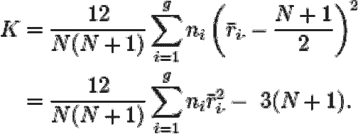
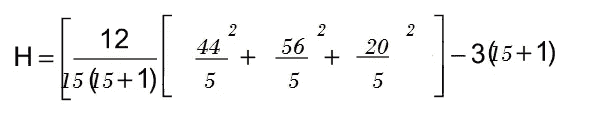

# 克鲁斯卡尔·沃利斯初学者测验

> 原文：<https://towardsdatascience.com/kruskal-wallis-test-for-beginners-4fe9b0333b31>

## 克鲁斯卡尔沃利斯测试:目的，范围，假设，例子，Python 实现


罗马法师在 [Unsplash](https://unsplash.com?utm_source=medium&utm_medium=referral) 上拍摄的照片

# 1.目的

Kruskal Wallis 是一种评估样本是否来自同一分布的非参数方法。它用于两个以上独立或不相关样本的比较。单向方差分析(ANOVA)是 Kruskal-Wallis 检验的参数等价。

## 1.1 什么是好的业务用例？

让我们来衡量一家制药公司推出的一项活动对一种新上市药物的影响，我们有 1550 个目标和 500 个抵制者。我们观察了处方行为分布，发现它是非正态的(偏斜的),但每个组(目标和抵制者)的形状相似。我们不能进行方差分析；因此，我们应用一个非参数检验，克鲁斯卡尔-沃利斯。

# 2.范围

由于 Kruskal Wallis 是非参数检验，因此没有假设数据是正态分布的(与 ANOVA 不同)。

1.  事实上的零假设是样本来源的总体具有相同的中位数。
2.  当有一个属性变量和一个测量变量，并且测量变量不满足方差分析(正态性和同质性)的假设时，最常使用 Kruskal-Wallis 检验
3.  与大多数非参数测试一样，它是对分级数据执行的，因此测量观察值使用整个数据集转换为它们的等级:最小或最低值的等级为 1，下一个最小值的等级为 2，接下来的等级为 3，依此类推。在平局的情况下，考虑平均排名。
4.  *在用等级代替原始值的过程中，信息的损失使得这种检验不如方差分析有效，因此如果数据满足假设*，则应使用方差分析。

克鲁斯卡尔-沃利斯检验的零假设有时被认为是组中值相等。然而，只有当你相信每个群体的分布特征是相同的，这才是准确的。即使中位数相同，如果分布不同，Kruskal-Wallis 检验也可以拒绝零假设。

# 3.假设

可以使用 Kruskal-Wallis 统计来检查不同大小的组。与可比的单向方差分析不同，Kruskal-Wallis 检验不假设正态分布，因为它是非参数程序。然而，该测试假设每个组的分布具有相同的形状和比例，除了中位数的任何变化。

# 4.方法学

Kruskal Wallis 可用于分析试验组和对照组的表现是否不同。当数据是偏斜的(非正态分布)时，测试将告诉两组是否不同，而不建立任何因果关系。它不会暗示行为差异的原因。

## 4.1 测试如何进行？

Kruskal Wallis 从 1(最次要的)开始对所有观察结果进行排序。对所有数据点进行排序，而不管它们属于哪个组。绑定值将获得未绑定时的平均排名。

当根据分析变量(处方数量)为所有观察值分配了带符号的等级后，将根据它们的目标/拒绝状态对它们进行区分/分组。之后，计算并比较每组的平均排名。

由于计划或促销活动是针对这一群体展开的，因此目标群体的平均排名应高于抵制者。由于具有显著的 p 值，Target 的表现优于钉子户。这里的挑战是，在存在离群值的情况下，目标群体的平均排名可能会更高，即很少有医生比其他人写更多的脚本。因此，我们总是查看 Kruskal Wallis 获得的算术中位数和结果 p 值来验证/反驳我们的假设。

设 Ni (i = 1，2，3，4，…，g)代表数据中每个 g 组的样本量(即样本，或者在这种情况下，医生的数量)。ri 是第一组的等级之和，ri’是第一组的平均等级。然后，Kruskal Wallis 检验统计量计算如下:



**配方 1。**说明了计算测试统计的公式。图片由作者使用 Markdown 和 Latex 制作。

如果检验统计量超过阈值卡方值，则拒绝相等总体中位数的零假设。当相等总体的零假设为真时，该统计量具有 k-1 个自由度，并且近似于卡方分布。近似值的 ni 值必须至少为 5(即，一组中至少有 5 个观察值)，才能准确。


**配方二。**说明了测试的 p 值近似值公式。图片由作者使用 Markdown 和 Latex 制作。

使用卡方概率分布表，我们可以得到 g-1 自由度的关键卡方值和期望的显著性水平。或者，我们可以检查 p 值来评价结果的显著性。

## 4.2 手动运行 H 测试

让我们假设一家制药公司想要了解三组医生是否有不同的患者量**(斯蒂芬妮·格伦，未注明)**例如，

关键意见领袖/KOL(一个月的患者量):23、42、55、66、78

专家/专家(一个月的病人数量):45、56、60、70、72

全科医生/全科医生(一个月的病人量):18、30、34、41、44

**4.2.1 将数据组合成一组后，按升序排列**

18 23 24 30 41 42 44 45 55 56 60 66 70 72 78

**4.2.2 对排序后的数据点进行排序。出现平局时使用平均值**

值:18 23 24 30 41 42 44 45 55 56 60 66 70 72 78

排名:1 2 3 4 5 6 7 8 9 10 11 12 13 14 15

**4.2.3 计算各组排名之和**


**图一。**显示每组的排名总和。图片来源——由作者准备。

**4.2.4 使用公式 1 和图 1 中的数字计算 H 统计数据**



**公式 3。**说明了计算我们处方者群体的 H 统计的公式。图片由作者使用 Markdown 和 Latex 制作。

H=6.72

**4.2.5 用
an α=0.05 确定 g-1 自由度的临界卡方值，对于我们的问题(3–1 = 2 自由度)而言，该值应为 5.99。请参考下表。**

  

**4.2.6 将 4.2.4 中的 H 值与 4.2.5 中的临界值进行比较**

如果临界卡方值小于 H 统计量，则应拒绝说明三个不同组的中值患者量相等的零假设。自 5.99(临界值)< 6.72, we can reject the null hypothesis.

There needs to be more evidence to infer that the medians are unequal if the chi-square value is not lower than the H statistic calculated above.

# 5\. Python Implementation

The null hypothesis that all groups’ population medians are equal is tested using the Kruskal-Wallis H-test. It is an ANOVA variant that is non-parametric. The test utilizes two or more independent samples of varying sizes. Note that disproving the null hypothesis does not reveal how the groups differ. To identify which groups are different, post hoc comparisons between the groupings are necessary.

```
from scipy import stats
x = [1, 3, 5, 8, 9, 12, 17]
y = [2, 6, 6, 8, 10, 15, 20, 22]
stats.kruskal(x, y)KruskalResult(statistic=0.7560483870967752, pvalue=0.3845680059797648)print(np.median(x))
print(np.median(y))8.0
9.0print(np.mean(x))
print(np.mean(y))7.86
11.12
```

The output generated by Python is shown above. It should be noted that although a marked difference is observed in the mean of values across the two categories, this difference, when taking the median into account, is insignificant as the p-value is much greater than 5%.

# 6\. Conclusion

Kruskal Wallis test is instrumental when dealing with particularly skewed samples. It can be used widely for a test control group during a campaign rollout or even when performing A/B testing. This is applicable for most industry use cases since each customer has different behavior when dealing with customers in a retail space or doctors in a pharmaceutical landscape. When we look at basket size or patient volume, few customers buy more, whereas few doctors have more patients. Hence for such skewed distribution, it is vital to put a Kruskal Wallis test to check if the behaviors are similar.

# **7。参考**

斯蒂芬妮·格伦。“克鲁斯卡尔·沃利斯 H 检验:定义、例子、假设、SPSS”来自[](https://www.statisticshowto.com/)**:对我们其余人的初步统计！[https://www . statistics show to . com/probability-and-statistics/statistics-definitions/kruskal-Wallis/](https://www.statisticshowto.com/probability-and-statistics/statistics-definitions/kruskal-wallis/)**

**‌**

***关于作者:高级分析专家和管理顾问，帮助公司通过对组织数据的业务、技术和数学的组合找到各种问题的解决方案。一个数据科学爱好者，在这里分享、学习、贡献；可以和我在* [*上联系*](https://www.linkedin.com/in/angel-das-9532bb12a/) *和* [*推特*](https://twitter.com/dasangel07_andy)*；***