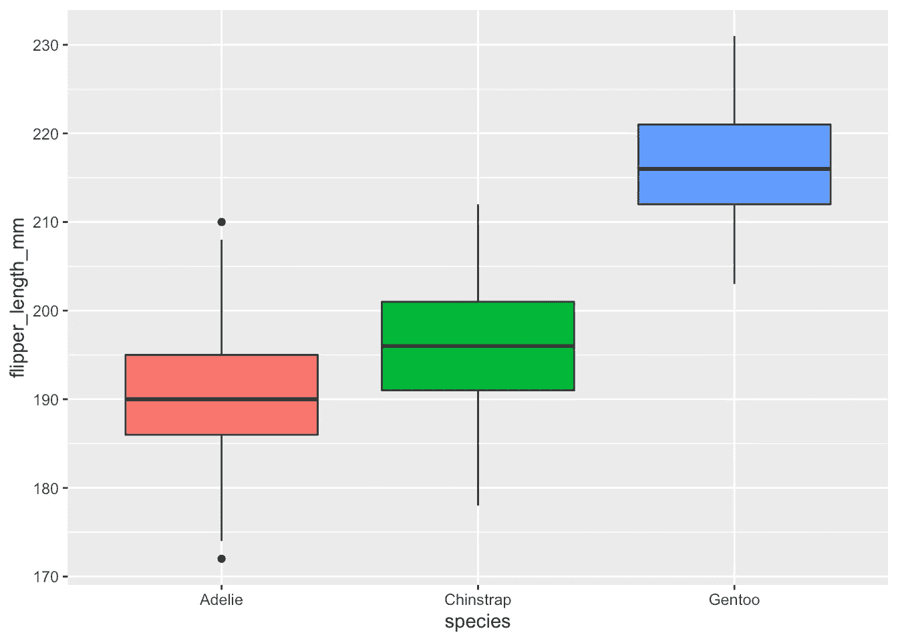
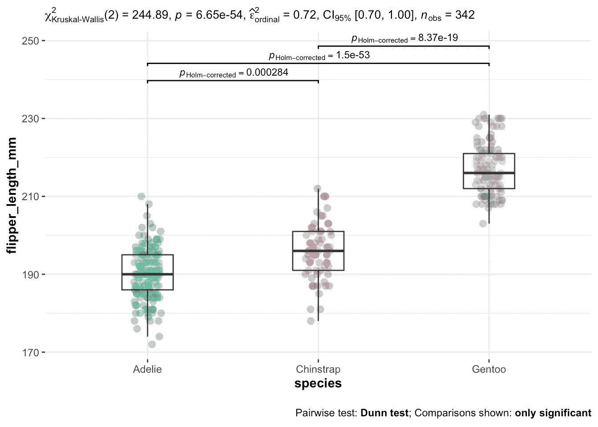

# Kruskal-Wallis 检验，或者方差分析的非参数版本

> 原文：<https://towardsdatascience.com/kruskal-wallis-test-or-the-nonparametric-version-of-the-anova-da3ae6e075ed>

## 学习如何在 R 中执行 Kruskal-Wallis 检验(方差分析的非参数版本),以在非正态假设下比较 3 组或更多组


照片由[内森·杜姆劳](https://unsplash.com/@nate_dumlao?utm_source=medium&utm_medium=referral)

# 介绍

在之前的一篇文章中，我们展示了如何用 R 中的 [ANOVA 来比较三个或更多的组。](https://statsandr.com/blog/anova-in-r/)

请记住，与许多[统计测试](https://statsandr.com/blog/what-statistical-test-should-i-do/)一样，单向 ANOVA 需要满足一些假设，以便能够使用和解释结果。特别是，方差分析要求残差近似遵循[正态分布](https://statsandr.com/blog/do-my-data-follow-a-normal-distribution-a-note-on-the-most-widely-used-distribution-and-how-to-test-for-normality-in-r/)。 [1](https://statsandr.com/blog/kruskal-wallis-test-nonparametric-version-anova/#fn1)

幸运的是，如果不满足正态假设，还有 ANOVA 的非参数版本:Kruskal-Wallis 检验。

在本文的其余部分，我们将展示如何在 R 中执行 Kruskal-Wallis 测试，以及如何解释其结果。我们还将简要说明如何进行事后测试，以及如何在图上直接显示所有必要的统计结果。

# 数据

本文的数据基于`penguins`数据集(众所周知的`iris`数据集的替代物)，可通过`{palmerpenguins}`包访问:

```
# install.packages("palmerpenguins")
library(palmerpenguins)
```

原始数据集包含 3 个不同物种(阿德利企鹅、下巴颏企鹅和巴布亚企鹅)的 344 只企鹅的数据。它包含 8 个变量，但我们在本文中只关注脚蹼长度和物种，所以我们只保留这 2 个变量:

```
library(tidyverse)dat <- penguins %>%
  select(species, flipper_length_mm)
```

(如果不熟悉管道运算符(`%>%`，也可以用`penguins[, c("species", "flipper_length_mm")]`选择变量)。在关于[数据操作](https://statsandr.com/blog/data-manipulation-in-r/)的文章中了解更多选择变量的方法。)

在进行测试之前，按组对整个样本做一些描述性统计总是一个好的做法，这样我们手头的数据就有了一个大致的概述。

```
# entire sample
summary(dat)##       species    flipper_length_mm
##  Adelie   :152   Min.   :172.0    
##  Chinstrap: 68   1st Qu.:190.0    
##  Gentoo   :124   Median :197.0    
##                  Mean   :200.9    
##                  3rd Qu.:213.0    
##                  Max.   :231.0    
##                  NA's   :2# by group
library(doBy)
summaryBy(flipper_length_mm ~ species,
  data = dat,
  FUN = median,
  na.rm = TRUE
)## # A tibble: 3 × 2
##   species   flipper_length_mm.median
##   <fct>                        <dbl>
## 1 Adelie                         190
## 2 Chinstrap                      196
## 3 Gentoo                         216# boxplot by species
ggplot(dat) +
  aes(x = species, y = flipper_length_mm, fill = species) +
  geom_boxplot() +
  theme(legend.position = "none")
```



作者图片

基于箱线图和汇总统计数据，我们已经看到，在我们的[样本](https://statsandr.com/blog/what-is-the-difference-between-population-and-sample/)中，阿德利企鹅似乎有最小的鳍状肢，而巴布亚企鹅似乎有最大的鳍状肢。然而，只有一个可靠的统计测试才能告诉我们是否能对我们的[人口](https://statsandr.com/blog/what-is-the-difference-between-population-and-sample/)推断出这个结论。

# 克鲁斯卡尔-沃利斯试验

# 目标和假设

如前所述，克鲁斯卡尔-沃利斯检验允许比较三组或更多组。更准确地说，它用于根据一个[数量变量](https://statsandr.com/blog/variable-types-and-examples/#quantitative)来比较三个或更多组。这可以看作是对曼恩-惠特尼[检验的扩展，该检验允许在非正态假设下比较两组。](https://statsandr.com/blog/wilcoxon-test-in-r-how-to-compare-2-groups-under-the-non-normality-assumption/)

在我们的例子中，我们将使用 Kruskal-Wallis 测试来帮助我们回答以下问题:“三种企鹅的鳍状肢长度不同吗？”

克鲁斯卡尔-沃利斯检验的无效假设和替代假设是:

*   H0:这三个物种的鳍状肢长度是一样的
*   H1:至少有一个物种和另外两个物种的鳍状肢长度不同

注意，至于方差分析，另一个假设是 ***而不是*** 所有物种的鳍长度都不同。所有物种平等的反面(H0)是至少有一个物种与其他物种不同(H1)。在这个意义上，如果零假设被拒绝，这意味着至少有一个物种不同于其他 2，但不一定是所有 3 个物种彼此不同。可能巴布亚企鹅的鳍状肢长度不同于下颚带企鹅和阿德利企鹅，但是下颚带企鹅和阿德利企鹅的鳍状肢长度相似。必须执行其他类型的测试(称为事后测试，稍后介绍)来测试所有 3 个物种是否不同。

# 假设

首先，Kruskal-Wallis 测试根据定量变量比较了几个组。因此，必须有一个定量因变量(对应于与问题相关的测量值)和一个定性自变量(至少有两个水平来确定要比较的组)。 [2](https://statsandr.com/blog/kruskal-wallis-test-nonparametric-version-anova/#fn2)

其次，记住克鲁斯卡尔-沃利斯检验是非参数检验，所以不需要**正态假设**。然而，**独立性假设仍然成立**。

这意味着从总人口中有代表性的和随机选择的部分收集的数据，在各组之间和每组内部应该是独立的。独立性的假设通常基于实验的设计和对实验条件的良好控制来验证，而不是通过正式的测试。如果你仍然不确定基于实验设计的独立性，问问自己一个观察是否与每个组内或组间的另一个观察相关(如果一个观察对另一个有影响)。如果没有，最有可能是你有独立样本。如果样本之间的观察值(形成不同的待比较组)是相关的(例如，如果三个测量值是在**相同的个体**上收集的，这是医学研究中在测量指标(I)治疗前、(ii)治疗期间和(iii)治疗后)时经常出现的情况)，则应首选弗里德曼测试，以便考虑样本之间的相关性。

关于同方差性(即方差相等):只要使用 Kruskal-Wallis 检验来比较各组，同方差性就不是必需的。如果你想比较中位数，Kruskal-Wallis 检验需要同质性。 [3](https://statsandr.com/blog/kruskal-wallis-test-nonparametric-version-anova/#fn3)

在我们的例子中，假设独立性，我们不需要比较中位数(我们只对比较组感兴趣)，所以我们可以继续如何在 r 中进行测试。注意，正态性假设可能成立，也可能不成立，但对于本文，我们假设满足*而不是*。

# 在 R 中

R 中的 Kruskal-Wallis 检验可以用`kruskal.test()`函数来完成:

```
kruskal.test(flipper_length_mm ~ species,
  data = dat
)## 
##  Kruskal-Wallis rank sum test
## 
## data:  flipper_length_mm by species
## Kruskal-Wallis chi-squared = 244.89, df = 2, p-value < 2.2e-16
```

该输出中最重要的结果是[*p*-值](https://statsandr.com/blog/student-s-t-test-in-r-and-by-hand-how-to-compare-two-groups-under-different-scenarios/#a-note-on-p-value-and-significance-level-alpha)。我们将在下一节展示如何解释它。

# 解释

基于 Kruskal-Wallis 检验，我们拒绝零假设，我们得出结论，至少有一个物种在鳍肢长度方面是不同的(*p*-值< 0.001)。

(*为了便于说明*，如果*p*-值大于显著性水平α = 0.05:我们不能拒绝零假设，因此我们不能拒绝三种企鹅的鳍长度相等的假设。)

# 事后测试

我们刚刚表明，至少有一个物种在鳍状肢长度方面与其他物种不同。尽管如此，克鲁斯卡尔-沃利斯测试的局限性也来了:它没有说明哪一个群体与其他群体不同。

为了了解这一点，我们需要使用其他类型的测试，称为事后测试(在拉丁语中，“在此之后”，因此在获得具有统计意义的 Kruskal-Wallis 结果之后)或多重成对比较测试。对于感兴趣的读者，可以在[这里](https://statsandr.com/blog/anova-in-r/#post-hoc-test)找到更详细的事后测试解释。

重大克鲁斯卡尔-沃利斯测试后最常见的事后测试有:

*   邓恩试验
*   科诺弗试验
*   奈梅尼试验
*   成对 Wilcoxont 检验

邓恩试验是最常见的一种，下面是如何在 R. [4](https://statsandr.com/blog/kruskal-wallis-test-nonparametric-version-anova/#fn4) 中进行试验

# 邓恩试验

```
library(FSA)dunnTest(flipper_length_mm ~ species,
  data = dat,
  method = "holm"
)##           Comparison          Z      P.unadj        P.adj
## 1 Adelie - Chinstrap  -3.629336 2.841509e-04 2.841509e-04
## 2    Adelie - Gentoo -15.476612 4.990733e-54 1.497220e-53
## 3 Chinstrap - Gentoo  -8.931938 4.186100e-19 8.372200e-19
```

感兴趣的是最后一列(调整后的*p*-值，针对多重比较进行了调整)。这些 *p* 值应该与您想要的[显著性水平](https://statsandr.com/blog/student-s-t-test-in-r-and-by-hand-how-to-compare-two-groups-under-different-scenarios/#a-note-on-p-value-and-significance-level-alpha)(通常为 5%)进行比较。

根据输出，我们得出结论:

*   阿德利和下巴颏儿差异显著(p < 0.001)
*   Adelie and Gentoo differ significantly (p < 0.001)
*   Chinstrap and Gentoo differ significantly (p < 0.001)

Therefore, based on the Dunn test, we can now conclude that **所有三个物种的鳍状肢长度都不同**)。

# 统计结果和绘图的组合

在 R 中执行 Kruskal-Wallis 和事后测试的一个非常好的替代方法是使用`{ggstatsplot}`包中的`ggbetweenstats()`函数:

```
library(ggstatsplot)ggbetweenstats(
  data = dat,
  x = species,
  y = flipper_length_mm,
  type = "nonparametric", # ANOVA or Kruskal-Wallis
  plot.type = "box",
  pairwise.comparisons = TRUE,
  pairwise.display = "significant",
  centrality.plotting = FALSE,
  bf.message = FALSE
)
```



作者图片

这种方法的优点是所有必要的统计结果都直接显示在图上。

克鲁斯卡尔-沃利斯试验的结果显示在图上方的副标题中(*p*-值在`p =`之后)。此外，事后测试的结果通过荣誉显示在每个组之间，箱线图允许可视化每个物种的分布。

# 摘要

在这篇文章中，我们回顾了克鲁斯卡尔-沃利斯测试的目的和假设，以及它的基本假设。然后，我们展示了如何在 R 中进行测试，以及如何解释结果。

我们还展示了在重要的 Kruskal-Wallis 测试之后最常见的事后测试 Dunn 测试。

最后但同样重要的是，我们提出了一种简洁的方法来显示分组数据和同一个图上的所有统计结果。

感谢阅读。

和往常一样，如果您有与本文主题相关的问题或建议，请将其添加为评论，以便其他读者可以从讨论中受益。

# 参考

詹姆斯·史蒂文斯，2013 年。*中级统计:现代方法*。劳特利奇。

1.  这是小样本的情况。对于大样本量，不需要正态性(这是一个常见的误解！).根据[中心极限定理](https://en.wikipedia.org/wiki/Central_limit_theorem)，即使数据不是正态分布，大样本的样本均值通常也是正态分布的近似值( [Stevens 2013](https://statsandr.com/blog/kruskal-wallis-test-nonparametric-version-anova/#ref-stevens2013intermediate) )。详见本[注释](https://statsandr.com/blog/anova-in-r/#fn3)。 [↩︎](https://statsandr.com/blog/kruskal-wallis-test-nonparametric-version-anova/#fnref1)
2.  注意，理论上，Kruskal-Wallis 检验也只能用于两组。然而，在实践中，我们对两组使用[曼-惠特尼检验](https://statsandr.com/blog/wilcoxon-test-in-r-how-to-compare-2-groups-under-the-non-normality-assumption/)，对三组或更多组使用克鲁斯卡尔-沃利斯检验。 [↩︎](https://statsandr.com/blog/kruskal-wallis-test-nonparametric-version-anova/#fnref2)
3.  在这篇[文章](https://influentialpoints.com/Training/Kruskal-Wallis_ANOVA_use_and_misuse.htm)中查看更多关于差异的信息。 [↩︎](https://statsandr.com/blog/kruskal-wallis-test-nonparametric-version-anova/#fnref3)
4.  注意还有其他的*p*-值调整方法。更多选项见`?dunnTest`。 [↩︎](https://statsandr.com/blog/kruskal-wallis-test-nonparametric-version-anova/#fnref4)

# 相关文章

*   [手工假设检验](https://statsandr.com/blog/hypothesis-test-by-hand/)
*   [R 中的方差分析](https://statsandr.com/blog/anova-in-r/)
*   [R 中的 Wilcoxon 检验:如何在非正态假设下比较两组](https://statsandr.com/blog/wilcoxon-test-in-r-how-to-compare-2-groups-under-the-non-normality-assumption/)
*   [R 中的相关系数和相关检验](https://statsandr.com/blog/correlation-coefficient-and-correlation-test-in-r/)
*   [一比例和卡方拟合优度检验](https://statsandr.com/blog/one-proportion-and-goodness-of-fit-test-in-r-and-by-hand/)

*原载于 2022 年 3 月 24 日*[*https://statsandr.com*](https://statsandr.com/blog/kruskal-wallis-test-nonparametric-version-anova/)*。*