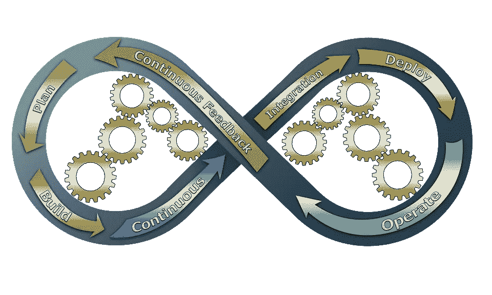
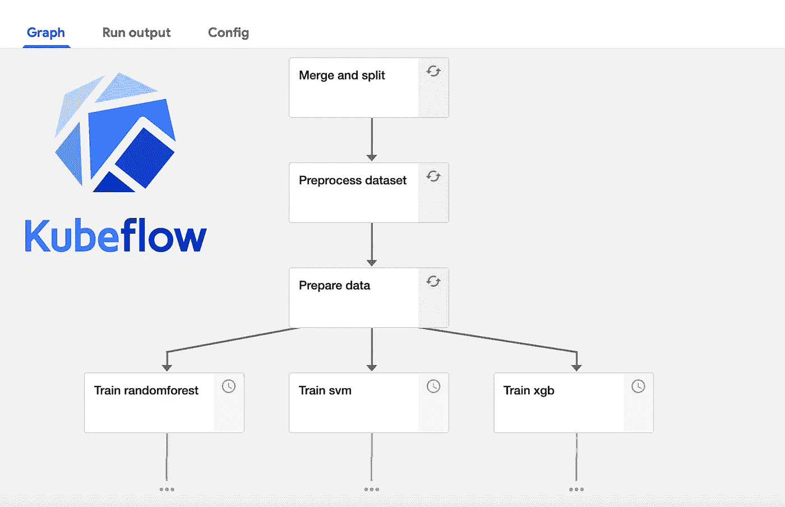
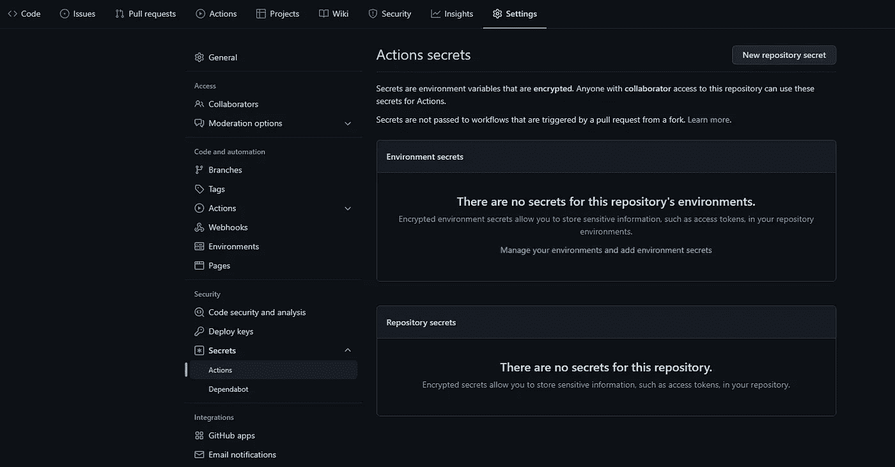
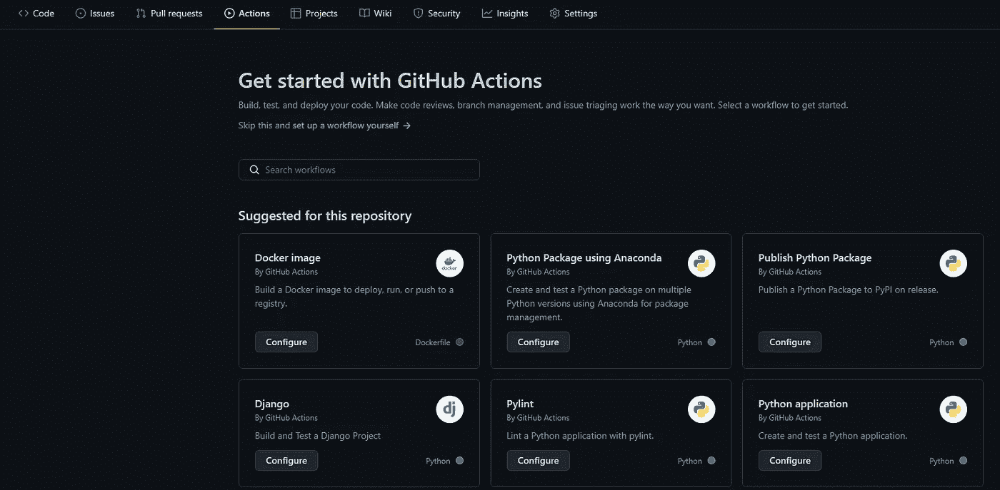

# Kubeflow MLOps:通过 CI / CD / CT 实现自动管道部署

> 原文：<https://towardsdatascience.com/kubeflow-mlops-automatic-pipeline-deployment-with-ci-cd-ct-64aeec46cc33>

## 创建先进的 Kubeflow 管道，并通过持续集成、部署和培训实现其部署和更新的自动化



由 [PCB-Tech](https://pixabay.com/users/pcb-tech-2044000/) 在 [Pixabay](https://pixabay.com/) 拍摄的照片

在我的[上一篇 kubeflow 文章](/tutorial-basic-kubeflow-pipeline-from-scratch-5f0350dc1905)中，我们经历了以下几个必要的步骤来建立一个有效的管道:

*   创建一个 Kuberneter 集群
*   安装 Kubeflow
*   创建容器注册表
*   构建一个容器映像，并将其推送到您的注册表中
*   让 Kubeflow 访问您的 S3 桶
*   用输入和输出工件创建 Kubeflow 组件
*   创建一个 Kubeflow 管道，上传并运行它

如果您已经有一个安装了 Kubeflow 的功能正常的 Kubernetes 集群，您可以直接遵循本指南。如果你不知道，我强烈建议你看看我以前的文章。

这一次，我们将更进一步:

*   制作一个包含预处理、建模、推理和性能评估的高级流水线
*   使用 GitHub 动作执行 CI 和 CD
*   将 GitHub Actions 连接到 Kubeflow 端点，并启动更新后的管道



您将通过本文构建的 Kubeflow 管道。作者图片

# 源数据集和 GitHub 报告

在本文中，我们将使用来自西雅图建筑能源基准的数据，这些数据可以在 [this Kaggle page](https://www.kaggle.com/datasets/city-of-seattle/sea-building-energy-benchmarking) 上找到，并建立一个模型来预测温室效应气体的总排放量，如`TotalGHGEmissions.`栏所示

这个数据集由两个表组成，分别是 2015 年和 2016 年的观测值。我们将把它们储存在一个 S3 桶里，我们的管道将从这个桶里获得资源。如果您遵循了我以前的文章，那么您的 Kubeflow 服务器应该可以访问您的 bucket。

本指南中显示的所有代码都可以在[这个公共库](https://github.com/Anvil-Late/Kubeflow_advanced_pipeline)中找到。

# 高级管道—步骤 1:组件

> ***如果您已经知道如何创建 Kubeflow 组件和管道，可以直接进入本文的“上传管道”一章。***

我们的管道将有以下步骤:

*   合并 2015 年和 2016 年的数据，并将结果分为训练集和测试集
*   数据清理、NaN 填充和特征工程
*   数据预处理和准备
*   模型建筑:SVM、随机森林和 XGBoost
*   评估结果，选择最佳模型，训练并保存它
*   预测

同样，所有这些步骤的代码都可以在我的 repo 的 kf_utils 文件夹中找到，但让我们详细说明其中一个，以便我们可以更好地理解 Kubeflow 的“语法”:

## 这里发生了什么？

我们要做的第一件事是导入描述 op 所需的包，并定义将成为 op 的`evaluate_models()`函数。
结构如下:

```
def function(input_1 : type, input_2 : type, …) -> Output
```

这里，输出是一个命名的元组，您可以在其中声明构成 op 输出的几个元素。这些是您稍后必须在代码中使用的名称，以保存工件。

请注意，对于 csv 文件这样的经典输出，这种简化的结构就足够了:

```
import kfp.components as comp
def function(input_1 : type, input_2 : type, …, 
             csv_output : comp.OutputPath('csv')
```

之后，我们导入这个组件所必需的包，比如 matplotlib。我在第一篇文章中解释了为什么导入是在函数内部而不是之前进行的。
我还定义了我的 easy_bar_plot 函数；注意，一个好的做法是在 repo 内部的一个模块中定义它，但是这里我直接在函数中定义它，以使代码片段具有更好的可读性。

性能和最佳超参数是先前库伯流分量的伪影输出，它们被存储在字典中并被绘制。保存绘图，并根据最佳 R2 分数选择最佳模型。
由于 Kubeflow 还不接受任何类型的绘图作为工件输出，一个变通的解决方案是将绘图上传到 s3 bucket，这就是我们在第 116 和 119 行中所做的。

现在，当我定义函数时，我将输出指定为命名元组:`NamedTuple('Outputs', [('best_model' : str), ('hyperparams' : dict)])`。Kubeflow 将理解我的工件输出由 2 个元素组成，因此期望 op 函数返回 2 个对象。
在第 123 行，我们确实返回了两个对象:
`return (best_model, best_models_hyperparams)`
`best_model`作为第一个返回的对象，它将被匹配到`NamedTuple`的第一个元素，并被 Kubeflow 自动认为是一个字符串。

这里的最后一个代码块使用`create_component_from_func`函数将 python 函数转换为实际的 Kubeflow op，该函数以 yaml 文件的形式，将要转换的函数、输出路径和基本 docker 图像作为参数。在这里，我提供了一个我创建的光公众形象，如果你读了我以前的文章，你现在应该知道如何创建一个。

在我的回购中，我所有的 Kubeflow 组件(他们的。py 文件及其结果。yaml 文件)存储在 kf_utils 目录中。

# 高级管道—步骤 2:从组件到管道

一旦创建了完成上述步骤的所有组件，您就可以创建下面的管道。由于我在上一篇文章中已经谈到了管道创建，所以我不会在这里过多地讨论细节。

我们将把这段代码保存在“管道”目录中。

# 上传管道

我们现在需要将这个管道上传到 Kubeflow。我们将上传的不是 python 文件，而是用 shell 命令创建的编译后的 yaml 文件:

```
dsl-compile --py pipeline/pipeline.py --output pipeline/pipeline.yaml
```

我们现在在“管道”目录中有了管道 yaml。在我的上一篇文章中，我向您展示了如何使用中央仪表板将它上传到 Kubeflow，但是这里我们将从 python 命令中完成。

这就是棘手的地方。连接到 Kubeflow pipelines 管理器的最简单、最不受平台限制的方法是打开一个客户端会话，如下所示:

```
client = kfp.Client(host=host, cookies=cookies)
```

韩国自由党。Client()函数有两个参数，它们是:

*   kubeflow 主机端点应该是这样的:
    `123-isitiosystem-istio-2af2-456.us-west-2.elb.amazonaws.com/pipeline`
    ，这是您的中央仪表板的 URL，后跟`/pipeline`
*   当您使用登录名和密码登录中央控制面板时，存储在浏览器中的身份验证 cookie

您可以在代码中复制并粘贴 cookie 值来打开客户端会话，但这意味着每个人都可以清楚地看到它，而且 cookie 不可避免地会过期。为了弥补这一点，我们将使用 beautiful soup 登录仪表板并检索 cookie。
最后，我们希望使用 GitHub 动作来启动管道——这意味着登录、密码和 URL 可以作为秘密保存，并作为环境变量传递给 python 脚本。因此，我们的管道启动脚本将如下所示:

运行该脚本将创建或更新并启动您的 Kubeflow 管道。请注意，要实现这一点，您需要已经创建了一个 Kubeflow 实验，但这在中央仪表板中很容易做到，并且它们是可重用的。

在我的回购协议中，这个脚本叫做`run_pipeline.py`，在主目录中。

我们现在拥有了实现全自动流程所需的所有工具。

# 自动化—步骤 1:准备 GitHub 秘密

`run_pipeline.py`脚本将使用 4 个秘密值:

*   URL:你的 Kubeflow 服务器 URL，应该是这样的:
    `123-isitiosystem-istio-2af2-456.us-west-2.elb.amazonaws.com`
*   端点:kubeflow 主机端点，看起来应该是这样的:
    `123-isitiosystem-istio-2af2-456.us-west-2.elb.amazonaws.com/pipeline`
*   电子邮件和密码:您的 Kubeflow Dashboard Center 日志

进入 GitHub repo，进入设置，然后进入密码:



GitHub 行动秘密。作者图片

从那里，添加您的秘密。我们分别称之为 KBFL_URL、KBFL_ENDPOINT、KBFL_LOGIN、KBFL_PASSWORD。

# 自动化—步骤 2:设置 GitHub 操作

点击“行动”。您应该在此页面上显示建议的操作。选择其中任何一个，例如名为“Python 应用程序”的应用程序，然后单击“配置”。



GitHub 操作主页。作者图片

在下面的配置窗口中，用以下代码替换 yaml 代码:

这个动作做什么在主分支上的每个提交或合并请求上，GitHub 动作将创建一个环境，安装 python 及其依赖项，安装 kfp，用`dsl-compile`重建管道，并使用从 GitHub secrets 导入的适当环境变量启动`run_pipeline.py`脚本。

在构建所有这些资产时，GitHub actions 将执行 CI / CD 步骤，Kubeflow 管道中的任何不一致将在`dsl-compile`步骤中被检测到，并返回一个错误。

如果要实现连续训练(CT)，可以将`run_pipeline.py`脚本中的`client.run_pipeline()`调用改为`client.create_recurring_run()`。

现在你知道了！当您需要修改管道的任何组件时，您可以创建一个分支，修改组件，运行组件脚本以重新创建 op，提交并创建一个合并请求。GitHub 将重新创建和上传管道，并在 Kubeflow 上发布，这都是自动化的。

# 后续步骤

就 MLOps 良好实践而言，这里的自动化并不是真正的 CD 和 CT，但是您现在已经拥有了完成这项工作的所有必要工具。

从那里开始，下一步将是只有一个模型定期用`client.create_recurring_run()`重新培训，这将使我们刚刚建立的您的培训管道。
然后，您应该创建一个推理管道，该管道只加载模型并进行预测，这将允许您设置另一种类型的循环(或按需)运行，而不必每次都重新训练模型。最后，您还应该有一个监视管道，当它检测到模型性能下降时，就会触发训练管道。
您还可以在您的 CD 中添加一个性能标准，这样您的 GitHub 操作只有在新添加的特性提高了模型的性能时才会成功。