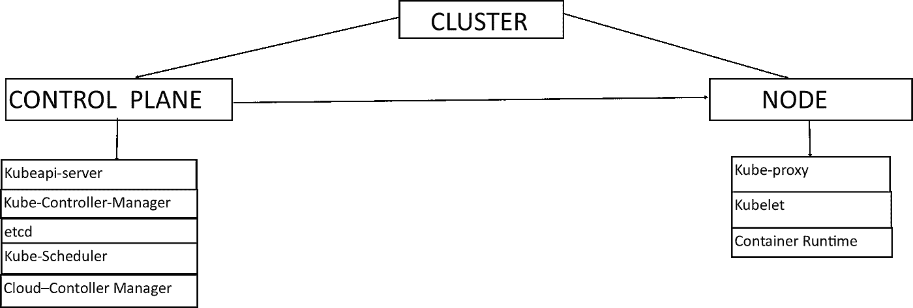
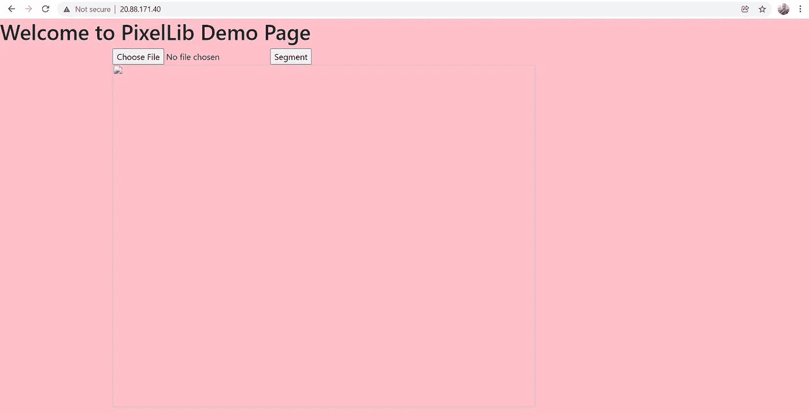
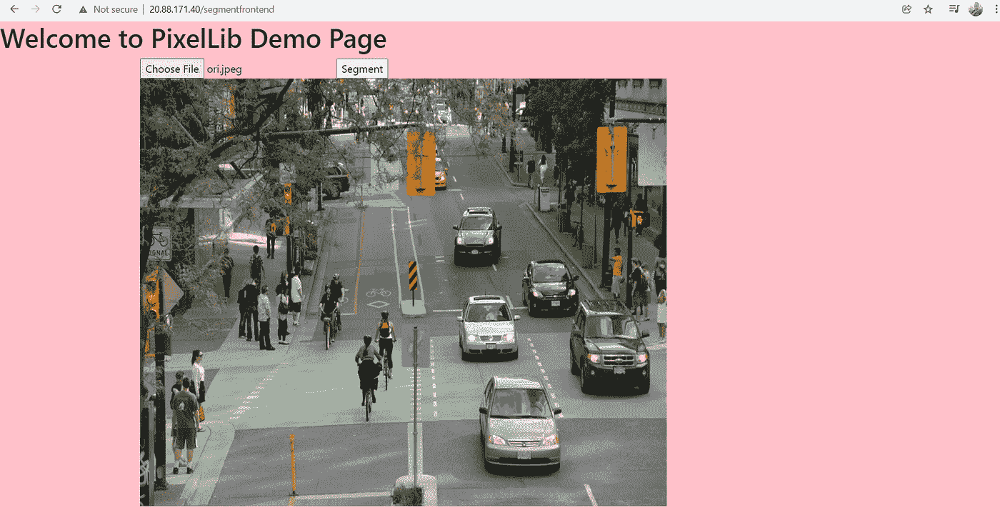
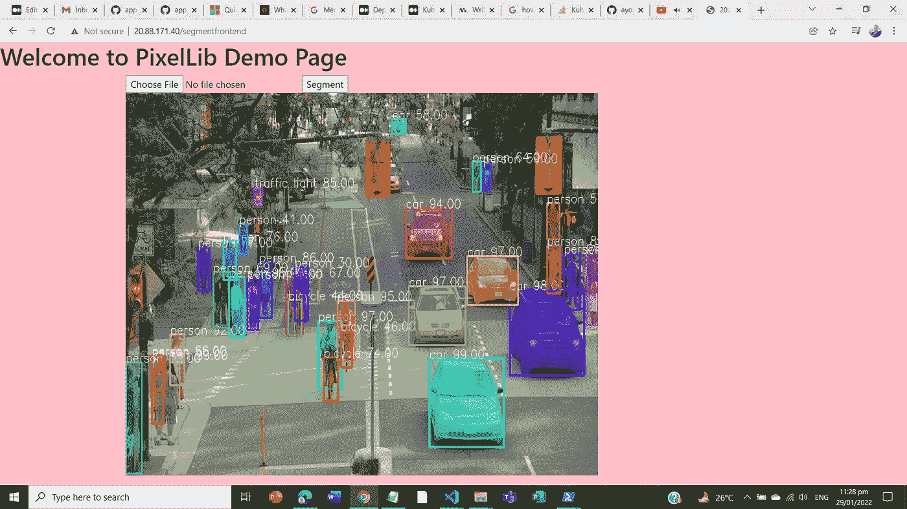
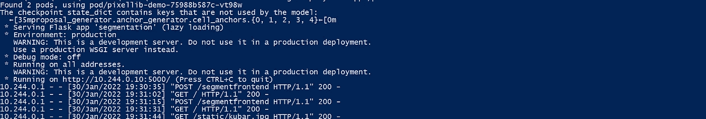

# Kubernetes 在云中部署机器学习 Rest API

> 原文：<https://towardsdatascience.com/kubernetes-deployment-of-a-machine-learning-rest-api-in-the-cloud-447debf6fb5c>

## 关于 Kubernetes 概念基础以及如何在 Azure Kubernetes 服务上设置机器学习 Rest API 的分步指南


[来源](https://pixabay.com/photos/container-storage-trade-haulage-4203677/)

## **什么是 Kubernetes？**

为生产部署创建可扩展的 DevOps 管道需要支持多个日常部署、超大规模扩展和软件应用监控。Kubernetes 是一个强大的 DevOps 工具，用于实现可伸缩的软件应用程序部署。Kubernetes 是一个工具，用于自动部署一个应用程序的多个实例，扩展、更新和监控部署的健康状况。Kubernetes 通过**容器编排**来完成这些。

## **什么是容器编排？**

它是容器化应用程序的多个实例的部署、扩展、管理和监控的自动化。

> **注:**在本教程中，我们将和 Kubernetes 一起讨论 ***docker 容器编排*** 。

## 目录

**1** [**Kubernetes 安装**](http://medium.com/p/447debf6fb5c/#5d76)

**2** [**Kubernetes 关键概念**](http://medium.com/p/447debf6fb5c/#8126)

**3**[**Kubernetes 部署的概念**](http://medium.com/p/447debf6fb5c/#9ffc)

**4** [**在** **Azure Kubernetes 服务**](http://medium.com/p/447debf6fb5c/#5f90) 上设置机器学习应用的分步指南

## Kubernetes 装置

Kubectl :这是用于管理 Kubernetes 的命令行工具，用户通过它与 Kubernetes 集群通信。我们使用 ***Kubectl*** 将命令传递给 Kubernetes 集群。在本文的后面部分，我将描述 Kubernetes 集群及其组件。

**在 Linux 上安装 Kubectl**

<https://kubernetes.io/docs/tasks/tools/install-kubectl-linux/>  

**在 Windows 上安装 ku bectl**

<https://kubernetes.io/docs/tasks/tools/install-kubectl-windows/>  

**在 MacOS 上安装 Kubectl**

<https://kubernetes.io/docs/tasks/tools/install-kubectl-macos/>  

## Kubernetes 的关键概念

Kubernetes 中有很多令人困惑的概念，对于初学者来说理解起来非常困难。在本教程中，我将阐述 Kubernetes 的基本概念，并解释如何在 Azure cloud 中使用 Kubernetes 执行逐步部署。



作者照片

此图展示了 Kubernetes 集群及其组件。它显示了一个具有单个节点和一个控制平面的群集。

Kubernetes 集群:它是服务器的组合，这些服务器相互作用以实现容器编排。Kubernetes 集群服务器有两种主要类型:

*   ***控制平面*** 和
*   ***节点***

**控制平面:**这是充当 Kubernetes 集群大脑的服务器。它控制集群内的活动。控制平面由使其能够在集群内执行控制的组件组成。控制平面组件包括以下内容:

*   **Kubeapi-server** :这是 ***控制平面*** 的组件，作为向集群发送指令的媒介或路径。命令通过 ***kubectl*** 命令行工具通过***kube API-server***传递到集群。
*   **Kube-Controller-Manager**:控制 ***控制平面*** 中主要活动的组件。它执行用户从集群的*传递到***kube API-server***的指令。它控制诸如部署、扩展和监控集群中部署的容器的健康状况之类的活动。*
*   ***etcd** :这是 ***控制平面*** 的组件，为 Kubernetes 集群存储数据。可以在其中找到有关集群中部署的信息。*
*   ***Kube-Scheduler** :这是 ***控制平面*** 的组件，用于调度 Kubernetes 集群中的活动。*
*   ***云控制器管理器**:这是 ***控制平面*** 的组件，管理云中的部署。***Cloud-controller-manager***是在 Azure、AWS、Google 云平台等云服务中用于 Kubernetes 集群部署的组件。*

***节点:**这是服务器，作为运行容器化应用程序的工作机。一个 Kubernetes 集群可以有多个节点，但是在本教程中，我们将把我们的示例限制在单个节点的 Kubernetes 集群。*

*节点组件包括以下内容:*

*   ***Kube-Proxy** :这是 ***节点*** 的组件，处理 Kubernetes 集群的网络任务。它管理网络服务，使得访问在 ***节点*** 中运行的容器化应用成为可能。*
*   ***Kubelet** :这是作为 Kubernetes 集群的 ***节点*** 和 ***控制平面*** 之间的通路的组件。 ***节点*** 通过 ***kubelet*** 与 ***控制平面*** 中的活动进行交互。*
*   ***容器运行时** : 这是将要在 Kubernetes 集群中部署的容器的运行时。使用的容器运行时是 ***Docker*** 。*

## *Kubernetes 部署的概念*

*在 Kubernetes 中部署应用程序时，需要考虑一些重要的概念。这些概念是:*

*   *分离舱*
*   *服务*
*   *部署*

***吊舱:**它们是由一组共享存储和网络资源的一个或多个类似容器产生的可部署单元。Docker 容器在 Kubernetes 集群的 ***节点*** 中的 pods 内进行编排(部署、扩展和监控)。*

***服务**:它是一个网络接口，可以与 pod 中运行的容器进行交互。Kubernetes 中有不同类型的服务，但在本文中，我将讨论两种主要的服务类型:*

*   ***负载平衡器**:这是一种允许用户从集群外部访问 pod 中正在运行的容器的服务。它向外界公开了 Kubernetes 集群中的应用程序。它使用户能够与部署的 Kubernetes 应用程序进行交互。 ***负载平衡器*** 确保与 Kubernetes 集群中运行的应用程序的互联网连接。*
*   *集群 IP:这是一种允许集群内部交互或连接的服务类型。该服务将 pods 中运行的容器连接到 Kubernetes 集群中的数据库系统。*

***Deployment** :它是 Kubernetes 中的一个资源对象，处理包含容器化应用程序的 pod 的创建、容器的多个实例的伸缩、容器化应用程序的健康监控、容器化应用程序更新的推出和回滚。*

## *Azure Cloud 中的 Kubernetes 部署(云中的机器学习应用程序部署)*

*我已经在 docker hub 上为 ***PixelLib* (** 我为执行图像中的对象分割而构建的库)发布了一个 docker 图像。这个 docker 图像将被部署为一个机器学习应用程序，用于在 Azure Kubernetes 服务上检测图像中的对象。*

*创建一个免费的 azure 帐户:我们需要一个 Azure 帐户，以便能够在 Azure 上创建服务。当你创建一个 azure 帐户时，你将在第一个月免费使用 azure 服务。*

*<https://azure.microsoft.com/en-us/free/>  

**安装 Azure CLI:** 我们需要 ***azure cli*** 这是在 Azure 账号上创建服务并与之交互的命令行工具。Azure cli 使得在 Azure 帐户上创建服务和与服务通信变得非常方便。

按照以下教程中的说明安装 azure cli:

<https://docs.microsoft.com/en-us/cli/azure/install-azure-cli>  

**使用 Azure CLI 连接到 Azure:**当 ***azure cli*** 成功安装后，在命令行工具中使用此命令登录到您的 Azure 帐户。

```
az login
```

**创建资源组:**azure 中的资源组充当将在 azure 上托管的其他服务的主机。这是一种将许多服务组合在一起的方法。使用此命令在 ***azure cli*** 上创建一个资源组。

```
az group create --name resgroup --location eastus
```

资源组将在不到一分钟的时间内创建，这将是所创建的资源组的输出 json。

```
{
  "id": "/subscriptions/<guid>/resourceGroups/resgroup",
  "location": "eastus",
  "managedBy": null,
  "name": "resgroup",
  "properties": {
    "provisioningState": "Succeeded"
  },
  "tags": null
}
```

**创建 Azure Kubernetes 服务:**使用以下命令使用 ***azure cli*** 创建 Azure Kubernetes 服务:

```
az aks create --resource-group resgroup --name deploymentcluster --node-count 1 --enable-addons monitoring --generate-ssh-keys
```

**注意:**您可以从创建 Azure Kubernetes 服务的命令中观察到，我们使用了之前创建的名为 ***resgroup*** 的资源组来创建 Kubernetes 集群。我们指定要创建的集群的名称为***deployment cluster***，并将 ***节点计数*** 指定为 1。**Kubernetes 集群的创建需要一些时间。创建后，它将返回一个关于集群的长 json 格式的信息。**

****连接到 Azure 上的 Kubernetes 集群:**我们将使用这个命令创建 Kubernetes 集群并连接到它**。****

```
**az aks get-credentials --resource-group resroup --name deploymentCluster**
```

**连接后，它会显示以下输出:**

```
**Merged "deploymentcluster" as current context in C:\Users\<pathtokubenetesconfiglocation>**
```

**它合并了来自 Azure 的 Kubernetes 集群，作为 Kubernetes 的当前上下文。Kubernetes 上下文是用于访问 Kubernetes 集群的配置。***deployment cluster***是使用的配置集群。**

****Kubernetes 部署代码****

****逐步部署代码分解****

*   ****apiVersion** :我们定义了部署的 api 版本为 ***apps/v1* 。****
*   ****种类**:设置为 ***展开*** 。**
*   ****元数据**:包含部署的信息。我们将部署的名称设置为***pixellib-demo***。**
*   ****spec** :它包含了整个部署和将要创建的 pod 的规范的完整列表。**
*   ****spec.replicas** :我们定义了 pod 的数量，并将其设置为 2。这意味着我们的应用程序将有两个实例在运行。**
*   ****spec . selector . matchlabels**:选择 ***部署中使用的 pod，*** 使用 pod 标签****app:pixellib-pod***。***
*   ****spec.template.metadata** :我们为 pod 定义元数据。**spec . template . metadata . name**为 pod 指定一个名称，即 ***pixellib-pod*** 。**spec . template . metadata . labels s**指定 pod 的标签，即***app:pixellib-pod***使部署可以选择带有该标签的 pod。我们稍后将定义的服务也将使用该标签来选择 pod。**
*   **spec . template . spec . containers:我们为容器化的应用程序定义规范。**spec . template . containers . name**指定将从 docker 图像创建的容器的名称，该图像被命名为***pixellib-container***。**spec . template . containers . image**指定将从其创建 docker 容器的图像，所使用的图像是 docker hub 上发布的 docker 图像 I，名称为***ayoolaolaofenwa/pixellibapi***。**spec . template . containers . imagepullpolicy**设置为 ***IfNotPresent，***that*指定如果图像不可用，则应拉取或下载图像。**spec . template . containers . ports . container port**指定容器端口，该端口必须与所使用的 docker 映像中暴露的端口相匹配，它是 ***5000*** 。***

****创建 Kubernetes 部署****

**在部署文件所在的文件夹中打开命令行，输入命令使用 **kubectl 创建部署。****

```
**kubectl apply -f app_deployment.ymldeployment.apps/pixellib-demo created**
```

**这是创建部署时的输出:***pixellib-demo***是 yaml 文件中为部署指定的名称。**

****检查创建的 pod:**在 yaml 文件中，我们将 pod 的数量设置为 2，将有两个 pod(同一个应用程序的两个实例)。您可以使用以下命令检查窗格的状态:**

```
**kubectl get podsNAME                            READY  STATUS    RESTARTS     AGE
pixellib-demo-676bdf6cf9-7vh2    0/1   Container      0      10s       
                                       Creating     
pixellib-demo-676bdf6cf9-9mvz2   0/1  Container       0       10s       
                                      Creating**
```

**这将是刚刚创建部署时 pod 的状态。我们可以看到，pod 的状态是***container creating***(它仍然在拉 docker 图像，当图像被拉时，将从图像创建一个容器)并且 pod 的年龄是 10s(它是在 pod 被创建后的 10 秒)。pod 中的容器将在几分钟或几秒钟内创建，这取决于您的互联网连接速度。**

```
**NAME                            READY  STATUS    RESTARTS     AGE
pixellib-demo-676bdf6cf9-7vh2    1/1   Running     0         70s       

pixellib-demo-676bdf6cf9-9mvz2   1/1   Running     0         70s** 
```

**pod 已准备好，容器已创建并正在运行。pod 的状态变为 ***运行*** 。**

****Pods 运行失败时该怎么办:**如果收到错误 ***ImagePullBackOff，*** it 表示 yaml 文件中指定的 docker 映像不存在。**

```
**NAME                     READY      STATUS         RESTARTS      AGE
pixellib-demo-676-7j2c2     0/1    ImagePullBackOff  0           10s**
```

**您可以使用以下命令检查其中一个窗格以了解问题所在:**

```
**kubectl describe pod pixellib-demo-676bdf6cf9-7vh2**
```

**此命令将显示 pod 未能完成的原因。**

****为部署创建服务:**我们已经成功创建了一个部署，我们需要创建一个 Kubernetes 服务来访问集群中运行的应用程序。**

**【Kubernetes 服务创建代码**

****一步一步服务创建代码分解****

*   ****apiVersion** :我们为服务定义了 api 版本，即 ***v1* 。****
*   ****种类:**我们将种类定义为 ***服务*。****
*   ****元数据:**我们指定服务的名称为***pixellib-Service***。**
*   **我们为将要创建的服务定义规范。**
*   ****spec.type:** 我们将服务类型定义为 ***LoadBalancer、*** ，这将使我们能够从外部访问 pod 内运行的应用。**
*   ****spec.ports:** 我们定义服务中使用的端口。我们将端口 ***80*** 映射到正在运行的容器的目标端口的端口 ***5000*** 。**
*   ****spec.selector:** 我们从部署中指定将使用名为***app:pixellib-pod***的服务的 pod。**

****创建 Kubernetes 服务****

**在服务 yaml 文件所在的文件夹中打开命令行，输入命令使用 **kubectl 创建服务。****

```
**kubectl apply -f app_service.ymlservice/deploy-service created**
```

**这是创建服务时的输出:***pixellib-Service***是 yaml 文件中为服务指定的名称。**

****访问 Kubernetes 部署:**使用这个命令访问在 Kubernetes 集群的 pods 中运行的机器学习应用程序。**

```
**kubectl get service pixellib-service**
```

**我们获得了我们为 pixellib 应用程序部署创建的服务***pixellib-服务*** 。这将是输出:**

```
**NAME             TYPE         CLUSTER-IP   EXTERNAL-IP  PORT(S) 
pixellib-service LoadBalancer 10.0.7.173   20.88.171.40 80:30832/TCP** 
```

****注意:**在输出中，我们有 ***外部 ip*** ，这是使我们能够访问在集群内运行的应用的 ip 地址。在这种情况下，ip 地址是**20.88.171.40*。*** 这个 ip 地址作为 restapi 接口，供我们访问集群中运行的应用程序，执行对象的分割。我们可以在代码中粘贴 ip 地址并执行对象检测。**

****样本图像****

****

**[来源](https://unsplash.com/photos/GKCMEI3rMKE)**

****测试代码****

****输出****

```
**{'boxes': [[145, 119, 282, 457], [162, 273, 261, 512], [238, 283, 398, 387], [442, 321, 496, 350], [411, 219, 422, 242], [31, 316, 51, 356], [352, 217, 366,243], [272, 264, 291, 317], [274, 241, 368, 306], [277, 233, 369, 309], [377, 307, 405, 350], [0, 157, 65, 563], [468, 301, 497, 328], [49, 307, 73, 328]],'class_ids': [0, 1, 2, 2, 9, 2, 9, 0, 5, 7, 2, 2, 7, 2], 'class_names': ['person', 'bicycle', 'car', 'car', 'traffic light', 'car', 'traffic light', 'person', 'bus', 'truck', 'car', 'car', 'truck', 'car'], 'mask_shape': [580, 498, 14],'object_counts': {'bicycle': 1, 'bus': 1, 'car': 6, 'person': 2, 'traffic light': 2, 'truck': 2},'scores': [99, 99, 99, 99, 97, 94, 90, 67, 65, 47, 47, 44, 37, 36]}**
```

**输出包括关于图像中检测到的对象的许多细节，包括**框坐标值、类 id、类名、对象计数、分割掩模形状**和**预测分数**。我们已经成功地在 Kubernetes 集群中运行了一个图像分割应用程序。**

****图像分割前端 API:** 如果你在浏览器中粘贴 ip 地址***20.88.171.40***，它会加载一个简单的 web API 来执行对象分割。**

****

**作者照片**

****

**作者照片**

**您可以选择任意一幅图像，按下*按钮，它将在几秒钟内显示一幅输出的分割图像。***

****

**作者照片**

****记录 Kubernetes 部署:**如果在 Kubernetes 部署中加载应用程序时遇到错误，可以使用以下命令轻松调试部署:**

```
**kubectl logs deployment.apps/<name of your deployment>**
```

**示例:**

```
**kubectl logs deployment.apps/pixellib-demo**
```

****

**作者照片**

**它将生成应用程序运行的报告。它生成在集群的 pod 内部运行的 flask 应用程序的日志。我们的应用程序运行良好，没有任何错误，如果有任何错误，我们可以很容易地从日志报告中观察到错误。**

****删除 Kubernetes 部署:****

**使用这个命令可以很容易地删除 Kubernetes 部署，**

```
**kubectl delete -n default deployment pixellib-demo**
```

****删除 Kubernetes 服务:****

**使用这个命令可以很容易地删除 Kubernetes 服务，**

```
**kubectl delete -n default service pixellib-service**
```

****删除 Kubernetes 集群****

**您可以使用这个 azure cli 命令轻松删除用于部署的 Kubernetes 集群。**

```
**az aks delete --name deploymentcluster --resource-group resgroup**
```

****删除 Azure 资源组****

**使用此 azure cli 命令删除 azure 资源组。**

```
**az group delete -n resgroup**
```

## **结论**

**我们在本文中详细讨论了 Kubernetes、Kubernetes 集群的基本概念，以及其组件如何工作。我们还描述了 Kubernetes 部署的基础，并给出了如何在 azure cloud 中设置机器学习 rest API 的 Kubernetes 部署的分步指南。**

****访问 PixelLibAPI github 库:****

**<https://github.com/ayoolaolafenwa/PixelLibAPI>  

**注意:**阅读我在 docker 上的文章，在那里我解释了 docker 的基础知识以及如何将机器学习 Rest API docker 化。

</docker-in-pieces-353525ec39b0>  

**通过以下方式联系我:**

电子邮件:[olafenwaayoola@gmail.com](https://mail.google.com/mail/u/0/#inbox)

Linkedin: [阿尤拉·奥拉芬娃](https://www.linkedin.com/in/ayoola-olafenwa-003b901a9/)

推特: [@AyoolaOlafenwa](https://twitter.com/AyoolaOlafenwa)***