# Kubernetes Ingress 解释道

> 原文：<https://towardsdatascience.com/kubernetes-ingress-explained-1aeadb30f273>

## TLS 证书入口实用介绍


图片来源: [Pixabay](https://pixabay.com/photos/maze-graphic-render-labyrinth-2264/)

根据 Kubernetes 官方文档:

> 入口将来自群集外部的 HTTP 和 HTTPS 路由暴露给群集中的服务。流量路由由入口资源上定义的规则控制。

简单地说，入口充当 Kubernetes 集群中部署的服务和外部用户或客户端之间某种形式的受控流量路由链接。

让我们用一个更简单的例子来说明这一点。让我们想象一下，Medium 上的所有文章都部署在某个集群上，其中每个发布本质上都是一个 Kubernetes 部署。所有这些部署都有一个附带的服务(*网络的行话*)，它带有一些 IP 地址和端口号，以便读者可以访问文章。如果没有入口这样的东西，读者将不得不给这些原始的网址，这肯定不是人类友好的。例如，您不知道正在阅读本文的本地 IP 和端口。就是不实用。相反，您可以简单地在 Kubernetes 集群中部署一个入口，并为每个出版物提供一个具有各种路由规则的人性化单点入口'`***medium[dot]com***`'，以便读者可以从浏览器访问'`***medium[dot]com/publication1***`'，入口控制器会自动将该流量定向到正确的服务以及包含该出版物所请求资源的随附 pod。现在，让我们在之前的文章 中创建的集群 [**中尝试一些入口部署。**](/embracing-kubernetes-for-machine-learning-setup-1-3-51c02686edfb)

我们将设置一些额外的配置，通过 TLS 证书启用 HTTPS 支持，测试这种 HTTPS 支持，最后在集群上从头开始部署一个简单的应用程序。

## 需要额外设置

*   [**mkcert**](https://github.com/FiloSottile/mkcert) —一个用于制作本地可信开发证书的工具，该证书将为在我们的集群上运行的服务启用`*https*`。安装完成后，让我们生成一个本地证书，该证书指向一些开发 URL 以及一个通配符 URL `***.**myminikube.demo`,它将通过以下两个命令用于入口设置:

```
**mkcert -install****mkcert "*.myminikube.demo" localhost 127.0.0.1**
```

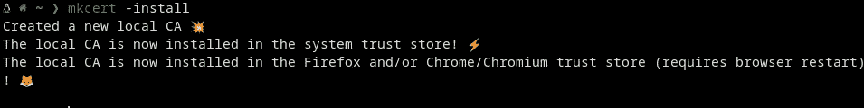

mkcert 安装(图片来源:作者)

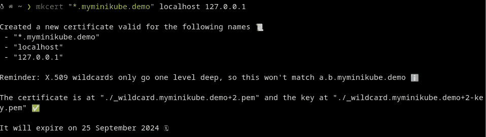

生成 TLS 证书(图片来源:作者)

保存好这个 TLS 证书和密钥(两个**)。pem** 文件)放在你想要的任何目录中，并从中创建一个 Kubernetes 秘密。通过`kubectl`为这篇文章创建了一个名为`**mkcert-tls-secret**`的秘密:

```
**kubectl create secret -n kube-system tls mkcert-tls-secret --cert=**<DIRECTORY_CONTAINING_PEM>/_wildcard.myminikube.demo+2.pem **--key=**<DIRECTORY_CONTAINING_KEY_PEM>/_wildcard.myminikube.demo+2-key.pem
```

> 注意:这两个文件的名字会因系统而异，但是这个概念仍然适用。同样在生产环境中，证书通常由证书管理器自动管理。例如，这个生成的证书将于 2024 年到期。

现在，让我们通过使用位于`kube-system`名称空间中的`mkcert-tls-secret`重新配置该证书，将它集成到 ingress 插件中:

```
$ **minikube addons configure ingress**
-- Enter custom cert(format is "namespace/secret"): **kube-system/****mkcert-tls-secret**
✅  ingress was successfully configured
```

禁用当前 ingress 加载项，然后再次启用它以使更改生效:

```
$ **minikube addons disable ingress**
🌑  "The 'ingress' addon is disabled

$ **minikube addons enable ingress**
🔎  Verifying ingress addon...
🌟  The 'ingress' addon is enabled
```

最后，让我们验证入口控制器现在有一个默认的 SSL 证书

```
**kubectl -n ingress-nginx get deployment ingress-nginx-controller -o yaml | grep "kube-system"**
```

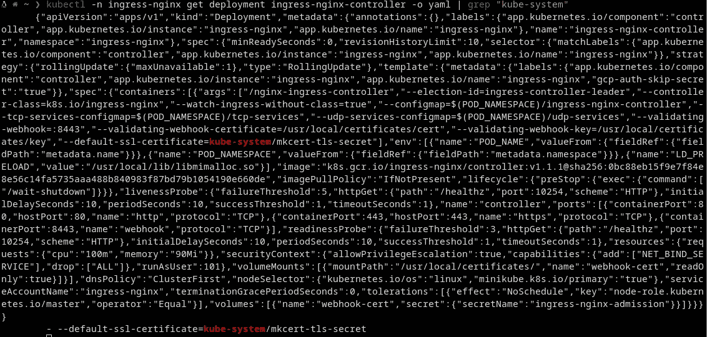

检查部署的 SSL 证书(图片来源:作者)

现在，您应该看到这个秘密名称(上面设置的)是默认的 SSL 证书

*   **使用 Minikube IP 和入口路由编辑 hosts 文件** : Hosts 文件现在需要使用为我们即将部署的入口预留的任何所需 URL 进行更新。因为我们使用了通配符选项，所以通过这种主机格式`**<SERVICE>**.myminikube.demo`，我们有无限的入口部署选项。*对于云提供商来说，这种入口设计选择也非常经济高效，因为您需要为每个负载平衡 URL 付费，但在我们的案例中，1 个 URL 可以用于不限数量的入口。*我们将测试 Ingress waters，为我们在上一篇文章中启用的日志和仪表板附加服务设置一个，最后为实际应用设置一个。使用`sudo`权限编辑主机文件地址，使用您的`**minikube ip**`地址，后跟所需的入口主机名`**hello.myminikube.demo dashboard.myminikube.demo logs.myminikube.demo**` **:**

```
**sudo vi /etc/hosts
cat /etc/hosts**
```

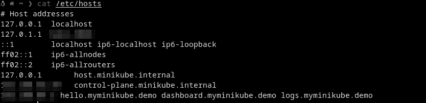

更新的主机文件(图片来源:作者)

无聊的准备工作终于结束了。让我们也用我们新的 TLS 证书体验一下入口部署的乐趣。

## 使用 HTTPS 证书测试部署

入口只是充当集群外部的客户端和集群中运行的服务之间的路由链接。因此，人们可以在脑海中想象一个入口和位于 Kubernetes 服务之上的东西。我们的计划是在之前的文章中启用这两个插件后，测试日志和仪表板服务的两个入口部署。唯一的问题是，这些服务运行在两个不同的名称空间中(本质上是隔离的环境)。 ***让入口为不同名称空间中的服务工作的技巧是在每个名称空间中都有一个入口*** *。*如果仪表板和日志服务在同一个名称空间中，那么一个入口文件就足够了。让我们通过以下方式从这些服务中获取一些重要的元数据:

```
**minikube service list**
```

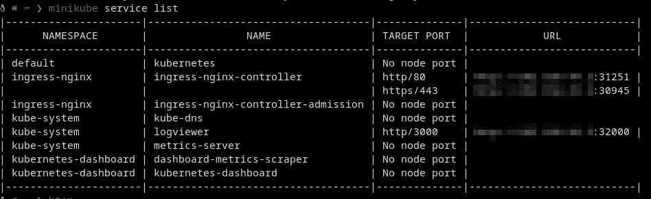

集群中运行的服务列表(图片来源:作者)

日志服务在`kube-system`中，而仪表板服务在`kubernetes-dashboard`中。现在从这两个服务中获取所需的元数据:

```
**kubectl get services -n kubernetes-dashboard --output=wide
kubectl get services -n kube-system --output=wide**
```

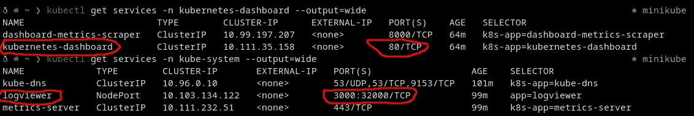

用 kubectl 检查服务(图片来源:作者)

从这些命令中，注意服务的`NAME`和`PORT(S)`。仪表板服务名为`kubernetes-dashboard`，运行在集群内的端口`80`上，而日志服务名为`logviewer`，运行在端口`3000`上。现在，让我们最后写入口 yaml 文件。

从我的经历来看，大多数人看到一堆`.yaml`文件，变得如此不知所措。你不需要记住语法之类的东西。VS 代码 中的 [**Kubernetes 扩展为每个 Kubernetes 组件提供了一些精彩的片段。打开一个`.yaml`文件，开始输入类似`ingress`的组件，一个代码片段应该会弹出来。用一个`tab`接受它，你应该有一个好的入口模板。**](https://marketplace.visualstudio.com/items?itemName=ms-kubernetes-tools.vscode-kubernetes-tools)

日志服务的入口组成如下:

让我们快速浏览一下添加到初始模板中的关键组件。

*   ***注释:*** `kubernetes.io/ingress.class: “nginx”`只是将`nginx`设置为入口控制器，而`nginx.ingress.Kubernetes.io/ssl-redirect`使用相同的 SSL 证书为该入口启用重定向。
*   ***名称和命名空间:*** 入口的名称是用 Kubernetes 中的典型约定设置的`name-<component>`。所以`logs-ingress`用于演示。还指定了`namespace`,因此 Kubernetes 将知道部署入口的名称空间。
*   ***spec:*** 启用 HTTPS 就像参照托管 TLS 证书的`secretName` ( `mkcert-tls-secret`)在`spec`部分下的`tls`子部分中指定所需的主机名(`logs.myminikube.demo`)一样简单。
*   ***主持人:*** 规则小节是路由魔术发生的地方。这是 HTTP 路径和集群中运行的相关后端服务的链接位置。在 HTTP 路径`logs.minikube.demo/`上，我们链接前面提到的运行在端口`3000`上的`logviewer`服务。

> 差不多就是这样。您将在 Kubernetes 的世界中读到的`.yaml`文件的大部分都是样板代码，所以不要被它们所影响！

下面仪表板的入口文件看起来与日志文件相同，唯一的区别是后端服务(`kubernetes-dashboard`)、规则主机(`dashboard.myminikube.demo`)和端口号(`80`)。

有了我们定义的入口配置和整齐打包的`.yaml`文件，`kubetcl`可以应用它们来实现定义的更改。只需通过以下方式申请:

```
**kubectl apply -f dashboard_ingress.yaml && \ kubectl apply -f logs_ingress.yaml**
```

根据您的系统和资源，部署的入口可能需要几秒或几分钟才能完全运行，因为入口控制器必须为该部署分配一个 IP 地址，URL 才能工作。只需使用`kubectl`检查几次，直到您看到分配的 IP 地址:

```
**kubectl get ingress -n kubernetes-dashboard
kubectl get ingress -n kube-system**
```

分配 IP 地址后，我们就可以开始访问部署中定义的主机了。


用 kubectl 检查入口(图片来源:作者)

然而，我更喜欢用 bash 脚本自动执行这个“*等待分配 IP 的*序列:

该脚本可重复用于检查任何名称空间中的任何入口，并在 IP 正常工作时返回该入口的 URL:

```
**sh check_ingress.sh "ingress-demo"
sh check_ingress.sh "kubernetes-dashboard"**
```

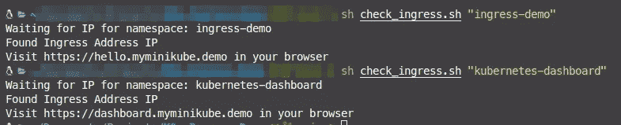

检查 IP 地址的 Bash 脚本(图片来源:作者)

仪表板入口应在`[https://dashboard.myminikube.demo](https://dashboard.myminikube.demo)`可用。在浏览器中访问该 URL，您应该会看到带有 HTTPS 证书的典型 Kubernetes 仪表板

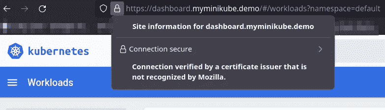

HTTPS 检查仪表板入口(图片来源:作者)

使用相同的 HTTPS 证书，应在`[https://logs.myminikube.demo](https://logs.myminikube.demo)`上提供相同的日志入口。

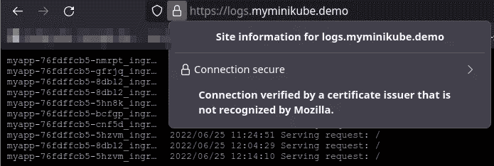

HTTPS 检查日志入口(图片来源:作者)

我们现在可以确认 TLS 证书按预期工作，入侵也可以利用它们。现在，从零开始快速部署流行的 hello world 容器应用程序怎么样？

## 使用 HTTPS 部署 Hello World 应用程序

让我们首先为这个部署创建一个名称空间文件，以保持一切都是独立的。这很简单，因为:

需要记住的一点是，在名称空间可以被其他组件调用之前，它需要是可用的，所以顺序对于`namespaces`很重要。应用文件以实现更改:

```
**kubectl apply -f hello_namespace.yaml**
```

接下来，让我们创建一个部署文件:

您可以看到这个名为`myapp`的部署所使用的名称空间。在此部署中，我们指定希望运行应用程序的 10 个副本(拷贝)。这个数字是任意的。容器映像`gcr.io/google-samples/hello-app:1.0`在设置了一些资源限制的情况下使用。端口`8000`被这个容器使用。应用文件以创建展开:

```
**kubectl apply -f hello_deployment.yaml**
```

pods 运行该应用程序的 10 个副本，这些副本在集群内部运行，让我们在部署之上构建一个服务，以便客户端可以从集群外部与正在运行的应用程序进行交互。上面配置了一个`NodePort`服务，目标是内部`8000`端口，并在同一个端口`8000`上向用户公开该端口。将该服务与 kubectl 一起应用，它将被分配一个我们本可以使用的 IP 地址，但我们不希望这样，因为我们可以有一个漂亮而真实的 URL:

```
**kubectl apply -f hello_service.yaml**
```

最后，我们为这个服务构建了一个入口，这样来自集群外的客户端对`**hello.myminikube.demo**`的任何调用都将被重定向到上面定义的服务！还记得我们正在运行 10 个副本吗？入口控制器将自动处理我们正在运行的 10 个副本中的 1 个的请求流。现在想象一下，如果有 10，000 份拷贝分发给 1，000 名不同的工人！太疯狂了，不是吗？

应用这个入口并使用`check_ingress` bash 脚本来检查分配的 IP 的可用性:

```
**kubectl apply -f hello_ingress.yaml**
```

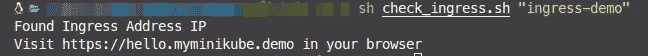

使用 bash 脚本检查 IP(图片来源:作者)

一旦分配，访问给定的 URL(`https://hello.myminikube.demo`)，你应该会看到一个`Hello, world!`消息以及应用程序的`Version`和一个`Hostname`

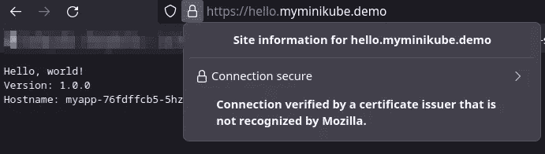

使用 TLS 证书的 Hello world 应用程序(图片来源:作者)

刷新页面几次，并在每次页面刷新时注意`Hostname`的最后部分。该值应该最多更改 10 个唯一的值，代表我们在集群中运行应用程序的 10 个副本容器。

```
**curl** [**https://hello.myminikube.demo**](https://hello.myminikube.demo)
```

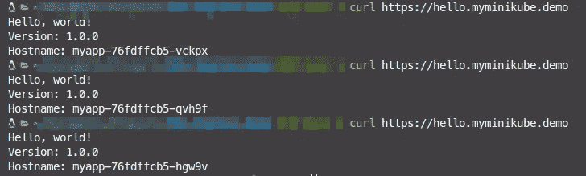

通过“curl”向应用程序发出多个 Get 请求(图片来源:作者)

恭喜你！现在，您有望对 Kubernetes Ingress 有足够的了解，开始在您的项目中使用它们。不要忘记通过删除它们来清理部署，以便为其他更重要的部署节省资源。

删除所有的资源非常容易，因为我们将所有的东西都隔离在一个名称空间中。只需运行:

```
**kubectl delete namespaces ingress-demo   **                                              
namespace "ingress-demo" deleted
```

已经创建了一个 [**GitHub 库**](https://github.com/PyDataBlog/K8s-Ingress-Demo) ，其中包含了本文使用的所有脚本，以供将来参考和扩展。玩得开心点！在下一篇文章之前，继续探索 Kubernetes 的世界。