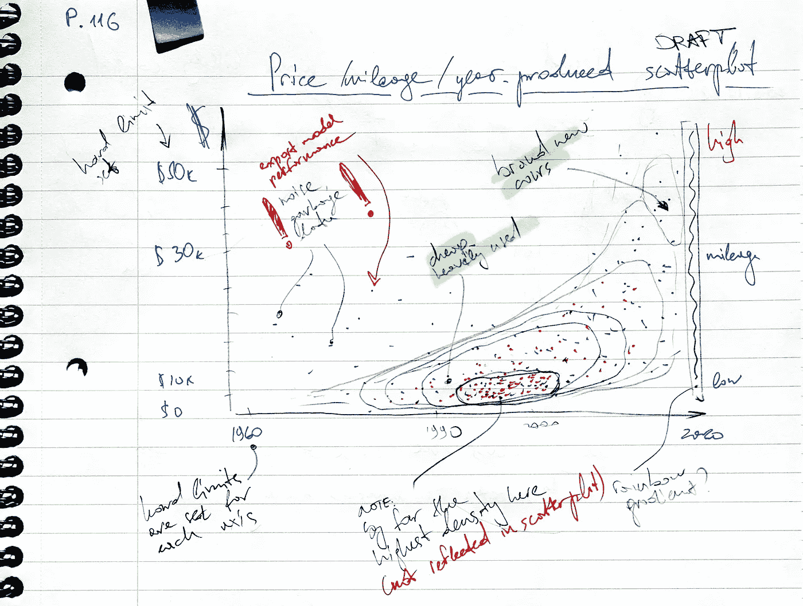
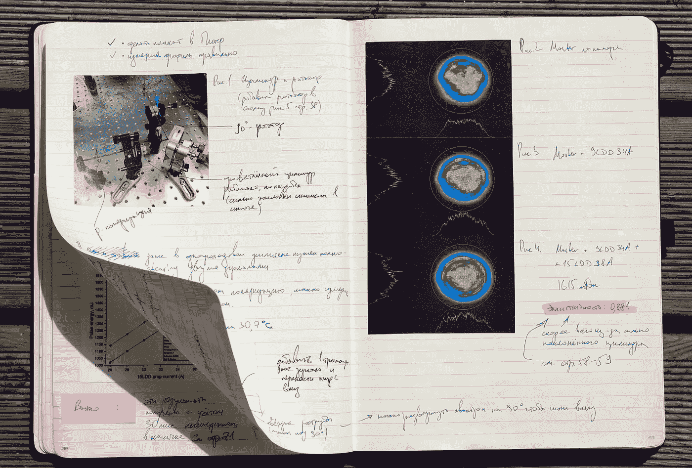
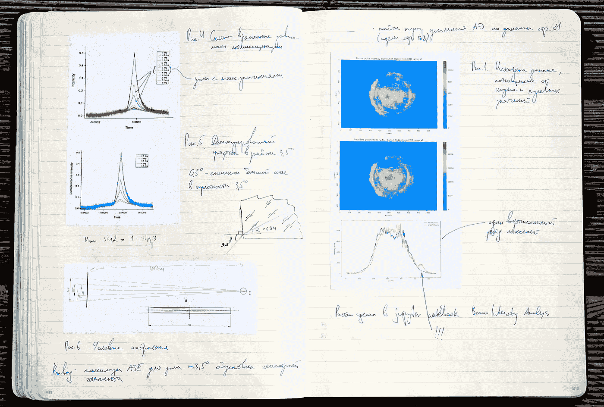
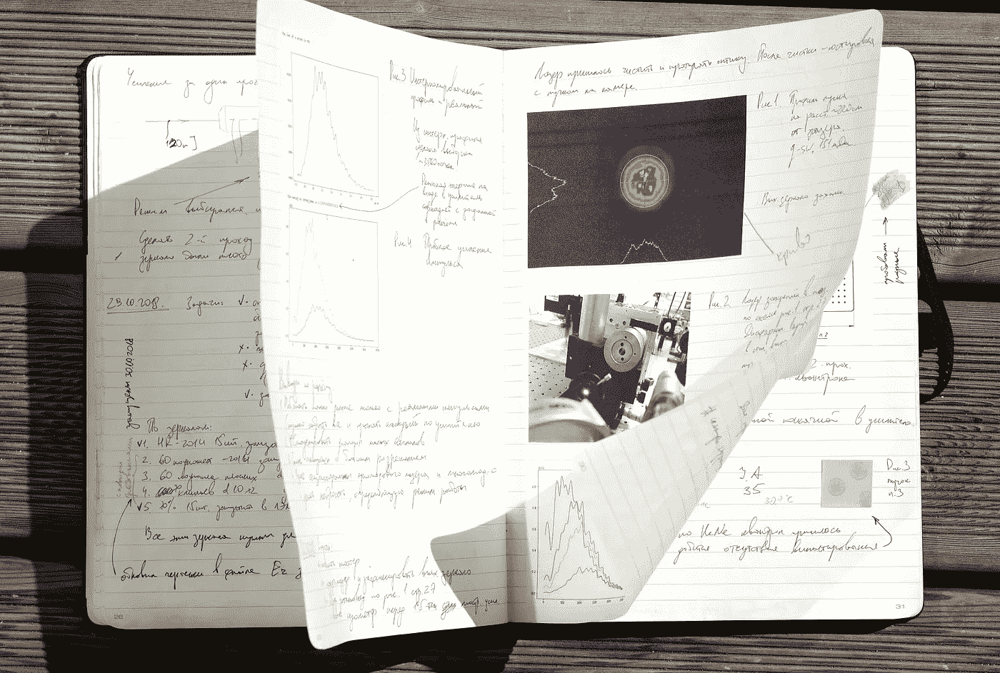
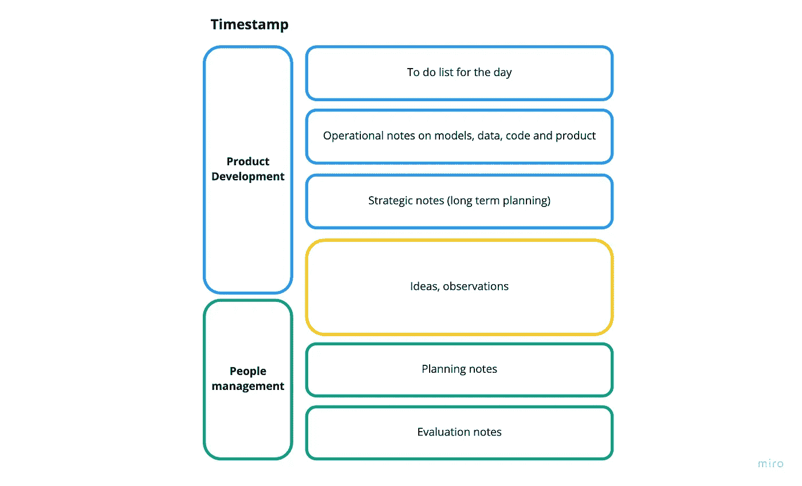
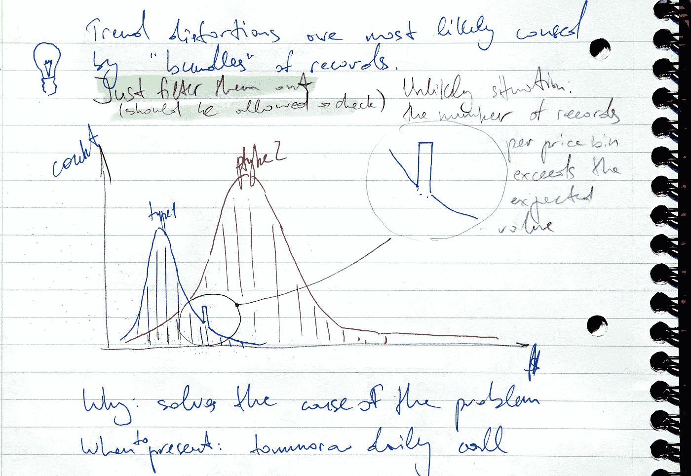
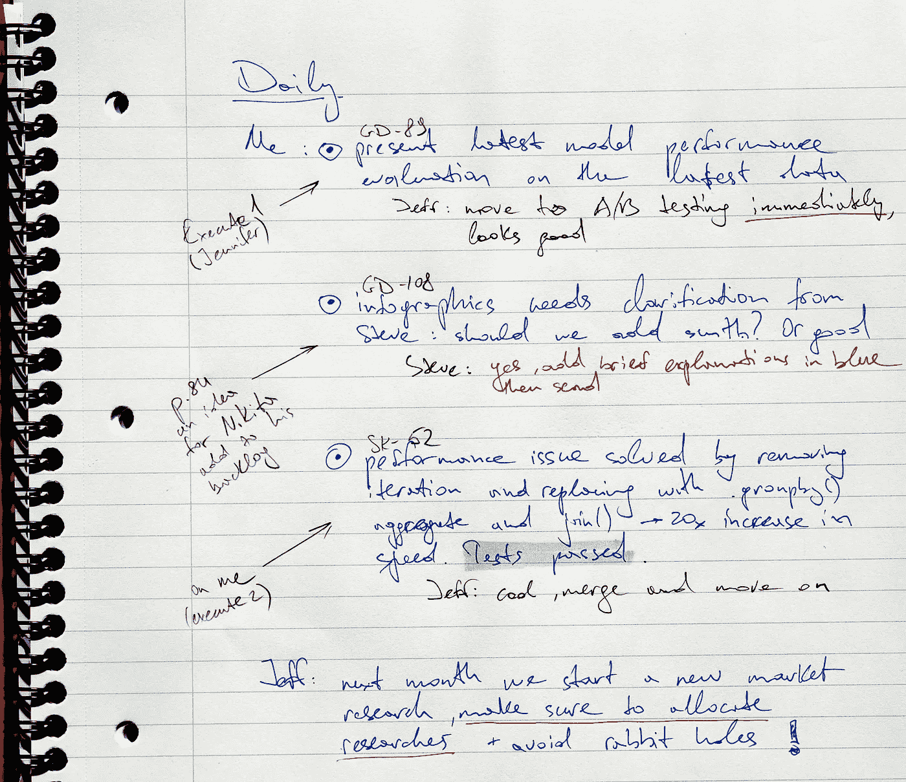

# 实验室笔记本是数据科学从业者的首选武器

> 原文：<https://towardsdatascience.com/lab-notebook-as-a-weapon-of-choice-for-a-data-science-practitioner-3ce9c89e3c05>

## 我的一套有效记笔记的规则和原则，以实验笔记本的形式

作者图片

作为一名拥有超过 7 年实验室经验的数据科学从业者和物理学家，我发现一些传统的学术实践非常适合现代数据科学工作流。

> O 这些实践之一是有一个适当的组织和结构**实验室笔记本**。

在这篇文章中，我将分享我个人对坚持使用它的看法。

## 我为什么要关心实验笔记本？

只要科学本身存在，实验室笔记本就已经存在很久了。一个[实验室笔记本](https://en.wikipedia.org/wiki/Lab_notebook)可以被定义为一个研究人员的原始记录。它用于记录假设、实验以及对这些实验的初步分析或解释(见下图)。

简单来说，实验室笔记本就是记录你的研究工作、想法、观察和活动的笔记本。然而，有些指导方针可能会因组织而异，你可以查看麻省理工学院建议的[。](https://web.mit.edu/me-ugoffice/communication/labnotebooks.pdf)

作者图片

你可能会问，为什么现在还有人会为实验笔记本烦恼呢？

现在，在 2022 年，我们有大量用于常规笔记、任务/项目管理和协作的花哨的通用解决方案:吉拉、Confluence、Slack 和虚拟白板(Miro)等等。

作为数据科学家，我们有一整套自己的数字工具来执行和跟踪实验(Comet、MLflow、Neptune、SageMaker Studio 等。).

这些广泛使用的解决方案中的大多数都非常适合解决日常数据科学工作流中的特定问题，并且它们中的每一个都提供了一组独特的功能。结合起来，这些工具似乎涵盖了我所有的商业数据科学需求。但只是第一眼。

有了所有这些工具，我最依赖的工具(实际上是过去 12 年的大部分时间)是我的**实验室笔记本**。

这需要一点解释。

## 我在做激光物理研究时如何使用我的实验室笔记本

我从事应用激光物理已经 7 年了，我的实验室笔记本总的来说一直是整个多维度研究和工作流程的中坚力量。

我习惯在早上的第一件事就是喝杯咖啡，通读我过去几周的记录。对我来说，一个典型的研究日需要 2 到 4 页白纸，上面写满图像和文本(如下图所示)。

我的一本实验笔记本的第 98–99 页

在处理一个特定问题时，我通常有多种类型的活动:设计实验、进行测量、进行探索性数据分析、运行数值模拟、撰写科学文章等。

每项活动都是以一种非常特殊的方式计划和跟踪的，这种方式对我来说是最好的长期服务方式。

我会把我的笔记分成五类:

1.  一天的简要计划(待办事项、重要会议/演示/实验)
2.  实验计划和跟踪(大部分是高层次的，但在需要时是详细的)
3.  实验数据分析和解释
4.  关键问题、见解和想法
5.  回顾展

五种类型的笔记实际上是很多的，但对我来说这是最起码的必要条件，因为作为一名应用物理从业者，你不可避免地要戴上许多帽子，而且你的大多数活动都不是琐碎的和容易解释的。

我的实验室笔记本

很多这样的活动会立即让你处于某种压力和紧张之中:使用不熟悉的工具操作，努力解释现象，对下一步行动步骤的不确定性，等等。

对我来说，处理这种压力的一个方法是把信息和结果仔细地放在笔记本上，把问题框起来，写下来，把问题分解成可行的步骤，然后开始一步一步地检查。

通过在实验室笔记本上做笔记，我一直试图保持简洁，但确保我的写作/绘图质量到位。我的意思是质量不是指书写工整和选择漂亮的图片，而是确保我花时间和精力仔细思考每一行。

不要误解我，我花了半天时间编写软件(用 Python 和 Wolfram Mathematica)，处理数十亿字节的数据，可视化数据，并撰写文章——所有这些都使用了几十种数字工具。

但我的实验室笔记本一直高于一切——监督每一项活动，指导我度过研究生活，并允许我克服不确定性。

> *关于模拟与数字的旁注:我用过* ***模拟*** *笔记本，因为我习惯于画图表，自由书写，然后在上面画，等等。在那个时候，没有办法在不丧失通用性的情况下用数字技术来做这件事。如今有了更多的无纸选择，但这不是本文所要讨论的。*
> 
> *在我看来，实验室笔记本是一个* ***框架*** *用于高度结构化的技术笔记结合日志实践。数字与模拟——其实并不重要。*

随着时间的推移，我意识到我的实验室笔记本一方面成了技术知识库，另一方面成了个人研究日记。

我从坚持使用实验笔记本中获得的好处是如此之大，以至于我甚至在离开激光物理学后仍坚持这个习惯。

## 这一切如何转化为我的日常数据科学实践

自从我离开学院以来，实验室笔记本在我工作生活中的角色已经发生了变化，但它仍然是我工具箱中非常重要的一部分。

我的笔记本进化了

作为一名数据科学从业者和团队经理，如今我做了很多与数据有关的事情来实现业务目标——我编程、执行探索性数据分析、管理项目、管理团队、会见产品所有者和利益相关者以及开发数据产品。

这是令人兴奋的，但我已经设法适应了紧张的工作量，并利用我在学校的学术实践保持了高效率。

我仍然以一种特别结构化的实验室笔记本方式保存我的每日记录。当然，我不再插入激光束形状，也不再记录激光物理实验，但我确实会使用一组更新的类别写下想法、想法和观察结果(见下文)。

我用来跟踪我的数据科学工作的类别

再一次，有了我可以使用的所有数字工具，实验室笔记本变成了一个知识库，一个日记，一个素描本，它位于所有其他工具之上，指导我完成我的工作。

以这种方式保存记录的原因，以及我所遵循的具体指导原则，我试图制定为一套规则/原则:

## 原因 1:记录你的想法——蹩脚的和优秀的

对我个人来说，数据科学家的角色是一个创造性的角色。尤其是在产品开发领域——在我看来，这是关于新鲜的想法和创造性的解决问题。

我总是用实验室笔记本来做我的头脑风暴。不是那种你只是产生大量荒谬的东西的头脑风暴，而是对实际可行的东西进行深入和持续的创造性思考。

因此，第一个原因是:保持和培养你的想法。把东西写下来。写下问题、想法和想法。我们人类的大脑不善于将思想长时间保留在身边。

> 想法是非常脆弱的，想法是不可预测的，你什么时候会有想法，会有多少想法。乔纳森·伊夫

仔细记录想法可以让你以一种真正深刻的方式重复、重新评估和思考它们。

*实验室笔记本让我能够从最早期阶段(最脆弱的阶段)到蓬勃发展的实施阶段小心翼翼地发展想法，而不会偏离正题。*

作者图片

**如何做**:我在用灯泡图标记录听起来可能很有趣的想法。有时，我需要花几天时间来重申一个想法，重新制定，添加细节，在这种情况下，我使用原始记录引用(页码)将最新的迭代链接到前一个迭代。

## 原因 2:跟踪你周围发生的事情

正如 Steven S. Skiena 在他的[数据科学设计手册](https://link.springer.com/book/10.1007/978-3-319-55444-0)中所写的:

> 然而，数据科学的核心在于做好简单的事情:理解应用领域，清理和集成相关数据源，并向他人清楚地展示您的结果

以我的经验，我怎么强调良好的沟通都不为过，尤其是在与领域专家打交道的时候。

在我看来，不仅认真倾听很重要，而且对业务方面发生的事情保持全面的警惕和关注也很重要。

尤其是当你管理项目、与利益相关者谈判、产生产品想法的时候——你有责任观察你周围的环境，并将每一点信息提炼成关键的观察结果。

**如何做:**我做这件事的方法很简单:每当我参与谈话时，我都会进入一种专注的模式，认真倾听，如果需要，要求澄清，然后在实验笔记本上把关键的观察/见解改写成几个句子。

在会议准备过程中，我会创建我计划涵盖的要点，然后插入对每个要点的反馈:

作者图片

缺点是——你必须积极倾听并集中注意力，这很难，但好处要大得多——随着时间的推移，它会给人留下一种印象，即你不仅关心他人的看法，而且没有什么会逃过你的注意(这是一件好事)。

当然，没有笔记本你也能做到，但是手里拿着笔开会，专心听，把输入的信息消化成关键的观察结果，为这些活动设置了一个坚实的协议。

如果我不能积极地倾听，我宁愿重新安排一次会议，而不是仅仅为了出席而参加。

## 原因 3:一个完美的习惯

对我来说，在实验室笔记本上记录我的工作成了一个有效的*基本习惯。*

> 基本习惯是一个人操作的常规和实践。它们标志着你所做的事情的基本水平，不需要任何意志力或说服力。默认。不管是积极的还是消极的，这些习惯都会对你在生活和工作中所做的一切产生连锁反应。([福布斯文章](https://www.forbes.com/sites/jodiecook/2021/01/11/fix-your-keystone-habits-to-transform-your-life/?sh=2d183ab46b06))

不管你正在处理的问题有多复杂，不管所有其他的情况和混乱，通过重读你的进展和想法来开始你的工作的习惯为一天定下了基调。对我来说，运行实验室笔记本创造了一种动力，我可以用它来建立和推动事情向前发展。

**如何做:**喝杯咖啡，通读过去 3-4 天的记录，开始一天的工作。给当天打上时间戳，制定当天的高级计划，开始考虑执行细节并从那里开始，至少对我来说是这样。

## 原因 4:跟踪你的个人进步和成长

不要拿自己和别人比较——拿自己和过去的自己比较，是的，我们已经听过很多次了，但是说起来容易做起来难。

有了一个合适的实验室笔记本，这也是一个个人的*工作日志*，你自己的进步将是显而易见的，你不应该低估这一招的威力(这甚至是一招吗？).

*只要通读几页，你就会看到技能、问题理解和问题解决能力的增长。*

作为一名研究人员，当你经历困难时期时，这一点尤为重要:实验笔记本将永远证明你已经远离了起点。

对我来说有用的是每三个月写一份目标清单。3 个月后，我拿起实验笔记本的一两页做一个回顾:我参考目标设定页，检查希望进展顺利和不顺利的地方。

## 原因 5:有战略眼光

实验笔记本促使你变得有战略眼光——它只是迫使你富有成效地思考并采取行动，因为否则你会失去动力。

战略本身很难定义，但我喜欢罗杰·马丁的定义:

> 战略是一套综合的选择，它以一种你能赢的方式把你定位在你选择的竞技场上。通常，如果你只是工作而没有留下时间标记的记录和想法，随着时间的推移，你的大脑可以很容易地替代你的记忆，扭曲事件的真实顺序，并把一切都放入一个更方便和可解释的，但却是错误的观点中。

然而，对于实验笔记本，你不允许这种情况发生。

首先，因为笔记本是永久装订的，所以你不能只是把书页撕掉，然后插入新的(你的大脑可能很容易用记忆做到这一点)。

其次，如果你在相当长的时间内对研究和工作做出了糟糕的选择，并记录下来，对结果的不利影响会变得如此明显，以至于令人震惊。

*所以，很自然的，笔记本只是强迫你想长远，有战略眼光。*

**如何做:**遵循协议——每 3 个月设定一次目标，并进行回顾——所有这些都记在同一个笔记本上。你在这 90 天中的日常事务将决定你是成功还是失败。

## 原因 6:非理性和戏剧性

嗯，这确实是有争议的和主观的，但我发现有一个合适的笔记本有点戏剧性。

不仅现在和过去的伟大科学家有实验笔记本，探险家也有。嗯，在这一点上你可能会说，船长有航海日志，北极研究人员有日记(我建议通读罗伯特·福尔肯·斯科特的日记)，但是我把这些不同种类的笔记本归入一个家庭。

当我在实验室的笔记本上写字时，我会想起过去和现在那些冒着生命危险到达未知地方的勇敢的人们。

**如今，我们大多数人都在极其安全的环境中工作，是的，但是对你的研究进行详细的、日志式的记录有一种无形的戏剧性。**

我对自己说的是，是的，我不是第一个登上北极的人类，也不是宇航员，但我也会去未知的地方，越过栅栏眺望。

我很喜欢当自己探险队队长的感觉。

**如何:**我在这里给不出什么具体的建议，而不是找一些能以好的方式激励你的事情，定下正确的基调。

## 结论

总结一下:对我来说，实验室笔记本是一个技术日志，同时也是一个日记，一个发生在我所能支配的一切之上的工具。Lab notebook 为跟踪想法、召开会议、解决问题和日常工作制定了规则和协议。

在我看来，在商业数据科学领域做任何长期项目时，拥有一个合适的实验室笔记本都是必不可少的:它有助于成为一个更好的倾听者，进行更深入的思考，进行战略性规划，并产生真正的影响。

作为奖励，你得到一本美丽的日记，讲述了一个独特的解决问题的故事，一个研磨和成长的故事。

就是这样，感谢阅读，好奇想听听大家的想法。