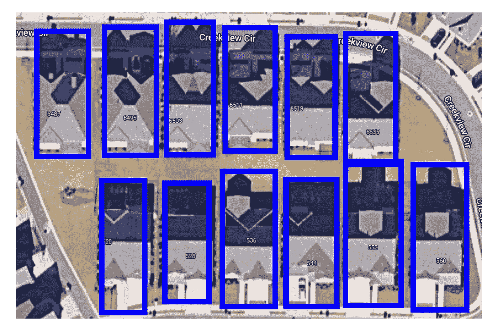
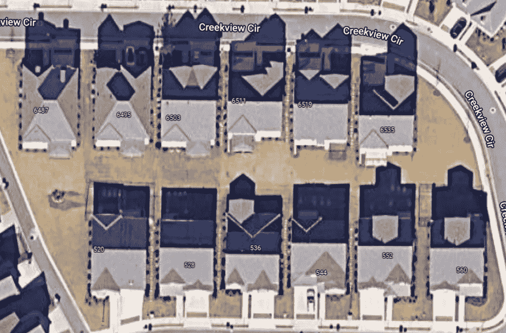
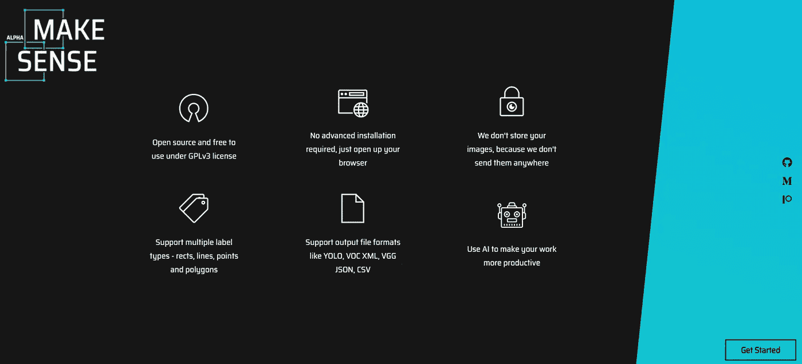
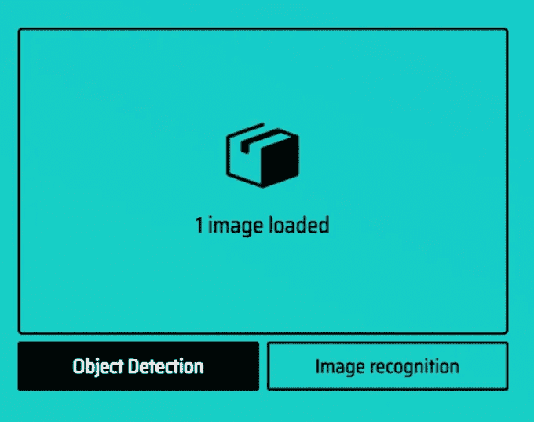
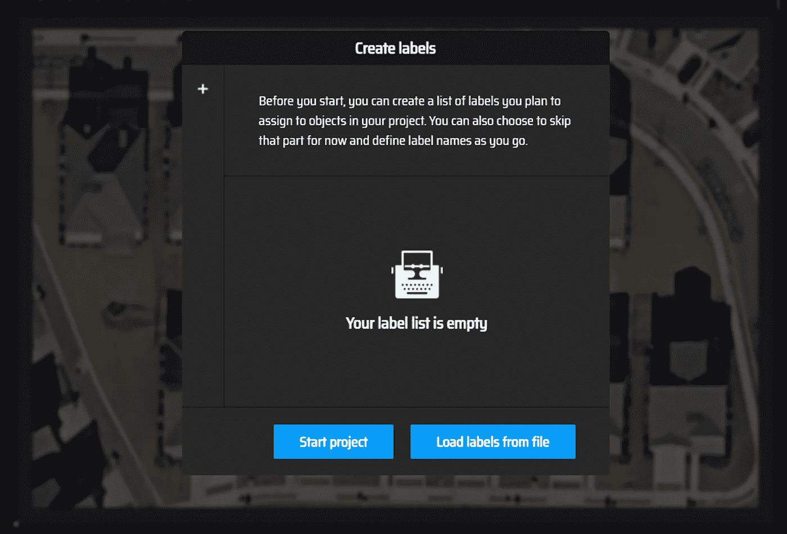
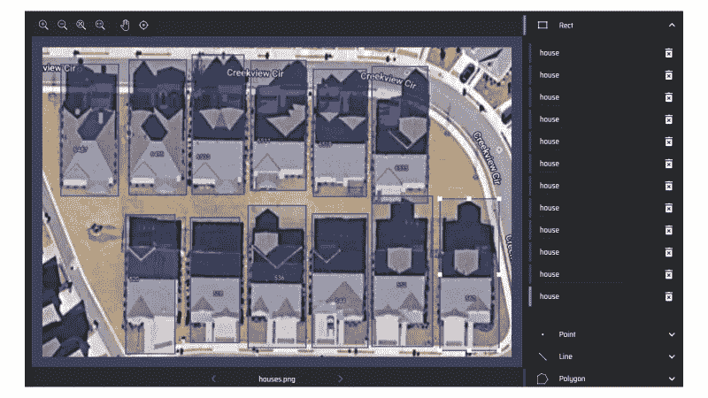
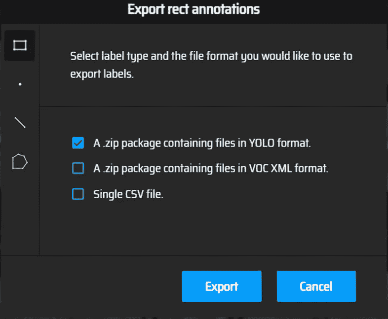
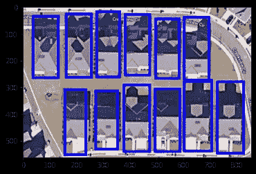

# 标记和可视化用于对象检测的图像

> 原文：<https://towardsdatascience.com/labeling-and-visualizing-images-for-object-detection-55b48f0da326>

## 经典的计算机视觉深度学习示例项目从包含图像和标签的数据集开始。然而，当需要计算机视觉来解决业务问题时，数据通常是未标记的，标记数据本身就是一个挑战。本文介绍了大规模标注影像以及相关的挑战



图片来自带注释边框的谷歌地图|塞犍陀·维维克

深度学习计算机视觉项目的经典例子始于包含图像和标签的数据集。这取决于你所拥有的标签类型和你想要完成的任务——图像分类、物体检测或图像分割；你会从一组合适的深度学习模型中进行选择。有许多资源可以使用，包括 Kaggle 数据集和笔记本、GitHub repos，以及内置的示例数据集，如深度学习包 TensorFlow 和 PyTorch 中提供的 MNIST 数据集。这类示例项目的重点主要是选择模型架构和调整超参数。有时，对于独特的数据集，采用迁移学习可能是有意义的，其中你应用预先训练的模型([参见我的博客，例如 PyTorch on Animals-10 Dataset](https://chaoscontrol.net/transfer-learning-tutorial-using-pytorch-on-animals-10-dataset/) 中的深度迁移学习教程)。

然而，在你遇到的大多数计算机视觉问题中，无论是在试图检测大型机械上的[缺陷的公司，还是有特定需求的客户，标记数据都是一个挑战。举个例子，假设一家保险公司想要从他们的无人机拍摄的卫星图像中检测房屋。](http://www.nscorp.com/content/nscorp/en/bizns/developing-_intelligent-wayside-track-detectors.html)



图片来自谷歌地图|塞犍陀·维维克

不幸的是，无人机拍摄的图像或谷歌地图上的卫星图像没有预先标记。你跟踪的这么多现有的深度学习资源，现在都缺少一个关键的步骤，而这个步骤是你启动项目所必须的。

> 首先，你如何给图像加标签？

原来有多个图像标注服务商。然而，缺乏关于如何给图像加标签的教程。这很令人惊讶。我发现了一个很好的免费在线解决方案——[make sense . ai](https://www.makesense.ai/)。如下图所示，很容易上手。



图片来自 Makesense.ai

上传图像后，请确保根据您是要检测图像中的多个对象还是要分类(识别)图像来选择正确的标记任务。



图片来自 Makesense.ai

接下来，创建一个标签列表。这里我只是检测房屋，所以我将只创建一类标签。



图片来自 Makesense.ai

接下来，我通过在各个图像周围画一个边界框来注释图像。



图片来自 Makesense.ai

最后，我以特定的格式下载注释。在这种情况下，我选择 YOLO，这是一个受欢迎的家庭的对象检测模型。



图片来自 Makesense.ai

当我打开 zip 文件夹时，注释在一个. txt 文件中，其内容如下。每一排都是不同的房子。这 5 列表示对象类别、中心 X 和 Y 坐标以及注释的宽度和高度。

```
#YOLO annotations0 0.100204 0.266547 0.122651 0.425760
0 0.245263 0.257603 0.122651 0.436494
0 0.373811 0.248658 0.110858 0.450805
0 0.502359 0.251342 0.117934 0.420394
0 0.633265 0.277281 0.113217 0.411449
0 0.761224 0.281753 0.119113 0.441860
0 0.229931 0.764758 0.103782 0.449016
0 0.367324 0.751342 0.104961 0.404293
0 0.499410 0.739714 0.123831 0.459750
0 0.766531 0.722719 0.129727 0.486583
0 0.633855 0.753131 0.119113 0.432916
0 0.909820 0.735242 0.126189 0.490161
```

我们如何知道我们的注释是正确的？我们可以在 Python 中加载我们的注释和图像，并创建一个自定义函数来可视化我们的注释，如下所示:

```
from PIL import Image, ImageDraw
import numpy as np
import matplotlib.pyplot as plt
import os#code adapted from [https://blog.paperspace.com/train-yolov5-custom-data/](https://blog.paperspace.com/train-yolov5-custom-data/)def plot_bounding_box(image, annotation_list):
    annotations = np.array(annotation_list)
    w, h = image.size

    plotted_image = ImageDraw.Draw(image)transformed_annotations = np.copy(annotations)

    try: 
        transformed_annotations[:,[1,3]] = annotations[:,[1,3]] * w
        transformed_annotations[:,[2,4]] = annotations[:,[2,4]] * h 

        transformed_annotations[:,1] = transformed_annotations[:,1] - (transformed_annotations[:,3] / 2)
        transformed_annotations[:,2] = transformed_annotations[:,2] - (transformed_annotations[:,4] / 2)
        transformed_annotations[:,3] = transformed_annotations[:,1] + transformed_annotations[:,3]
        transformed_annotations[:,4] = transformed_annotations[:,2] + transformed_annotations[:,4]
    except:
        transformed_annotations[[1,3]] = annotations[[1,3]] * w
        transformed_annotations[[2,4]] = annotations[[2,4]] * h 

        transformed_annotations[1] = transformed_annotations[1] - (transformed_annotations[3] / 2)
        transformed_annotations[2] = transformed_annotations[2] - (transformed_annotations[4] / 2)
        transformed_annotations[3] = transformed_annotations[1] + transformed_annotations[3]
        transformed_annotations[4] = transformed_annotations[2] + transformed_annotations[4]  

        print(transformed_annotations)

    for ann in transformed_annotations:
        try:
            obj_cls, x0, y0, x1, y1 = ann
            plotted_image.rectangle(((x0,y0), (x1,y1)), width = 10, outline="#0000ff")

        except: 
            obj_cls= transformed_annotations[0]
            x0=transformed_annotations[1]
            y0=transformed_annotations[2]
            x1=transformed_annotations[3]
            y1=transformed_annotations[4]
            plotted_image.rectangle(((x0,y0), (x1,y1)), width = 10, outline="#0000ff")

    plt.imshow(np.array(image))
    plt.show()#get an annotation file
annotation_file = './houses.txt'#Get the corresponding image file
image_file = annotation_file.replace("txt", "png")
assert os.path.exists(image_file)#Load the image
image = Image.open(image_file)#Plot the Bounding Box
plot_bounding_box(image, np.loadtxt(annotation_file))
```

注释看起来一点不错！



图片来自带注释边框的谷歌地图|塞犍陀·维维克

# 结论和挑战

虽然 makesense.ai 是一个很棒的免费平台，但它不具备可扩展性。为了训练一个 YOLO 风格的对象检测模型，你至少需要数百个(如果不是数千个)对象来获得合理的精度。Makesense.ai 不保存任何注释或合并工作流。你需要一次单独完成所有这些。如果一个人连续坐几个小时来标记成千上万的图像，将会花费大量的时间。还有其他服务，比如提供定制报价和标签服务的 ango.ai，每张图片只需几分钱。在我看来，这是一个有待改进和挖掘潜力的领域。随着人工智能变得越来越受欢迎和易于使用，对大规模轻松、准确和廉价的定制标签的需求将变得更加重要。

我希望这向您展示了端到端计算机视觉项目的冰山一角；模特训练只是拼图的一部分。请关注更多讨论以业务为中心的端到端深度学习的其他关键方面的博客！

您可以从 GitHub 上的这篇文章中找到代码:

https://github.com/skandavivek/Visualizing-YOLO-annotations

*如果你还不是中会员，想支持我这样的作家，可以通过我的推荐链接随意报名:*[*https://skanda-vivek.medium.com/membership*](https://skanda-vivek.medium.com/membership)

[*关注我*](https://medium.com/@skanda.vivek) *如果你喜欢这篇文章——我经常在数据科学、物理和社会的界面上写作。*

*每周数据透视* [*订阅此处*](https://skandavivek.substack.com/) *！*