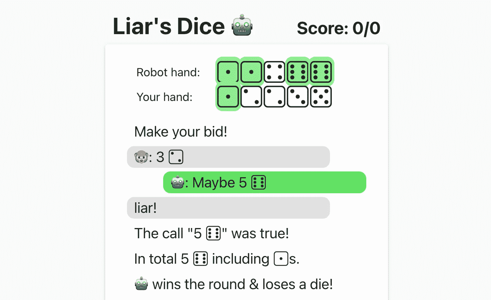
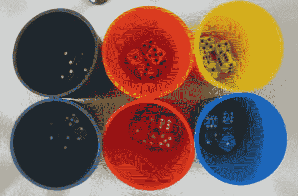
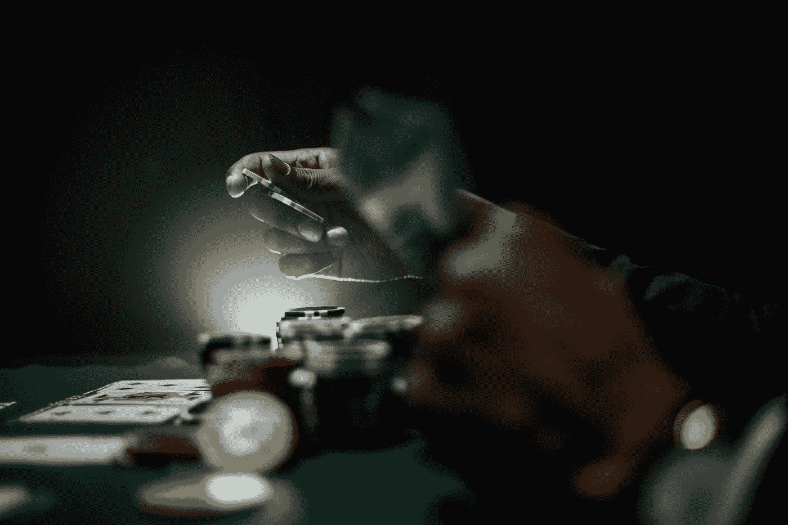
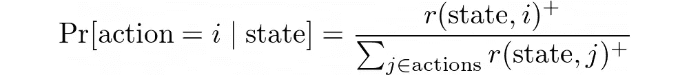
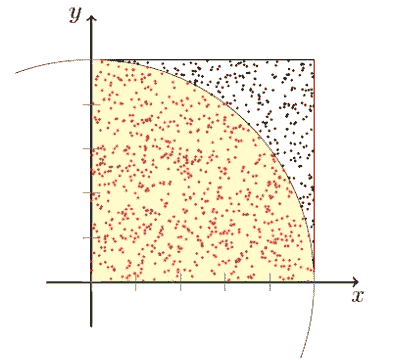
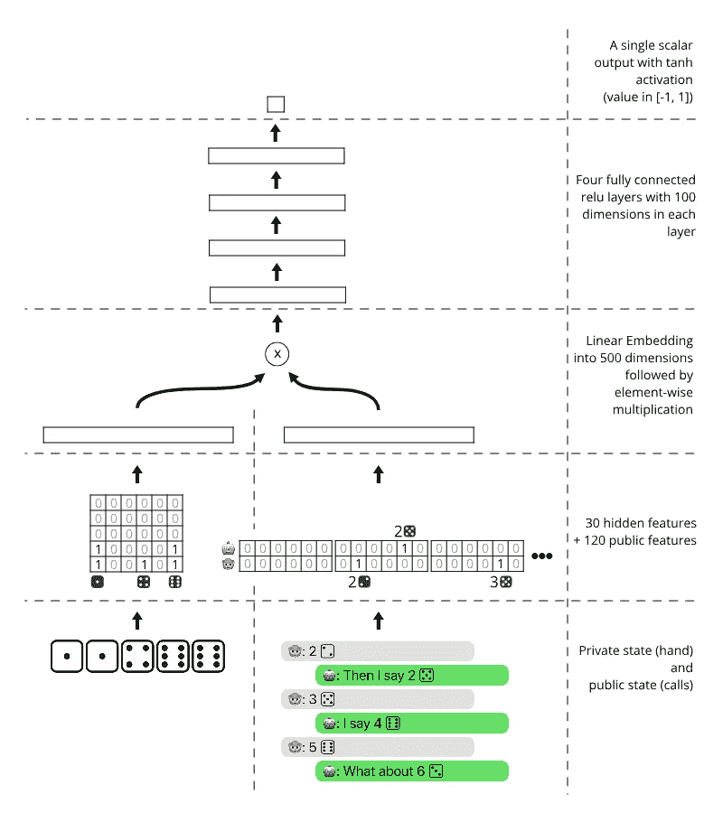
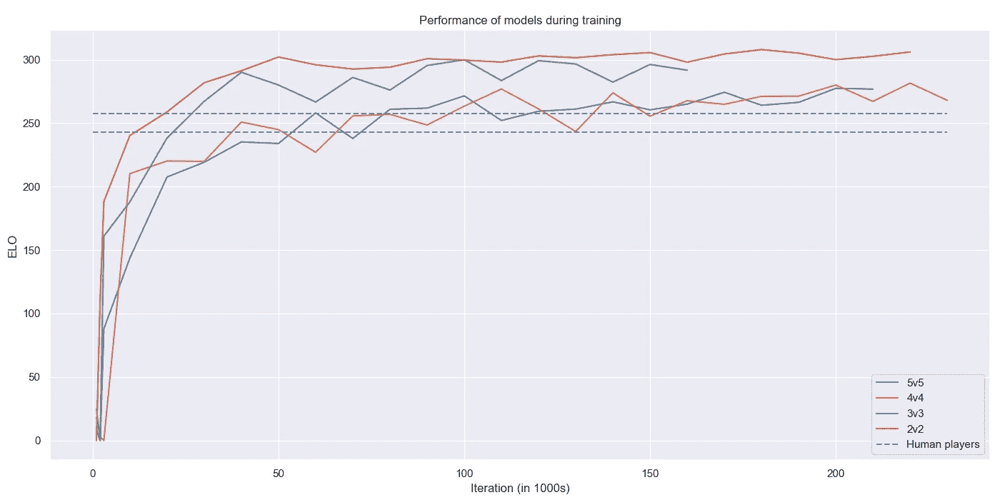
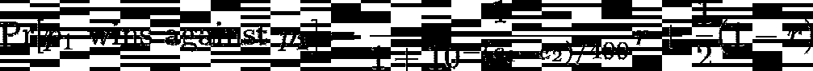
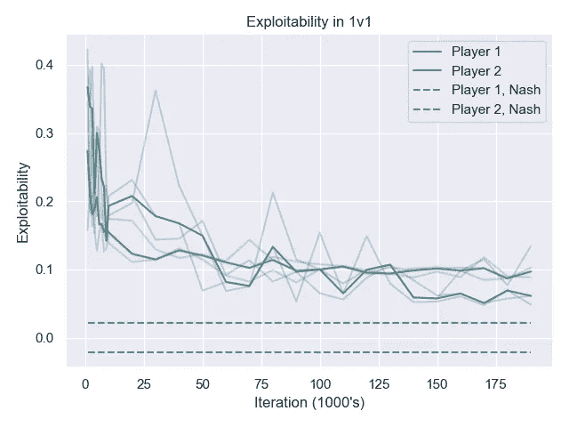
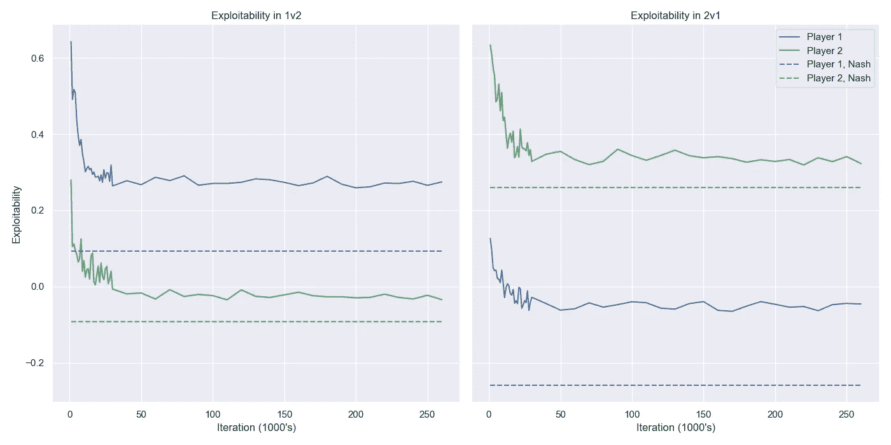

# 靠自我发挥的骗子的骰子

> 原文：<https://towardsdatascience.com/lairs-dice-by-self-play-3bbed6addde0>

## [实践教程](https://towardsdatascience.com/tagged/hands-on-tutorials)

# 靠自我发挥的骗子的骰子

## 用反事实后悔和神经网络



与人工智能对战是如此有趣，以至于我不得不创建一个小网站来与世界分享它。—[dudo . ai](https://dudo.ai/)截图。作者图片

一段时间以来，我一直想学习像扑克或骗子骰子这样的[游戏的人工智能。最近在读 Deepmind 的文章](https://en.wikipedia.org/wiki/Perfect_information)[游戏玩家](https://arxiv.org/abs/2112.03178)时，我想我也许能做出一些真正简单的东西，足够好，足够有趣。“应该不会超过一个下午，”我想。当然，我最终在这上面花了更多的时间，但这确实很有趣，也很简单。

这个项目让我能够深入到反事实后悔最小化、强化学习、在浏览器中提供 PyTorch 模型和一些其他有趣的主题的令人兴奋的概念中，所以在这篇博客文章中有一堆事情要涵盖。

# 骗子的骰子怎么玩？

> 我明白。这是一个欺骗的游戏。但是你的赌注包括所有的骰子，而不仅仅是你自己的。——威尔·特纳，《加勒比海盗》

[骗子的骰子](https://en.wikipedia.org/wiki/Liar%27s_dice#Single_hand)是我个人喜欢在我们还能去酒吧的时候玩的游戏。它比扑克简单，但有许多相同的下注、虚张声势和隐藏信息的概念，这使它成为人工智能的一个有趣挑战。



供六个人玩的骗子的骰子，有用来隐藏的骰盅。在这篇博文中，我们只考虑 2 人版本。[图片由 Dicemanic](https://www.flickr.com/photos/dicemanic/12902825/) (CC BY 4.0)

游戏也是从[加勒比海盗](https://pirates.fandom.com/wiki/Liar%27s_Dice)开始出名的，不过不了解游戏的话我会快速勾画一下规则。

*   每个玩家都有一套只有他们自己知道的骰子。玩家轮流对玩家认为显示给定值的最小骰子数出价。
*   每回合，玩家必须对任何特定的牌面叫牌数量更高，或者对更高的牌面叫牌数量相同。例如，“2 ⚃”和“3 ⚂”都是“3 ⚁”之后的有效赌注，但“2 ⚂”不是。
*   或者，玩家可以挑战先前的出价。如果挑战成功——例如，先前的出价是虚张声势——挑战者赢得这一轮；否则，下注的玩家获胜。

通常，⚀'s 被认为是爱开玩笑的人，在最后合计骰子点数时，他会考虑任何一张脸。

爱丽丝和鲍勃可能有⚀ ⚁和⚂ ⚃.的手爱丽丝出价“2 ⚁”(她可以独自用自己的手支撑)，鲍勃说“2 ⚂”(预计爱丽丝有一张⚂或⚀(百搭))。艾丽丝打电话给鲍勃，但是鲍勃是对的并且赢了。

# 理论是什么

解释这个算法需要一点理论——尽管它最终非常简单。如果您想直接跳到神经网络部分或模型的 ELO 评级和*可开发性*评估，请随意跳过以下三个部分。

> 为什么不完全信息博弈如此困难？毕竟，我们有深蓝，我们有 AlphaGo。为什么我们不能把这些技术直接应用到像扑克这样的游戏中呢？— [诺姆·布朗·尼普斯 2017 年最佳论文演讲](https://www.youtube.com/watch?v=tRiaGahlyy4)。

骗子的骰子是一个有限的游戏:你只能掷出有限的骰子组合，以及有限的下注顺序。(我们称这种组合为*状态，*从技术上来说，它通常被称为*信息集*)然而，与像国际象棋这样的[完全信息博弈](https://en.wikipedia.org/wiki/Perfect_information)不同，我们无法为每种状态计算出单一的完美走法(或*动作*)。相反，[如约翰·冯·诺依曼和约翰·纳西](https://en.wikipedia.org/wiki/Nash_equilibrium)所示，我们需要一个“混合策略”:对于每个状态，我们从一组动作的**概率分布**中选择一个动作。

直觉上，这是因为有一个固定的策略会泄露我们私人骰子的信息。如果我们在掷骰子时总是下大注，我们的对手就会明白这一点，开始跟我们虚张声势。如果我们一半时间虚张声势，另一半时间稳扎稳打，我们的对手就更难识破我们。



据报道，约翰·冯·诺依曼在 T4 曼哈顿计划 T5 和其他科学家玩扑克时发明了现代博弈论。照片由 [Keenan Constance](https://unsplash.com/@keenangrams?utm_source=medium&utm_medium=referral) 在 [Unsplash](https://unsplash.com?utm_source=medium&utm_medium=referral) 上拍摄

纳什均衡可以使用[线性规划](https://en.wikipedia.org/wiki/Linear_programming)来计算，例如[达芙妮·柯勒和尼姆罗德·迈吉多](http://www.sciencedirect.com/science/article/pii/089982569290035Q)的方法，该方法在状态数(或更常见的术语“信息集”)上花费多项式时间。)几年前我其实就是用这个方法[解开骗子的骰子的。这是可能的，因为每个人有 1 个骰子，有意义的最大出价是 2 ⚅'s.，总共有 12 个可能的出价。结合骰子信息，那就是 6*2 ~40 万个状态。这只是现代线性代数解算器可能做到的事情，比如谷歌或者工具。](https://en.wikipedia.org/wiki/Linear_programming)

不幸的是，这种方法不能扩展到多个骰子。每个 6 个骰子，我们得到大约 10 个⁶状态，这相当于国际象棋中的[总合法位置。虽然国际象棋理论上可以通过简单的深度优先搜索来解决——在状态数中采用恒定的空间和线性时间——但骗子的骰子要难得多。这就是为什么人工智能在 1998 年可以很好地下棋，但直到最近才在扑克上达到同样的水平。](https://github.com/tromp/ChessPositionRanking)

# 反事实后悔最小化

好了，是时候我开始解释这个人工智能实际上是如何工作的，以及机器学习是如何发挥作用的。

> 在过去，很多人会通过最大化你的收益来模拟决策。你想尽最大努力赢得比赛，对吗？但是人们发现你真正想做的是尽量减少你的遗憾。— [*布莱恩·佩莱格里诺*](https://www.cardplayer.com/poker-news/25778-team-polk-s-bryan-pellegrino-talks-about-his-ai-research-and-how-it-helped-formulate-strategies-to-win-1-2-million) 、扑克职业和人工智能研究员

解决不完美信息博弈的算法被称为反事实后悔最小化。我在这篇文章的结尾添加了一些相关链接，但在我的休闲版中，它是这样工作的:


我们应该生活和玩耍来最大化我们的快乐还是最小化我们的遗憾？马科斯·保罗·普拉多在 [Unsplash](https://unsplash.com?utm_source=medium&utm_medium=referral) 上拍摄的照片

1.  如果开始的玩家赢了，给所有的最终状态(其中一个玩家称另一个玩家说谎)赋值+1，如果第二个玩家赢了，赋值-1。
2.  对于所有其他状态，我们将保持一个值 *v(state)* (在-1 和 1 之间)，该值近似于在通过给定状态的先前游戏中观察到的*平均值*。
    *(在真实的 CFR 中，这些值应该由玩家进入状态的概率进行反向加权，但为了简单起见，由于使用 Adam 和 momentum 来训练神经网络已经有点乱了加权，所以我跳过了这一部分。)*
3.  定义“反事实遗憾” *r(state，I)= v(state+I)*—*v(state)*，这是如果我们在给定的状态下每次都采取行动 *i* ，我们的得分(平均)会差(或好)多少。
    (此处*状态+i* 是采取动作 *i* 后的结果状态。)
4.  最后，通过以下方式定义策略(在给定状态下选择动作 *i* 的概率)



其中 r *(状态)**= max(r(状态)，0)。这确保了不存在负概率。*

总是玩具有最高期望值 *v(state+i)的动作可能很有诱惑力。然而，这将是一种确定性策略，很可能被我们的对手所利用。相反，随着我们对状态值的估计越来越精确，上述算法(称为后悔匹配)肯定会给出纳什均衡。*

# 蒙特卡洛和神经网络的懒惰

在真实反事实后悔最小化(简称 CFR)中，我们通过在整个博弈树上运行深度优先搜索并存储迄今为止看到的平均分数，来反复改进我们的 *v(状态)*估计。



蒙特卡洛近似法可用于测量物体的面积，方法是对随机点进行采样，并计算感兴趣的物体内部有多少陆地。类似地，通过重复游戏，它可以接近游戏的期望值。图片由[凯特琳·乔·拉姆齐](https://commons.wikimedia.org/wiki/User:CaitlinJo)

这有两个主要问题:

1.  它用了太多的时间。
2.  它占用了太多的空间。

为了解决时间问题，我们用游戏样本代替深度优先搜索(也称为蒙特卡罗 CFR)。基本上，我们不用更新每个子状态——包括那些概率为 0 的动作——我们只需玩一个游戏，然后根据游戏结果用+1 或**—**1 更新游戏树中的路径。换句话说，我们在做强化学习。

为了确保我们探索所有的选项，我们在玩的时候增加了一些噪音。噪音还教会了人工智能利用对手的糟糕举动，因为它不是在对手总是做出完美选择的情况下训练的。理想情况下，我们应该减少训练期间随着时间增加的噪音量——如果我们想最终获得纳什均衡的话——但我没有这样做。

为了解决内存问题，我们不存储每个可能状态的精确平均分数。相反，我们使用神经网络来计算平均值 *v(状态)的良好近似值。*为了模拟 CFR 更新规则，我们使用 1/T 的学习率，其中 T 是当前时间步长。这确保了 *v(state)* 学习训练游戏的平均值，而不仅仅是最近的结果。*(我实际上尝试了其他学习率，比如 1/sqrt(T)和 1/T，令人惊讶的是 1/T 是唯一一个收敛到纳什均衡附近的学习率。)*

完整的训练代码可以在[github.com/thomasahle/liars-dice/blob/main/code/train.py](https://github.com/thomasahle/liars-dice/blob/main/code/train.py)中找到，而最关键的部分——自我游戏代码——只有 27 行。

代码将三元组(私有状态、公共状态、游戏结果)保存到一个名为 *replay_buffer* 的列表中，该列表被传递给 PyTorch 用于训练神经网络(在 *game.sample_action* 中调用)。在一个梯度下降的步骤之后，我们用改进的策略玩另一批游戏并重复。

# 模型

神经网络是一个函数 *v(private，public)* ，它返回一个介于**-**1 和 1 之间的值。我们可以用很多方法来定义它，所以我只选择了我能想到的最简单的方法，它看起来足够好了。



我能想到的最简单的模型是:私有和公共状态被编码、组合，并通过几个完全连接的层传递。作者图片

私人输入是玩家手牌的一个 6 **×** “骰子数”的一键表示。我们可以把它看作是每个面上有多少骰子的直方图。该编码取自[dou zero](https://arxiv.org/abs/2106.06135)【2021】。

由于在两个玩家的游戏中，我们最多可以调用 2 个 **×** “骰子数”，
公共状态是 2 个 **×** 6 个 **×** (2 个 **×** num-dice)的一键表示，表示每个玩家到目前为止所做的调用。

每个独热输入被嵌入为 500 维向量，并且两者相乘。其他的池化方式，比如连接，也可以工作得很好，但是元素式乘法模拟了[压缩双线性池](https://en.wikipedia.org/wiki/Tensor_sketch#:~:text=Compact%20multilinear%20pooling%5Bedit%5D)，[我个人倾向于](https://thomasahle.com/#paper-tensorsketch-joint)。

在结合了私有和公共状态之后，我们运行 4 个完全连接的层，100 个单元宽，在每层中具有校正的线性单元。最终，我们减少到一个标量值，使用 tanh 映射到[1，+1](像 AlphaZero 一样。)

训练损失简单来说就是 MSE: ( *v(私，公)——game _ result)。再次复制 AlphaZero。*

# 有用吗？

有时候我会打败它。有时候我也不知道。说谎者的骰子是一个涉及很多机会的游戏，需要很多游戏才能确定谁是更好的玩家。所以我们来玩很多游戏吧！

在第一周在 [dudo.ai](https://dudo.ai) 与人在线对战时，人工智能赢了 5031 回合，输了 4416 回合。这相当于骰子点数的 **53.3%** 胜率。骗子骰子游戏由多轮不同数量的骰子组成。AI 赢了 846 场完整的比赛，输了 640 场，对应于 56.9%的胜率。

我们可以使用经典的 ELO 公式将这些百分比转换成评级差异:


玩家 1 战胜玩家 2 的概率被认为是他们的评级 e1 和 e2 之间的差的函数。

加上上面的胜率，人工智能比人类对手有 23 到 48 个 ELO 点的优势。

另一个有趣的测试是观察算法在自我对抗时提高的速度。我建立了一个锦标赛，不同版本的模型与其他版本的模型进行 10，000 场比赛。然后我用最大似然估计来计算每个玩家的 ELO。



不同迭代的 n 骰子模型的 ELO，假设迭代 1000 的评级为 0。作者图片

模型显然在开始时改进得更快，但它们都在长时间内保持改进。将 5 骰子模型训练到 230，000 次迭代大约需要 24 小时。训练本身不需要太多时间，但是玩 23，000，000 个游戏需要一段时间，因为我没有实现任何并行化。

有趣的一点是，ELO 通常用于不需要运气的游戏，比如国际象棋。我们可以在 ELO 公式中加入如下的偶然性因素:



ELO 公式假设骗子的骰子是概率为 r 的技巧游戏，概率为 1-r 的纯运气游戏

如果我们使用这个公式来估计不同版本之间的比赛的 ELO 收视率，结果是最好地解释数据的模型具有 *r* ~ 0.20。这意味着骗子的骰子大约 80%是纯粹的运气。🤷

# 它能工作吗？2 —可开发性



我对 1v1 模型进行了 3 次训练，并计算了不同迭代的可开发性。粗线表示运行的中值可开发性，虚线表示理论最小值。作者图片

有一个更有原则的方法来计算我们的人工智能离纳什均衡有多近。这被称为测量战略的*可开发性*。

可利用性是任何人在对抗人工智能时能够赢得的最大数量*，即使知道人工智能使用的概率是多少，并且拥有无限的计算能力。*

实际的 CFR 保证最终产生一个不可利用的策略。我们不能期望我们的方法有那么好，因为神经网络甚至不能代表这个完美的策略。然而，如果我们接近 0，这意味着人工智能客观上非常好，而不仅仅是在线上与自己和人类玩得很好。

计算可利用性是通过计算对手的最优反应策略来完成的。我们告诉我们的对手我们的策略(我们每个状态的概率)，这个策略将游戏转变成一个[马尔可夫决策过程](https://en.wikipedia.org/wiki/Markov_decision_process) (MDP)。对手可以解决这个问题(在深度优先搜索的线性时间内)，MDP 的值是任何对手使用任何策略都无法战胜我们的。

虽然可利用性可以在状态数中以线性时间计算，但对于具有 4 个或更多骰子的游戏来说，这仍然太昂贵了。然而，我设法计算了 1v1 的可利用性(上图)，以及 1v2 和 2v1(下图)。巧合的是，这也是我 5 年前设法计算出(使用线性规划)的精确纳什均衡的游戏。结果如下:



1v2 和 2v1 游戏中的可利用性，其中玩家 1 有 1 个骰子，玩家 2 有 2 个骰子，反之亦然。在这两种情况下，玩家 2 的可利用性都相当好(低)，尽管不是最低可能。然而，当人工智能是参与人 1 时，它是令人惊讶地可利用的。例如，在 1v2 中，玩家 2 有优势，我们应该仍然只能赢得大约 54%的比赛(每场 0.09 分)，但有一种策略可以在近 65%的时间里击败它(每场 0.3 分)。作者图片

显然，我的模型很擅长学习参与人 2 的最佳策略。这里的可开发性离最佳值不远。另一方面，在这两个游戏中，参与人 1 的策略都没那么好。似乎人工智能更喜欢在做出自己的决定之前判断人类的呼唤。

这是否意味着作为一号玩家玩好游戏要困难得多？在 1v1 设置中，这似乎不是一个问题…是不是有一个 bug🐛在我的算法、架构或最佳反应开发器中的某个地方，只会为参与人 1 提供更多骰子？如果我想通了，我会更新这个帖子。

**总的来说，该算法似乎很好地学习了骗子的骰子&非常快。鉴于代码和架构如此简单，我对此感到非常鼓舞。它当然足够强大，可以在大部分时间里赢过网上的人。[请随意使用 Github](https://github.com/thomasahle/liars-dice) 上的代码，让它变得更好！**

# 为模型服务

我认为只有终端界面不会鼓励我的许多朋友去测试这个模型。我需要一些基于浏览器的东西，但是我不想创建一个完整的服务器/客户机来运行这个模型。

幸运的是，我发现了关于 [ONNX](https://github.com/microsoft/onnxruntime) ，尤其是埃利奥特·韦特的这个伟大的视频。在两行代码中，PyTorch 模型可以转换成 onnx 文件，可以直接从 javascript 中使用:

```
torch.onnx.export(model, path=’out.onnx’)
```

我创建了一个小的静态 javascript 前端，买了一个域名，你现在可以在 [dudo.ai](http://dudo.ai) 上与之对战。

# 附录

这篇文章的灵感来自于 Erik Bernhardsson 的深度学习...2014 年的象棋。除了 Deepmind 的游戏玩家，我还从其他令人兴奋的扑克论文中获得了灵感，如 DouZero、DeepStack 和 ReBeL。

更高级的方法有两个主要改进:

1.  他们使用两个神经网络而不是一个:一个网络(像我们的一样)用于预期的游戏价值，另一个预测最佳政策/概率分布。由于另一项创新，第二个网络可以训练得特别好:
2.  他们使用[搜索](https://arxiv.org/abs/2111.05884)。搜索意味着给定状态的策略(概率分布)随着给 AI 时间“思考”而迭代改进。经典游戏(如国际象棋)的人工智能一直都是这样做的，但在 CFR 中，策略完全是在训练时计算的，游戏中更多的“思考时间”对人工智能没有帮助。直到最近几年才发现如何将这一点应用到类似《骗子的骰子》这样的游戏中，方法比我以为一个下午就能做到的要复杂得多。

有关 CFR 的更多信息，您可以查看

1.  原文[不完全信息博弈中的后悔最小化](https://proceedings.neurips.cc/paper/2007/file/08d98638c6fcd194a4b1e6992063e944-Paper.pdf)摘自 NIPS 2007。
2.  来自 NIPS 2009 的[蒙特卡洛版本](http://mlanctot.info/files/papers/nips09mccfr_techreport.pdf)。
3.  一篇关于[深度反事实后悔最小化](https://openreview.net/forum?id=ByebT3EYvr)的更有原则性的论文，来自 ICLR 2020。
4.  2021 年[强化学习和控制手册](https://link.springer.com/book/10.1007/978-3-030-60990-0)中关于基于政策的方法的 12.4.2.2 章节。

感谢 [Kosti](https://twitter.com/kgourg) 阅读本文的早期草稿，感谢 Troels Bjerre Lund 批评我轻率地使用 CFR 术语。