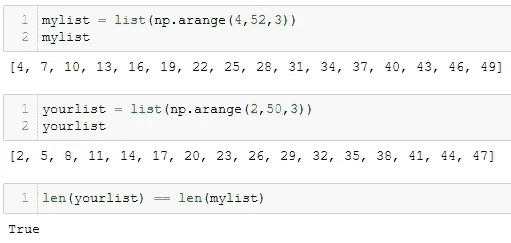
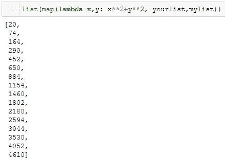
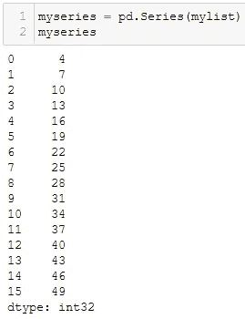
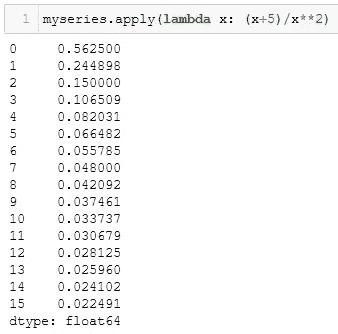
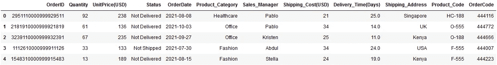
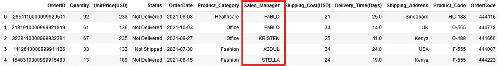
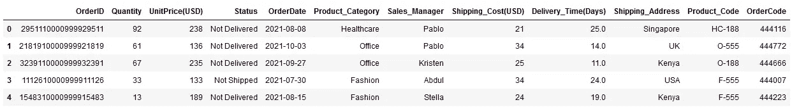
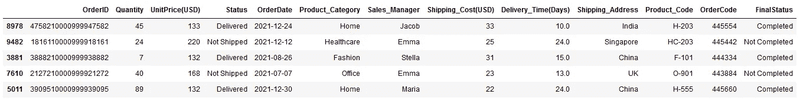

# Python 中的 Lambda 函数:您需要知道的一切

> 原文：<https://towardsdatascience.com/lambda-functions-with-3-practical-examples-in-python-f4ed7f266e53>

## 数据科学

## 从真实和最实际的例子中学习


加里·巴特菲尔德在 [Unsplash](https://unsplash.com/?utm_source=unsplash&utm_medium=referral&utm_content=creditCopyText) 上拍摄的照片

**Lambda —明智地使用它！！**💡

Python 是强大的数据分析语言，不仅因为它易于使用，而且它提供了大量的内置函数和方法来处理数据。

Lambda 函数是 Python 中非常有用的函数之一，这使得在一行代码中定义和使用该函数变得非常容易。因此，了解它的来龙去脉，以便在您的数据分析任务中无缝地使用它是很好的。

所以，这里我列举了 lambda 函数的 3 个实际用例，并附有例子。你也会发现为什么以及什么时候不使用 lambda 函数。🏆

尽管这是一个快速阅读，您可以使用下面的索引直接导航到您最喜欢的部分。

```
**·** [**What is Lambda Function in Python?**](#7bd9) **·** [**Filter a List using Lambda Function**](#f0ac) **·** [**Use Lambda function in map()**](#e054) **·** [**Use Lambda function in apply()**](#63a1) **·** [**When not to use a Lambda function**](#311e)
  ∘ [Assigning a lambda expression to a variable](#ae35)
  ∘ [Passing function inside lambda function](#52a7)
  ∘ [Use lambda function when one-liner is poor choice](#41ca)
```

在开始使用用例之前，让我们快速了解一下什么是 lambda 函数以及如何使用它。

# Python 中 Lambda 函数是什么？

它是匿名函数或者没有名字的函数。与 Python 中的其他用户定义函数不同，lambda 函数可以在同一行代码中定义和调用。

这个特性本质上使得它非常便于在需要用最少的代码对多个项目执行重复任务的情况下使用。

每个 lambda 函数都以关键字`**lambda**`开头，后面是函数参数和函数体。函数参数和正文用冒号隔开即`**:**`。

例如，在函数`lambda x: x**2`中，`**x**`是函数参数，`**x**2**`是表达式，即函数体。您可以对单个变量应用此函数，如下所示:

```
**(lambda x:x**2)(5)**# Output
**25**
```

所以表达式中提到的运算(*在这里是* `*x**2*` *是* `*x*`的平方)是对数字 *5* 执行的。

📌注意:你可以在 lambda 函数中包含任意多个参数，但是函数体只能有一个表达式。这使得它不同于其他用户定义的函数。

现在，让我们看看这个神奇功能的最实际的用例。

# 使用 Lambda 函数过滤列表

lambda 函数的一个最简单的用例是根据特定的标准过滤给定的列表。为此，您可以将 lambda 函数与另一个内置函数`**filter()**`一起使用。

在 Python 中，`filter()`被应用于一个可迭代对象，比如一个列表或一个字典，以创建一个新的可迭代对象，它本质上只包含原始可迭代对象中满足特定条件的那些项。这个条件是用一个函数定义的。

由于 filter()的语法是`**filter(function, iterable)**`，从逻辑上讲，lambda 函数可用于定义在 filter()中使用的条件。

例如，您有一个从 2 到 50、间隔为 3 的数字列表。而你只想得到那些平方小于 100 的数字。所以这个条件可以定义为λ函数如下—

```
**lambda x:x**2<100**
```

它可以用在这样的过滤器中，

```
import numpy as np
yourlist = list(np.arange(2,50,3))
**list(filter(lambda x:x**2<100, yourlist))**# Output 
**[2, 5, 8]**
```

如果看一下中间步骤`**filter(lambda x:x**2<100, yourlist)**`，它返回一个 *filter 对象*，确实需要转换成 list 或 set 之类的数据结构，这是在上面最后一行代码中完成的。

当然，对于函数中的复杂计算，您应该使用普通的用户定义函数，但是当您的函数只有一个表达式时，lambda 函数是最佳选择。💯

接下来，除了过滤列表，了解如何对 iterable 的每一项应用函数也是很有趣的。

# 在 map()中使用 Lambda 函数

在 Python 中，`**map()**`是在 iterable 的每一项上映射或操作传递函数的函数。

它的语法与前面的函数`**map(function, iterable)**`相同。因此，就像您在 filter()中所做的那样，您可以在 map()中传递 lambda 函数。

例如，假设你想得到列表中每一项的平方和立方之和。所以λ函数会是，

```
**lambda x: x**2+x**3**
```

与 filter()类似，map()函数返回需要转换成其他数据结构的地图对象。因此可以获得所需的结果，

```
**list(map(lambda x: x**2+x**3, yourlist))**# Output
[12,
 150,
 576,
 1452,
 2940,
 5202,
 8400,
 12696,
 18252,
 25230,
 33792,
 44100,
 56316,
 70602,
 87120,
 106032]
```

但是，这是一个非常简单的例子，对吗？？

在另一个例子中，假设你有两个相同长度的列表`mylist`和`yourlist`——

```
mylist = list(np.arange(4,52,3))
yourlist = list(np.arange(2,50,3))
```



使用 numpy arange | Image by Author 创建列表

你想得到两个列表中相同位置的元素的平方的相加。使用下面的`map()`功能，这非常简单

```
list(map(**lambda x,y: x**2+y**2**, **yourlist,mylist**))
```



带有两个参数的 lambda 函数|作者图片

> 请注意，由于您在 lambda 函数中定义了两个变量 x 和 y，因此您需要在 map 函数中提供两个可迭代变量，即 yourlist 和 mylist。

这些 iterable 在 map()甚至 filter()中的顺序很重要，因为第一个 iterable 总是作为 x 传递，而第二个 iterable 作为 y 传递。💯

接下来，您还可以使用 lambda 函数来转换熊猫系列对象。

# 在 apply()中使用 Lambda 函数

熊猫系列实际上是索引数据的一维数组。与列表不同，序列总是包含相同数据类型的数据。这是熊猫数据框架的基础，数据框架的每一列都是熊猫系列。

要转换 pandas 系列，可以使用 apply()函数。顾名思义，它用于在熊猫系列上应用一个功能。

让我们创建一个熊猫系列，通过一个例子来理解这个概念。

```
myseries = pd.Series(mylist)
myseries
```



根据作者列表|图片创建熊猫系列

apply()的语法与前两个函数略有不同，但逻辑是相同的——apply()中传递的函数应用于系列的每个元素。💯

举个例子，假设你想在 *myseries* 的每个元素中加 5，然后除以相同元素的平方。因此 lambda 函数将为`lambda x: (x+5)/x**2`并且它可以在 apply 中使用，如下所示，

```
**myseries.apply(lambda x: (x+5)/x**2)**
```



lambda 函数与熊猫系列应用()|图片作者

与前两个函数不同，您不需要将 iterable 或 series 传递给 apply()，而是可以使用`.apply(function)`直接在 series 上使用它。

与其应用于单个系列，不如在 DataFrame 中使用它更有意义。例如，你在 DataFrame `df`中有一个 [*虚拟销售数据*](https://github.com/17rsuraj/data-curious/blob/master/TowardsDataScience/Dummy_Sales_Data_v1.csv) (可以从 [**Github**](https://github.com/17rsuraj) 的 [MIT license](https://github.com/17rsuraj/data-curious/blob/master/LICENSE.md) 下免费下载)。

```
df = pd.read_csv("Dummy_Sales_Data_v1.csv")
df.head()
```



虚拟销售数据|作者图片

你想让每个销售经理的名字都大写。这可以通过使用**中的 lambda 函数轻松完成。应用()**方法。

```
df["Sales_Manager"] = df["Sales_Manager"]**.apply(lambda x: x.upper())**
df.head()
```



熊猫数据帧中的 Lambda 函数 apply() |图片由作者提供

您可以简单地在任何列上使用`.apply()`，使用 lambda 函数定义一个快速转换，并将结果赋回原始列。💯

> 。带有 lambda 函数的 apply()比 str.upper()快 1.4 倍

当你比较`.apply()`和 lambda 函数用 string 方法做同样的转换，可以看到前者比后者快。而如果用 for loop 来比较，那么`.apply()`比 ***快 300X*** 。

我个人发现带有 lambda 函数的`**.apply()**`在我的大部分数据分析任务中非常有用。

当您学习了如何以及何时可以在 Python 中使用 lambda 函数时，知道何时不使用它也很重要。🎯

# 何时不使用 Lambda 函数

当然，很少有 Lambda 函数的用例不是由 [Python 标准编码指南](https://peps.python.org/pep-0008/#programming-recommendations)推荐的。

在以下 3 种情况下使用 lambda 函数没有错，但这不是最佳实践，因此应该避免。

## 将 lambda 表达式赋给变量

当你需要一个简单的函数时，你可能会想到使用 lambda 函数来定义它，并在需要时使用它。但是，这不是最佳做法。

[根据定义](https://python-reference.readthedocs.io/en/latest/docs/operators/lambda.html)，lambda 是一个匿名函数，因此将其存储在一个变量中以备将来使用并不是一个好主意。

例如，假设你想得到两个数的平方和，你想在你的项目中多次进行这种转换，

不好的做法❌

```
squared_sum = lambda x,y: x**2 + y**2
squared_sum(3,4)#Output
25
```

✅最佳实践

```
def squared_sum(x,y):
    return x**2 + y**2#Output
25
```

当你想多次使用同一个代码块时，通常使用用户定义的函数。因此，在这种情况下，它应该优于 lambda 函数。

而且，我还观察到很多数据专业人士在 lambda 函数中传递一个标准函数比如`sqrt`，这并不是一个好的做法。

## 在 lambda 函数中传递函数

当您想要在 map()或 filter()或 apply()方法中使用函数时，就会出现这种情况。这包括所有内置函数和用户定义的函数，这些函数只接受一个参数。

例如，假设您有一个数字列表，并想得到这些数字的平方根。这可以通过使用 **math** 库中的内置函数 **sqrt** 获得。

不好的做法❌

```
import math
mylist = [10, 25, 40, 49, 65, 81]
sqrt_list = list(map(lambda x: math.sqrt(x), mylist))
sqrt_list#output
[3.1622776601683795, 5.0, 6.324555320336759, 7.0, 8.06225774829855, 9.0]
```

✅最佳实践

```
import math
mylist = [10, 25, 40, 49, 65, 81]
sqrt_list = list(map(math.sqrt, mylist))
sqrt_list#output
[3.1622776601683795, 5.0, 6.324555320336759, 7.0, 8.06225774829855, 9.0]
```

来自 **math** 库的内置函数 **sqrt** 可以直接在 map()函数中使用。在 lambda 函数中使用它是不必要的，而且会影响性能。

如果您比较上面两种在 lambda 函数中传递另一个函数的方法，并对每种方法运行 100000 次迭代，您会发现最佳方法总能提高性能。💯

> 将函数直接传递给 map()要快 1.8 倍！！

用户定义的函数也是如此。

接下来，Python 中的一行程序非常受欢迎，编码人员通常会上当。然而，一行程序并不总是最好的选择，在这种情况下使用 lambda 函数甚至会降低代码的可读性并使其难以维护。

## 当一行程序不是好的选择时，使用 lambda 函数

当您在 lambda 函数中使用复杂的运算(如 if-else 条件或简单的多重运算)时，实际的 lambda 函数定义会变得更长。

当您在一行程序中使用这样的 lambda 函数时，您的一行代码不再适合一行。

> 根据 [PEP8 指南](https://peps.python.org/pep-0008/#maximum-line-length)，将所有行限制为最多 79 个字符。

由于代码写在多行上，因此很难有效地阅读代码并在需要时进行调试。

例如，你在 DataFrame df 中有一个 [*虚拟销售数据*](https://github.com/17rsuraj/data-curious/blob/master/TowardsDataScience/Dummy_Sales_Data_v1.csv) (可以在 [MIT license](https://github.com/17rsuraj/data-curious/blob/master/LICENSE.md) 下从 [Github](https://github.com/17rsuraj) 免费下载)。

```
df = pd.read_csv("Dummy_Sales_Data_v1.csv")
df.head()
```



虚拟销售数据|作者图片

并且您想要创建一个具有*最终状态*的新列，这样，如果*状态*列包含*‘已交付’*或*‘已装运’*，则最终状态将为*‘已完成’*，否则将为*‘未完成’*

一句俏皮话和糟糕的做法❌

```
df["FinalStatus"] = df["Status"].map(lambda x: 'Completed' if x == 'Delivered' or x == 'Shipped' else 'Not Completed')
```

这一行包含 118 个字符，并且扩展到一行之外。所以很难读懂。



使用和不使用 Lambda 函数的相同输出|作者的图像

虽然它给你正确的输出，我推荐下面的最佳做法。✅

```
df["FinalStatus"] = ''df.loc[(df["Status"] == 'Delivered') |
       (df["Status"] == 'Shipped'),
       'FinalStatus'] = 'Completed'df.loc[(df["Status"] == 'Not Delivered') |
       (df["Status"] == 'Not Shipped'),
       'FinalStatus'] = 'Not Completed'
```

一般来说，当您想要基于多个条件过滤数据集时，一个线性并不是很好的选择。相当容易地将代码分成多行，以提高其可读性。

我个人经常使用这种最佳实践，因为它让您对代码有更多的控制，并且如果需要，您可以随时添加更多的条件。🏆

关于 Python 中的 lambda 函数你就知道这么多了！

我希望你发现这篇文章非常有用，令人耳目一新，并且你学会了在 Python 中什么时候使用(*和什么时候不使用* ) lambda 函数。我确信，读完这篇文章后，你可以毫不费力地明智地使用 lambda 函数。

过去 4 年多以来，我一直在使用 Python 进行数据分析，并发现 lambda 函数在我这里提到的某些场景中非常有用。

> 有兴趣阅读媒体上的所有故事吗？？

💡考虑 [**成为媒介会员**](https://medium.com/@17.rsuraj/membership)**可以在媒介上无限制的访问**我和*百万其他作家写的故事*！。我会得到一小部分你的费用，没有额外的费用给你。

💡请务必 [**注册我的电子邮件列表**](https://medium.com/subscribe/@17.rsuraj) 以免错过另一篇关于数据科学指南、技巧和提示、SQL 和 Python 的文章。

**感谢您的阅读！**