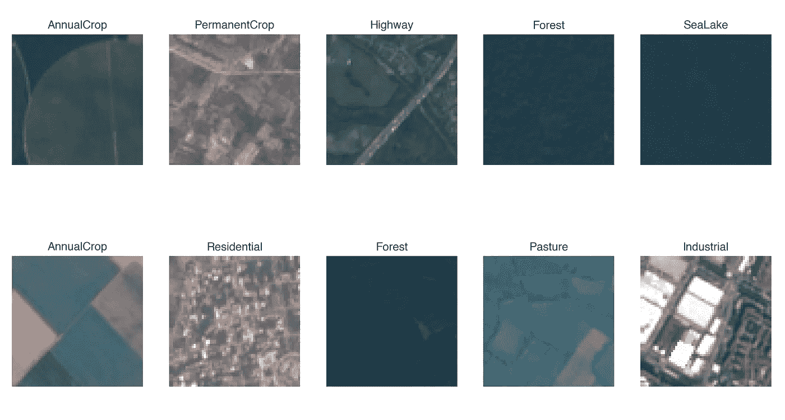
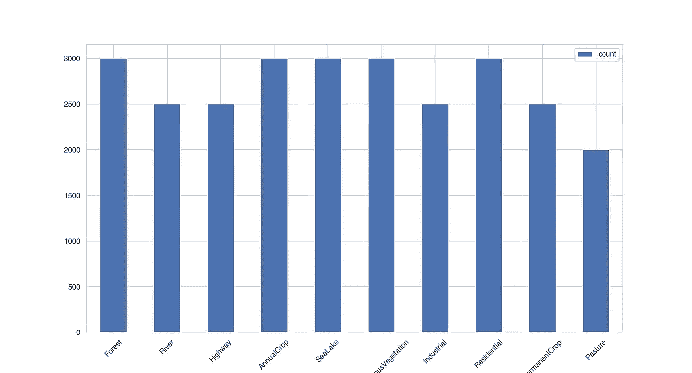
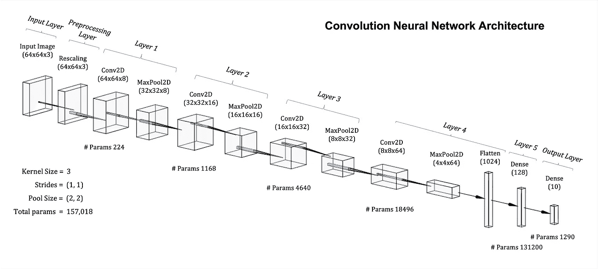
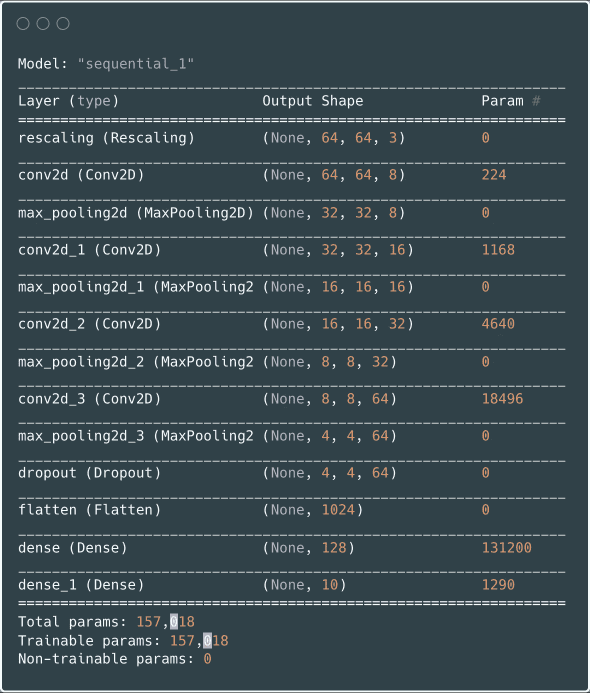
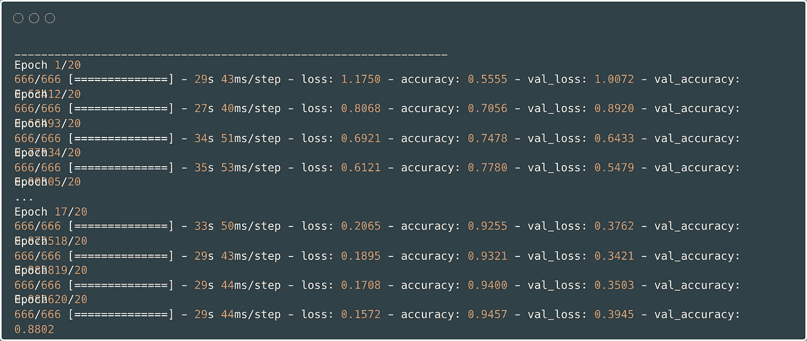
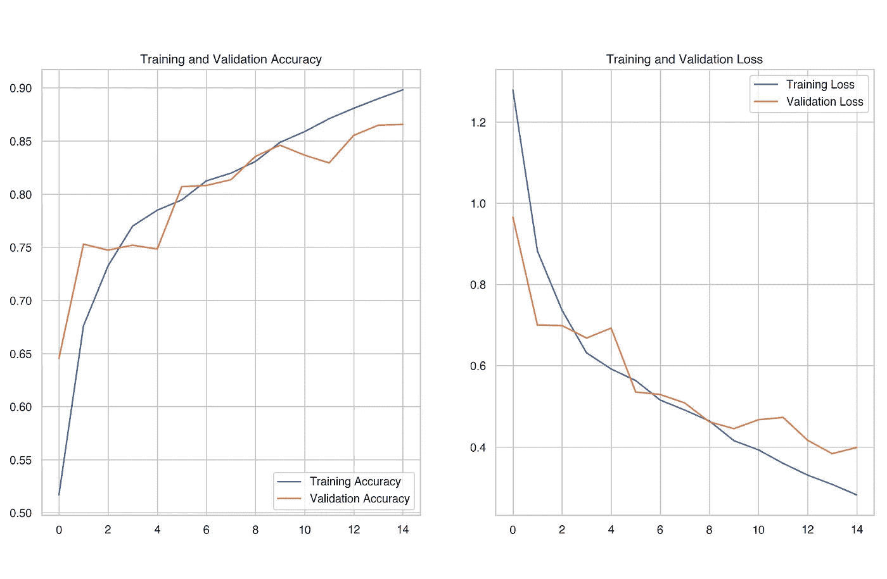
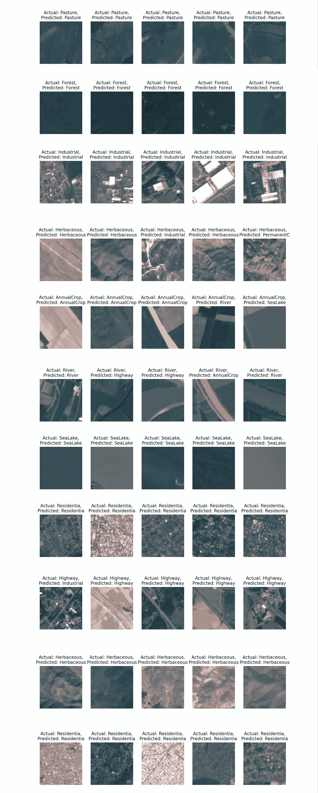
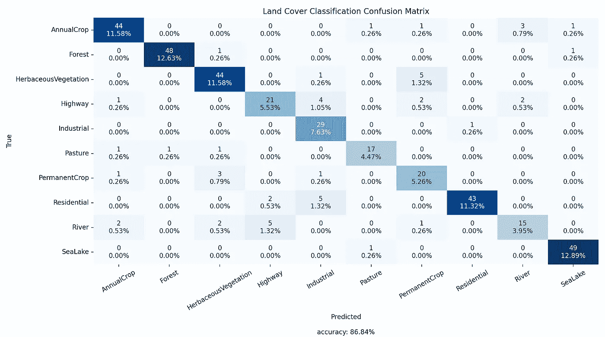
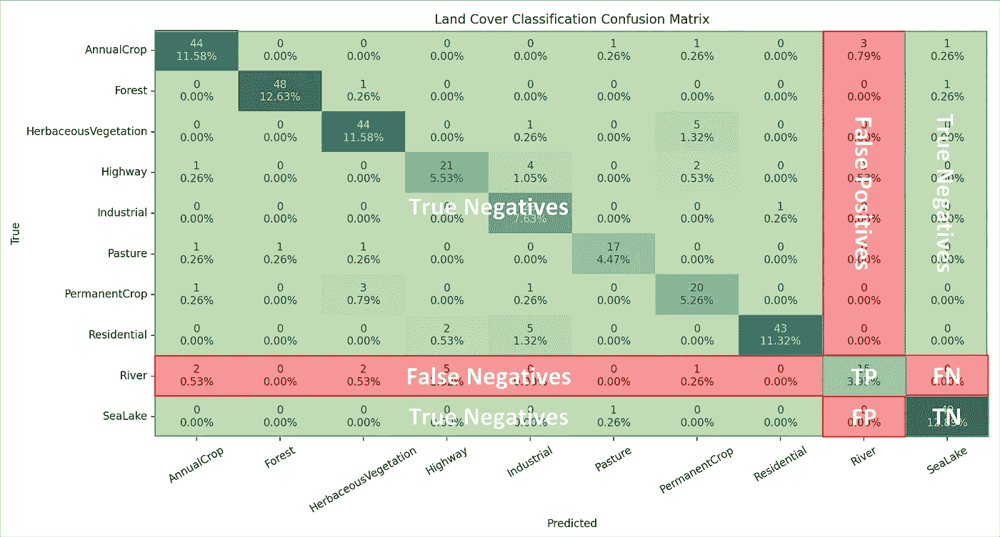

# 基于 Python 语言的张量流 CNN 土地覆盖图像分类

> 原文：<https://towardsdatascience.com/land-cover-classification-using-tensorflow-in-python-791036eaa373>

## 使用张量流卷积神经网络的欧洲卫星土地覆盖图像分类

## 介绍

**土地覆盖**是探测到的地球表面的*生物物理覆盖*，包括草、森林、牧场、水等物质。吸收土地覆被信息的方法多种多样。一个主要过程包括使用**遥感图像**结合**实地调查**。


美国宇航局在 [Unsplash](https://unsplash.com?utm_source=medium&utm_medium=referral) 拍摄的照片

## 资料组

**欧洲卫星数据集**由来自**哨兵-2** 卫星图像的瓦片组成。数据集**公开**到[下载](https://github.com/phelber/EuroSAT)。

图 1 显示了从集合中随机选择的 15 个样本，描述了 10 个可能类别中的 8 个。剩下的两个看不见的类是`HerbaceousVegetation`和`River`。



图 1 —欧洲卫星组织样本训练数据(图片由作者提供)

从图 1 中可以看出，每种土地覆被类别之间有明显的视觉差异。因此，一个合理的先验假设预计`Forest`、`Pasture`和`AnnualCrop`类别之间的*潜在混淆*。另外，`Highway`和`River`图像可能趋于相似。然而，一般来说，对于神经网络来说，似乎存在适当的区别属性来充分学习适当的*特征映射*。

图 2 显示了*十个土地覆盖类别*中每个类别的**计数分布**，总共有 *27，000 张*带标签和地理参考的图像。

> 地理参照意味着**航空照片的坐标系统与地理坐标的地面系统**相关。因此，地理信息系统(GIS)可以将图像“放置”在适当的真实位置。



图 2—训练数据计数分布(图片由作者提供)

机器学习任务通常利用**三个数据子集** : *训练、测试和验证* **。**训练/验证/测试百分比分割根据可用数据集的大小而变化:

*   *训练* (60%):标记数据，用于通过反向传播算法进行梯度下降以调整 CNN 的参数
*   *验证* (20%):用于在每个训练周期后确定模型性能指标的标记数据
*   *测试* (20%):用于评估模型功效的看不见的标记数据

要点 1 显示了 **Keras** 实用函数[image _ dataset _ from _ directory](https://www.tensorflow.org/api_docs/python/tf/keras/utils/image_dataset_from_directory)，该函数加载目录结构与文档匹配的图像文件。

要点 1 —使用 Tensorflow 加载训练/验证数据集

加载图像后，检查数据并确定有用的变量。例如，使用以下命令查找类的**名称**和**编号**:

```
class_names = **train_dataset.class_names**
num_classes = **len(class_names)**
```

上面使用的 Keras 函数批量加载数据。从`BatchDataset`检索单个体积，检查输入和输出形状以及图像值范围，如要点 2 所示。

要点 2——用于`BatchData`检查的 Python 代码

根据要点 2 的规定，*批量= 32* 。因此，输入`image_batch`是一个`(32, 64, 64, 3)`张量，其中图像是`*64 (height) x 64 (width) x 3 (RGB channels)*`。每个图像都有一个对应的**整数标签**用于类别识别，因此`label_batch`的形状为`(32)`。

## 预处理

数据预处理是指为建立和训练机器学习模型准备原始数据。随后，卷积神经网络(CNN)模型执行欧洲卫星土地覆盖分类。

输入图像是张量，可解释为 8 位无符号整数(十进制 0 到 255)的 NumPy 数组。因此，r **escaling** 从 0–255 到 0–1**的值提高了性能和训练稳定性。**

Keras 提供了一个`[Rescaling](https://www.tensorflow.org/api_docs/python/tf/keras/layers/Rescaling)` **预处理层**，它将输入值修改为一个新的范围。使用下面的 Python 代码定义该图层。

```
rescaling_layer = layers.experimental.preprocessing.**Rescaling**(
    **scale**=1\. / 255,
    **input_shape**=(img_height, img_width, 3)
)
```

输入图像的每个值都乘以`scale`。

## 模型架构

随着预处理的完成和 CNN 训练可接受格式的数据，下一步是定义**网络架构**。图 3 图示了*六层*模型架构。

> 当计算 CNN 网络的深度时，我们只考虑具有可调/可训练权重/参数的层。⁵



图 3-土地覆盖分类的卷积神经网络结构(图片由作者提供)

基本张量流 CNN 模型通常采用相同的元素。这些层包括:

*   `[Conv2D](https://www.tensorflow.org/api_docs/python/tf/keras/layers/Conv2D)`层*幻灯片* **内核** *，*例如八个*滤波器*以给定的*步距*穿过输入图像 *(3x3)，*提取适合于解决分类问题的特征。通过**卷积**操作，或者更准确地说是*互相关*来进行特征提取。过滤器在模型编译期间被随机初始化。
    *通过反向传播学习滤波器参数，在训练网络时提取输入图像的本质特征。*
*   `[MaxPooling2D](https://keras.io/api/layers/pooling_layers/max_pooling2d/)`层对像素组进行操作，例如*(2 x2)**，并通过**选择最大值**来过滤值。汇集*在保持特征信息的同时，对输入图像尺寸进行向下采样*。*填充*可维持或减缓空间尺寸的缩小；然而，“`valid`就是没有填充的意思。*
*   *`[Dense](https://keras.io/api/layers/core_layers/dense/)` : *“只是你的正则密连 NN 层”。**

*Gist 3 给出了定义**tensor flow**`Sequential`*CNN*模型的 Python 代码。*

*Gist 3 —使用 Python 中的 Keras 定义的 CNN 架构*

*模型编译`model.compile()`包括定义:*

*   *`optimiser=’adam’` : [**Adam**](https://keras.io/api/optimizers/adam/) 是一种*随机梯度下降(SGD)* **优化**方法，其本质上是*基于损失函数的反向传播输出来更新可训练参数*。*
*   *`loss=’**SparseCategoricalCrossentropy**`':计算标签和预测之间的交叉熵**损失**。`[SparseCategoricalCrossentropy](https://www.tensorflow.org/api_docs/python/tf/keras/losses/SparseCategoricalCrossentropy)`损失适用于标签类别计数≥2，以整数提供。由于模型*不*包含一个 *softmax 层*作为最后一层，`from_logits=True`是必要的，以指示概率没有被归一化。⁴*
*   *`metrics=[‘[**accuracy**](https://www.tensorflow.org/api_docs/python/tf/keras/metrics/Accuracy)’]`:计算预测等于标签的频率，并用于评估训练期间的模型性能。*

*参见本文[文章](https://medium.com/@andrewdaviesul/chain-rule-differentiation-log-loss-function-d79f223eae5)确定如何推导分类应用的二元(0 或 1)交叉熵损失函数。*

*[](https://medium.com/@andrewdaviesul/chain-rule-differentiation-log-loss-function-d79f223eae5) [## 二元交叉熵分类损失函数的推导

### 逻辑回归机器学习任务中使用的对数损失函数的导数。

medium.com](https://medium.com/@andrewdaviesul/chain-rule-differentiation-log-loss-function-d79f223eae5) 

图 4 是`model.summary()`的输出。层、输出形状和参数计数与图 3 中所示的等效。



图 4——CNN 模型总结(图片由作者提供)* 

## *培养*

*训练可以使用下面的 Python 代码开始，因为训练/验证数据在 TensorFlow `BatchDatasets`结构和定义的模型架构中。*

```
*# number of training cycles
epochs = 15# trains the model for 15 iterations on the dataset
history = **model.fit**(
    train_dataset,
    validation_data=validation_dataset,
    epochs=epochs
)# save model
model.save(f'{os.getcwd()}/land_cover_model')*
```

*许多网络**超参数**，如*学习率、*历元数*、*批量*、*隐含层数和单元数、*都是**通过试错调整**。尝试使用不同的超参数来提高分类性能。**

*图 5 是**装配**期间**控制台日志**输出的片段。它显示了定型数据集和验证数据集的损失。*

**

*图 5 —模型拟合的详细输出(图片由作者提供)*

*图 6 绘出了感兴趣的训练*度量*，训练和验证**精度**，以及训练和验证**损失**。随着时间的推移，网络通过反向传播学习合适的`Conv2D`过滤器权重，以最小化损失，随着损失的减少，模型的准确性增加。*

*最终的训练和验证准确率分别约为 **90%** 和**86%**。*

**

*图 6 —培训和验证指标的图表(图片由作者提供)*

## *预言；预测；预告*

*在训练土地覆盖分类网络之后，进一步的测试通常是有价值的。如前所述，数据集的一个保存部分(约为 *20%* )保留下来，用于对**不可见数据**进行额外评估。*

*首先，使用与图 3 中相同的代码加载数据集，除了更新后的 path 变量指向测试文件夹。使用以下命令从磁盘加载**预训练的 Keras 模型**:*

```
*# load keras model and print summary
model = keras.models.load_model('path/to/model')
model.summary()*
```

*随着模型加载到内存中，可以进行**预测**。Gist 4 详细描述了用于迭代*测试图像*的`BatchDataset`并进行预测的 Python 代码。*

*要点 4——用于`BatchDataset Iteration`预测的 Python 代码(图片由作者提供)*

*对于每个推理`model.predict()`返回与每个类别相关联的类别可能性的概率的*数组。概率指数最高的是模型的整数标签预测，`argmax()`提取这个位置。**

*图 7 显示的是 CNN 的预测。*

**

*图 7-CNN 土地覆盖等级预测(图片由作者提供)*

## *估价*

*一个**混淆矩阵**是一个评估分类准确度*的可用度量。*通过一个模型预测类列表、`y_pred`和一个实际类别列表，SciKit-Learn Python 库`y_true`具有一个内置函数来快速计算矩阵。*

*图 8 是从测试数据集的预测中生成的混淆矩阵。*

**

*图 8-土地覆被混淆矩阵(图片由作者提供)*

*矩阵的每个**行**表示**实际**类，而每个 ***列*** 描述了 ***预测*** 类。*

*   *True Positive ( **TP** ):标识正确预测的类。TPs 位于实际值和预测值交点处的矩阵对角线上。*
*   *True Negative ( **TN** ):指定正确预测的负类。TNs 是所有列和行的值的总和，不包括当前类。*
*   **误报* ( **FP** ):误报类，当前列的和减去 TP 值*
*   **假阴性* ( **FN** ):一个错误预测的阴性类，除 TP 值外对应的类行总和*

*以`River`类为例，图 9 描绘了度量细目: ***TP = 15*** ， ***TN = 350*** ， ***FP = 5*** 和 ***FN = 10*** *。**

**

*图 9-河流等级的混淆矩阵分解(图片由作者提供)*

*最初，可以预见的是`Highway`组和`River`组之间的混乱。根据混淆矩阵，模型*错误地将* f *ive 河流标注为高速公路(* ***漏报*** *)。*同样，*两条高速公路被误划为河流(* ***误报*** *)* 。*

*总的来说，预测**精度**在 **86%** 左右，如图 8 所示，并且在训练期间确定的预期值附近。准确度的提高当然是可能的。*欧洲卫星 paper⁷* 报告高*九十*范围内的性能指标值。**实验**用 CNN 网络架构和超参数调谐来增强结果。*

## *结论*

**本文展示了如何用 Python 实现卷积神经网络，用于卫星影像土地覆盖分类。**

*找到下面使用的所有 Python 代码。感谢阅读。*

*[](https://medium.com/@andrewdaviesul/membership) [## 通过我的推荐链接加入媒体-安德鲁·约瑟夫·戴维斯

### 作为一个媒体会员，你的会员费的一部分会给你阅读的作家，你可以完全接触到每一个故事…

medium.com](https://medium.com/@andrewdaviesul/membership)* 

## *CNN 培训的 Python 代码(要点 5)*

*Gist 5 — CNN 土地覆盖分类培训*

## *CNN 预测的 Python 代码(要点 6)*

*要点 5 — CNN 对土地覆盖分类的预测*

## *参考*

*[1] [Eurosat:土地利用和土地覆盖分类的新型数据集和深度学习基准](https://arxiv.org/abs/1709.00029)。帕特里克·赫尔伯，本杰明·比斯克，安德烈亚斯·登格尔，达米安·博斯。IEEE 应用地球观测与遥感选题期刊，2019
【2】[euros at | tensor flow 数据集](https://www.tensorflow.org/datasets/catalog/eurosat)(2022 年 2 月)
【3】[地理配准](https://serc.carleton.edu/research_education/geopad/georeferencing.html) —用 GeoPads 教学
【4】[from _ logits = True 在 SparseCategoricalcrossEntropy loss 函数中做什么？](https://datascience.stackexchange.com/questions/73093/what-does-from-logits-true-do-in-sparsecategoricalcrossentropy-loss-function) —数据科学栈交换(2020 年 4 月)
【5】[统计 CNN 层数](https://stackoverflow.com/a/65061642/12040795)。ran mal de wage—stack overflow
【6】[EuroSAT 公开可用数据集](https://github.com/phelber/EuroSAT)—GitHub.com
【7】[介绍 euros at:一种新型数据集和深度学习基准，用于土地利用和土地覆盖分类](https://ieeexplore.ieee.org/document/8519248)。帕特里克·赫尔伯，本杰明·比斯克，安德烈亚斯·登格尔。2018 IEEE 国际地球科学与遥感研讨会，2018。*