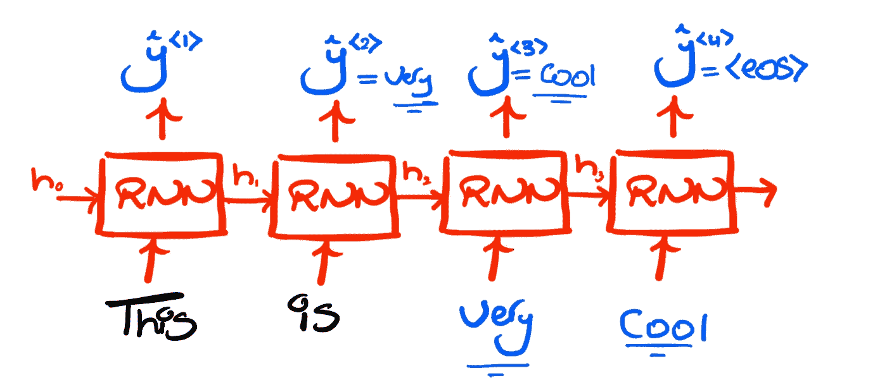
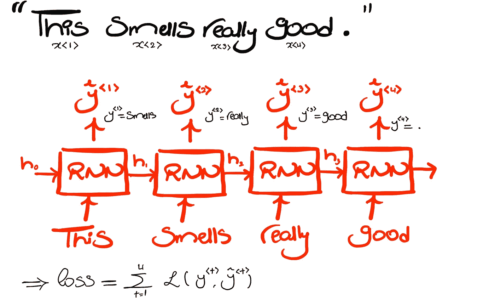
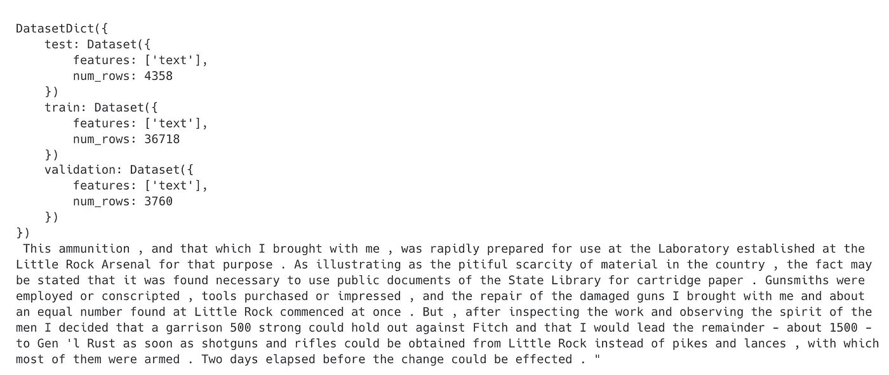
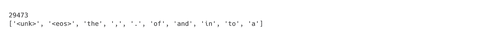
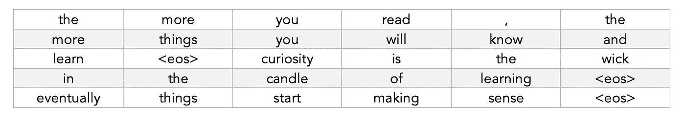
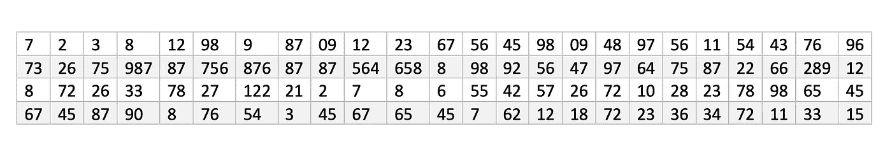
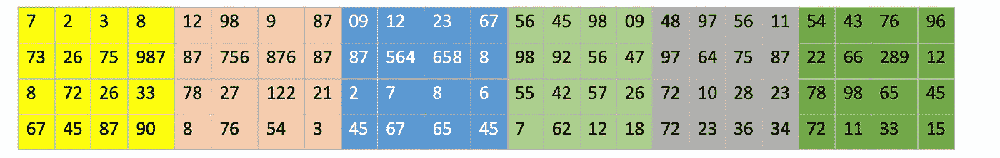
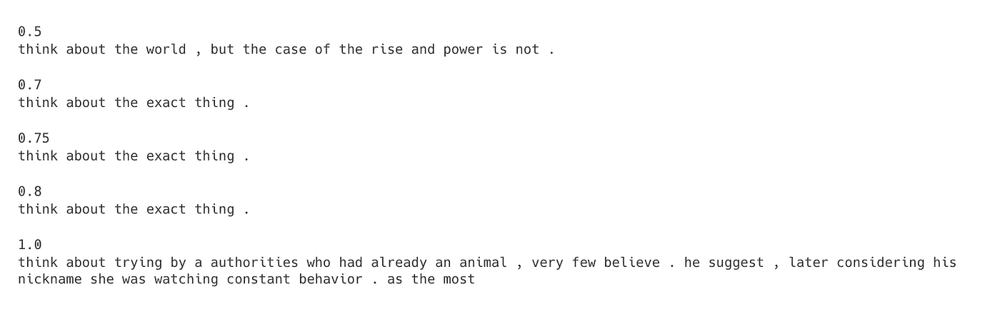

# PyTorch 中 LSTMs 的语言建模

> 原文：<https://towardsdatascience.com/language-modeling-with-lstms-in-pytorch-381a26badcbf>

## “学习如何在这种类型中保护他们的感情，这本身就是一个自信的例子，”这位模特说。

在前三个故事中，我们从理论角度讨论了很多关于 RNNs 和 LSTMs 的内容。在这个故事中，我们将通过在 PyTorch 中使用 LSTMs 实现一个英语语言模型来弥合实践之间的差距。

## 什么是语言模型？

语言模型是已经学会估计记号序列的概率的模型。它可以使用这些事实来执行序列生成。也就是说，**给定任何初始令牌集**，它可以预测在所有可能的令牌中，**最有可能跟随**的是哪个**令牌**。这意味着，我们可以给模型一个单词，并让它生成一个完整的序列，方法是让它重复生成下一个单词，给出目前为止的前一个单词。

给定“这是”的初始表征，模型将以如下方式进行推理:

这张图片和所有其他图片都是作者的

注意，一旦模型产生一个特殊的句子结束标记<eos>，我们就停止给它输入前一个标记。这假设模型是在所有以这个标记结尾的序列上训练的，所以它知道什么时候输出它。另一种方法是仅在模型生成大量令牌后停止模型。</eos>

您可能已经猜到，语言模型的一个应用是自动完成。他们可以学习帮你写电子邮件、代码、莎士比亚的书，只要你训练他们。

## 我们如何建立一个语言模型？

任何语言模型都与一个**词汇表**相关联，它从这个词汇表中抽取标记。对于英语单词级语言建模，如果这样的词汇表有 100K 个单词，那么给定任何初始单词集，模型必须选择哪一个(在 100K 个中)来预测为下一个单词。

因此，我们可以通过使用具有分类头的 LSTM 网络来建立语言模型。也就是说，输出层应该是一个 Softmax，它为词汇表中的每个单词分配一个概率。然后，可以通过选择与最高概率相关联的预测来为下一个字选择最佳预测，或者更经常地，只是随机采样 Softmax 输出分布。

为了训练模型，我们所需要的是一大堆有许多序列的文本作为我们的数据集。假设“这个闻起来真香。”是其中的一个序列，那么模型可以按照下面的方式进行训练

在每个时间步中，我们查看预测的令牌是否确实是下一个令牌，并相应地计算损失。注意训练标签也是如何从语料库中获得的；对于语料库中任何长度为 T 的序列，前 T-1 个单词构成输入序列，后 T-1 个单词构成目标序列(标签)。在这个意义上，训练一个语言模型可以说是自我监督的。

现在您已经理解了什么是语言模型，让我们开始构建一个吧！我们将使用 WikiText-2 数据集，该数据集来自维基百科上的许多精彩文章。

## 我们来编码吧！

这将是我们的管道。我们将使用笔记本代码快照来回顾和解释其中的每个步骤。也可以笔记本格式[在这里](https://colab.research.google.com/drive/15g7-HyNIT35GUXUZ-am3285XmaQB-SSE?usp=sharing)查看。

我们将使用 HuggingFace 中的 [**数据集库**](https://huggingface.co/docs/datasets/index) 来加载和映射数据集， [**Torchtext**](https://pytorch.org/text/stable/index.html) 来标记化数据集并构造词汇， [**PyTorch**](https://pytorch.org/tutorials/) 来定义、训练和评估模型。 [tqdm](https://tqdm.github.io/) 的目的只是在培训和评估过程中显示进度条。

除了导入之外，我们还设置了一个设备变量，我们将在后面的函数中使用它来确保计算在 GPU 上进行(如果可能的话),我们还设置了一个种子值，这样我们就可以在需要的时候重现结果。

**加载数据集**

电池输出

为了加载数据集，我们使用来自**数据集的 *load_dataset()* 函数。**有两个 [WikiText 数据集](https://huggingface.co/datasets/wikitext)，一个旧版本:WikiText-103，一个新版本:WikiText-2。每一个都有一个原始版本和一个稍微预处理的版本。我们选择了新数据集的原始版本，因为稍后我们将自己处理预处理。

来自 *load_datasets* 的输出已经为我们拆分了训练、测试和验证集。要打印一个示例，我们首先选择三个集合中的一个，然后选择对应于该示例的行，然后选择我们要打印的特征(列)的名称。这里，数据集总是有一个“文本”列，对应于维基中的一段/一段文本。如果你试图改变索引，你可能会注意到有时没有段落，而是一个空字符串，所以我们将不得不在以后处理这个问题。

**对数据集进行标记**

下一步是标记数据集中的每个序列。为此，我们从第 1 行的 torchtext 中获取一个标记化器，然后定义一个函数，给出一个带有特征“text”的示例，返回一个带有特征“tokens”的示例，其中包含文本的标记化。

所以如果文本是“有意义的”然后函数会返回["it "，" makes "，" sense "，]. "]

我们没有实现自己的记号赋予器，因为像这样的内置记号赋予器通常是为处理特殊情况而精心设计的。

在第三行中，我们使用 datasets 库中的 map 函数对每个示例应用 tokenize_data 函数。map 需要将示例和标记器一起传递给 tokenize_data，因此我们也在 *fn_kwargs* 中传递标记器。此时，我们不再需要文本列，所以我们删除了它。

这一步非常重要，因为 LSTM/RNN 逐个符号地考虑序列。所以它必须被分解成我们可以迭代的记号。

**构建词汇**

电池输出

在第一行中，我们告诉 torchtext 将任何在数据集中出现至少三次的单词添加到词汇表中，因为否则它会太大(记住它的长度将是输出分类层中神经元的数量),并且有些单词很少出现。然后，我们手动添加一个<unk>标记，并将 is 设置为默认索引，这样每当我们从词汇表中请求一个单词的索引时，就会得到<unk>。</unk></unk>

在第 4 行，我们还插入了一个<eos>令牌。我们稍后会将它插入到每个序列的末尾，这样当它生成的序列应该结束时，模型会学习产生它。</eos>

如单元格输出所示，词汇表长度约为 30K，我们注意到，通过打印词汇表中的前 10 个元素，词汇表中确实有<unk>和<eos>。“itos”是指“字符串的索引”。</eos></unk>

**实现数据加载器**

PyTorch 中的 dataloader 是一个给定数据集的函数，它为您提供了一种迭代批量数据集的方法。在批处理中，所有示例都是并行处理的。

这里我们定义一个做 4 件事的函数:

1-它给每个标记化文本序列附加一个<eos>标记来标记它的结束。(第 5 行)</eos>

2-它将每个标记编码成一个数值，该数值等于它在词汇表中的索引。请注意，在数据集中出现少于三次的标记将映射到未知标记。(第 6 行)

3-它将所有的数字序列组合成一个列表(1D 张量)。(第 2 行，第 8 行)

4-它将其重新成形为维度为[批量大小，数量批次]的 2D 张量(第 10 行，第 11 行)

为了进一步澄清，假设数据集只包含来自 Wiki 的三段文本，它们是

> 你读得越多，你知道和理解的东西就越多
> 
> “好奇心是学习之烛的灯芯”
> 
> “最终事情开始变得有意义”

然后，该函数给定批量为 5，返回 2D 张量数据**的形式为**

但是有更多的列和数字而不是单词。我们一会儿会看到如何用这个来训练我们的模型。现在，让我们在训练集、测试集和验证集上应用这个函数。

**定义模型**

我们将要建立的模型将对应于上图。三个关键组件是[嵌入层](https://pytorch.org/docs/stable/generated/torch.nn.Embedding.html)、 [LSTM 层](https://pytorch.org/docs/stable/generated/torch.nn.LSTM.html)和分类层。我们已经知道了 LSTM 和分类层的用途。嵌入层的目的是将每个单词(作为索引给出)映射到一个 E 维的向量中，其他层可以从中学习。不确定向量或等效的单热点向量被认为是差的表示，因为它们假设单词彼此之间没有关系。这种映射也是在训练期间学习的。

作为正则化的一种形式，我们将在嵌入层、LSTM 层和输出层之前使用丢弃层。

关于上述模型的实现，有几点需要强调:

1.  *平局 _ 砝码*的争论。这样做的目的是使嵌入层与输出层共享权重。这有助于减少参数的数量，因为[已经表明](https://paperswithcode.com/method/weight-tying)输出权重在某种意义上也学习单词嵌入。请注意，要做到这一点，隐藏层和嵌入层的大小必须相同。
2.  *self.init_weights()* 调用。我们将初始化权重，如本文中的[所示。它们声明在范围[-0.1，0.1]内统一初始化嵌入权重，并且在范围[-1/sqrt(H)，1/sqrt(H)]内统一初始化所有其他层。要将此应用于 LSTM，我们必须遍历其每一层，以初始化其隐藏到隐藏和隐藏到下一层的权重。](https://arxiv.org/abs/1708.02182)

我们还实现了一个函数，将 LSTM 的隐藏和单元格状态设置为零。

最后，我们将在 LSTM 类下实现的最后一个函数是 detach_hidden

我们在训练时将需要这个函数来明确地告诉 PyTorch，由于不同的序列导致的隐藏状态是独立的。现在不要担心它。

**超参数调整&模型初始化**

请注意，我们将嵌入和隐藏维度设置为相同的值，因为我们将使用权重绑定。

在这里，我们初始化模型、优化器和损失标准。我们还计算出参数数量为 47M。

现在我们准备开始训练。但在此之前，让我们回过头来，记住我们的数据结构。

回想一下，我们有一个[batch _ size =*128*，num _ batches =*16214*张量，它看起来类似于

这里[批次大小=4，批次数量=24]

还记得 LSTM 将形状为[N，L，E]的张量作为输入，其中 N 是批量大小，L 是序列长度，E 是序列中每个元素的长度(嵌入长度)。因此，我们需要决定一个序列长度(L ),我们需要将数据集分成该序列的多个块，然后一个接一个地输入它们。如果我们决定对上表取 L=4，那么模型在 6 次迭代中对所有数据进行训练，因为每种颜色对应于“一批序列”,这是到模型的一次前馈传递。

是的，这意味着将输入模型的一些序列可能涉及原始数据集中不同序列的部分，或者是一个序列的子集(取决于序列长度 L)。由于这个原因，我们以后将只在每个时期重置隐藏状态，这就像假设下一批序列可能总是原始数据集中前一批序列的后续。

我们所做的被称为“通过时间窗口使用固定反向传播”,这只是处理我们不能有一批长度不等的序列的问题的方法之一。

现在，因为我们还没有执行将数据集分成“L 序列批次”的步骤，所以我们将定义一个函数，该函数在给定批次中第一批标记的索引的情况下返回相应的序列批次。

该函数采用[batch_size，num_batches]格式的数据集、序列长度和索引，并返回与 LSTM 的输入和目标相对应的序列批次。

**培训&评估模型**

在这里，第 4 行将模型设置为 training mode to train mode(因此没有禁用 dropout)。第 6 行到第 8 行确保数据集可以分解成长度为 seq_len (L)的批。

在 for 循环中，我们考虑了在非索引[0，seq_len，2*seq_len，..]其中的每一个都将被提供给 **get_batch** 函数，因此它返回输入(src)和标签(trg)的相应批次序列，如第 16 行所示。两者都有维度*【批量大小，序列长度】。*

在 for 循环的前两行中，我们将前一批的梯度归零，并分离其隐藏状态。

我们在第 20 行中得到的预测具有维度*[批处理大小，序列长度，vocab 大小]，*我们将其整形为*[批处理大小*序列长度，vocab]* ，并将目标平坦化为*[批处理大小*序列长度]。*在这种情况下，损失函数需要目标和预测。

在第 25 行中，我们计算网络中的梯度，然后剪切所有超过“剪切”的梯度，以避开爆炸梯度。在第 27 行我们更新了权重，在第 28 行我们计算了损失。Loss.item()将总损失除以 batch_size 和 sequence_length，再乘以 seq_len，这样我们最终可以计算每个序列(而不是每个令牌)的平均损失。

如果你在 Google Colab 上得到一个 Nvidia T4，在上面的超参数设置下，训练需要大约 2 个半小时。

评估循环类似于训练循环，只是我们不再需要反向投影或跟踪梯度。

现在我们需要调用这两个函数

在这里，我们使用 ReduceLROnPlateu，在没有改进的每个时期之后，将学习率降低 2 倍。在这种情况下，我们很可能在最小值附近振荡，所以是时候减速了。

我们还保存具有最高验证损失的模型，并返回困惑度，该困惑度是损失的增函数，用于度量模型的置信度。

**推论**

这是我们管道的最后一步！

在这里，我们将提示、标记化、编码并输入到模型中以获得预测(这是逻辑，记住 Softmax 应用于损失函数)。因此，我们随后应用 Softmax，同时指定我们希望得到序列中最后一个单词的输出，该输出表示对下一个单词的预测。

我们将对数除以温度值，通过调整 Softmax 概率分布来改变模型的置信度。我建议[检查一下这个](https://lukesalamone.github.io/posts/what-is-temperature/)，了解更多关于效果的信息。

一旦我们有了 Softmax 分布，我们就对它进行随机采样，以预测下一个单词。如果我们得到了<unk>，那么我们会再试一次。</unk>

一旦我们得到<eos>，我们就停止预测。</eos>

我们将预测解码回第 24 行和第 25 行的字符串。

输出

就是这样！恭喜你完成了故事的结尾。在你离开之前，让我们回顾一下这个故事的**要点**

1.  语言模型只是一个带有分类头的 RNN，它被训练来预测大型文本语料库中的下一个标记(通常是标记)。
2.  一旦经过训练，该模型就能感知不同序列的概率。因此，给定初始记号集，模型可以生成后续记号，以便最终的序列是有意义的。
3.  给定一个大的文本语料库，在我们开始训练之前，我们需要对它进行标记、编码并将其置于正确的形状。
4.  剩下的部分来自于你在 PyTorch 上实现深度学习模型的普通经验

这将使我们的故事结束。如果你发现这很有用，那么记住你可以通过留下一些掌声来帮助它到达其他人那里。下次见，再见。

**参考书目:**[https://github.com/bentrevett/pytorch-language-modeling](https://github.com/bentrevett/pytorch-language-modeling)

**数据集**:“wiki text 2.0，指针哨兵混合模型，作者:Stephen Merity 和 Xiong 以及 James Bradbury 和 Richard Socher，根据[知识共享署名-共享许可协议(CC BY-SA 4.0)提供](https://creativecommons.org/licenses/by-sa/4.0/)”