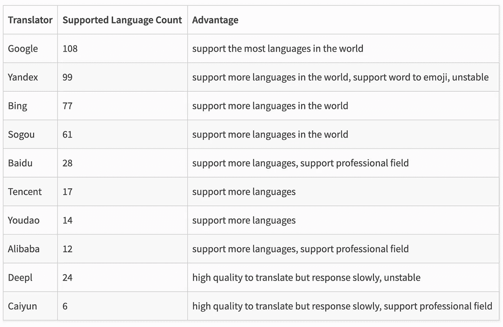
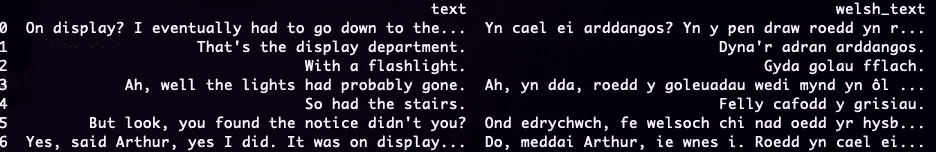

# 使用 Python 进行语言翻译

> 原文：<https://towardsdatascience.com/language-translation-using-python-bd8020772ccc>

## 如何使用大量语言翻译 API 翻译一组散文和/或 XML 页面。


在 [Unsplash](https://unsplash.com?utm_source=medium&utm_medium=referral) 上 [veeterzy](https://unsplash.com/@veeterzy?utm_source=medium&utm_medium=referral) 拍摄的照片

我们经常面临一个问题，要么我们无法理解一段重要的文本，要么我们需要向说另一种语言的人提供信息。虽然在线翻译工具是可用的，但并不总是可以访问它们，或者为我们的客户提供一个静态翻译页面可能更好。

在本教程中，我们将了解不同的翻译 API，如何在 Python 中使用它们，以及如何使用 BeutifulSoup 来翻译 HTML 网页或 XML 文档中的文本。

# 安装库

为了完成我们的翻译，我们使用了`translate-api` python 库。这为许多可用的翻译 API 提供了一个有效的接口。

```
pip install translators --upgrade
```

# 选择翻译者

我们从选择一名翻译开始。虽然谷歌翻译经常是我们的默认选择，但也有一些更精确的选择:



来源:[https://pypi.org/project/translate-api/](https://pypi.org/project/translate-api/)

值得注意的是，更具体的翻译者也支持他们翻译的专业领域——这确保了翻译与从特定领域内的文档(语料库)中导出的翻译相匹配。

下面给出了两个示例，并在指定查询时使用“professional_field”参数提供。

```
baidu: ('common','medicine','electronics','mechanics')caiyun: ("medicine","law","machinery")
```

# 构建查询

现在，我们已经选择了一个翻译 API，我们加载我们的脚本，并解决如下。

```
import translators as ts
ts.<api_name>(..)                          # e.g. ts.google
```

## 选择语言

有几种语言可供我们互译。要检查我们是否对这两个感兴趣，我们可以选择我们的翻译器并运行以下命令:

*注意译者姓名前的下划线！*

```
**ts._<translator_name>.language_map** # e.g. ts._google.language_map
```

这为我们提供了每种包含的语言的键的字典，以及表示它们可能被翻译成什么的值。

对于 Google，我们也可以查看下面的语言支持页面:

<https://cloud.google.com/translate/docs/languages>  

## 查看选项

如果我们决定使用 Google API 进行翻译，我们可以使用 help 函数:`help(ts.google)`来决定我们需要哪些参数。下面列出了比较常见的几种。

*   **query_text** :这是我们正在翻译的默认字符串
*   **from_language** :默认为“自动”，使用 apo“猜测”语言
*   **to_language** :默认情况下，所有翻译都是英语(`en`)
*   **超时**:在它放弃之前我们想要等待的时间。默认值为无(未指定)
*   **sleep_seconds** :如果执行多个请求，可能值得将这些请求隔开，以防止淹没服务器并导致它们被拒绝。

## 翻译一个短语

我们从常见的测试短语“狐狸跳过懒狗”开始，并将其翻译成威尔士语`(cy)`:

```
phrase = 'The quick brown fox jumps over the lazy dog.'ts.google(phrase, from_language='en', to_language='cy')
```

这将返回:*" maer llwynog brown cy flym yn neid io dros y ci diog。"*

由于我不会说威尔士语，我可以通过翻译来测试译文的情感:

```
phrase = "Mae'r llwynog brown cyflym yn neidio dros y ci diog."ts.google(phrase)
```

我们得到一个与原字符串非常相似的翻译:“快速的棕色狐狸跳过懒惰的狗。”

***注:*** *很像汉语中的悄悄话，有某些语言的细微差别，在翻译中往往会丢失。这意味着我们不太可能得到准确的原始短语。*

## 批量翻译

对于多个段落，我们可以将数据分组，并使用列表理解来遍历它们。这对于大型文档很有用，因为 google 有 5000 个字符的限制。

举个例子，我们从道格拉斯·亚当的《银河系漫游指南》中选了几行:

```
corpus = ["On display? I eventually had to go down to the cellar to find them.","That's the display department.","With a flashlight.","Ah, well the lights had probably gone.","So had the stairs.","But look, you found the notice didn't you?","Yes, said Arthur, yes I did. It was on display in the bottom of a locked filing cabinet stuck in a disused lavatory with a sign on the door saying 'Beware of the Leopard'"]
```

我们现在可以依次翻译它们，使用:

```
welsh = [ts.google(phrase, from_language='en', to_language='cy') for phrase in corpus]
```

## 翻译数据帧

如果我们的信息包含在 pandas 数据框中，我们选择一个单独的列并对其应用翻译功能:

```
import pandas as pd
df = pd.DataFrame(corpus, columns = ['text'])df['welsh_text'] = df['text'].apply(**lambda** x: ts.google(x, from_language='en', to_language='cy'))
```



以上命令的输出示例。

# 页面翻译:HTML / XML

通常，这不仅仅是我们需要翻译一份文本文档那么简单。例如，我们网站上的信息可能需要提供给其他国家或团体。对于这种情况，我们可以使用 BeutifulSoup 提取我们的元素，并在原位替换它们。

## 装置

为此，我们安装了 Beautiful Soup 4:

```
pip install bs4
```

<https://beautiful-soup-4.readthedocs.io/en/latest/>  

## HTML 模板示例

使用一些早期的翻译，我们随机分配一组元素威尔士语翻译从希区柯克指南摘录。

```
html = '''<html><head><title>That is the display section.</title></head><body><p>So got the stairs.</p><p>Yes, said Arthur, yes I did. It was displayed at the bottom of the locked filing cabinet stuck in a dormant toilet with a sign on the door saying 'Be wary of the leopard'</p></body></html>'''
```

## 编写美丽的汤

我们首先决定哪些元素包含我们的文本。在这个例子中，只有段落和标题字段，但是，它们可以用属性或类来标记。

然后我们读取代码(我们的汤)，提取这些元素，使用`Navigatable String`属性并应用一个适当的`replace_with`来替换我们的翻译。

```
**from** bs4 **import** BeautifulSoup
soup = BeautifulSoup(**html**, 'html.parser')**elements** = ['p','title']for i in soup.findAll(elements):
   i.string**.replace_with**(*ts.google(i.string,from_language='cy',    to_language='en')*)print(soup)
```

运行它将返回翻译了`p`和`title`元素的原始文档:

```
<html><head><title>That is the display section.</title></head><body><p>So got the stairs.</p><p>Yes, said Arthur, yes I did. It was displayed at the bottom of the locked filing cabinet stuck in a dormant toilet with a sign on the door saying 'Be wary of the leopard'</p></body></html>
```

# 结论

在本教程中，我们介绍了通过 python 使用几种语言翻译 API，以及如何翻译数据框中的文本。最后，我们看了如何使用 Beautiful Soup 从 XML 模板中提取文本并生成翻译。希望本教程有助于使文本更容易理解。