# 伯特的语言理解

> 原文：<https://towardsdatascience.com/language-understanding-with-bert-c17a453ada1a>

## 最有用的深度学习模型

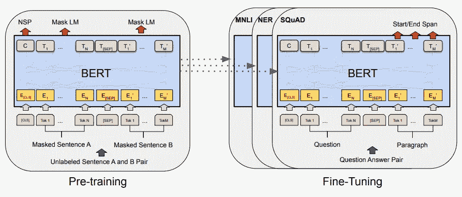

BERT 模型及其训练过程的示意图(来自[1])

# 伯特是什么？

来自变压器的双向编码器表示(BERT) [1]是一种流行的深度学习模型，用于许多不同的语言理解任务。BERT 与 transformer 编码器共享相同的架构，并在被微调以解决下游任务(例如，问题回答、句子分类、命名实体识别等)之前，使用自我监督的学习目标对原始的、未标记的文本数据进行广泛的预训练。).在提出这个建议的时候，BERT 在 11 个不同的语言理解任务上获得了一个新的最先进的技术，促使其几乎立即成名，并一直持续到现在。

BERT 令人难以置信的有效性源于:

1.  通过自我监督学习对大量原始文本数据进行预训练
2.  为序列中的每个标记制作丰富的双向特征表示

尽管以前的工作表明语言建模任务受益于大型文本语料库的预训练，但 BERT 通过制作一套简单而有效的自我监督预训练任务扩展了这一想法，使相关特征能够被学习。此外，BERT 摆脱了使用单向自我关注的常见做法，这种做法通常被用来在这种语言理解任务中进行语言建模式的预训练。相反，BERT 在其每一层中都利用了双向自我注意，揭示了双向预训练对于实现强大的语言表达至关重要。

伯特很有用。在这一点上，你可能想知道:*为什么你要把整个帖子都放在这个模特身上？*简单的答案是 BERT 非常通用，这种单一模型架构可用于解决数量惊人的不同任务，具有最先进的准确性，包括标记级(如命名实体识别)和句子级(如情感分类)语言理解任务。此外，它的使用已经扩展到自然语言处理(NLP)领域之外，以解决多模态分类[2]、语义分割[3]等问题。

声称一个单一的深度学习模型是“最有用的”有点夸张(尽管它是一个很好的缩略图！).然而，对于任何深度学习实践者来说，BERT 无疑是最重要的工具之一。简而言之，这种架构只需对特定任务进行最少的修改，就可以下载(即，预先训练的参数可以在线获得)并以较低的计算成本进行微调，以解决 NLP 及其他领域的一系列潜在问题*它是深度学习的“瑞士军刀”*！

# 伯特的积木

在概述 BERT 体系结构的细节之前，理解 BERT 所基于的核心组件和思想是很重要的。这些主要概念可以归结为以下几点:

*   (双向)自我关注
*   变压器编码器
*   自我监督学习

## 自我关注

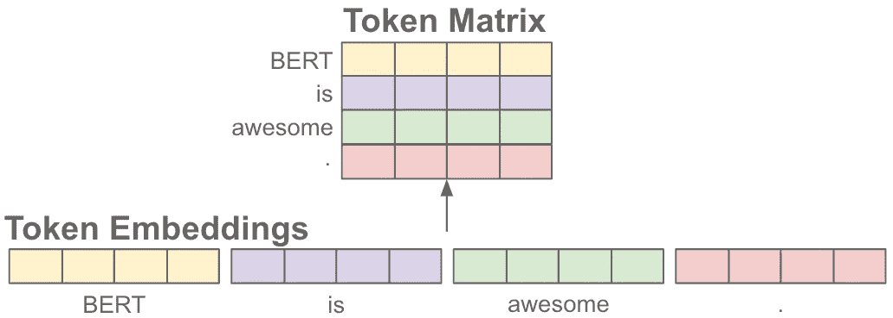

令牌嵌入序列的不同表示(由作者创建)

我已经在[以前的帖子](https://cameronrwolfe.substack.com/i/74325854/self-attention)中概述了自我关注背后的基本思想，但是我将在这里提供另一个更具体的关于这个概念的讨论。在高层次上，自我关注是一种非线性转换，它将一系列“标记”(即，序列中的单个元素)作为输入，每个标记都表示为一个向量。与该输入序列相关的矩阵如上所述。然后，这些记号表示被转换，返回一个新的记号表示矩阵。

**在这种转变中会发生什么？** 对于每一个单独的记号向量，自我注意做了以下事情:

*   将该标记与序列中的所有其他标记进行比较
*   为每一对计算关注分数
*   根据序列中的其他标记调整当前标记的表示，并通过关注分数进行加权

直观上，自我注意只是根据序列中的其他标记来调整每个标记的向量表示，形成一个更具上下文感知的表示；见下文。

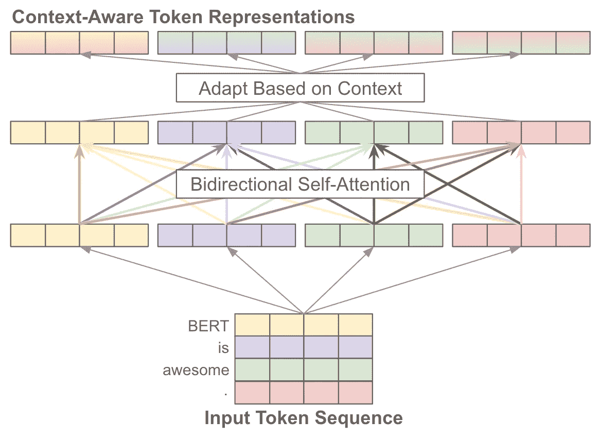

双向自我关注根据每个标记与序列中所有其他标记的关系来调整每个标记的表示(由作者创建)

**多个注意头。**自我关注通常以多头方式实现，其中多个自我关注模块在将它们的输出连接起来之前被并行应用。自我注意的机制在每个单独的注意头中仍然是相同的，尽管在应用自我注意之前，标记向量将被线性投影到更低的维度(以避免计算成本的过度增加)。

这种多头方法的好处在于，多头注意力层中的每个注意力头可以学习基础序列中的不同注意力模式。因此，该模型不会受到可以在单个自我关注层内“关注”的其他表征的数量的瓶颈或限制。相反，不同的头部中的每一个都可以捕获不同的令牌关系模式。

**单向与双向。**当制作序列中每个标记的上下文感知表示时，在定义该上下文时有两个基本选项:

*   考虑所有令牌
*   考虑当前标记左边的所有标记

如下图所示，这些选项产生了两种不同的自我关注:双向和单向。

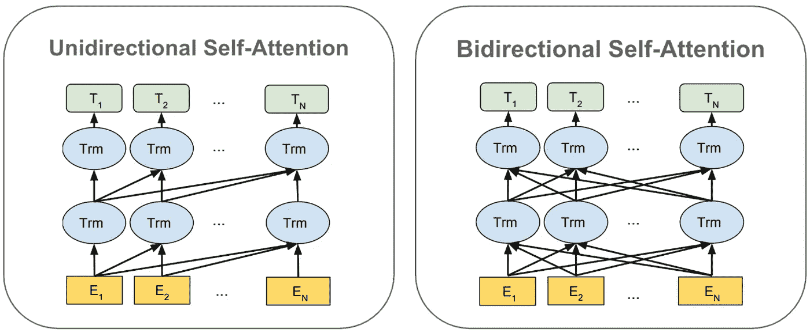

单向与双向自我关注(来自[1])

单向自我注意确保每个标记的表示只依赖于序列中在它之前的那些标记(即，通过在自我注意期间仅仅“屏蔽”序列中后来的标记)。对于像语言建模这样的应用程序来说，这种修改是必需的，因为语言建模不允许在序列中“向前看”来预测下一个单词。

相比之下，双向自我注意基于序列中的所有其他表征来制作每个表征。这种自我关注的双向变化是 BERT 成功的关键，因为许多以前的建模方法:

1.  利用单向自我关注[4]
2.  通过在向前和向后两个方向上串联句子的单向表示，精心制作了浅的双向特征[5]

这些方法远不如 BERT 使用的双向自我注意有效，双向自我注意强调双向特征表示在语言建模以外的任务中的好处。

## 变压器编码器

变压器架构[6]通常有两个组件——编码器和解码器。然而，BERT 只使用转换器的编码器组件，如下所示。

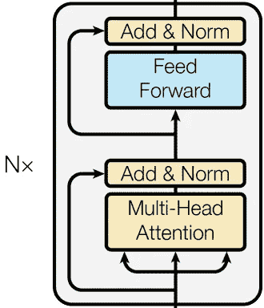

变压器编码器(来自[6])

可以看出，transformer encoder 只是几个具有(双向、多头)自关注和前馈变换的重复层，每个层之后是[层归一化](https://leimao.github.io/blog/Layer-Normalization/)和[剩余连接](/what-is-residual-connection-efb07cab0d55)。够简单！

**为什么只有编码器？**你可以看我的[上一篇文章](https://cameronrwolfe.substack.com/p/vision-transformers)来更深入地讨论变压器，但是变压器架构的两个组件倾向于服务于不同的目的。

*   **编码器:**利用双向自我注意将原始输入序列编码成一系列有区别的标记特征。
*   **解码器:**获取丰富的编码表示，并将其解码为新的所需序列(例如，将原始序列翻译成另一种语言)。

在 BERT 的例子中，我们将在本文的剩余部分看到这种解码过程是不必要的。BERT 的目的是简单地制作这种初始的编码表示，然后可以用于解决不同的下游任务。

## 自我监督学习

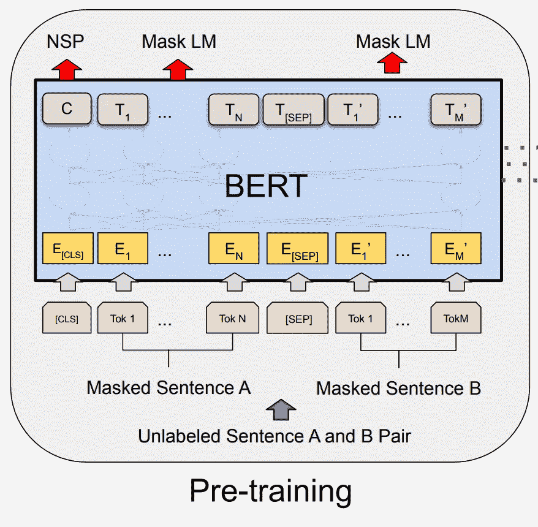

BERT 的自我监督预培训(来自[1])

伯特令人难以置信的表现的一个关键因素是它能够以自我监督的方式进行预先训练。在高层次上，这样的训练是有价值的，因为它可以在原始的、未标记的文本上执行。因为这种类型的数据可以在网上广泛获得(例如，通过在线图书储存库或维基百科等网站)，所以可以收集大量文本数据的[语料库](https://www.merriam-webster.com/dictionary/corpus)进行预训练，使 BERT 能够从比大多数监督/标记数据集大几个数量级的多样化数据集进行学习。

虽然存在许多自我监督培训目标的例子，但我们将在本帖中进一步概述的一些例子包括:

*   **屏蔽语言建模(MLM):** 屏蔽/删除句子中的某些单词，并尝试预测它们。
*   **下一句预测(NSP):** 给定一对句子，预测这些句子在文本语料库中是否前后连贯。

这些任务都不需要任何人工注释。相反，它们可以用未标记的文本数据来执行。

**这是无监督学习吗？**这里值得区分的一点是自监督学习和无监督学习的区别。无监督和自我监督学习都不利用标记数据。然而，虽然无监督学习专注于发现和利用数据本身中的[潜在](https://www.dictionary.com/browse/latent)模式，但自监督学习却发现一些已经存在于数据中的监督训练信号，并将其用于训练，因此不需要人工干预。这种区别是微妙的，但(幸运的是)T4·伊桑·米斯拉在莱克斯·弗里德曼的播客 T7 中对此进行了精彩的描述和解释。点击查看时间戳[。](https://www.youtube.com/watch?v=FUS6ceIvUnI&t=147s)

# 伯特实际上是如何工作的…

尽管到目前为止，我们已经概述了 BERT 背后的一些基本思想，但在这一节中，我将更详细地描述 BERT，重点放在它的架构和训练方案上。

## 伯特的建筑

如前所述，BERT 的架构只是转换器模型[6]的编码器部分(即，仅编码器转换器架构)。在最初的出版物中，提出了两种不同大小的 BERT(尽管现在有更多的 BERT 存在):

*   **BERT 基:** 12 层，768 维隐藏表征，每个自我关注模块中 12 个关注头，110M 参数。
*   **BERT Large:** 24 层，1024 维隐藏表征，每个自我注意模块中 16 个注意头，340M 参数。

值得注意的是，BERT Base 与 OpenAI 的 GPT [7]大小相同，这使得模型之间可以进行公平的比较。

**为什么会这样不一样？**BERT 和之前提出的语言理解模型(如 OpenAI GPT)的主要区别在于双向自我注意的使用。以前的工作，尽管利用了自我监督的预训练，但只使用单向的自我注意，这严重限制了模型可以学习的表征的质量。

> “凭直觉，有理由相信深度双向模型比从左到右模型或从左到右和从右到左模型的浅层连接更强大。”—来自[1]

**构建输入序列。**直觉上，伯特把一些文本序列作为输入。特别是，这个序列通常是一个单句或一对两个，连续的句子。

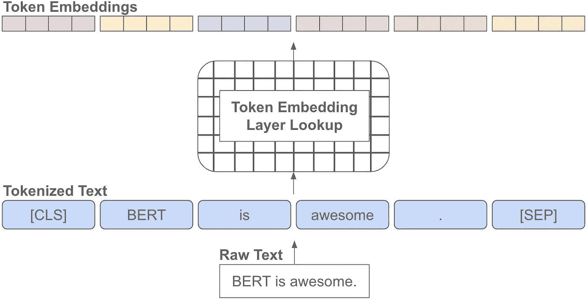

将原始文本转换为 BERT 中的一系列嵌入标记(由作者创建)

这个高层次的想法很简单，但是您可能想知道:*我们如何从原始文本中得到 BERT 兼容的输入序列？*这个过程可以分为几个步骤:

*   **标记化:**原始文本数据被分解成代表单词或单词部分的单个标记或元素。
*   **插入“特殊”记号:** BERT 的输入序列以一个`[CLS]`记号开始，以一个`[SEP]`记号结束，表示一个句子的开始/结束。如果使用两个连续的句子，另一个`[SEP]`符号被放置在它们之间。
*   **嵌入:**将每一个 token 转换成其对应的 WordPiece [8]嵌入向量。
*   **附加嵌入:**输入数据现在是一个向量序列。可学习的嵌入被添加到该序列中的每个元素，表示该元素在序列中的位置以及它是第一句还是第二句的一部分。这样的信息是需要的，因为自我注意不能区分一个元素在序列中的位置。

按照这些步骤，原始文本数据被转换成可以被 BERT 接收的向量序列。上图描述了标记化、插入特殊标记和嵌入过程，而下图描述了附加嵌入过程。

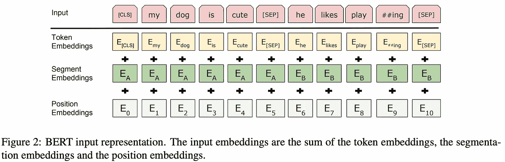

(来自[1])

BERT 的嵌入过程在文章中有很好的解释，但是我在这里推荐文章[以获得更多关于标记化的细节。](/how-to-build-a-wordpiece-tokenizer-for-bert-f505d97dddbb)

## 训练伯特

BERT 的培训过程分两步进行:

1.  预培训
2.  微调

这些步骤之间的架构几乎相同，尽管可以使用一些小型的特定任务模块(例如，MLM 和 NSP 都使用单个附加分类层)。

**前期培训。**在预训练过程中，使用两种不同的任务在未标记的数据上训练 BERT 模型:MLM(也称为完形填空任务[9])和 NSP。值得注意的是，BERT 不能用先前工作中使用的典型的语言建模目标来训练，在先前的工作中，模型迭代地试图预测序列中的下一个单词。双向自我注意的使用将允许伯特通过简单地观察和复制下一个记号来作弊。

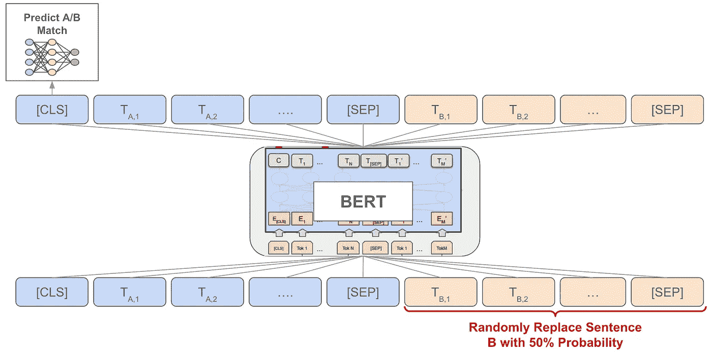

NSP 自我监督的伯特训练前任务(由作者创建)

如上图所示，NSP 任务非常简单。来自预训练语料库的连续句子被传递到 BERT 中(即，句子 A 和 B)，并且 50%的时间第二个句子被另一个随机句子替换。然后，`[CLS]`标记的最终表示在经过 BERT 处理后，通过一个分类模块，该模块预测输入的句子是否是实际的匹配。

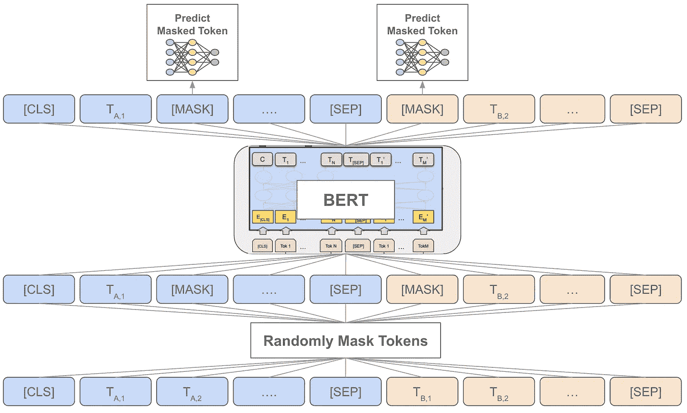

MLM 自我监督的伯特训练前任务(由作者创建)

上面描述的 MLM 不像 NSP 那样是一个序列级的任务。它随机屏蔽输入序列中 15%的标记，用特殊的`[MASK]`标记替换它们。然后，这些`[MASK]`记号中的每一个的最终表示通过分类层来预测被屏蔽的单词。然而，作者不是总是以这种方式屏蔽标记，而是在 80%的时间里用`[MASK]`替换每个标记，在 10%的时间里用随机标记替换，在 10%的时间里用原始标记替换。实现这样的修改是为了避免`[MASK]`令牌出现在预训练中而不是微调中的问题。

使用这些任务，BERT 在由[书籍语料库](https://huggingface.co/datasets/bookcorpus)和英语维基百科组成的语料库上接受预训练。有趣的是，使用文档级语料库(与混排句子的语料库相反)有助于预训练的质量。你的语料库需要句子之间的长期依赖关系，以便 BERT 学习最好的可能特征。这一有趣的发现也为后来的工作所证实。事实上，即使根据 [TF-IDF](https://nlp.stanford.edu/IR-book/html/htmledition/tf-idf-weighting-1.html) 分数对随机打乱的句子进行重新排序，以形成合成的长期依赖关系，也能提高预训练质量[10]。

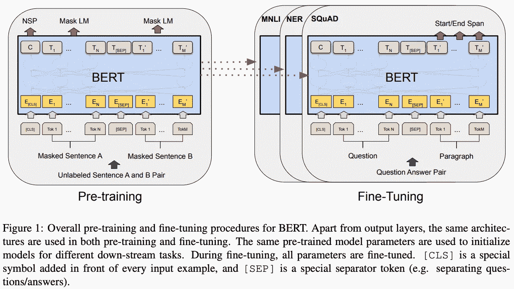

(来自[1])

**微调。**BERT 中的自我关注机制的构建使得对不同种类的下游任务建模尽可能简单。在大多数情况下，只需将任务的输入输出结构与 BERT 的输入输出结构相匹配，然后对所有模型参数进行微调。下图中也描述了这方面的一些例子，包括:

*   **标记级任务:**正常地处理序列，然后将每个标记的输出表示通过一个单独的模块来执行给定标记的预测。
*   **语句/文档级任务:**正常处理您的序列，然后将`[CLS]`标记的输出表示(输入序列的聚合嵌入)通过一个单独的模块进行序列级预测。
*   **文本对任务:**在 BERT 的输入结构中将文本对的每个部分编码为“句子 A”和“句子 B”，然后将`[CLS]`令牌的输出表示通过一个单独的模块，以基于您的文本对执行预测。

上面列出的一般任务结构应该证明 BERT 是一个通用的模型。许多不同的任务可以通过简单地将它们映射到 BERT 的输入-输出结构来解决，并且相对于预训练需要最小的架构修改。下面是可以用 BERT 解决的不同语言理解任务的例子。

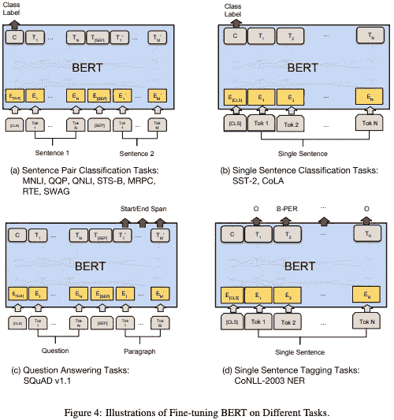

(来自[1])

在微调过程中，所有 BERT 参数都以端到端的方式进行训练。与预训练相比，BERT 的微调过程并不昂贵。事实上，论文本身的所有结果用单个 GPU 复制不到 2 小时。不信的话，[自己试试](https://github.com/huggingface/transformers/tree/main/examples/pytorch/text-classification)！

# 伯特可能是自面包片以来最好的东西！

在结束这个概述之前，我想概述一下用 BERT 取得的一些经验结果。虽然人们可以很容易地阅读论文本身来查看结果，但我认为它们值得简单介绍一下，原因只有一个，即*强调 BERT 在 NLP 任务方面有多好*。下面概述了 BERT 在各种不同任务上取得的结果。

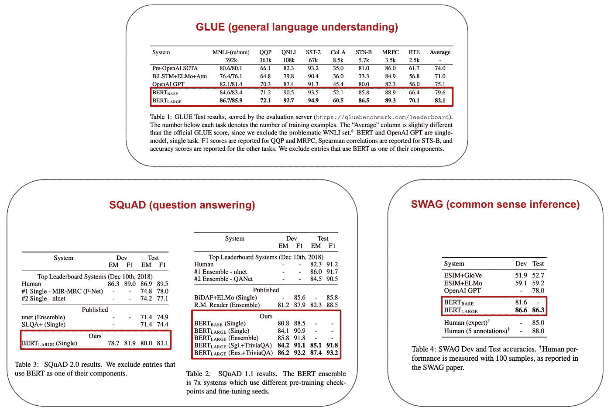

不同下游任务的 BERT 性能(来自[1])

你可能会注意到 BERT 在这些实验中表现的一些有趣之处——它从未被超越(除了人类，但只是在某些情况下)。在发表的时候，BERT 在 11 个不同的 NLP 基准测试上设定了一个新的最先进的标准。此外，这些任务中的大多数都是由特定于特定任务的专用模型解决的，而 BERT(正如您在本概述中看到的)是一个通用的语言理解模型，可以应用于许多不同的任务。

BERT 实证评估的其他一些有趣发现如下:

*   在[1]中考虑的所有任务上，BERT Large 和 BERT Base 都显著优于所有以前的方法。
*   BERT Large 在所有任务上明显优于 BERT Base，在训练数据很少的任务上表现尤其出色。
*   移除 NSP 或 MLM(即，通过使用单向语言建模目标)显著恶化了 BERT 性能。

尽管更大的模型在小数据集上表现更好可能看起来违反直觉(即，这似乎是[过度拟合](https://www.ibm.com/cloud/learn/overfitting)的方法)，但使用 BERT 获得的结果表明，如果有足够的预训练，使用更大的模型有利于低资源任务(即，那些几乎没有训练数据的任务)。

> “我们相信，这是第一次令人信服地证明，如果模型已经过充分的预训练，扩展到极端模型大小也会导致非常小规模任务的巨大改进。”—来自[1]

# 外卖食品

尽管考虑到当前深度学习研究的步伐，BERT 是一个相对较老的模型，但我希望这篇概述适当地强调了该模型的简单性和深刻性。BERT 是一个非常强大的工具，使用起来既简单又便宜。

**是什么让伯特如此强大？**BERT 的关键在于两个核心概念:双向自我关注和自我监督学习。BERT 部分地改进了现有方法，因为它抛弃了使用单向自我注意进行语言建模风格的预训练的常见方法。相反，BERT 利用双向自我注意来制定一组自我监督的预训练任务，从而产生更健壮的特征表示。最近，研究人员表明，这些自我监督任务本身的形成——而不仅仅是用于预训练的大量数据——是 BERT 成功的关键[10]。

**普通修行者可以用这个吗？**使用 BERT，您可以简单地:

1.  [在线下载](https://huggingface.co/transformers/v3.3.1/pretrained_models.html)预先训练好的模型
2.  [微调](https://huggingface.co/docs/transformers/training)该模型，在数量惊人的 NLP 任务上实现一流的性能

微调 BERT 在计算上是廉价的，并且可以用相对最少的硬件设置(例如，单个 GPU)来执行。因此，对于任何深度学习实践者来说，BERT 都是一个非常好的工具，你会惊讶于 BERT 是你最佳选择的不同任务的数量。

**延伸阅读。**在这篇综述中，我只介绍了一篇论文，但是 BERT 已经被无数的后续出版物所扩展。下面列出了我最喜欢的几个:

1.  [ELECTRA:预训练文本编码器作为鉴别器而不是生成器](https://arxiv.org/abs/2003.10555)(提出了一个新的预训练任务，能够训练高性能、较小的 BERT 模型)
2.  [ALBERT:一个用于语言表示的自我监督学习的 Lite BERT】(提出了参数缩减技术，使 BERT 预训练更快，占用的内存更少)](https://arxiv.org/abs/1909.11942)
3.  [维尔伯特:为视觉-语言任务预先训练任务不可知的视觉-语言表征](https://arxiv.org/abs/1908.02265)(伯特对联合视觉-语言任务的推广)
4.  [用于对图像和文本进行分类的监督式多模态双变换器](https://arxiv.org/abs/1909.02950)(与上述类似，但专用于对图像和文本的联合输入进行分类)

**个人笔记。BERT 是第一个激发我对深度学习兴趣的模型。虽然我目前的研究更侧重于计算机视觉(或多模态学习，对此 BERT [仍然非常有效](https://arxiv.org/abs/2107.13054)！)，伯特的多才多艺至今让我印象深刻。*行之有效的简单想法是罕见而美好的*。**

## 结论

非常感谢你阅读这篇文章。如果你喜欢它，请在 [twitter](https://twitter.com/cwolferesearch) 上关注我，或者订阅我的[深度(学习)焦点时事通讯](https://cameronrwolfe.substack.com/)，在那里我挑选了一个关于深度学习研究的单个双周主题，提供了对相关背景信息的理解，然后概述了关于该主题的一些流行论文。我是 [Cameron R. Wolfe](https://cameronrwolfe.me/) ，Alegion 的研究科学家，莱斯大学的博士生，研究深度学习的经验和理论基础。也可以看看我在 medium 上的[其他著述](https://medium.com/@wolfecameron)！

## 文献学

[1] Devlin，Jacob 等，“Bert:用于语言理解的深度双向转换器的预训练” *arXiv 预印本 arXiv:1810.04805* (2018)。

[2] Kiela，Douwe 等人，“用于图像和文本分类的监督式多模态双向变换器” *arXiv 预印本 arXiv:1909.02950* (2019)。

[3]郑，，等.“用变形金刚从序列到序列的角度重新思考语义切分”IEEE/CVF 计算机视觉和模式识别会议文集。2021.

[4]拉德福德、亚历克等，“通过生成性预训练提高语言理解”(2018).

[5]巴耶夫斯基，阿列克谢，等.“完形填空驱动的自我注意网络的预训练” *arXiv 预印本 arXiv:1903.07785* (2019)。

[6]瓦斯瓦尼、阿希什等人，“你所需要的只是关注。”*神经信息处理系统进展* 30 (2017)。

[7]亚历克·拉德福德、卡蒂克·纳拉辛汉、蒂姆·萨利曼斯和伊利亚·苏茨基弗。2018.用无监督学习提高语言理解。技术报告，OpenAI。

[8]吴，永辉等.“Google 的神经机器翻译系统:弥合人与机器翻译的鸿沟” *arXiv 预印本 arXiv:1609.08144* (2016)。

[9]威尔逊·泰勒。1953.完形填空程序:测量可读性的新工具。新闻简报，30(4):415–433。

[10] Krishna，Kundan 等人，“下游数据集是非常好的预训练语料库。”arXiv 预印本 arXiv:2209.14389 (2022)。