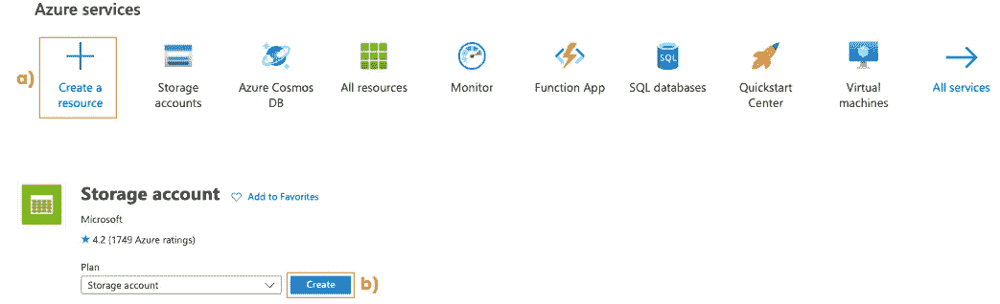
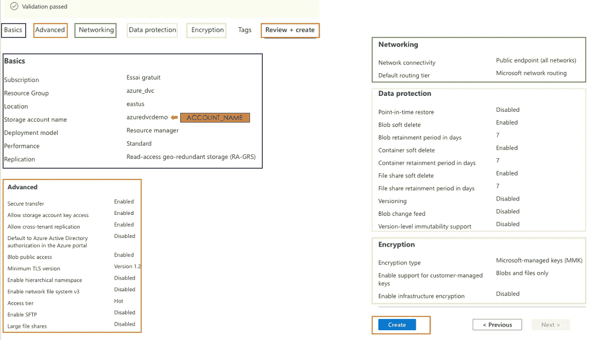
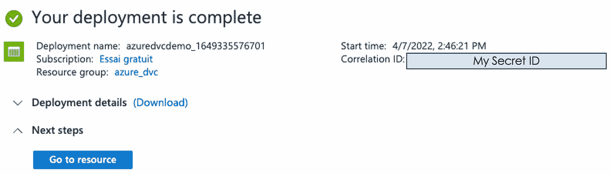
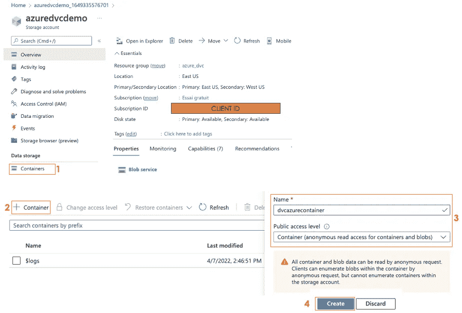
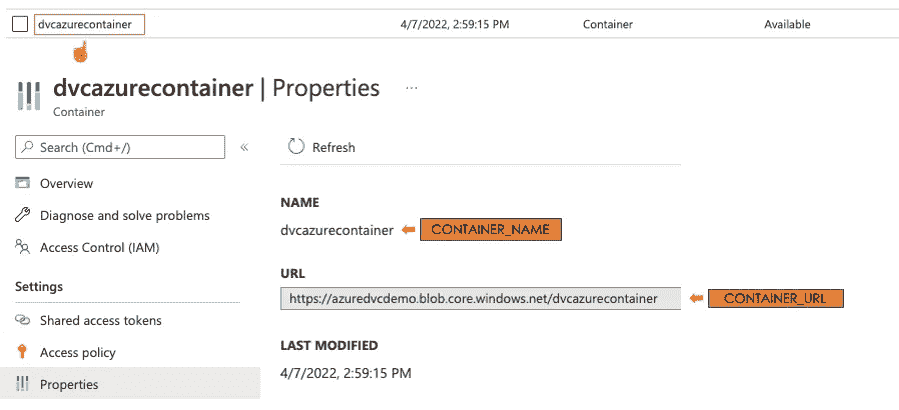
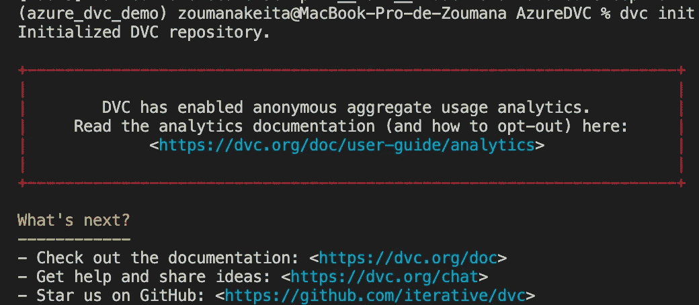
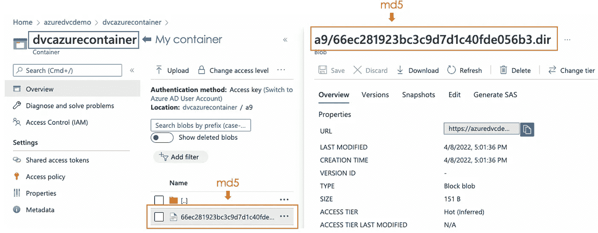

# MLOps —通过 DVC 和 Azure Blob 存储进行数据和模型版本控制

> 原文：<https://towardsdatascience.com/large-data-versioning-with-dvc-and-azure-blob-storage-a-complete-guide-b97344827c81>

## 关于如何跟踪数据的端到端方法—不到 5 分钟！


照片由[法比奥](https://unsplash.com/@fabioha)在 [Unsplash](https://unsplash.com/photos/oyXis2kALVg) 上拍摄

# 介绍

软件工程师主要使用 Git，因为它是源代码版本控制的好方法。另一方面，机器学习从业者可能很容易面临其局限性，因为大多数项目不仅涉及不同版本的源代码，还涉及不同版本的数据和模型。如果没有合适的工具，跟踪哪些数据用于训练哪个模型可能会很快变成一场长期灾难，并带来许多挫折。

接下来是`**Data Version Control**`，或简称为`**DVC**`，我认为它是最伟大的开源工具之一，通过以类似于 Git 的方式处理数据版本，弥合了 Git 和数据科学家之间的鸿沟。

本文旨在为您提供一些使用 DVC 在 Microsoft Azure Blob 存储上对大型数据集进行版本化的实践经验。

# 开始

为了能够成功地进行所有体验，您需要创建一个 Azure 帐户并登录到您的门户网站。

在本节中，我们将从设置 Microsoft Blob 存储开始，然后是 DVC，最后是创建它们之间的交互:从 Blob 存储中推送和提取数据。

## 设置 Azure Blob 存储

设置 Azure Blob 包括两个主要步骤:`1)create a storage account`，`2)create a container inside that storage account`，它将托管我们的数据。

1.  **创建存储账户**

*   选择**创建资源**并搜索`Storage account`，然后选择**创建**按钮。



Azure 存储帐户创建(图片由作者提供)

*   提供每个部分的所有信息后，从**基础**、**高级等。**到**审查+创建**，我得到了我的存储的如下最终配置结果。为了简单起见，我忽略了标记部分。



存储帐户最终配置(图片由作者提供)

*   一旦您对结果感到满意，只需点击**创建**，即可获得以下消息，表明您的存储帐户已成功部署！🎉



存储帐户的成功部署消息(图片由作者提供)

**2。创建存储容器**

通过选择**转到资源按钮，您可以获得以下完整的存储概述。**之后，按照步骤 1 到 4 创建您的容器。



容器创建步骤:1 到 4(图片由作者提供)

创建容器后，您可以选择容器名称`dvcazurecontainer`来获取与其相关的所有细节。



容器详细信息(图片由作者提供)

**注**:记住橙色矩形中的所有大写信息，因为当尝试使用 DVC 连接到 Blob 存储时，这些信息非常重要。

## 建立 DVC

让我们从使用下面的 pip 命令安装 DVC 开始。

```
pip install dvc
```

一旦完成安装 DVC，运行以下命令告诉 DVC，你正在考虑将当前文件夹作为 DVC 文件夹。

```
dvc init
```

前面的命令生成类似下图的输出



同样，它创建了一个**。dvc** 文件夹，以便跟踪我们将添加到远程存储器的文件。

## DVC 与 Azure 博客的互动

现在，我们已经正确配置了 DVC 和 Blob 存储，是时候考虑我们想要跟踪的数据了。

**关于数据**

我实现了以下下载**的脚本。csv** 和**。我的 [Github 账号](https://github.com/keitazoumana/streamlit-spam-detector)中的 pkl** 文件，保存在 **data** 文件夹中，稍后会推送到 DVC。

视频 _ 下载 _ 自 _ 网址. py

项目存储库结构如下所示:

```
|--- AzureDVC
|       |------- .dvc 
|       |------- **data** 
|       |         |---- **spam_detector_model.pkl**
|       |         |---- **spam.csv**
|       |------- download_data.py
```

**导出环境变量**

下一步是配置 Azure credentials 环境变量，DVC 将使用这些变量与 Azure 进行交互。

```
# Environment variables & Exports
CLIENT_ID="your_client_ID"
USERNAME=“your_email”
PASSWORD=“your_password”# Start the exports
export AZURE_CLIENT_ID= CLIENT_ID
export AZURE_USERNAME= USERNAME
export AZURE_PASSWORD= PASSWORD
```

之后，我们为代码可读性设置常量变量。

```
# Constants Variables
ACCOUNT_NAME="azuredvcdemo"
CONTAINER_URL=[https://azuredvcdemo.blob.core.windows.net/dvcazurecontainer](https://azuredvcdemo.blob.core.windows.net/dvcazurecontainer)
CONTAINER_NAME=dvcazurecontainer
```

接下来，设置 blob 存储和 DVC 之间的链接

```
dvc remote add -d zoumanaremote CONTAINER_URLdvc remote modify zoumanaremote url azure://CONTAINER_NAME/dvc remote modify zoumanaremote account_name ACCOUNT_NAME
```

是时候添加我们想要在 Azure Blob 上存储和监控的数据了。这是通过以下命令完成的。

```
dvc add data
```

该指令生成一个 **data.dvc** 文件，其中包含如何访问原始数据的信息，但不提供任何相关信息。这个 **data.dvc** 的内容是这样的:

```
outs:
- md5: a966ec281923bc3c9d7d1c40fde056b3.dir
  size: 20248421
  nfiles: 2
  path: data
```

*   `md5`是使用 DVC 跟踪的原始数据文件夹的哈希值。
*   `size`是数据文件夹中文件的大小。
*   `nfiles`是数据文件夹中文件的数量。在本例中，我们有 2 个文件，一个. csv 文件和一个. pkl 文件。
*   `path`是原始文件夹的路径。

使用以下命令将数据推送到容器中。

```
dvc push
```

从 Azure 门户，我们可以看到已经执行了更改，这可以通过相同的`md5`哈希值的存在来观察。



DVC 将结果从 Azure 门户推送到我的容器中(图片由作者提供)

现在，数据在 Azure Blob 存储上可用。使用下面的命令，您最终可以在需要的时候将它下载到您的本地项目存储库中。

```
dvc pull
```

# 结论

恭喜你！🎉 🍾您刚刚学习了如何使用 DVC 和 Azure Blob 存储进行大型数据监控。我希望你喜欢阅读这篇文章，它给了你所需的技能。请在下面找到更多资源来帮助您进一步学习。

此外，如果你喜欢阅读我的故事，并希望支持我的写作，可以考虑[成为一个媒体成员](https://zoumanakeita.medium.com/membership)。每月支付 5 美元，你就可以无限制地阅读媒体上的故事。通过使用[我的注册链接](https://zoumanakeita.medium.com/membership)，我将获得一小笔佣金。

欢迎在[媒体](https://zoumanakeita.medium.com/)、[推特](https://twitter.com/zoumana_keita_)和 [YouTube](https://www.youtube.com/channel/UC9xKdy8cz6ZuJU5FTNtM_pQ) 上关注我，或者在 [LinkedIn](https://www.linkedin.com/in/zoumana-keita/) 上打招呼。讨论人工智能、人工智能、数据科学、自然语言处理和人工智能是一种乐趣！

再见🏃🏾‍♂️

# 额外资源

[Azure Blob 存储文档](https://docs.microsoft.com/en-us/azure/storage/blobs/)

[授权许可不匹配故障排除](https://nishantrana.me/2020/11/23/fixed-authorizationpermissionmismatch-azure-blob-storage/)

[DVC 文档](https://dvc.org/doc/command-reference/remote/add)