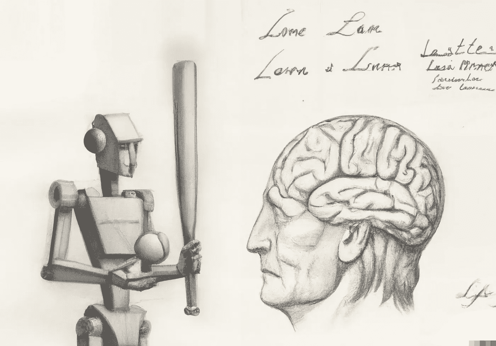
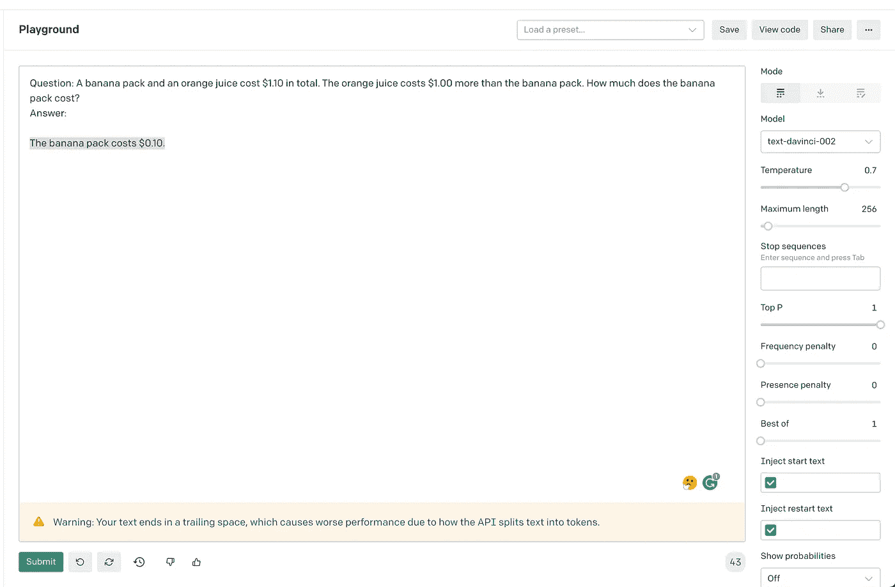
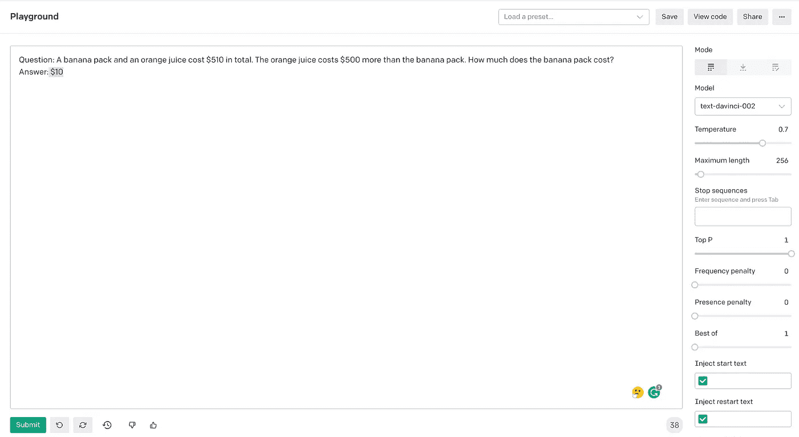
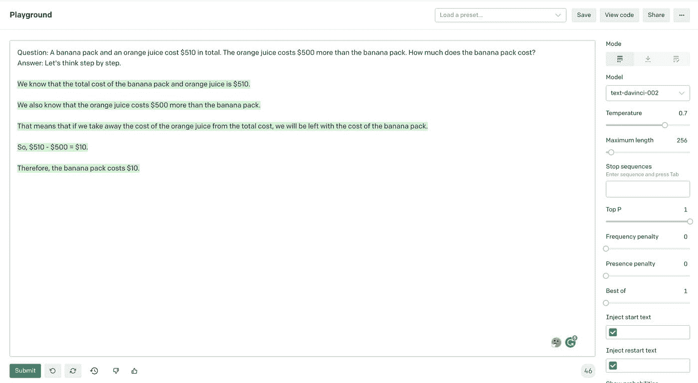
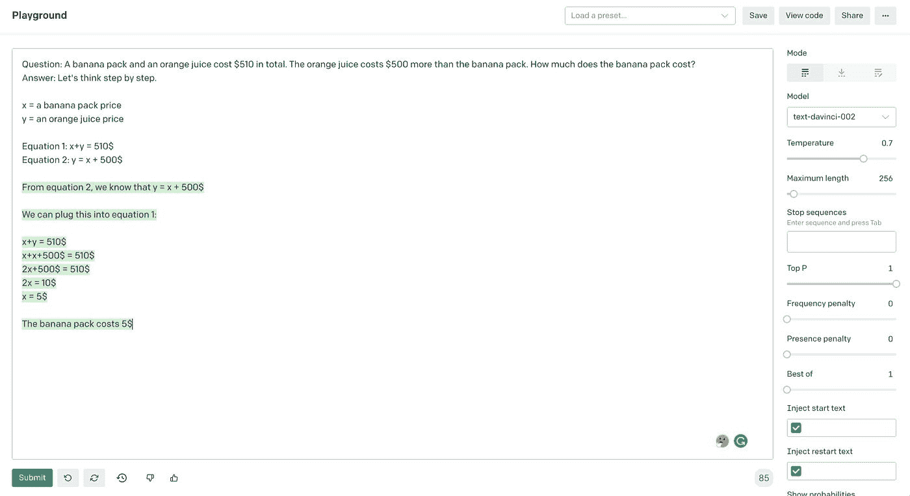
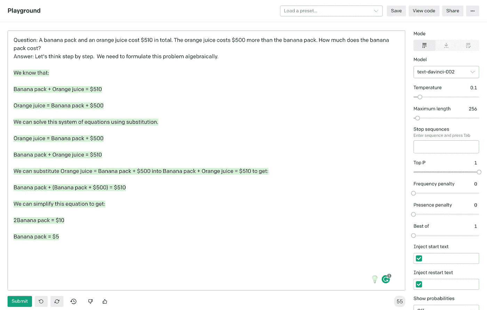

# 大型语言模型和人类思维的两种模式

> 原文：<https://towardsdatascience.com/large-language-models-and-two-modes-of-human-thinking-1322160755e8>

## 与人类相比，GPT-3 如何解决“棒球棍和球”的问题？

图片由作者使用 OpenAI DALLE-2 生成。

我决定测试 GPT-3 将如何解决一个经典的“球棒和球”的难题。它通常用来展示思维系统 1 和系统 2 的区别。它在使用系统 1 时会不会犯和人类一样的错误，最终能不能解决？

**TL；大卫:是的，是的。**

# 两种思维方式

“系统 1 和系统 2”是一个流行的模型，描述了人类决策和推理的两种模式。它是由心理学家基思·斯坦诺维奇和理查德·韦斯特在 2000 年提出的。最近，丹尼尔·卡内曼在《思考，快与慢》一书中推广了这一方法。框架是新的，但背后的思想是旧的。人们很久以前就意识到了本能思维和有意识推理的区别。你可以在威廉·詹姆斯，西格蒙德·弗洛伊德，甚至古希腊哲学家的著作中找到它。

该模型的主要思想是人类有两种思考方式:

系统 1 是快速的，本能的，情绪化的。它自动地、无意识地运转，很少或根本不用努力，也没有自觉控制的感觉。系统 1 本质上是一个强大、快速、节能的模式匹配机器。

系统 2 更慢，更谨慎，更有逻辑性。它消耗更多的能量。它将注意力分配给需要它的费力的脑力活动，包括复杂的计算。它的运作通常与主观经验的代理，选择和集中。而且很贵。

> 系统 1 是自动且快速的，但是容易出错。系统 2 更谨慎、更有意识、更慢，但更准确。

# 大型语言模型是系统 1 模式的良好近似

像 GPT-3 和它的兄弟姐妹这样的大型语言模型已经在系统 1 任务中表现出了优异的性能。例如，它们可以生成与人类书写的文本无法区分的文本，生成看起来自然的问题回答，进行简单的算术、总结和重组。在许多方面，这些模型就像非常强大的模式匹配机器。模式匹配是系统 1 的本质。然而，[大型语言模型在系统 2 任务](https://arxiv.org/pdf/2206.10498.pdf)上表现不佳，比如计划、推理和决策。

对这一事实有许多解释。

一个可能的原因来自它们的自回归操作模式。也就是说，它们根据序列中的前一个标记来预测序列中的下一个标记。当人类用他们的系统 2 思考解决任何问题时，他们本质上是在他们的工作记忆中或使用一些外部媒介进行多步计算。但是 GPT 3 号缺乏这样的工作记忆。它只受到信号通过其层的单次正向传递的限制。它被设计成提供快速、单步的答案。有一些提示编程技术，比如元提示和思想链提示，可以在一定程度上缓解这种情况。它们帮助语言模型“慢下来”，并开始使用其输出作为多步骤系统 2 任务的一种工作记忆。

> “我们需要对 GPT-3 保持耐心，给它时间思考。GPT-3 在写出自己的答案时表现最佳，因为这迫使它大声思考:也就是说，以缓慢而有序的方式写出自己的想法。”[提示编程的方法](https://generative.ink/posts/methods-of-prompt-programming/)。

但是还有一个更深层次的原因。大型语言模型和一般所有现代(自我)监督的机器学习模型本质上都是模式识别系统。Yoshua Bengio 在他的 [2019 NeurIPS 演讲](https://www.youtube.com/watch?v=T3sxeTgT4qc)中谈到了这个话题。它们可能根本不适合系统 2 的任务，我们可能需要人工智能的另一次革命。但这仍然是一个悬而未决的问题。

增强大型语言模型的系统 2 能力是一个活跃的研究领域。

# 一个球和一个球棒的测验

这个测试是由诺贝尔经济学奖得主、心理学家丹尼尔·卡内曼提出的。

测验陈述如下:

> 一个球棒和一个球总共花费 1.10 美元。球棒比球贵一美元。这个球多少钱？

最直接的答案通常是 **0.10 美元**。这是不正确的。当你给一个人多一点时间去思考，就很容易找到正确的答案。也就是 **0.05$** 。

这个测验展示了人类是如何依赖系统 1 而不是系统 2 的。

我决定通过检查 GPT 三号的答案来检验它是否和我们的推理方式相似。

现在，第一个问题是 GPT-3 已经在它的训练集中看到了这个难题。您可以通过让它预测其语句和不同的上下文来轻松检查它:

GPT 三号游乐场截图。图片由作者提供。

> 一个球棒和一个球的测验陈述:
> 
> 一根球棒和一个球总共值 1.10 美元。
> 
> 球棒比球贵一美元。
> 
> **这个球多少钱？**

事实上，它意识到了这一点。因此，为了使模型更难再现它以前简单看到的东西，让我们更改项目的名称。我决定用*一包香蕉*和*橙汁*。健康的选择。看看它会怎么回答:

GPT 三号游乐场截图。图片由作者提供。

> 问题:一包香蕉和一杯橙汁总共要 1.1 美元。橙汁比香蕉包贵 1 美元。香蕉包要多少钱？
> 
> 回答:
> 
> **香蕉包售价 0.1 美元。**

太好了，它提供了相同的答案。现在让我们使实验更清晰，并改变数字:

GPT 三号游乐场截图。图片由作者提供。

> 问题:一包香蕉和一杯橙汁总共要 510 美元。橙汁比香蕉包贵 500 美元。香蕉包要多少钱？
> 
> 答案: **$10**

所以，GPT-3 确实犯了大多数人在使用系统 1 模式时犯的同样的错误。

让我们试着引导它慢慢思考这个问题，不要给出过早的答案。让我们试试东京大学和谷歌大脑团队最近的论文中提出的元提示技术。这个想法是通过添加短语“让我们一步一步地思考”来“放慢”模型的结论在您的提示中:

GPT 三号游乐场截图。图片由作者提供。

> 问题:一包香蕉和一杯橙汁总共要 510 美元。橙汁比香蕉包贵 500 美元。香蕉包要多少钱？
> 
> 回答:让我们一步步思考。
> 
> **我们知道香蕉包和橙汁的总成本是 510 美元。**
> 
> **我们还知道橙汁比香蕉包贵 500 美元。**
> 
> 这意味着如果我们从总成本中去掉橙汁的成本，我们将剩下香蕉包的成本。
> 
> **所以，510 美元——500 美元= 10 美元。**
> 
> 因此，香蕉包的价格是 10 美元。

没多大帮助。这个模型仍然不能给出正确的推理路线。让我们按照模型解决方案的第一步给它一些指导:

GPT 三号游乐场截图。图片由作者提供。

> 问题:一包香蕉和一杯橙汁总共要 510 美元。橙汁比香蕉包贵 500 美元。香蕉包要多少钱？
> 
> 回答:让我们一步步思考。
> 
> x =一包香蕉的价格
> 
> y =橙汁价格
> 
> 等式 1: x+y = 510 美元
> 
> 等式 2: y = x + 500 美元
> 
> **从等式 2 中，我们知道 y = x + 500 美元**
> 
> 我们可以把这个代入等式 1:
> 
> **x+y =510$**
> 
> **x+x+500 美元= 510 美元**
> 
> **2x+500 美元= 510 美元**
> 
> **2x = 10 美元**
> 
> **x = 5$**
> 
> **香蕉包售价 5 美元**

它找到了正确答案！

好吧，但也许是监督太多了。我们可以做得更好。让我们将模型的温度降低到 0.1，使它变得更少，但更连贯。让我们简单地给它一个提示，它应该使用代数来解决这个难题。我实际上用了同样的提示来指导我的人类朋友在这个测验中的正确方向。

GPT 三号游乐场截图。图片由作者提供。

> 问题:一包香蕉和一杯橙汁总共要 510 美元。橙汁比香蕉包贵 500 美元。香蕉包要多少钱？
> 
> 回答:让我们一步步思考。我们需要用代数方法来表述这个问题。
> 
> **我们知道:**
> 
> **香蕉包+橙汁= 510 美元**
> 
> **橙汁=香蕉包+500 美元**
> 
> 我们可以用替换法来解这个方程组。
> 
> **橙汁=香蕉包+500 美元**
> 
> **香蕉包+橙汁= 510 美元**
> 
> **我们可以把橙汁=香蕉包+500 美元代入香蕉包+橙汁= 510 美元得到:**
> 
> **香蕉包+(香蕉包+ $500) = $510**
> 
> **我们可以简化这个方程得到:**
> 
> **2 香蕉包= 10 美元**
> 
> **香蕉包= 5 美元**

成功！

# 结论

大型语言模型的智能水平令我们惊讶。到目前为止，比例假说显然对他们有效。从 GPT-2 到 GPT-3 的飞跃不仅仅是数量上的不同，而是一种新品质的出现。人们很容易在相反的方面犯错误:将他们过于拟人化，同时低估他们的智力。它们有明显的局限性。他们不是特工，没有任何主动动机。他们只知道文本，除此之外一无所知。他们的推理是初步的，与我们的不同。但同时，令人着迷的是，在某些情况下，它们是如此的相似。

GPT 4 号也快到了！引用 YouTube 频道“2 分钟论文”作者的话，“这是多么美好的活着的时光啊！”。

## 参考

*   [GPT 三号游乐场](https://beta.openai.com/playground)
*   [思考，快与慢](https://www.amazon.com/Thinking-Fast-Slow-Daniel-Kahneman/dp/0374533555)
*   [提示编程的方法](https://generative.ink/posts/methods-of-prompt-programming/)
*   [Yoshua Bengio:从系统 1 深度学习到系统 2 深度学习(NeurIPS 2019)](https://www.youtube.com/watch?v=T3sxeTgT4qc)
*   [小岛康誉等，大型语言模型是零命中率推理器，2022](https://arxiv.org/pdf/2205.11916.pdf)
*   [Valmeekam 等人，大型语言模型还是不会规划，2022](https://arxiv.org/pdf/2206.10498.pdf)

# 跟我来

如果你觉得我与你分享的想法很有趣，请不要犹豫，在[媒体](https://medium.com/@areshytko)、 [Twitter](https://twitter.com/areshytko) 、 [Instagram](https://www.instagram.com/areshytko/) 或 [LinkedIn](https://www.linkedin.com/in/areshytko) 上连接这里。