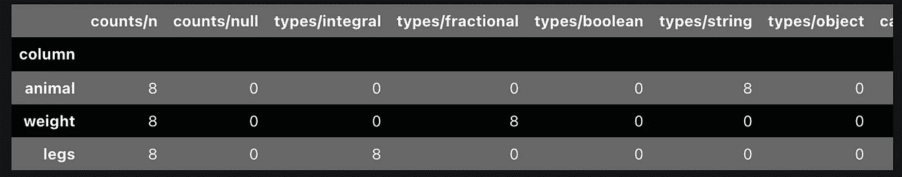
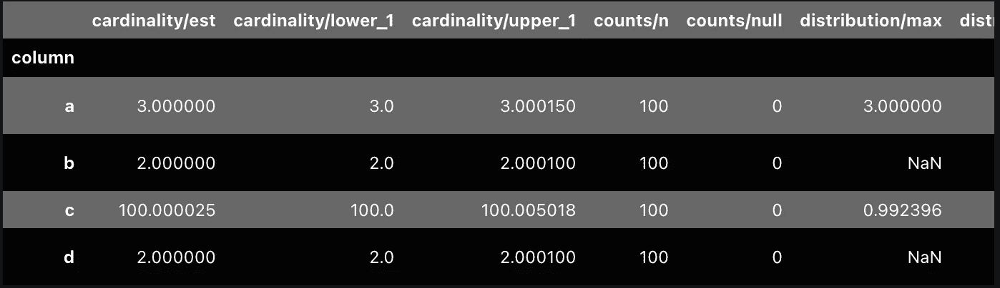
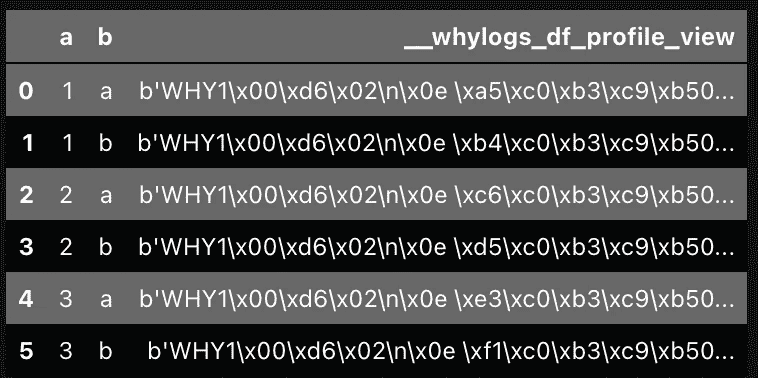
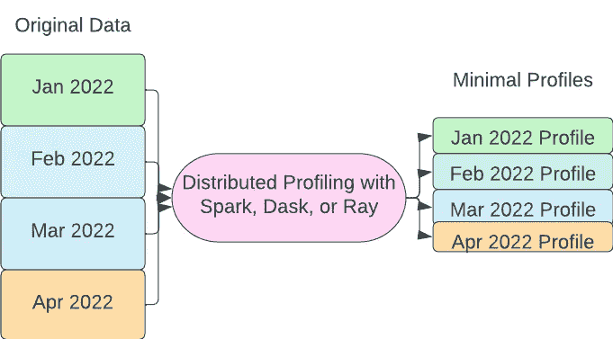
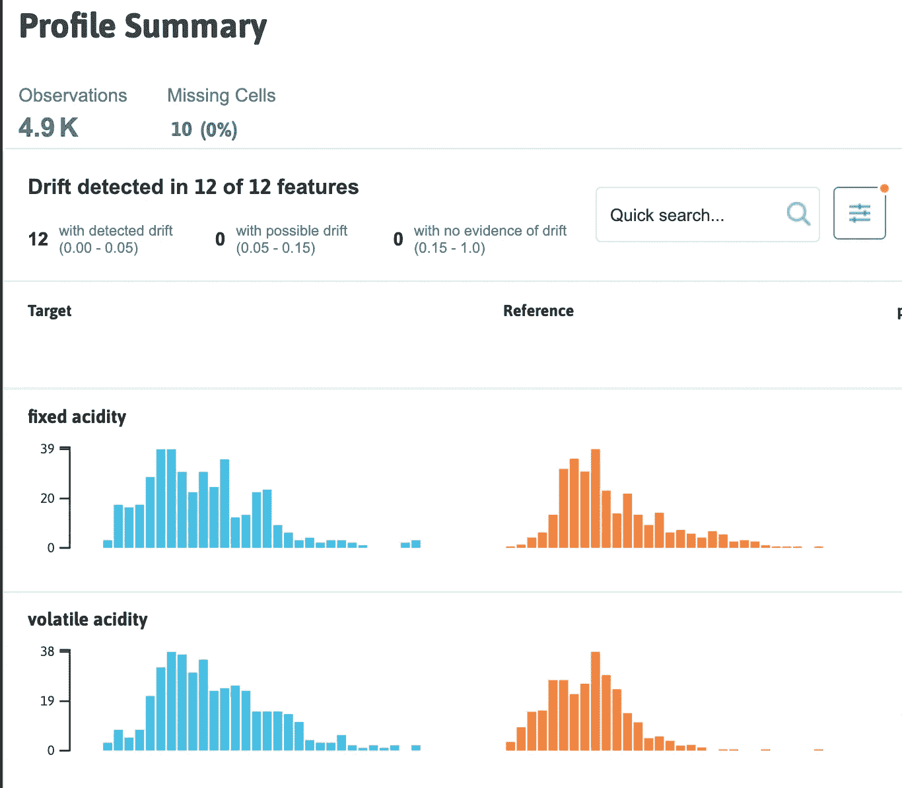

# 在 Spark、Ray 或 Dask 上使用 whylogs 和 Fugue 进行大规模数据分析

> 原文：<https://towardsdatascience.com/large-scale-data-profiling-with-whylogs-and-fugue-on-spark-ray-or-dask-e6917f6e1621>

## 为异常检测、漂移检测和数据验证等用例分析大规模数据

哈士奇与放大镜——作者图片

# 动机

数据管道有可能以多种方式产生意想不到的结果。异常数据会导致数据缩放不正确。机器学习模型漂移会导致预测精度降低。当数据管道执行时，上游集合中的故障可能会导致空值。我们如何防范这些失败案例？

监控数据质量的一种方法是数据验证。像[潘德拉](https://github.com/unionai-oss/pandera)和[远大前程](https://github.com/great-expectations/great_expectations)这样的工具允许数据从业者建立一套预定义的规则。例如，我们可以检查数据集中是否存在列，或者某个重要特性是否包含空值。

虽然这在理论上听起来不错，但它要求我们事先知道关于数据的许多事情。Great Expectations 确实有一个分析器，但是它非常严格，并且不能很好地扩展到 Spark。当我们的数据不太可预测时，我们需要找到其他方法或指标来提醒我们随着时间的推移数据会下降。例如，想象一个趋势向上的时间序列在某一天显著下降。如果我们应用数据验证来检查最大值和最小值，我们的验证规则可能无法捕捉到这种下降。我们需要一套更通用的分析工具，能够扩展到数据验证、漂移检测和异常检测等应用。

# whylogs 简介

这就是为什么日志会出现的原因。 **whylogs 是一个开源的数据记录框架，它让我们能够以最小的开销分析我们的数据。上面提到的问题:异常检测、漂移检测和数据质量检查都可以解决，如果我们有好的数据配置文件。**

使用 whylogs，用户可以通过添加几行代码来分析他们的数据。以下面的例子为例，我们分析了熊猫的数据帧。

样本 whylogs 代码— [摘自 WhyLabs 文档](https://whylogs.readthedocs.io/en/latest/examples/basic/Getting_Started.html#Profiling-with-whylogs)

可以查看概要文件，生成类似于下表的内容。

whylogs 的配置文件输出— [摘自 WhyLabs 文档](https://whylogs.readthedocs.io/en/latest/examples/basic/Getting_Started.html#Profiling-with-whylogs)

该配置文件包含的列数超过了此处可以优雅显示的数量。在上图中，我们看到(按顺序):

*   记录总数(第一列)
*   空记录计数(第二列)
*   列中值的推断类型(第三至第七列)

不适合上图的其他列包括:

*   估计基数
*   频繁值
*   分布指标，如最大值、最小值和分位数

whylogs 配置文件设计有三个重要属性:高效、可定制和可合并。前两个非常简单明了。whylogs 的开销很低，这使得它可以轻松扩展到 Spark 这样的大数据框架。更重要的属性是[可熔性](https://whylogs.readthedocs.io/en/latest/examples/basic/Merging_Profiles.html?highlight=merging#Merging-Profiles)。可以将数据帧的较小部分的配置文件添加在一起，以形成全局数据集配置文件。

在处理 Spark、Dask 和 Ray 之类的分布式框架时，这是一个重要的属性，在这些框架中，数据可以存在于多个工作者之间。可以独立地分析分区，然后汇总。第二件事是，如果需要，数据集的更重要的子部分也可以独立地进行分析，然后整合到更广泛的分析中，而不必重新计算分位数等统计数据。

# 通过神游扩展到大数据

一些图书馆分析数据，如[熊猫-分析](https://github.com/ydataai/pandas-profiling)，但这些都集中在探索性数据分析，所以它们被设计成跟踪不同的东西。熊猫概况提供的一些信息很难扩展到 Spark 这样的大数据框架。

**whylogs 旨在将其数据记录扩展到大数据。**我们可以使用赋格集成来分布式运行分析。他们还集成了[卡夫卡](https://whylogs.readthedocs.io/en/latest/examples/integrations/kafka-example/Kafka_Example.html)和[盛宴](https://whylogs.readthedocs.io/en/latest/examples/integrations/Feature_Stores_and_whylogs.html#Logging-data-from-Feature-Stores-with-Feast-and-whylogs)等等。

开源的[神游项目](https://github.com/fugue-project/fugue/)获取 Python、Pandas 或 SQL 代码，并将其带到 **Spark、Dask 或 Ray** 。在 Fugue 上使用 whylogs 允许我们维护相同的简单界面来生成配置文件。例如:

fugue_profile 函数

这仍然是运行在熊猫的引擎之上。它将产生与上面使用普通 whylogs 的代码片段相同的结果。优点是，我们只需提供一个参数，就可以将它带到 Spark、Dask 或 Ray。

fugue_profile 输出—作者提供的图像

为了引入 Spark，我们可以将 SparkSession 作为`engine`传递。

将 whylogs 档案带到 Spark

为了在 Dask 和 Ray 上执行，我们可以传递集群地址或`Client`。

# 分析逻辑分区

在处理大数据时，一个更常见的用例是分析数据的逻辑分区。这可以帮助我们找到离群分区，并且对于探索性分析也是有用的。

对每个分区应用 fugue_profile

这将返回如下图所示的输出，其中最后一列是序列化的概要文件。然后这些可以被[解串](https://whylogs.readthedocs.io/en/latest/examples/integrations/Fugue_Profiling.html?highlight=fugue#Profiling-on-logical-partitions)和后处理。这个数据帧已经比原始数据帧小得多，所以反序列化和提取数据非常快。**通过对配置文件进行操作，我们可以存储和分析数量少得多的数据。**

每个分区的分析—按作者分类的图像

# 数据配置文件的使用

有了数据概要文件，我们可以将它们应用到不同的用例中。

**异常检测**

对于每月持续出现的新数据，我们可以每月运行配置文件并存储这些配置文件。然后，我们可以用 z-score 之类的指标来比较分布图中不同分位数的值。

分布式概要分析用例—按作者分类的图像

这种设置对于大数据尤其重要，因为我们不需要返回到以前的数据并重新计算指标。数据配置文件足以检查异常情况。

**数据质量**

配置文件中缺少数据计数。基数也有助于查找包含过多类别的列。我们还可以用已经包含的分位数检查这些数字是否在某个已知的范围内。如果用户需要跟踪更多的东西，还可以添加自定义指标。

**漂移检测**

我们可以通过监控传入数据的分布来确定是否需要重新训练我们的机器学习模型。通过几行额外的代码，whylogs 可以生成[可视化报告](https://whylogs.readthedocs.io/en/latest/examples/basic/Notebook_Profile_Visualizer.html#Profile-Summary)。这些在调试为什么会发生意外的预测分布时非常有用。下图显示了新数据的预期分布与实际分布。

whylogs 可视化示例—图片来自 [whylogs 文档](https://whylogs.readthedocs.io/en/latest/examples/basic/Notebook_Profile_Visualizer.html#Drift-Summary)

# 结论

在本文中，我们讨论了可以通过数据概要分析解决的一系列问题。**异常检测、漂移检测和数据质量问题有时需要在没有数据先验知识的情况下解决。数据配置文件是一种以无人监管的方式处理这些数据的非常通用的方法。**档案也可以作为将来验证规则的基础。

whylogs 特别强大，因为它被设计成轻量级的，可以扩展到大数据。mergability 属性还允许在数据分区的分布式设置中使用它，这些分区可以在以后合并。通过使用 Fugue 集成，可以在 Spark、Dask 和 Ray 之上轻松使用 whylogs 来在集群之上运行分析。这些结果可以保存并在将来使用，而无需重新计算过去的数据。

# 资源

1.  [whylogs 回购](https://github.com/whylabs/whylogs)
2.  [为什么日志文档](https://whylogs.readthedocs.io/en/latest/)
3.  [赋格回购](https://github.com/fugue-project/fugue/)
4.  [赋格教程](https://fugue-tutorials.readthedocs.io/)

要与我们聊天:

1.  [赋格松弛](http://slack.fugue.ai/)
2.  [为什么日志松弛](https://bit.ly/rsqrd-slack)