# 梯度下降的大规模 K 均值聚类

> 原文：<https://towardsdatascience.com/large-scale-k-means-clustering-with-gradient-descent-c4d6236acd7a>

## 利用顺序数据、小批量数据和批量数据进行学习

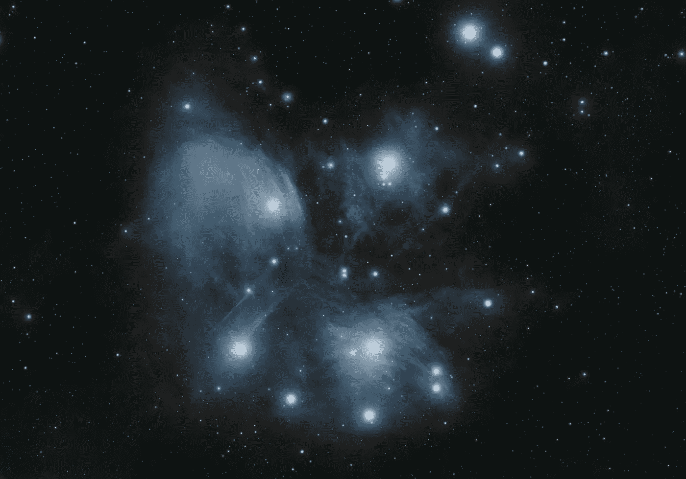

拉杜·切拉里乌在 [Unsplash](https://unsplash.com/?utm_source=unsplash&utm_medium=referral&utm_content=creditCopyText) 上拍摄的照片

# **简介**

聚类是一种无监督形式的机器学习算法。它发现数据中的子组或模式。K-Means 算法是一种简单直观的数据聚类方法。当我们应用 K-Means 算法时，我们必须注意数据集的大小和维度。这些中的任何一个都可能导致算法收敛缓慢。在本文中，我们将探索梯度下降优化和降维技术，以扩大 K-Means 算法的大数据集。我还将分享我在流行图像数据集上的一些实验结果。

在梯度下降优化中，我们计算成本函数的导数，并在梯度的相反方向上迭代移动，直到我们达到最优值。这种优化可用于通过在小批量数据集上执行优化来扩展 ML 算法以在大数据集上训练。

我们还可以对数据集应用降维技术，以找到更好的数据表示并加快聚类时间。在下一节中，我们将看到如何使用梯度下降学习来执行 K-Means。

# k 均值

K-Means 算法将数据集分成 K 个不同的聚类组。它使用一个代价函数，该函数使聚类中心和它们的指定样本之间的平方距离之和最小化。基于领域知识或通过一些其他策略来设置聚类的数量。K 均值成本函数可以写成:

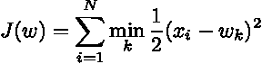

其中样本 ***x*** 具有维度 d，N 是数据集中样本的总数。聚类中心由 ***w*** 表示。标准 K-Means 算法在聚类中心估计和聚类中心与样本之间的距离计算之间交替进行固定次数的迭代。

接下来，我们将了解如何使用梯度下降优化来执行 K 均值聚类。

# **批量梯度下降学习**

标准 K-Means 算法在大数据集上可能具有缓慢的收敛和存储密集型计算。我们可以用梯度下降优化来解决这个问题。对于 K-均值，聚类中心更新等式被写成:

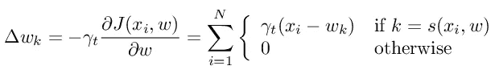

其中 s(w)是欧氏空间中最接近 ***x*** 的原型。学习率被设置为样本聚类计数，即分配给特定聚类中心的样本数。在固定数量的迭代之后或者当 K-均值成本的变化低于某个容限值时，我们停止这种梯度优化。在批量梯度下降中，我们用整个数据集计算梯度。对于大型数据集，计算梯度可能会很慢且效率低下。

接下来，我们将研究梯度下降的两种变体来缩放 K-均值聚类。

# **随机梯度下降**

使用一个样本来计算梯度的梯度下降的变体被称为随机梯度下降(SGD)。由于它只用一个样本进行聚类更新，因此可以应用于在线学习。在实践中，我们随机化数据集，一次处理一个样本。学习率在每次迭代期间针对每个聚类中心进行更新。这种方法在实践中效果很好。SGD 的伪代码如下所示。

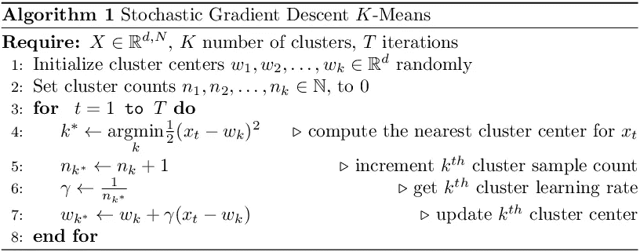

带 SGD 的 K 均值伪代码

为了可视化 K-Means SGD 学习过程，我创建了一个玩具数据集，其中有两个可线性分离的圆形斑点。


具有 SGD 学习的 K-Means 的图示

从图中，我们看到聚类中心更新可能很慢，因为一次只处理一个样本。当有许多不同的聚类中心要学习时，这可能会变得更糟。

# **小批量随机梯度下降**

SGD 可能找不到好的聚类中心，因为只有一个样本用于计算梯度。我们可以修改梯度更新步骤，使用 M 个样本的批量来计算梯度。这种变体被称为小批量 SGD。这比 SGD 具有更快和更平滑的成本收敛。mini-batch 背后的理由是，数据子集比单个样本包含更多的信息，同时也不太可能包含在整个数据集中找到的冗余示例。实际上，小批量是随机抽样的。小批量 SGD 的伪代码如下所示。

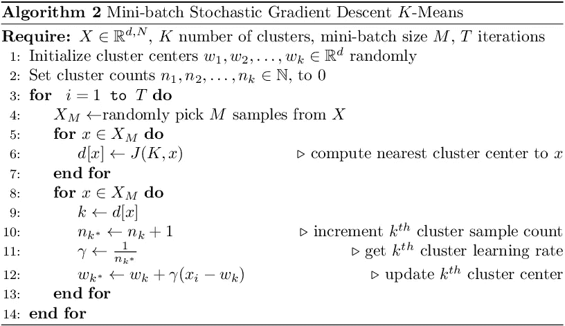

带小批量 SGD 的 K 均值伪代码

该算法类似于 SGD，只是我们使用 M 个样本来计算每次迭代的梯度。最小批量是一个需要调整的超参数，其值会影响算法的性能。

下面是小批量 SGD K-Means 算法在同一个玩具数据集上的图解，其中小批量的大小为 4。相比新币，成本收敛更快。SGD 和 mini-batch SGD 都能找到好的聚类中心，并很好地对玩具数据集进行分组。

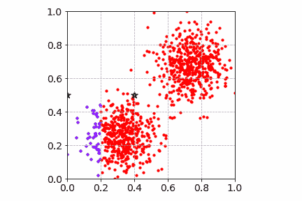

批量大小为 4 的小批量 SGD 学习的 K 均值图

接下来，我们将讨论两种流行的降维技术，以及它们如何改进和加速聚类工作流。

# 降维

降维可以看作是一个特征选择和特征提取的步骤。原始数据被映射到低维空间，这有助于更快地学习 clusters⁴.我试验了主成分分析(PCA)和稀疏随机投影(SRP)方法。

## 主成分分析

PCA 学习最大化数据方差的嵌入矩阵。这是一种数据相关的投影，因为嵌入矩阵包含样本协方差矩阵的特征向量。Jonathan Hui 写了一篇关于奇异值分解的主成分分析的综述

## 稀疏随机投影

SRP 构造了一个与数据无关的嵌入矩阵。成对的距离在较低的维度中保留了一个因子。与高斯随机投影矩阵相比，SRP 支持更快的数据投影，并且内存效率高。本文由 [CJ Sullivan](https://medium.com/u/a9bc11f7a61b?source=post_page-----c4d6236acd7a--------------------------------) ⁶.对 SRP 进行了详细的解释和应用

# 实验

为了比较不同版本的 K-Means，我对 iris、USPS 和 Fashion-MNIST 数据集进行了聚类分析。这些数据集包含不同维度的小型、中型和大型样本。对于所有三个数据集，样本分布在所有类中是一致的。下面是不同数据集的总结。

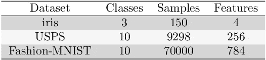

数据集摘要

随机选择的样本被初始化为所有三个 K 均值算法的聚类中心。对于批量梯度下降，我将 iris 数据集的学习率设置为 0.03/t，将 USPS 和 Fashion-MNIST 数据集的学习率设置为 0.1/t。对于小批量 SGD，我使用 32 作为批量大小。对于 SGD 和小批量 SGD，我使用集群分配计数作为学习率。所有数据集都使用最小-最大缩放器进行缩放，该缩放器在范围[0，1]内缩放每个样本。下面是用于缩放数据的公式。

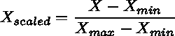

我还尝试了标准缩放器，它将数据转换成零均值和单位标准差。对于上述三个数据集，我没有看到收敛速度或更低的最终成本有很大的差异。

## 不同梯度下降算法的代价收敛性

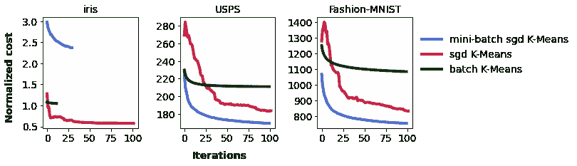

iris、USPS 和 Fashion-MNIST 算法的标准化 K 均值成本。

当我们在所有三个数据集上比较成本收敛时，mini-batch SGD 具有更平滑和更快的收敛。对于较小的 iris 数据集，SGD 比小批量 SGD 成本更低。这可能是因为 32 的批量可能太大了。为了了解小批量如何影响收敛，我用 16、32、64 和 128 个小批量进行了一个实验。

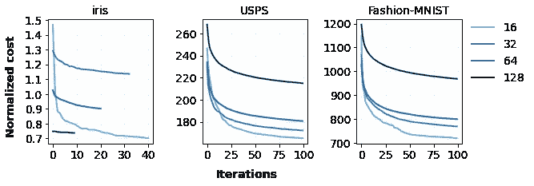

标准化不同小批量的成本趋同。

我们看到小批量和大批量的最终成本差距很大。16 的小批量为所有三个数据集产生最低的最终成本。

## 基于维数的相对聚类时间缩减

时间缩减是在具有全维度的标准 K-均值和具有缩减维度的小批量 SGD K-均值之间的度量。我在 USPS 和 Fashion-MNIST 数据集上运行了小批量 K-Means 算法，这些数据集用不同维度的 PCA 和 SRP 绘制。在时间计算中不考虑降维计算步骤，而只考虑数据聚类时间。

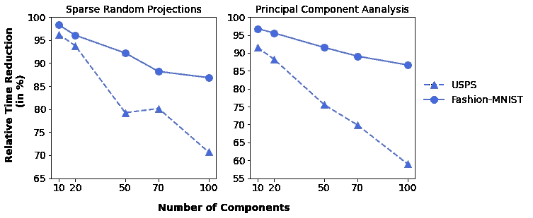

用小批量 SGD 可视化相对时间减少

正如所料，随着更多的组件，K-Means 需要更多的时间来收敛到一个更低的成本。时间减少趋势随维度线性减少。

## K-均值代价与维数的相对误差

相对误差是标准和小批量 SGD K 均值之间的最终成本差异。标准 K-Means 在原始数据集上训练，小批量 K-Means 在不同维度上训练。以下是 PCA 和 SRP 后的相对误差。

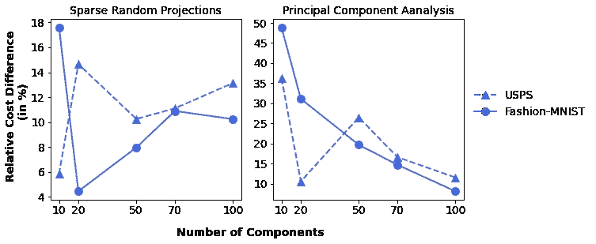

可视化标准 K 均值和小批量 SGD 之间的相对成本差异

当原始维度非常高时，随机投影会受益。与 SRP 相比，PCA 的相对成本差异随着更多组件而降低(在一定程度上)。

## 代码片段

我们可以使用 scikit-learn API 为集群工作流创建一个简单的管道。下面是一个带有 PCA 和小批量 K-Means 的样本管道。

```
**from** **sklearn.pipeline** **import** [Pipeline](https://scikit-learn.org/stable/modules/generated/sklearn.pipeline.Pipeline.html#sklearn.pipeline.Pipeline)
**from sklearn.preprocessing import** [MinMaxScaler](https://scikit-learn.org/stable/modules/generated/sklearn.preprocessing.MinMaxScaler.html)
**from** **sklearn.decomposition** **import** [PCA](https://scikit-learn.org/stable/modules/generated/sklearn.decomposition.PCA.html#sklearn.decomposition.PCA)
**from sklearn.cluster import** [MiniBatchKMeans](https://scikit-learn.org/stable/modules/generated/sklearn.cluster.MiniBatchKMeans.html#sklearn.cluster.MiniBatchKMeans)
**from sklearn.datasets import** [fetch_openml](https://scikit-learn.org/stable/modules/generated/sklearn.datasets.fetch_openml.html) **# load dataset**
X, y = fetch_openml('USPS', return_X_y=True, as_frame=False)**# add methods to pipeline**
steps = [
("scale_step", MinMaxScaler()),
("dimred_step", PCA(n_components=50)), 
("cluster_step", MiniBatchKMeans(n_clusters=10, batch_size=16))
]**# create pipeline**
clusterpipe = Pipeline(steps)**# fit pipeline on data**
clusterpipe.fit(X)
```

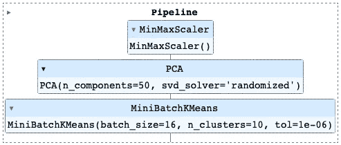

具有 scikit-learn API 的简单集群管道

# 结论

两个 SGD 版本都可以很好地处理大规模 K-Means 聚类。在中型和大型数据集上，与 SGD 相比，mini-batch SGD 收敛速度更快，发现的聚类中心更好。小批量大小是一个基于数据集大小进行调整和设置的超参数。聚类受益于降维方法，降维方法是内存高效的并且具有更快的收敛。当我们设计机器学习管道时，速度和低成本的权衡曲线可视化是有帮助的。

# **参考文献**

[1]斯卡利博士(2010 年 4 月)。网络规模的 k 均值聚类。在*第 19 届万维网国际会议记录*(第 1177-1178 页)。

[2]博图和本吉奥(1994 年)。k-means 算法的收敛性质。*神经信息处理系统的进展*、 *7* 。

[3]博图，L. (2012 年)。随机梯度下降技巧。在*神经网络:交易技巧*(第 421–436 页)。斯普林格，柏林，海德堡。

[4] Boutsidis，c .，Zouzias，a .，和 Drineas，P. (2010 年)。随机投影为*k*-均值聚类。*神经信息处理系统的进展*、 *23* 。

[5]乔纳森·惠。(2019).[机器学习—奇异值分解&主成分分析](https://jonathan-hui.medium.com/machine-learning-singular-value-decomposition-svd-principal-component-analysis-pca-1d45e885e491)。[走向数据科学](https://medium.com/towards-data-science)

[6]希杰·沙利文。(2021).[幕后讲述生成图嵌入的快速随机投影算法](/behind-the-scenes-on-the-fast-random-projection-algorithm-for-generating-graph-embeddings-efb1db0895)。[走向数据科学](https://medium.com/towards-data-science)

*所有图片，除非特别注明，均为作者所有。*