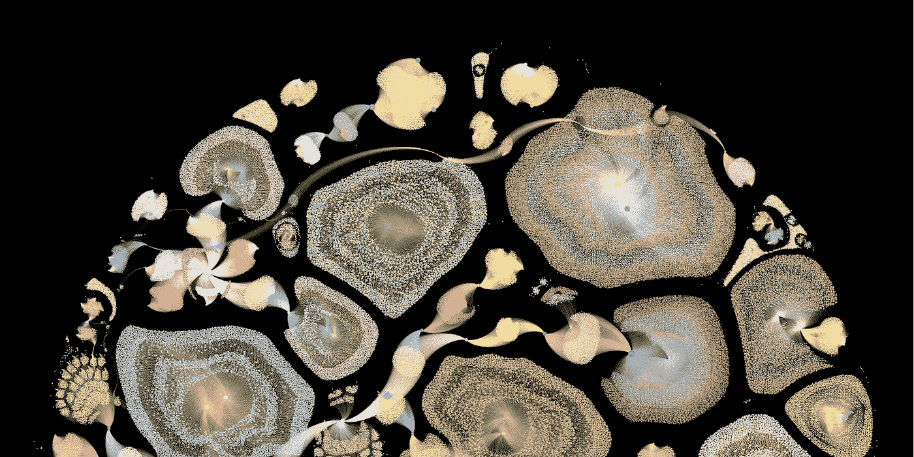
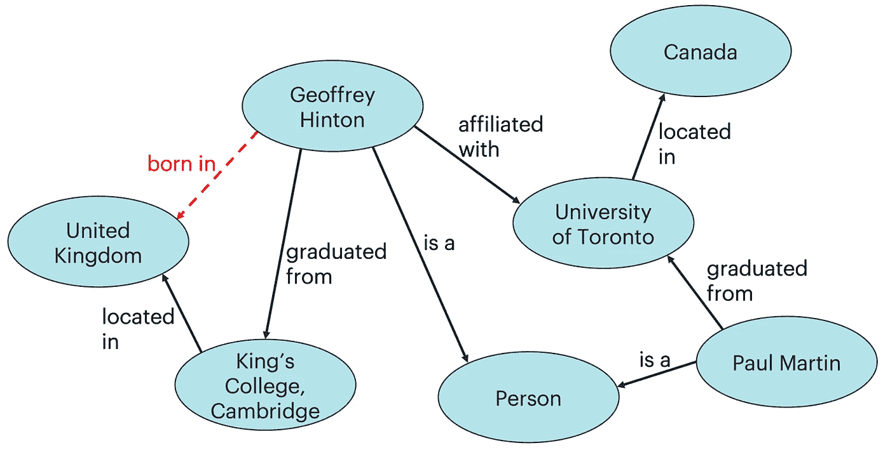
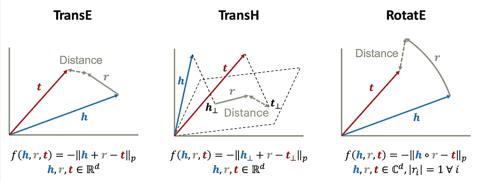
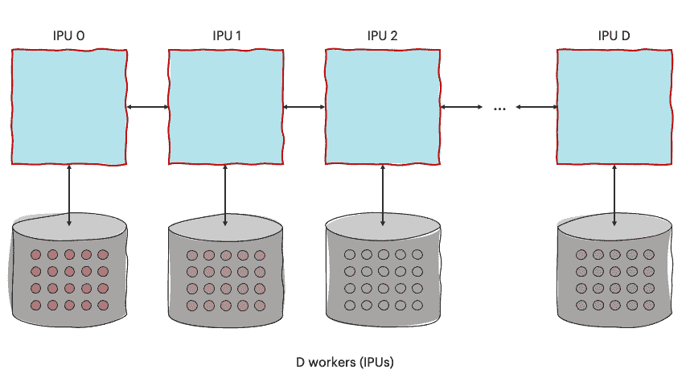
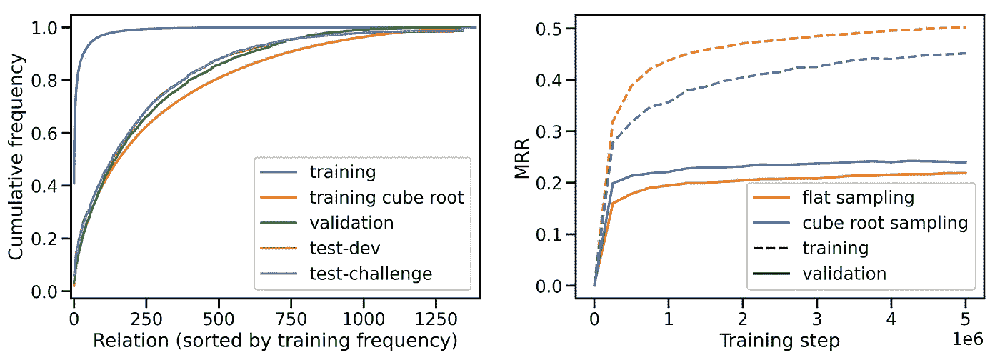
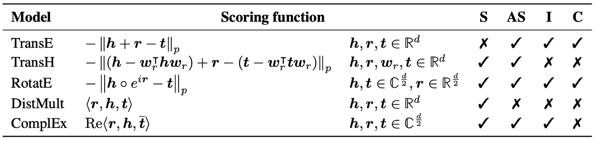
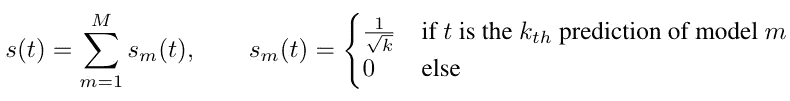
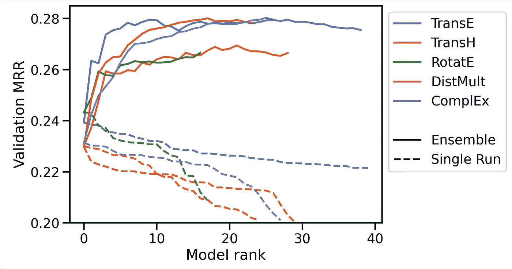

# Graphcore IPUs 上的大规模知识图完成

> 原文：<https://towardsdatascience.com/large-scale-knowledge-graph-completion-on-ipu-4cf386dfa826>

## neur IPS 2022 OGB-LSC 知识图表竞赛的获胜者

## 通过快速实验、仔细调谐和大型集合进行准确预测

知识图嵌入模型的计算图的绘制。图片作者。

表示图结构数据的机器学习方法变得越来越重要。该领域研究人员面临的主要挑战之一是模型对大型数据集的可扩展性。作为 [NeurIPS 2022 竞赛赛道计划](https://neurips.cc/Conferences/2022/CompetitionTrack)的一部分， [Open Graph Benchmark 大规模挑战赛(OGB-LSC)](https://ogb.stanford.edu/docs/lsc/) 旨在通过鼓励 graph ML 研究社区与实际大小的数据集合作，开发能够满足现实世界需求的解决方案，来推动图形表示学习的边界。

在这篇博文中，我们展示了 Graphcore 提交给 [OGB-LSC@NeurIPS 2022](https://ogb.stanford.edu/neurips2022/) 知识图谱的获奖作品。我们深入探讨了机器学习模型、数据集考虑因素、集成策略以及我们实现这一成功的高效执行方案。关于我们方法的更深入的信息可以在[论文](https://arxiv.org/abs/2211.12281)【1】中找到。

## 什么是知识图？

知识图是通过捕捉现实世界实体之间的关系来构建和表示知识的一种非常自然的方式。事实表示为三元组(*头*、*关系*、*尾*)，其中关系描述了*头*和*尾*实体之间的链接。例如，三联(*杰弗里·辛顿*、*毕业于*、*剑桥大学国王学院*)是图 1 中知识图陈述的七个事实之一。知识图的应用范围从[药物发现](https://arxiv.org/abs/2102.10062)到[问答](https://aclanthology.org/P17-1021/)和[推荐系统](https://dl.acm.org/doi/abs/10.1145/2939672.2939673)【2–4】。

图 WikiKG90Mv2 知识图的一个小子图。一个可能的查询可能是(Geoffrey Hinton，出生于？).图片作者。改编自[5]。

知识图嵌入(KGE)模型通过学习低维向量空间中的实体和关系的嵌入来对知识图进行推理，使得三元组的似然性通过头部、关系和尾部嵌入的评分函数来测量。通过最大化阳性样本的分数和最小化阴性样本的分数，在阳性(真实)三元组和阴性(随机抽取)三元组的批次上训练 KGE 模型。

图 2:评分函数的三个不同例子:TransE 度量头+关系和尾嵌入之间的距离；TransH 在应用 TransE 之前将头部和尾部嵌入投影到依赖关系的超平面上；在 RotatE 中，该关系描述了复数值头嵌入的旋转。在所有三个模型中，负距离可以用作分数。图片作者。

虽然知识图文献通常关注相对较小的图，但是商业价值的实际应用越来越需要在具有数亿甚至数十亿个实体和三元组的图上进行推理。WikiKG90Mv2 是基于 Wikidata 的大规模知识图，由超过 9000 万个节点和 6 亿个三元组组成。知识图通常是不完整的:虽然现有的三元组可以被认为是真实的，但两个实体之间没有关系就没有真值。因此比赛的任务是完成三个一组的形式(*头*、*关系*、*？*)，比如(*杰弗里·辛顿*、*出生于*、*？*)，见图 1。WikiKG90Mv2 数据集的巨大规模是实现快速准确的知识图完成模型的主要挑战之一，因为我们最大的模型消耗超过 300 GiB 的参数、优化器状态和功能。为了克服这个问题，我们实现了 BESS(平衡实体采样和共享)，这是一个用于训练 KGE 模型的分布式处理方案，可以有效地平衡多个工作人员的通信和计算。

## 基于 BESS 的分布式知识图训练

BESS 在 *D* 个可用的工人中随机且均匀地划分实体嵌入集。这导致将数据集中的三元组划分为 *D* 桶 *{T* ₘₙ *，m，n = 1，…，D}* ，其中 *T* ₘₙ是一组三元组，头实体存储在 worker *m* 上，尾实体存储在 worker *n* 上。然后，在培训时，对每个工人 *m* 从 *{T* ₘₙ *，n=1，…，D}* 中统一抽取一批。类似地，对于每个小批量BESS 从所有可用的工人中统一抽取尾部来构建负样本。这些阴性样本在微量批次中的所有三个样本中共享，以增加有效的阴性样本量，而不增加阴性样本交流和评分的成本

作者制作的动画。

因为与实体的数量相比，不同关系类型的数量通常很少，所以关系嵌入在所有工人之间复制，并使用 *AllGather* 操作进行更新。

在推理时，对于一个给定的查询(*头*、*关系*、*？并且返回前 K 个结果的有序列表。*

BESS 方法保证了只有尾部嵌入必须在工人之间交换。同时，它平衡了计算和工作人员之间的通信。我们在 Graphcore Bow Pod16 上使用 BESS 训练 KGE 模型，它受益于在快速 IPU-IPU 链路上运行的集体通信，这使得单独的参数服务器变得过时。此外，14.4 GB 的处理器内存允许在整个系统中高效地使用 DRAM 的总带宽。

## 匹配数据集分布

正如挑战组织者所详述的，验证和测试数据集是通过采样三元组创建的，使得关系类型的计数与原始关系计数的立方根成比例。如果不相应地调整来自训练数据集的采样，这将导致严重的泛化差距。因此，我们偏置训练三元组的样本，使得关系类型的结果分布与训练数据集中关系类型计数的立方根相匹配。此程序将训练期间使用的不同关系类型的频率与验证和测试集中的关系分布对齐，并减少训练和验证 MRR 之间的差距(图 3)。

图 3:立方根抽样策略调整了关系类型的训练和验证/测试分布(左)，并减少了训练和验证 MRR 之间的差距(右)。图片作者。

## 多样化的组合，以获得最佳的所有世界

BESS 在 [Graphcore Bow Pod16](https://www.graphcore.ai/bow-processors) 上实现的吞吐量使我们能够训练 85 个 KGE 模型的非常多样化的集合，该集合结合了五个不同的评分函数([转移](https://papers.nips.cc/paper/2013/file/1cecc7a77928ca8133fa24680a88d2f9-Paper.pdf)、[转移](https://ojs.aaai.org/index.php/AAAI/article/view/8870)、[旋转](https://arxiv.org/abs/1902.10197)、[分散](https://arxiv.org/abs/1412.6575)、[复杂](http://proceedings.mlr.press/v48/trouillon16.pdf)、【6–10】)和两个不同的损失函数。每个评分函数都有不同的优点和缺点，如表 1 中所总结的，使得具有不同评分函数的模型集合特别有前途。为了进一步提高模型的多样性，我们采用了两种不同的损失函数:log-sigmoid 损失和采样 softmax 交叉熵损失。详见[文件](https://arxiv.org/abs/2211.12281)【1】。

表 1:评分函数及其模拟基本关系属性的能力:S =对称性；AS =反对称性；I =反转；C =构成。图片作者。

除了知识图的结构(三元组的集合)，WikiKG90Mv2 数据集为每个实体和关系提供了 768 维的特征向量。我们的模型通过使用可学习的权重矩阵将实体特征投影到实体嵌入空间并将结果添加到可学习的实体嵌入中来利用实体特征。由于不同关系类型的数量很少，我们假设关系特征对于学习良好的关系嵌入并不重要，因此我们在模型中忽略了这些特征。

多个模型的预测使用幂秩集合策略进行组合，概括[11]。每个预测尾部实体根据其在各个预测中排名的平方根倒数获得一个分数:

图片作者。

然后，通过使用该分数对实体进行排名来选择最终预测。

## 结果

我们对各种模型进行了训练，验证平均倒数等级(MRR)至少为 0.2，其中最佳的单个模型达到了 0.243 的 MRR(图 4)。我们发现，根据评分函数的不同，模型在不同程度上有助于集成:尽管个体验证的 mrr 较低，但 DistMult 和 ComplEx 模型在集成中表现得非常好(图 4)。

图 4:每个评分函数的 K 个最佳个体模型(虚线)和 K 个最佳模型集合(实线)的验证 MRR。图片作者。

基于这一证据，我们选择了一个由 85 个 KGE 模型组成的集合(25 个最佳 trans、DistMult 和 ComplEx 模型，以及 5 个最佳 trans 和 RotatE 模型)，在测试-挑战数据集上实现了 0.2922 的验证 MRR 和 0.2562 的 MRR，[赢得了 2022 年开放图基准大规模挑战](https://ogb.stanford.edu/neurips2022/results/#winners_wikikg90mv2)的 WikiKG90Mv2 赛道。

对大量知识图进行快速准确的推理是一项重要而又富有挑战性的机器学习应用。我们使用一种新颖的分布框架来提高 KGE 模型对大型图形的可伸缩性，并展示了良好调整的模型的多样性集合的优势。虽然这些方法不是灵丹妙药，但我们希望我们的见解有助于社区创建快速准确的知识图嵌入模型，并加速它们在现实世界应用中的采用。

[**读论文**](https://arxiv.org/abs/2211.12281) **|** [**访问代码**](https://github.com/graphcore/distributed-kge-poplar)

## 参考

[1] A. Cattaneo，D. Justus，H. Mellor，D. Orr，J. Maloberti，Z. Liu，T. Farnsworth，A. Fitzgibbon，B. Banaszewski，C. Luschi， [BESS:面向大规模知识图完成的平衡实体采样与共享](https://arxiv.org/abs/2211.12281) (2022)， *arXiv 预印本 arXiv:2211.12281* 。

[2] S. Bonner，I.P. Barrett，C. Ye，R. Swiers，O. Engkvist，A. Bender，C.T. Hoyt，W.L. Hamilton，[与药物发现相关的生物医学数据集回顾:知识图视角](https://arxiv.org/abs/2102.10062) (2022)，*生物信息学简报*， *23* (6)，第 bbac404 页。

[3]郝，张，刘，何，刘，吴，赵，(2017)，计算语言学协会第 55 届年会论文集*(第一卷:长论文)*(第 221-231 页)。

[4] F. Zhang，N.J. Yuan，D. Lian，X. Xie，W.Y. Ma，[面向推荐系统的协同知识库嵌入](https://dl.acm.org/doi/10.1145/2939672.2939673) (2016)，载于*第 22 届 ACM SIGKDD 知识发现与数据挖掘国际会议论文集*(第 353–362 页)。

[5] W. Hu，M. Fey，H. Ren，M. Nakata，Y. Dong，J. Leskovec，[-LSC:机器学习对图的大规模挑战](https://arxiv.org/abs/2103.09430) (2021)， *arXiv 预印本 arXiv:2103.09430* 。

[6] A. Bordes，N. Usunier，A. Garcia-Duran，J. Weston，O. Yakhnenko，[翻译用于多关系数据建模的嵌入](https://papers.nips.cc/paper/2013/file/1cecc7a77928ca8133fa24680a88d2f9-Paper.pdf) (2013)。*神经信息处理系统的进展*、 *26* 。

[7] Z. Wang，J. Zhang，J. Feng，Z. Chen，[超平面上平移的知识图嵌入](https://ojs.aaai.org/index.php/AAAI/article/view/8870) (2014)，*AAAI 人工智能会议论文集*(第 28 卷第 1 期)。

[8] Z. Sun，Z.H. Deng，J.Y. Nie，J. Tang，[旋转:复空间中关系旋转的知识图嵌入](https://arxiv.org/abs/1902.10197) (2019)， *arXiv 预印本 arXiv:1902.10197* 。

[9] B. Yang，W.T. Yih，X. He，J. Gao，L. Deng，[在知识库中嵌入用于学习和推理的实体和关系](https://arxiv.org/abs/1412.6575) (2014)， *arXiv 预印本 arXiv:1412.6575* 。

[10] T. Trouillon，C.R. Dance，J. Welbl，S. Riedel，e .Gaussier，G. Bouchard，[通过复张量分解的知识图完成](http://proceedings.mlr.press/v48/trouillon16.pdf) (2017)， *arXiv 预印本 arXiv:1702.06879* 。

[11] G.V .科马克，C.L. Clarke，S. Buettcher，[互逆秩融合优于孔多塞和个体秩学习方法](https://dl.acm.org/doi/10.1145/1571941.1572114) (2009)，在*第 32 届国际 ACM SIGIR 信息检索研究与发展会议论文集*(第 758-759 页)中。