# 套索和岭回归:直观的比较

> 原文：<https://towardsdatascience.com/lasso-and-ridge-regression-an-intuitive-comparison-3ee415487d18>

## 以及它们如何帮助你理解正规化

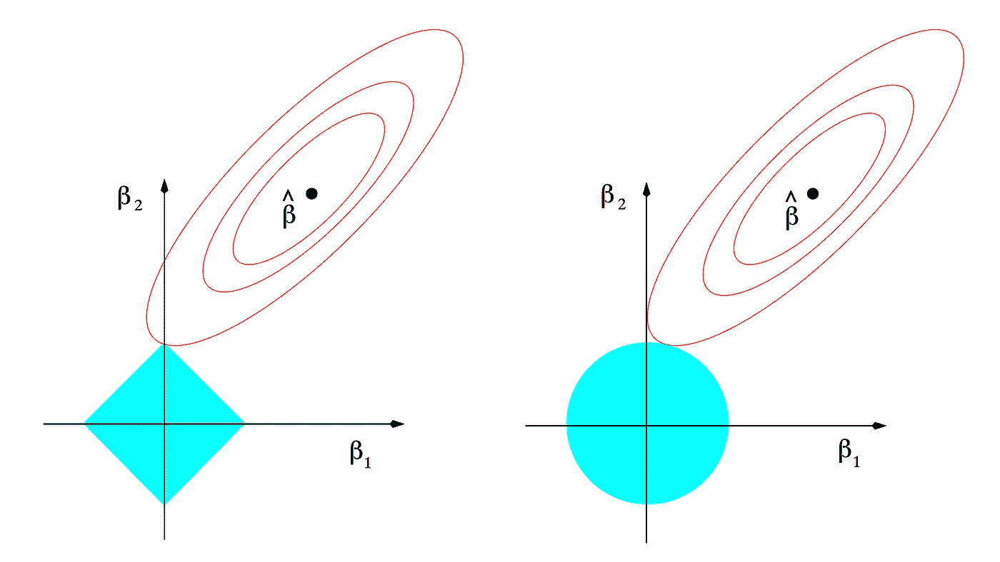

套索和山脊([统计学习的要素](https://hastie.su.domains/Papers/ESLII.pdf)

# 介绍

当人们开始他们的机器学习之旅时，他们通常从线性回归开始，这是最简单的算法之一。然而，这种模型很快就显示出它的局限性，特别是在处理导致模型过度拟合的数据集时。对此的主要解决方案被称为岭和套索回归。

## 偏差方差权衡

为了理解为什么这些模型是有用的，我们首先需要讨论偏差-方差权衡。

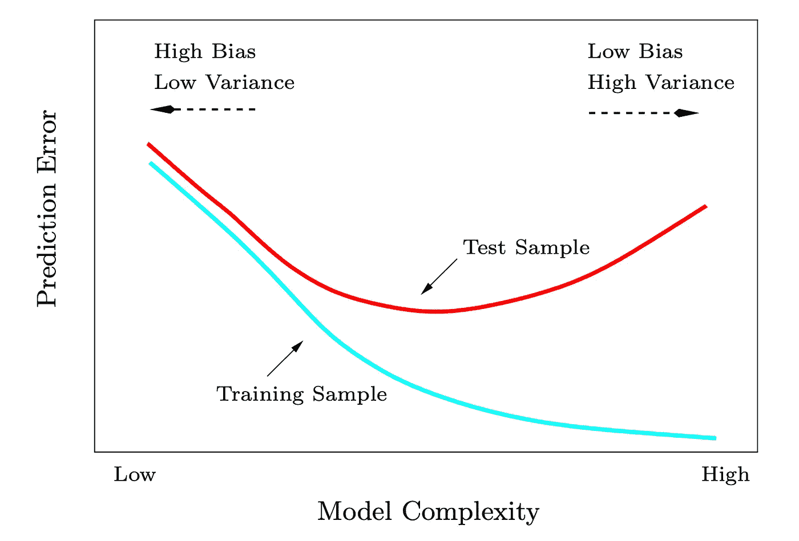

偏差方差权衡([统计学习的要素](https://hastie.su.domains/Papers/ESLII.pdf)

在监督设置中，模型的误差主要有两个来源:偏差和方差。

*   ***偏差*** 是学习算法中错误假设产生的误差。高偏差会使算法错过特征和目标之间的相关关系(也称为欠拟合)
*   ***方差*** 是由于对训练数据的微小波动敏感而产生的误差。高方差将使算法模拟训练数据的随机噪声(也称为过拟合)。

理想情况下，您希望找到这两个分量之和最小的最佳点。这将为您提供性能最佳的模型。

## 例子

首先，我们将看到一个拟合不足的例子:

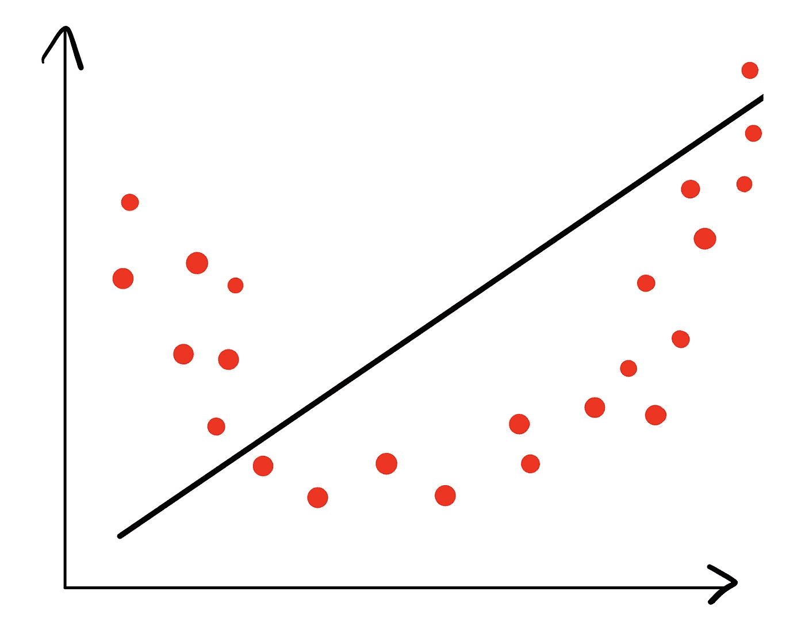

底切的例子(图片由作者提供)

这里，您可以看到模型没有很好地捕捉特征和目标之间的关系。因此，它具有高偏差(算法错过了特征和目标之间的相关关系)但具有低方差(没有对数据的随机噪声建模)。

相反，这里有一个过度拟合的例子:

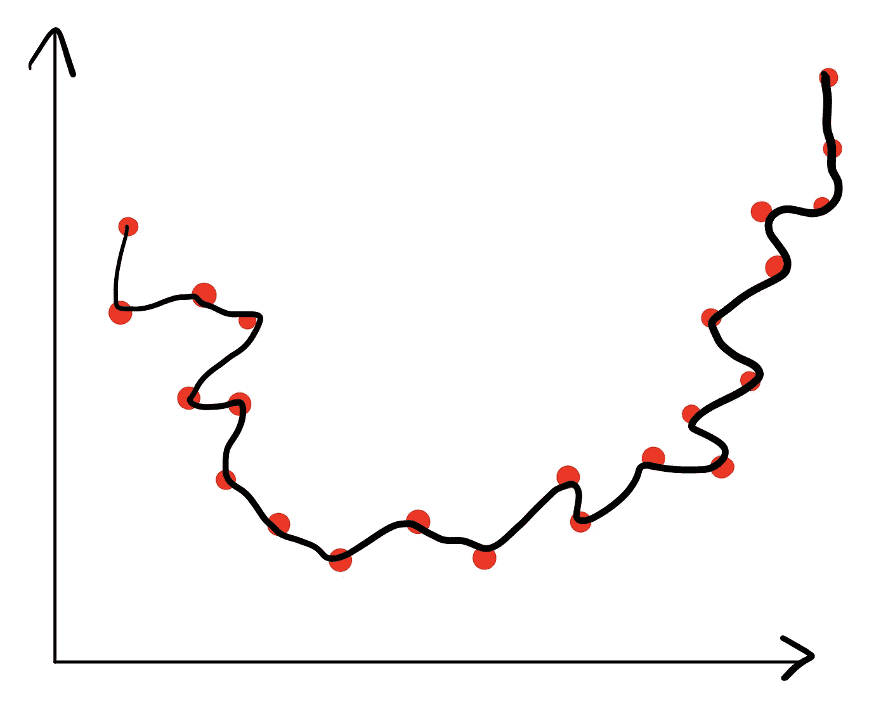

过度拟合的例子(图片由作者提供)

在这里，您可以看到算法理解特征和目标之间的关系，但也对数据的噪声进行建模。因此，它具有低偏差(算法获得特征和目标之间的相关关系)但具有高方差(模拟训练数据的随机噪声)。

现在，让我们看看一个合适的例子是什么样的:

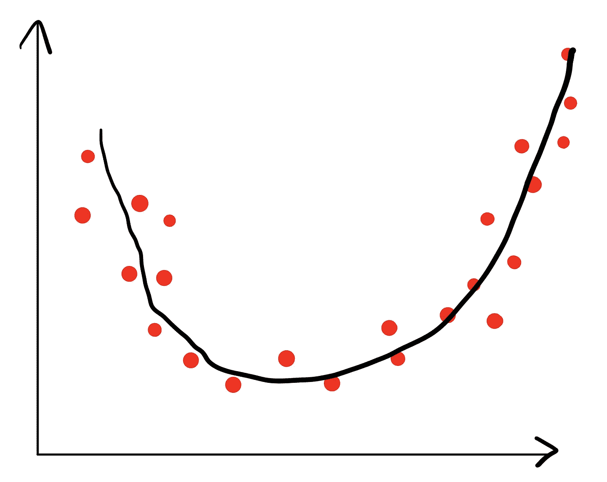

非常适合的示例(图片由作者提供)

在这里，您可以看到该算法能够模拟特征和目标之间的关系，但它不能模拟数据的噪声。因此，它具有低偏差和低方差。这就是我们想要达到的契合度。

## 这和山脊/套索有什么联系？

当您拟合线性回归模型时，会发生以下情况。您有一组特征(通常称为 X，表示为矩阵),并且您想要找到一组系数(通常称为β，表示为向量),通过乘以 X 中的值来预测您的目标(通常称为 y，表示为向量)。

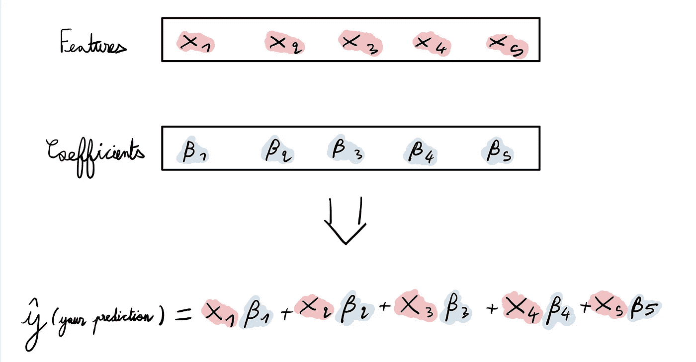

使用线性模型进行预测(图片由作者提供)

问题是，在某些情况下，线性回归会过度拟合特定的数据集。这种情况下你会怎么做？使用脊和套索回归。

# 这些模型是如何工作的？

Lasso 和 Ridge 都是线性回归模型，但有一个惩罚(也称为正则化)。它们以不同的方式增加了β向量的惩罚。

## 套索回归

Lasso 对你的 Beta 向量的 l1 范数进行惩罚。向量的 l1 范数是该向量中绝对值的和。

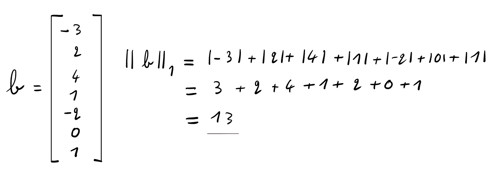

向量的 l1 范数(图片由作者提供)

这使得拉索零出一些系数在你的贝塔矢量。我不会详细解释原因，因为这会使本教程过于复杂，并且需要优化方面的背景知识。如果你对为什么会发生这种情况感兴趣，看看这个[链接](https://online.stat.psu.edu/stat508/lesson/5/5.4)。

简而言之，使用 Lasso 就像是在说:“尽可能实现最佳性能，但如果你发现一些系数没有用，就把它们丢掉”。

## **岭回归**

里奇对β向量的 l2 范数进行了惩罚。向量的 2 范数是向量中平方值之和的平方根。

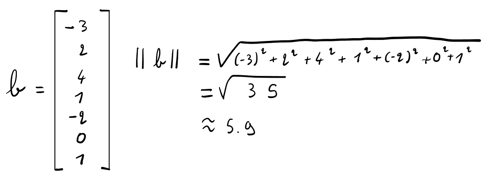

向量的 l2 范数(图片由作者提供)

这使得 Ridge 防止 Beta 向量的系数达到极值(这在过度拟合时经常发生)。

简而言之，使用 Ridge 就像是说:“尽可能实现最佳性能，但任何系数都不应有极值”。

## 正则化参数

这两个模型都有一个称为 lambda 的正则化参数，它控制惩罚的大小。在λ=0 时，Lasso 和 Ridge 都成为线性回归模型(我们只是不加任何惩罚)。通过增加λ，我们增加了对β向量大小的约束。这是每个模型进行不同优化的地方，并试图找到给定其自身约束的最佳系数集。

# 一个例子:波士顿住房数据集

让我们试着看看在数据集的实践中我们会遇到什么问题，以及我们如何用脊和套索来解决这些问题。

要跟进，请访问我的 GitHub 上的这个[链接](https://github.com/tlemenestrel/lasso_vs_ridge)，并简单地按照自述文件中的说明进行操作。我使用的数据集可以从 Kaggle 下载[这里](https://www.kaggle.com/prasadperera/the-boston-housing-dataset)。

## 波士顿住房数据集

波士顿住房数据集来自 1993 年，是机器学习领域最著名的数据集之一。目标要素是波士顿住宅的中值，而要素是相关联的住宅和街区属性。

## 读取数据集

第一步是读取数据集并打印其前 5 行。

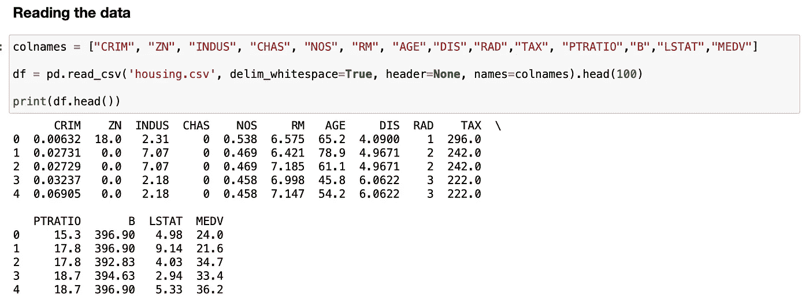

读取数据(图片由作者提供)

首先，我使用一个列表定义列名。然后，我调用 read _ CSV with*delim _ white space = True*来告诉 pandas 我们的数据是由空格而不是逗号分隔的， *header=None* 来表示文件的第一行不是列标题，最后 *names=colnames* 使用我们之前定义的列表作为列名。

我也用。head(100)仅保留数据集的前 100 行，而不是包含 505 行数据的完整数据集。这样做的原因是我想说明过度拟合，如果我们有更少的数据，这将是更有可能的。实际上，您应该保存完整的数据集(一般来说，数据越多越好)。

## 列车测试分离

下一步是将我们的数据分为 X(特征)和 Y(目标)，然后将这两个数据分为训练集(X_train，y_train)和测试集(X_test，y_test)。我将 80%的数据放在训练集中，20%放在测试集中，这是机器学习问题最常见的分裂之一。

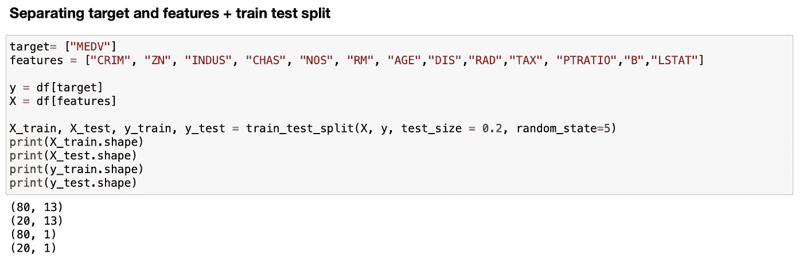

训练测试分割(图片由作者提供)

## 拟合线性回归模型

在此之后，我对训练数据拟合线性回归模型，并计算测试数据的均方误差(MSE)。最后，我打印出β向量，看看我们的模型的系数是什么样的。

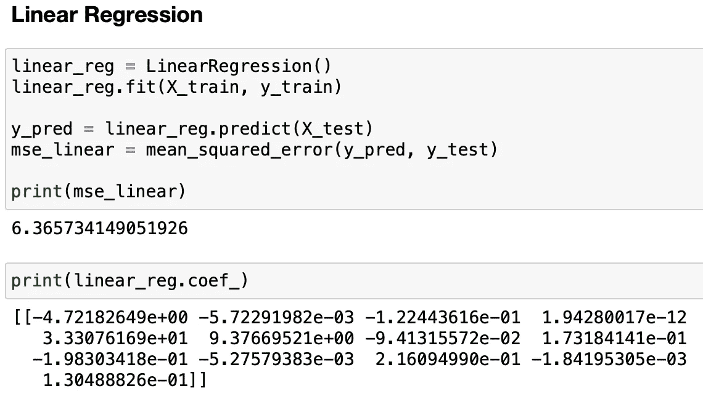

那么，我们能做得比≈6.4 MSE 更好吗？是的。

**套索回归**

在本例中，我使用一系列的 lambda 值拟合各种 Lasso 回归模型，lambda 值是正则化参数(lambda 值越高，我们对模型的惩罚就越高，即我们限制 beta 向量的绝对值之和)。

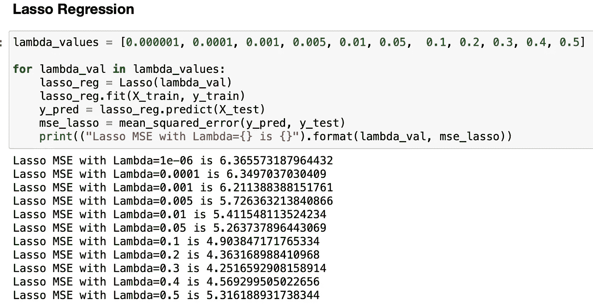

我们看到，当λ= 0.3 时，性能最高，MSE 约为 4.2。现在，让我们看看β向量的系数是什么样的。

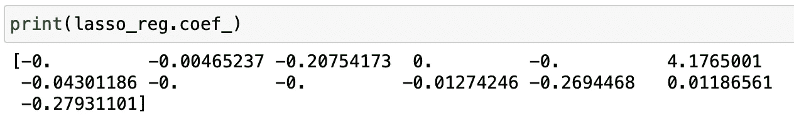

带套索的贝塔矢量的系数(图片由作者提供)

你可以看到这个模型已经剔除了大约一半的系数。它只保留了 14 个系数中的 8 个，但保留了其中一个相当大的权重，RM 是每个住宅的平均房间数。这是有道理的，因为一处房产的房间数量通常与其价格相关(6 人公寓几乎总是比 1 人公寓贵)。

因此，您可以看到与我们之前讨论的内容之间的联系。我们“告诉”Lasso 找到最佳模型，给出每个系数的权重限制(即“预算”)，它“决定”将大量“预算”放在房间数量上，以计算出房产的价格。

现在，让我们看看里奇能做什么。

## 里脊回归

在这里，我用套索应用与之前相同的步骤。我在这里使用的λ值是不同的。请记住，脊和套索之间的λ值不成比例，即套索的λ值为 5 并不等于脊的λ值为 5。

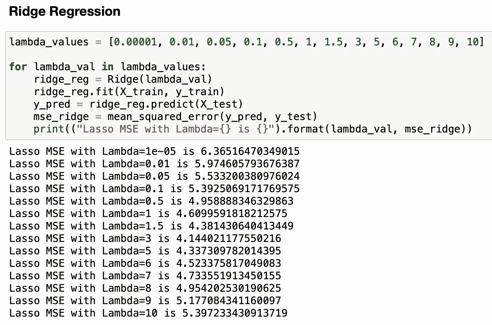

我们在这里看到，在λ= 3 时，我们能够做得比以前更好，MSE ≈ 4.1，这比 Lasso 和线性回归都好。现在，让我们看看β向量。

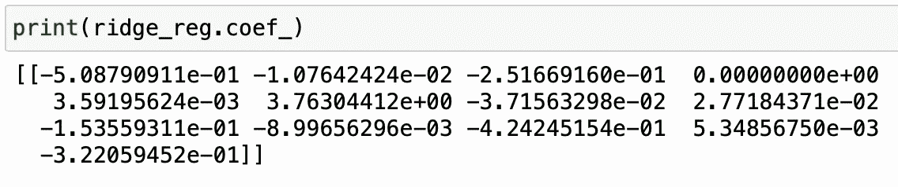

山脊的贝塔矢量(图片由作者提供)

我们看到，RM 的系数仍然很高(约 3.76)，而所有其他系数都降低了。然而，没有一个像套索一样被归零。

这是两者之间的关键区别:Lasso 通常会将特征清零，而 Ridge 会减少模型中大多数特征的权重。

我邀请您仔细检查每个模型的 Beta 向量，并仔细检查这些值:理解 Beta 向量中发生的事情是理解这些模型的关键。

## 如何决定用哪一个？

当你有几个预测能力很强的特征而其他特征没有用的时候，Lasso 是很好的:它会将无用的特征清零，只保留变量的子集。

当数据集的预测能力分布在不同的要素上时，岭很有用:它不会将可能有助于进行预测的要素清零，而只是减少模型中大多数变量的权重。

实际上，这通常很难确定。因此，最好的方法是简单地做我上面编码的事情，看看在测试集上使用不同的 lambda 值能得到什么样的最佳 MSE。

# 更进一步

如果你想更深入地研究数学(我建议你这样做，因为它会帮助你更好地理解正则化是如何工作的)，我推荐你阅读特雷弗·哈斯蒂、罗伯特·蒂伯拉尼和杰罗姆·弗里德曼的《统计学习的要素》第 3.4 章。罗伯特·提布拉尼是套索的发明者，也是我在斯坦福大学的机器学习教授。他的书是这一领域的参考，深入研究了数学，同时也给出了正在发生的事情的全貌。

我还建议在不同的数据集上重新实现这些模型，看看哪一个表现最好，并尝试了解为什么会这样。

*我希望你喜欢这个教程！让我知道你对它的看法。*

*随时连接上*[*LinkedIn*](https://www.linkedin.com/in/thomas-le-menestrel/)*和*[*GitHub*](https://github.com/tlemenestrel)*谈论更多关于数据科学和机器学习的话题并关注我上* [*中*](https://tlemenestrel.medium.com) *！*