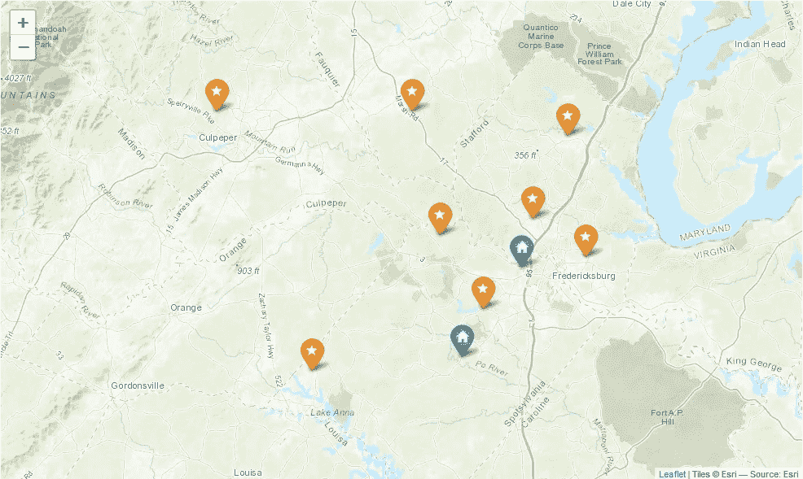
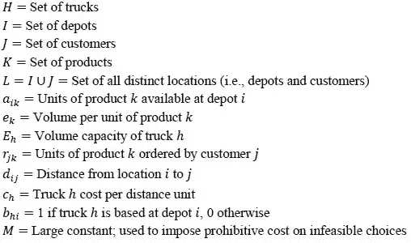
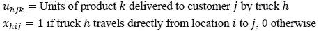
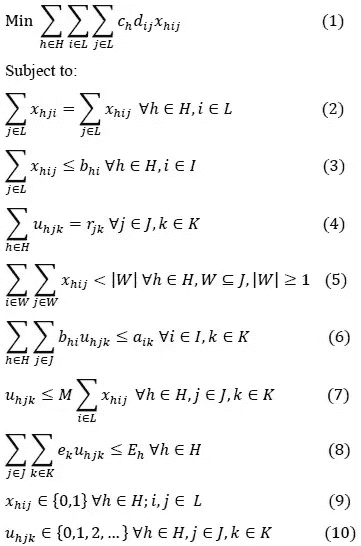
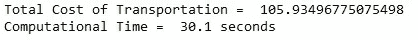
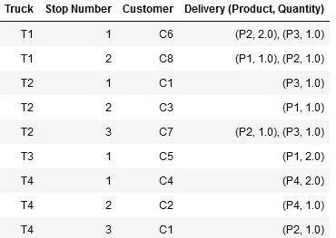
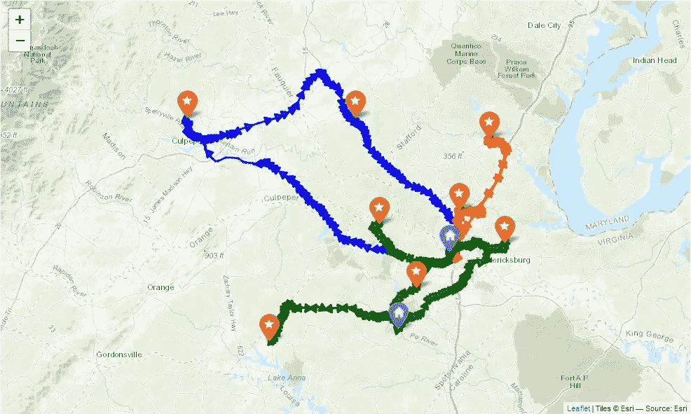

# Python 中多个仓库的最后一英里交付

> 原文：<https://towardsdatascience.com/last-mile-delivery-from-multiple-depots-in-python-26c4325407b4>

## 使用 PuLP 和 VeRoViz 进行数学建模、求解和可视化

[Marcin Jozwiak](https://unsplash.com/@marcinjozwiak?utm_source=medium&utm_medium=referral) 在 [Unsplash](https://unsplash.com?utm_source=medium&utm_medium=referral) 上拍摄的照片

随着网上购物的快速增长，公司面临着对快速、低成本交付的不断增长的需求。*最后一英里配送*是指供应链的最后阶段，包裹从仓库送到顾客家门口。这是一个复杂的战术问题，涉及共同确定如何将包裹分配给卡车以及如何将卡车发送给客户。这也是一个非常昂贵的问题，根据最近的估计，最后一英里的运输成本占总运输成本的 53%。这强调了生成高效交付计划的需要。

这个问题的经典形式涉及到一个单一的仓库(通常是一个仓库)，所有的卡车都从这里装载并发送出去。一个更复杂的版本涉及多个彼此靠近的仓库，例如，当零售连锁店从商店位置发货时。在这种情况下，给定的客户可能由多个仓库提供服务，因此公司还必须确定哪些仓库将向哪些客户发货。有时，没有一个仓库会提供客户订单中的所有商品，因此需要将订单拆分到多个仓库。

下面我们将讨论如何使用[整数规划](https://medium.com/hackernoon/mixed-integer-programming-a-straight-forward-tutorial-41cc50fb9c23) (IP)对这种更复杂的多车场问题形式进行建模和求解。这个问题有以下几个方面:

1.  有一组卡车、仓库、客户和产品。
2.  每个客户都订购了特定数量的每种产品，每个仓库都有一定数量的每种产品。
3.  每辆卡车都恰好位于一个仓库(这意味着它的路线总是从其基地开始和结束)。此外，卡车不需要完全相同——每辆卡车可能有不同的容量和每英里的成本。

目标是同时确定 1)要从每个仓库运送到每个客户的产品，2)如何将包裹分配给卡车，以及 3)如何将每辆卡车发送给其客户，所有这些都以尽可能实现最低总交付成本的方式进行。

我们将使用[纸浆](https://coin-or.github.io/pulp/)实现并解决一个 IP 模型，并使用[维罗维兹](https://veroviz.org)来可视化卡车路线。首先，我们导入必要的库:

## **一个示例场景**

一家家具公司在弗吉尼亚州弗雷德里克斯堡有两个仓库，有八个客户订单需要交付。数据和地图如下所示。*注意:**nodes array*变量是用 [VeRoViz Sketch Tool](https://veroviz.org/sketch.html) 准备的，它支持位置数据的图形化创建并导出到 Python。

场景图:蓝色标记表示仓库，橙色标记表示客户。

## **建模问题**

虽然有许多方法可以解决这个问题，但我们将建立并解决一个整数规划模型。这给出了问题的精确数学规范，并允许中等大小的问题实例使用现成的解算器进行优化解决(尽管超出了我们的范围，但较大的实例通常无法使用现成的解算器快速解决，需要专门设计的解算算法)。我们从模型输入开始:

接下来，我们定义我们的决策变量:

最后，我们定义优化模型:

在这个模型中，我们希望最小化的目标函数(1)就是所有旅行费用的总和。(2)中的约束确保对于每个位置，如果特定卡车到达该位置，则该卡车也离开。(3)中的约束确保没有卡车离开不是其基地的仓库。(4)中的约束确保每个客户得到他们订购的所有产品。(5)中的约束确保在任何路线中不出现子电路。由于形成一个回路的一组位置将具有相同数量的边作为节点，我们防止这种情况在每辆卡车的每个可能的非空客户子集中发生。(6)中的约束确保对于每个仓库和产品，从该仓库装载到卡车上并运送给客户的产品的总单位不超过仓库的可用性。(7)中的约束确保没有任何单位的产品被装载到卡车上并运送给客户，除非卡车拜访客户。(8)中的约束条件确保每辆卡车装载的产品总量不超过其容量。最后,( 9-10)中的约束指定了决策变量的定义域(二进制用于 *x* 变量； *u* 变量的非负整数)。

为了方便和可重用，我们将创建一个 Python 函数，使用 [PuLP](https://coin-or.github.io/pulp/) 为特定的输入数据构建这个模型的实例:

## **解决例题**

既然我们已经有了公式化的模型，我们可以使用它来为我们的场景找到一个最优的解决方案。下面我们使用[纸浆](https://coin-or.github.io/pulp/)附带的 CBC 解算器。这可能需要 15-45 秒才能找到最佳解决方案。如果您可以使用更强大的 [CPLEX](https://www.ibm.com/analytics/cplex-optimizer) 解算器，您可以使用注释掉的行来更快地得到解决方案。

运行该命令会得到以下输出消息:

## **提取并查看卡车路线**

现在，我们需要从求解模型的决策变量中提取卡车路线。对于每辆卡车，我们想知道它的停靠点以及在每个停靠点交付哪些产品。为了获得这些信息，我们需要筛选非零决策变量。

这构成了以下卡车路线:

请注意，两辆卡车(T2 和 T4)拜访了客户 C1，因此产生了一个拆分订单。考虑到同时的客户需求和可用的资源，这被证明是一个最优的决策。例如，当一个订单包含一组在任何一个仓库都找不到的商品时，这也是必要的。

## **可视化卡车路线**

作为我们的最后一步，我们使用 [VeRoViz](https://veroviz.org) 为卡车路线创建一个漂亮的可视化:

## 结论

虽然这个问题可能有许多变化，但是这个例子说明了我们如何使用整数规划来建模和解决这样的问题。它还展示了如何使用 Python 将强大的组件如 [PuLP](https://coin-or.github.io/pulp/) 和 [VeRoViz](https://veroviz.org) 粘合在一起，快速创建有用的决策支持系统。送货愉快！

源代码可以在笔记本[这里](https://nbviewer.org/github/chrisgarcia001/Notebooks/blob/master/multidepot_last_mile_delivery/Multi-Depot-Last-Mile-Delivery.ipynb)查看或者在这里[下载。](https://github.com/chrisgarcia001/Notebooks/tree/master/multidepot_last_mile_delivery)