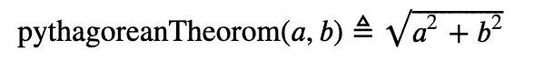

# latexify——清理代码以方便读者的答案

> 原文：<https://towardsdatascience.com/latexify-the-answer-to-cleaning-code-to-be-reader-friendly-ac11a9178bc5>

## 如何让你的代码看起来很漂亮！


[JESHOOTS.COM](https://unsplash.com/@jeshoots?utm_source=medium&utm_medium=referral)在 [Unsplash](https://unsplash.com?utm_source=medium&utm_medium=referral) 上拍照

任何代码的文档都是关键。大多数人希望阅读你的代码，以理解你的方法和你用来解决问题的操作。在阅读别人的代码时，我肯定遇到过**的意大利面条式代码(一堆没有注释的函数，只是松散地扔在笔记本里)**很多次，但如果我说我自己不会犯同样的错误，那我是在撒谎。阅读这些代码可能是一件麻烦的事情，而且一旦完成就会变得很难理解。修复你的代码并为其他用户清理它，这对于把你的想法传达给其他人是很重要的，同时也允许他们理解和利用你创建的代码！

# 清理代码的方法

有许多方法可以清理他们的代码。今天，我们将从*意大利面条式代码*到漂亮的编写代码，华丽的输出勾勒出你的数学方程式。

# **清理 1 →添加文档**

首先，假设您正在创建一个勾股定理函数。首先，您创建两个函数来定义边(显然您可以将 *a* 和 *b* 设置为整数值)。

```
def side_1(a):
    side1 = a return side1def side_2(b):
    side2 = b return side2
```

现在，让我们为勾股定理创建一个函数。

```
def pythagoreanTheorem(a,b):
    c = math.sqrt(a**2 + b**2)

    return c
```

将所有这些放在一起，但是现在用*注释*将真正清理代码，使它对用户来说更容易理解。代码最初允许边 *a* 和 *b* 为负值，因此，如果给出负值，**异常处理**会引发错误。此外，我们将摆脱那些无用的功能，我们开始收集双方，只是让用户输入双方，以减少代码(即。*精益*代码)。最后，我们可以重命名该函数，以便更明确地解释它的作用，并添加文档来解释该函数的假设。

```
import math 
def hypotenuse_frm_pythagThrm(side1: float ,side2: float) -> float:
    """Assuming a the triangle has a 90 degree angle.

    Arugments
    ---------
    side1 (float) : A float value for the first side of a triangle 
    side2 (float) : A float value for the second side of a triangle 

    Returns
    --------
    side3(float): The calculated hypotenuse
    """ if side1 =<0:
        raise ValueError('A triangle can not have a negative                  length!')if side2 =<0:
        raise ValueError('A triangle can not have a negative  length!') side3 = math.sqrt(side1**2 + side2**2)

    return side3
```

现在，看看那个！尽管我们使用的是简单的函数，但是仅仅添加一些文档、异常处理和删除无用的函数就已经使我们的代码看起来更加美观了。包含异常处理的额外步骤确保人们理解为什么他们会破坏你的代码。什么能让这段代码看起来更好？**用 latex 字体转换我们代码的输出。**

# 清理 2 → Latexify

正如我所说的，我们可以使用 latex 格式清理 python 数学函数。latex 格式受到各种 STEM 学科的高度重视，并在发表关于数学/工程过程的研究和写作时使用。最初，我们把勾股定理概括为

```
def pythagoreanTheorem(a,b):
    c = math.sqrt(a**2 + b**2) return c
```

现在，如果我们在这个函数上使用 *latexify* 会发生什么？(注意:Latexify 对我的文档函数不起作用，但如果您将函数简化为 return 语句，它将起作用。在您的代码中这样做并隐藏输入，只显示输出函数仍然是有帮助的。

```
[@latexify](http://twitter.com/latexify).with_latexdef pythagoreanTheorom(a,b):
    return math.sqrt(a**2 + b**2)pythagoreanTheorom
```

运行该单元后，我们得到以下输出(在 Jupyter 笔记本中):



Jupyter 中的输出(图片来自作者)

就这样，我们让我们的代码**变得美丽！使用这种格式在你的代码中表达你的功能对任何阅读或使用你的代码的人来说都是非常有用的。它不仅有助于克服阅读用计算机语言编写的数学方程的困难，而且可以清楚地概述方程是如何运算的，这对那些努力理解方程运算的人非常有帮助。**

# 结论

不仅编写基本正确的代码很重要，而且记录下来并使其对查看者清晰可见也很关键，这样其他人就可以理解您的工作以及您是如何得出各种结论的。 ***Latexify*** 是一个 API，可以帮助读者勾勒出数学方程，否则在编程语言格式中很难阅读和理解。在出版你的下一部作品之前尝试一下，我保证人们会非常感激你采取的额外步骤！

如果你喜欢今天的阅读，请关注我，并告诉我你是否还有其他想让我探讨的话题！如果你还没有中等账号，就通过我的链接 [**这里**](https://ben-mccloskey20.medium.com/membership) **报名吧！另外，在**[**LinkedIn**](https://www.linkedin.com/in/benjamin-mccloskey-169975a8/)**上加我，或者随时联系！感谢阅读！**