# 加速收敛的解空间技术:介绍

> 原文：<https://towardsdatascience.com/latexpage-fc3c47e4d822>

弗洛里安·里德在 [Unsplash](https://unsplash.com?utm_source=medium&utm_medium=referral) 上拍摄的照片

> 三个门我都要了！
> 
> 作者对[天魔堂问题](https://en.wikipedia.org/wiki/Monty_Hall_problem)的建议解决方案

机器学习中的许多策略涉及解空间ω的迭代搜索。我们从初始解ω₀开始，并更新ωₙ以最小化目标函数 *f(x)* ，

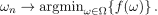

为了在合理的时间内找到全局解，我们必须采用随机方法:在 *ωₙ* 的ω-邻域内随机选择 *ωₙ₊₁* ，同时选择*f(ωₙ₊₁)*<*f(ωₙ)*。

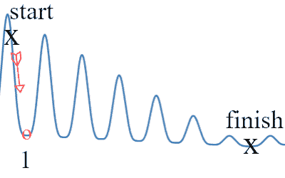

作者图片

收敛速度是在每个点局部确定的，同样地， *f(x)* 的拓扑构成了追求全局最优的主要瓶颈。

让我们考虑一个物理例子，让你做随机行走。假设有一个带有二十个未知开关{1，…，20 } =ω的断路器，我们想要为一个特定插座识别正确的开关 *ω** 。在断路器和插座之间行走需要一分钟，所以我们对检查所有 20 个开关感到不满意。

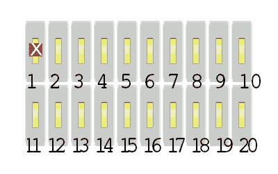

作者图片

为了测试开关，我们在打开和关闭之间切换其状态，并检查插座是否也被切换。显然，不超过 20 次开关的翻转就足以识别这个插座。让这成为我们的直接方法，用预期的时间来确定出口

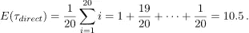

收敛到正确的交换机是显而易见的，但是我们检查插座的次数比需要的多！在这里，我们的搜索涉及在开关ω= {*ω₁，…，ω₂₀* }的规范空间中独立状态之间的字面行走，并且我们降落在一个*ω**∈ω上，该ω通过连续的选择 *αₙ* 来识别出口

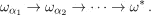

事实证明，我们可以通过走路做得更好——不，把你的脚拿开！而是在一个扩大的空间里。使用相同的切换开关和检查插座电源的基本程序，我们现在将开关分组。

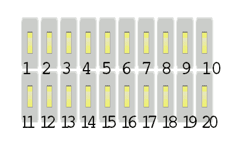

作者图片

比如说，在五个一组的分组中进行选择，然后一旦除了一个组之外的所有组都被排除，就拨入单个交换机。

因此，我们保留了我们的算法，但是通过在随机行走中附加额外的状态来访问，我们期望采取更少的步骤。这里我们分而治之，但一般来说，我们应用任何利用我们在解空间中访问的点的相对结构的技术。

# 线性代数中的预处理

虽然上面的想法非常广泛，并且经常用于加速复杂图形上的遍历，但是线性代数中的预处理提供了一个为什么我们增加解空间的简洁的例子。考虑求解中的最速下降算法

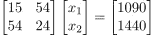

求解等价系统

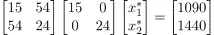

意味着我们在一个单一步骤中接近真实解(20，15 ),就像我们在两个步骤中所做的那样，而没有将解空间缩放

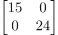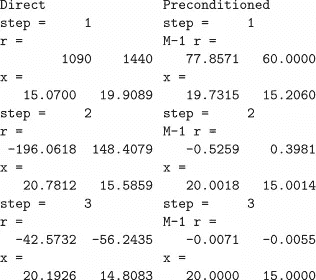

直接和预处理变量*，* x₀ = 0

由于 0 处的梯度在缩放下比没有缩放时更紧密地适合残差，所以收敛立即加快。带渐变的俄罗斯方块，如果你愿意的话。

现在，回到寻找断路器开关的问题，我们最终找到了解决方案*ω**∈ω⊂ω*，只需首先通过步进

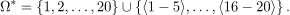

在连续检查每个单独开关的最坏情况下，我们最多用二十步来识别开关；而ω*中的分组方法

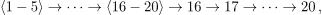

我们最多检查三个组，并且只留下来验证剩余的五个独立开关。因此，通过以下九个步骤保证了收敛

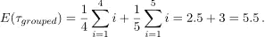

# 随机漫步和超越

除了方程组和最优化问题，我们在马尔可夫链蒙特卡罗中发现了许多解空间技术的例子。在确定正确的断路器开关时，我们发现了一种更好的方法来执行随机行走，即在整组开关之间引入中间步骤，从而缩短解决问题的预期时间。

纽约的国会选区([维基百科](https://en.wikipedia.org/wiki/New_York's_congressional_districts)，公共领域)

在国会选区重划分析中，计划是根据其在所有选区分配排列中对稳定分布的偏离来审查的。从城镇到地区的原始地图开始，我们问一个提议的计划是否是任意选择的。具体来说，在[模拟分配过程](https://mggg.org/districtr)到接近平稳的程度时，有没有可能提议的计划被选择用于一个非常特殊的目的？它会在邻近地区交换城镇时自然出现吗？

下一次，我们将介绍元图作为一种加速随机游走收敛的方法，展示如何从初始状态空间ω生成它，以及它如何将一些 **np** 问题转化为**:-p**——稍后见。