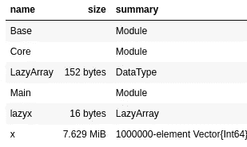
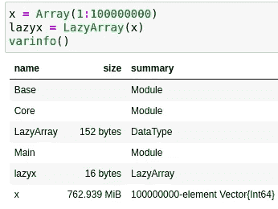

# 惰性数组及其在数据科学中的潜在应用

> 原文：<https://towardsdatascience.com/lazy-arrays-and-their-potential-applications-in-data-science-d1f34e8657f6>

## 什么是惰性数组，如何在数据科学环境中使用它们？


(图片由 [Pixabay](http://pixabay.com) 上的 [Pixapopz](https://pixabay.com/images/id-1547018/) 提供)

# 介绍

数据科学就是寻找适合完美模型的完美数据。有时，某些模型可能比其他模型需要更多的数据，这是由于偏差的原因。如果你想知道更多关于一个给定的模型是如何不足或过度的，以及偏见意味着什么，我有一整篇文章，你可以在这里阅读:

</everything-you-need-to-know-about-bias-over-fitting-and-under-fitting-8e2c1963107b>  

也就是说，如果你有一个巨大的模型，有很多非常好的、统计上显著的特征，但仍然不合适，会发生什么？换句话说，如果您的模型急需数据，但由于硬件的限制，您似乎没有办法输入更多的数据，该怎么办呢？不管你有什么样的系统，它的内存容量总是有限的。也许你碰巧在一台内存很小的电脑上工作，比如 Chromebook 或类似的东西。对于这些情况，我有几个选项，您必须补救您的数据问题。

第一种选择是利用分解。分解可以采用许多不同的维度和特性，并将它们压缩成本质上一个可读的特性。这将节省大量内存，也有利于机器学习模型的性能和分析，但是像分解这样的事情是有限制的，它不会完全解决这些问题。我确实有一篇关于奇异值分解的文章，这可能是最恰当和最流行的分解形式，如果你想了解更多关于这个主题的知识，你可以在这里阅读:

</deep-in-singular-value-decomposition-98cfd9532241> [## 深入奇异值分解

towardsdatascience.com](/deep-in-singular-value-decomposition-98cfd9532241) 

下一个方法是把数组变成表达式。这很像随机投影，但是当你真正开始考虑它的时候，它确实变得有点困难。你怎么能做出一个通用的表达式来表示整个数组的数据呢？今天我想考虑的就是这个，以及这些表达式数组的应用，它们可以帮助机器学习领域的人。此外，我决定在本文中编写我们自己的惰性数组，我在一个笔记本中快速完成了这项工作，下面是该笔记本文件的链接:

<https://github.com/emmettgb/Emmetts-DS-NoteBooks/blob/master/Julia/lazyarrays.ipynb>  

> 顺便说一句，两年多的笔记本提交到那个仓库。2022 年将是我在 Medium 上写博客的第三年。非常感谢大家这两三年的美好时光！

# 什么是懒数组？

惰性数组是作为表达式或函数存储在内存中的数组(相同的区别，只是类型不同)。举个例子来形象地说明这到底是什么意思可能会有帮助。考虑以下阵列:

```
x = [5, 10, 15, 20]
```

这个数组中的每个元素都可以被 5 整除，数据是线性的。因此，我们可以用经典的斜率式公式来计算，当然，这不需要任何 y 截距。

```
xbar(n) = n * 5
```

正如索引该数组将提供存储在该位置的值的返回一样，

```
x[1]5
```

如果我们像调用这个索引一样调用这个新函数，我们将得到相同的确切回报:

```
xbar(1)5
```

现在我们可以将数组的维数限制在 4，所以虽然数组不能调用超出这些界限的索引，但是函数可以。我们可以通过简单地存储一些值来解决这个问题，就像我们要做一个 LazyArray 构造函数…像这样举个例子:

```
mutable struct LazyArray
    n::Int64
    function LazyArray(is::Any ...)
        new{typeof(is[1])}(length(is)) end
end
```

对于那些不写 Julia 的人来说，这可能有点令人困惑，但是现在我们有了一个新类型 LazyArray，它的属性是 n，即值的长度。我们需要完成的最后一件事是一个表达式。通常，LazyArray 构造函数会被提供一个表达式和一些需要创建的东西。这是因为对数组的某些函数规范形式进行逆向工程可能很困难。也就是说，如果没有无限多的可能性，这将是困难的。

无论如何，考虑到这实际上是不可能的，我想考虑我们正在从一个数字数组，1–100，000，000，创建一个惰性数组，这应该给出一个好主意，为什么我们应该首先使用惰性数组。

```
mutable struct LazyArray
    n::Int64 f::Function
    function LazyArray(is::Any ...) f(x) = x * 1
        new{typeof(is[1])}(length(is),f)end
end
```

考虑到我们的实现，我们可能还希望允许从一个常规数组构造一个惰性数组。

```
mutable struct LazyArray
    n::Int64f::Function
    function LazyArray(is::Any ...)f(x) = x * 1
        new(length(is),f)end function LazyArray(is::AbstractArray)
        f(x) = x * 1 new(length(is), f)
    end
end
```

这是重复的代码，因为我们要调用数组类型，而不是只调用 any 的一个…它被求值为一个元组。我们可以通过反转这些调用来避免代码重复，让 LazyArray(::AbstractArray)在我调用的 LazyArray(::Any …)中的值之后被调用，并且所提供的值被转换成一个数组。请允许我演示:

```
mutable struct LazyArray
    n::Int64f::Functionfunction LazyArray(is::AbstractArray)
        f(x) = x * 1new(length(is), f)
    end
    function LazyArray(is::Any ...)
    return(LazyArray([i for i in is]))end end
```

我们甚至可以进一步将这个最小化到

```
mutable struct LazyArray
    n::Int64f::Functionfunction LazyArray(is::AbstractArray)
        f(x) = x * 1new(length(is), f)
    end
    LazyArray(is::Any ...) = LazyArray([i for i in is])end
```

现在我们有了函数，f，我们可以继续讨论这些函数如何在前端工作。每当调用索引时，我们将在被调用的点上计算给定的索引。在 Julia 中，这都是通过扩展 Base.getindex()方法来完成的。

```
import Base: getindex
```

基本上，提供给这个方法的任何索引都将通过我们的 f 函数运行。假设我们希望新的惰性数组与之前的数组长度相同，如果索引大于我们想要的值，我们也可能希望抛出

```
function getindex(a::LazyArray, i::Int64)
    if i > a.n
        throw(IndexError("Index outta bounds, yo"))
    end
    a.f(i)end
```

同样，我将对 UnitRange 做同样的事情。

```
function getindex(a::LazyArray, i::UnitRange)
    if i[2] > a.n
        throw(IndexError("Index outta bounds, yo"))
    end
    [a.f[val] for val in i]end
```

现在让我们创建一个新的范围，这将是我们的 x 数组，我们将通过它本身的惰性版本。

```
x = Array(1:1000000)lazyx = LazyArray(x)
```

现在让我们评估和比较这两个数组的内存使用情况，然后尝试一些索引。

```
varinfo()
```



我们看到，典型的 x 1，000，000 元素向量方法占用了 7.629 兆字节的内存。另一方面，我们的懒惰版本只占用 16 字节的内存。惰性版本的优点还在于，不管 x 有多长，我们仍然会有相同的内存使用量。

```
x = Array(1:100000000)lazyx = LazyArray(x)
varinfo()
```



虽然我们的 lazyx 只需要 16 个字节来存储，而我们最初的 x 几乎需要整整 10 亿字节来存储，但它们在数学上是等价的。Lazyx 只是 x 的一种规范形式，一种数学压缩的代数表示。这是通过索引揭示的，它保持完全相同:

```
x[500]500lazyx[500]lazyx[1:1000]MethodError: no method matching getindex(::var"#f#1", ::Int64)
```

> 哎哟

不知道为什么我试图索引函数而不是调用它。

```
function getindex(a::LazyArray, i::UnitRange)
    if i[2] > a.n
        throw(IndexError("Index outta bounds, yo"))
    end
    [a.f(val) for val in i]
endlazyx[1:1000] == x[1:1000]true
```

对于我们的实现，下一步将是实现一些基本函数，比如 length，分派一些函数，比如。+，等等。添加到一个表达式列表中，最后构建一个迭代器或者进行某种迭代绑定。

# 惰性数组的实现

既然我们已经编写了自己的惰性数组，并因此完全理解了它们的作用和工作原理，我们需要考虑它们实际上是如何实现的，它们是如何派上用场的，以及它们的优秀之处。惰性数组的一个重要问题是，它们需要给定数组的某种代数形式。对于一般的数据源来说，这未必是一件难以置信的事情。在线性模型上可能很容易，但在非线性模型上肯定不容易。这限制了数据科学中的潜在应用，因为数据通常是非线性的，每当事情是这样时，表达式可能很难评估。

也就是说，仍然有一些惰性数组的实现，以及这些实现的一些问题。我想谈的第一个是 Python 的 Dask 框架的实现。这个实现可以在 dask.array 中找到，根据我的经验，它非常健壮。dask 系统主要针对集群，而不是单一系统。也就是说，对于像典型的数据科学过程这样更加个人化和声明性的东西，我们真的不需要将这些东西分布在一个计算机集群中——此外，与一组硬件的密切关系也不是一件坏事。

惰性数组的 dask 实现实际上非常棒，非常健壮。总的来说，dask 软件包相当不错。我真正喜欢的是，我们可以向计算中添加额外的表达式，然后一次性执行所有的操作。

在 Julia 中还有另一个类似的实现，名为 LazyArrays.jl。当然，这个实现更接近于我们上面编写的示例，以演示这些数组的功能和内存使用，但这一点仍然有效。这个实现与 dask 非常相似，但是我要说的是 dask 模块内部的一些语法变得更简单了。我认为这可以归结为 dask 是一个拥有大量赞助商的庞大团队，而 LazyArrays 团队只是普通的朱利安一起创造东西。

# 结论

问题是，现在我们知道了什么是惰性数组，以及它们如何有益于数据科学，那么这些数组对 DS/ML 有什么价值呢？像这样的惰性数组的概念在一个特定的环境中非常好:

> 我们更关心记忆，而不是计算。

特别是在像 Julia 这样的语言中，它提供了更具命令性的静态类型的低级语言的速度和高级声明性语法的便利，这是我们可能要做的一个权衡。之前的 10，000，000 个值的数组几乎使用了千兆字节的数据。我的电脑总共只有 8g 的内存。也就是说，在执行期间，一个维度占用了整整 10 亿字节，也就是我总内存的 1/8，这是一个很大的问题。在这种情况下，只要我们可以用表达式计算数组，这将非常适用于我正在进行的任何项目。

我想到的一个真正伟大的应用是在工程特征中。也许我们甚至可以以表达式的形式读入值，但肯定主要形式是通过函数或表达式进行工程设计。这样我们可以说有一个惰性数组，它的起始表达式是

```
df["feature"] + df["feature"]
```

我认为惰性阵列真的很酷，可能会对数据科学产生相当大的影响。坦率地说，我喜欢用数组的代数表示法做大量的实验。这似乎是一个伟大的方式，许多东西都有可能被压缩。我一直在思考一些潜在的方法，也许我可以将这些方法应用到我的数据管理框架中，但是我们将会看到结果，因为我现在在每个地方都有很多工作要做。如果我要实现它，我希望它更有用，基本上允许任何值被转换成表达式。那么它可能是完全不费力的，你甚至不需要考虑它。感谢您阅读我的文章，我希望这个关于惰性数组的小项目既有趣又有趣。