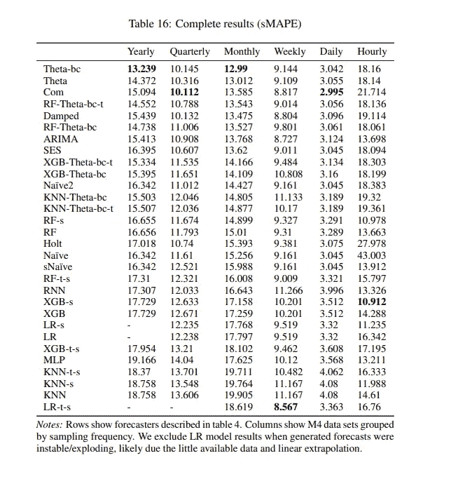
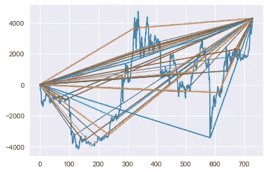
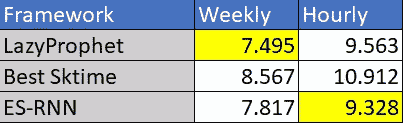

# LazyProphet:用 LightGBM 进行时间序列预测

> 原文：<https://towardsdatascience.com/lazyprophet-time-series-forecasting-with-lightgbm-3745bafe5ce5>

## 都是关于功能的


[**塞巴斯蒂安·拉瓦雷**](https://unsplash.com/@lavalaye) 在 [Unsplash](https://unsplash.com/) 上的图像

当我们考虑时间序列空间中的提升树时，通常是关于 M5 竞赛，其中十大参赛作品中有很大一部分使用了 LightGBM。然而，当观察单变量情况下提升树的性能时，没有大量的外部特征可以利用，它们的性能已经…粗糙了。

直到现在。

# 第一部分:简介

首先，我应该提出一些警告。M4 比赛中的亚军确实使用了提升树。然而，它是作为一个元模型来集成其他更传统的时间序列方法。我在 M4 看到的所有基准测试都相当糟糕，有时甚至无法与天真的预测者相提并论。我在这里使用的主要资源来自为 [Sktime](https://www.sktime.org/en/stable/) 包和他们的[论文](https://arxiv.org/pdf/2005.08067.pdf)【1】所做的出色工作:



马库斯·洛宁、[弗朗茨·基拉里](https://arxiv.org/search/cs?searchtype=author&query=Kir%C3%A1ly%2C+F)的表格，摘自他们的 [Sktime 论文](https://arxiv.org/pdf/2005.08067.pdf)

任何带有“XGB”或“RF”的模型都使用基于树的集合。我们确实看到一个例子，Xgboost 在每小时的数据集中提供了最好的结果，为 10.9！然后，我们意识到这些只是他们在他们的框架中尝试的模型，M4 的获奖者在同一数据集上得了 9.3 分…

试着记住这张图表中的一些数字，特别是 XGB-s 的每小时数据集的 10.9 和每周数据集中树木的“最佳”结果:RF-t-s 的 9.0。

我们的目标是使用快速 LightGBM 程序彻底粉碎这些数字，该程序适合各个时间序列，在速度上与 stat 方法相当。

所以，没时间优化了。

听起来相当困难，我们的第一想法可能是我们**有**来优化我们的树。增强树非常复杂，我们正在拟合单个数据集，因此它们必须有不同的参数。

但都是功能的问题。

# 第 2 部分:功能

当查看单变量空间中树的其他实现时，您会看到一些特征工程，如宁滨，使用目标的滞后值，简单的计数器，季节性虚拟，可能还有傅立叶基函数。如果你想后悔安装助推树，并希望你坚持使用指数平滑器，这一切都很好。主题是我们必须特征化我们的时间元素，并将其表示为表格数据以提供给树，我们的实现:[lazy profet](https://github.com/tblume1992/LazyProphet)也不例外。但是，我们有一个额外的特征工程元素，我在任何地方都没有见过(尽管它非常简单，所以这不可能是新颖的)。

我们将…“把这些点连接起来”。

很简单，我们连接我们系列的第一个点，并在中间拟合一条线到另一个点，然后将该点连接到最后一个点。重复几次，同时改变哪一点作为“拐点”,你就成功了。

希望这张图能很好地说明这一点。蓝线是一个时间序列，其他线只是“连接这些点”:



作者图片

原来，这些只是加权的分段线性基函数。(再说一次，如果你知道这方面的任何研究，一定要让我知道，因为我真的找不到任何关于这个具体实现的东西。)这样做的一个不利之处是，这些线的外推可能会有偏差。为了处理这个问题，我们将加入一个“衰减”因子，它只是惩罚从中点到终点的每条线的斜率。

就这样，就这样。把这些坏男孩连同滞后的目标值和傅立叶基函数一起扔进去，你就成功了！对于某些问题，几乎达到了最先进的性能，而且对我们的要求很低，因此被称为“LazyProphet”。

但是让我们得到一些结果来支持这个观点。

# 第 3 节:守则

这些数据集都是开源的，并且在 M 竞赛 [github](https://github.com/Mcompetitions/M4-methods/tree/master/Dataset) 上直播。它被标准训练和测试分割，因此我们将使用训练 csv 进行拟合，而测试 csv 仅用于使用 SMAPE 进行评估。让我们将数据和 LazyProphet 一起导入，如果您还没有安装它，请从 pip 中获取它。

```
pip install LazyProphet
```

安装后，让我们开始编码:

```
import matplotlib.pyplot as plt
import numpy as np
from tqdm import tqdm
import pandas as pd
from LazyProphet  import LazyProphet as lp train_df = pd.read_csv(r'm4-weekly-train.csv')
test_df = pd.read_csv(r'm4-weekly-test.csv')
train_df.index = train_df['V1']
train_df = train_df.drop('V1', axis = 1)
test_df.index = test_df['V1']
test_df = test_df.drop('V1', axis = 1)
```

在这里，我们只需导入所有必需的包，并将数据作为每周数据的标准数据帧读入。接下来，让我们创建 SMAPE 函数，该函数将返回给定预测和实际值的 SMAPE:

```
def smape(A, F):
    return 100/len(A) * np.sum(2 * np.abs(F - A) / (np.abs(A) +       np.abs(F)))
```

在我们的实验中，我们将采用所有时间序列的平均值来与其他模型进行比较。对于健全性检查，我们还将获得“天真”的平均得分，以确保我们所做的与竞争中所做的一致。也就是说，我们将简单地遍历数据帧并进行惰性拟合和预测。代码可以通过**而不是**执行 for 循环来优化，但是这样做也很好！

```
smapes = []
naive_smape = []
j = tqdm(range(len(train_df)))
for row in j:
    y = train_df.iloc[row, :].dropna()
    y_test = test_df.iloc[row, :].dropna()
    j.set_description(f'{np.mean(smapes)}, {np.mean(naive_smape)}')
    lp_model = LazyProphet(scale=True,
                            seasonal_period=52,
                            n_basis=10,
                            fourier_order=10,
                            ar=list(range(1, 53)),
                            decay=.99,
                            linear_trend=None,
                            decay_average=False)
    fitted = lp_model.fit(y)
    predictions = lp_model.predict(len(y_test)).reshape(-1)
    smapes.append(smape(y_test.values,      pd.Series(predictions).clip(lower=0)))
    naive_smape.append(smape(y_test.values, np.tile(y.iloc[-1], len(y_test))))  
print(np.mean(smapes))
print(np.mean(naive_smape))
```

在我们查看结果之前，让我们快速了解一下 LazyProphet 参数。

1.  `scale` **:** 这个很简单，简单的看是否缩放数据。默认值为 True，因此我们在这里只是明确说明。
2.  `seasonal_period`:该参数控制季节性的傅立叶基函数，因为这是我们使用的`52`的周频率。
3.  `n_basis`:该参数控制我们正在申请专利的加权分段线性基函数。这只是要使用的函数数量的一个整数。
4.  `fourier_order`:用于季节性的正弦和余弦对数。
5.  `ar`:使用什么滞后目标变量值。我们可以接受一个倍数的列表，然后简单地传递一个 1-52 的列表。
6.  `decay`:用于惩罚基函数“右侧”的衰减因子。设置为`0.99`表示斜率乘以(1- 0.99)或 0.01。
7.  `linear_trend`:树的一个主要缺点是它们不能推断出以前数据的界限。我提到过吗？是的，这可能是个大问题。为了克服这一点，有一些针对多项式趋势的即兴测试，如果检测到一个趋势，我们将线性回归拟合为去趋势。通过`None`表示将会有测试，通过`True`表示总是去趋势，通过`False`表示不测试并且从不使用线性趋势。
8.  `decay_average`:使用衰减率时，这不是一个有用的参数。这主要是做奇怪事情的奇怪的黑魔法。试试吧！但是不要用。通过`True`本质上只是对基函数的所有未来值进行平均。在我的测试中，这在使用 elasticnet 过程时很有用，但在使用 LightGBM 时就没那么有用了。

在我们得到结果之前，让我们继续并适应每小时的数据集:

```
train_df = pd.read_csv(r'm4-hourly-train.csv')
test_df = pd.read_csv(r'm4-hourly-test.csv')
train_df.index = train_df['V1']
train_df = train_df.drop('V1', axis = 1)
test_df.index = test_df['V1']
test_df = test_df.drop('V1', axis = 1)smapes = []
naive_smape = []
j = tqdm(range(len(train_df)))
for row in j:
    y = train_df.iloc[row, :].dropna()
    y_test = test_df.iloc[row, :].dropna()
    j.set_description(f'{np.mean(smapes)}, {np.mean(naive_smape)}')
    lp_model = LazyProphet(seasonal_period=[24,168],
                            n_basis=10,
                            fourier_order=10,
                            ar=list(range(1, 25)),
                            decay=.99)
    fitted = lp_model.fit(y)
    predictions = lp_model.predict(len(y_test)).reshape(-1)
    smapes.append(smape(y_test.values, pd.Series(predictions).clip(lower=0)))
    naive_smape.append(smape(y_test.values, np.tile(y.iloc[-1], len(y_test))))  
print(np.mean(smapes))
print(np.mean(naive_smape))
```

好吧，我们真正改变的是`seasonal_period`和`ar`参数。当把一个列表传递给`seasonal_period`时，它将为列表中的所有东西建立季节基函数。`ar`进行了调整，以适应新的主要季节周期 24。就是这样！

# **第四节:结果**

还记得上面的 Sktime 结果吗？你其实不必，这里有一张表:



作者图片

因此，LazyProphet 击败了 Sktime 的最佳模型，其中包括几种不同的基于树的方法。在每小时的数据集上，我们确实输给了 M4 的冠军，但平均而言，我们实际上总体上优于 ES-RNN。这里要认识到的重要一点是，我们是用默认参数做到这一点的…

```
boosting_params = {
                    "objective": "regression",
                    "metric": "rmse",
                    "verbosity": -1,
                    "boosting_type": "gbdt",
                    "seed": 42,
                    'linear_tree': False,
                    'learning_rate': .15,
                    'min_child_samples': 5,
                    'num_leaves': 31,
                    'num_iterations': 50
                    }
```

如果你想改变这些，你可以在创建 LazyProphet 类时传递你自己的 dict。这些甚至可以针对每个时间序列进行优化，以获得更多收益。

但是，让我们将我们的结果与我们的目标进行比较:

1.  我们进行了零参数优化(针对不同的季节进行了细微的修改)。
2.  我们分别拟合每个时间序列。
3.  我们在我的本地机器上“懒洋洋地”用了一分多钟就做出了预测。
4.  我们击败了基准测试中的所有其他树方法，甚至平均击败了 M4 的获胜者。

我得说我们相当成功！

你可能会问，“其他数据集的结果在哪里？”

不幸的是，我们的成功没有持续多久。一般来说，其他数据集的数据要少得多，因此我们的方法往往会显著降低性能。据我所知，LazyProphet 往往以高频率和可观的数据量大放异彩。当然，我们可以尝试用一个 LightGBM 模型来拟合所有的时间序列，但是我们可以留到下次再做！

由于我们只是使用 LightGBM，您可以改变目标并尝试时间序列分类！或者使用分位数目标作为预测界限！有很多很酷的东西可以尝试。

如果你觉得这很有趣，我鼓励你看看我用另一种土生土长的方法对 M4 比赛的另一种看法:[百里香增强。](https://github.com/tblume1992/ThymeBoost)

[](/the-m4-time-series-forecasting-competition-with-thymeboost-b31196fc319)  [](/thymeboost-a0529353bf34)  [](/gradient-boosted-arima-for-time-series-forecasting-e093f80772f6)  

**参考文献:**

[1][Markus lning，Franz Király:《用 sktime 进行预测:设计 sktime 的新预测 API 并应用于复制和扩展 M4 研究》，2020 年；arXiv:2005.08067](https://arxiv.org/abs/2005.08067)