# 在分类数据集中，LDA 比 PCA 更能有效地降低维数

> 原文：<https://towardsdatascience.com/lda-is-highly-effective-than-pca-for-dimensionality-reduction-in-classification-datasets-4489eade632>

## 线性判别分析(LDA)在最大化类别可分性的同时进行维数缩减


威尔·弗朗西斯在 [Unsplash](https://unsplash.com/photos/Rm3nWQiDTzg?utm_source=unsplash&utm_medium=referral&utm_content=creditCopyText) 拍摄的照片

可以使用各种技术来实现降维。11 种这样的技术在我的热门文章[*2021 年你应该知道的 11 种降维技术*](/11-dimensionality-reduction-techniques-you-should-know-in-2021-dcb9500d388b) 中已经讨论过了。

在那里，你将适当地学习一些技术术语背后的含义，如维度和降维。

简而言之， ***维度*** 是指数据集中特征(变量)的数量。减少数据集中特征的过程称为 ***降维*** 。

# 线性判别分析

线性判别分析(下文称为 LDA)是一种流行的线性降维技术，它可以在低维空间中找到输入特征的线性组合，同时最大化类别可分性。

类别可分性仅仅意味着我们尽可能地保持类别，同时保持每个类别中数据点之间的最小间隔。

类别分离得越好，就越容易在类别之间绘制决策边界来分离(区分)数据点组。

LDA 通常用于具有类标注的分类数据集。它既可以用作二元/多类分类(监督学习)算法，也可以用作降维(非监督学习)算法。

然而，LDA 在用于降维时需要类别标签。因此，LDA 执行*监督降维*。

拟合的 LDA 模型可以用于分类和维数减少，如下所示。

```
from sklearn.discriminant_analysis import LinearDiscriminantAnalysis

lda = LinearDiscriminantAnalysis().fit(X, y) # fitted LDA model
```

*   `**lda.predict(X)**` **:** 进行多级分类。这将向可用类别分配新的数据点。
*   `**lda.transform(X)**` **:** 在分类数据集中执行降维，同时最大化类的分离。这将在低维空间中找到输入特征的线性组合。当以这种方式使用 *lda* 时，它充当数据预处理步骤，其输出被用作另一种分类算法的输入，例如支持向量机或逻辑回归！

# PCA 与 LDA

PCA 是最流行的降维技术。PCA 和 LDA 都被认为是 ***线性*** 降维技术，因为它们在数据中找到输入特征的线性组合。

然而，这两种算法之间有显著的差异。

*   PCA 通过最大化数据的方差来执行维数减少。因此，在大多数情况下，在应用 PCA 之前，特征标准化是必要的(参见这里的例外)。
*   LDA 通过最大化分类数据集的类别可分性来执行维数缩减。因此，特性标准化在这里是可选的(我们将很快验证这一点)。
*   PCA 不需要类别标签。因此，它可以用于分类，回归，甚至无标签的数据！
*   LDA 要求等级标签。因此，它用于分类数据集。
*   PCA 在低维空间中找到一组不相关的特征。因此，PCA 会自动移除数据中的多重共线性(在此处了解更多[)。](/how-do-you-apply-pca-to-logistic-regression-to-remove-multicollinearity-10b7f8e89f9b)
*   如前所述，LDA 可用于监督和非监督任务。PCA 只能用于无监督的降维。
*   PCA 能找到的最大分量数等于数据集的输入特征(原始维数)数！我们通常倾向于找到数量相当少的组件，尽可能多地捕捉原始数据中的差异。
*   LDA 可以找到的最大组件数等于分类数据集中的类数减一。例如，如果数据集中只有 3 个类，LDA 最多可以找到 2 个组件。
*   对于分类数据集，LDA 比 PCA 更有效，因为 LDA 通过最大化类别可分性来降低数据的维度。对于具有最大类可分性的数据，更容易绘制决策边界。

今天，在本文中，**我们将*通过使用葡萄酒分类数据集，直观地*证明 LDA 比 PCA 在分类数据集中的降维方面更加有效。**然后，我们将继续讨论如何将 LDA 模型的输出用作支持向量机或逻辑回归等分类算法的输入！

# 葡萄酒数据集

这里，我们将使用[葡萄酒分类数据集](https://scikit-learn.org/stable/datasets/toy_dataset.html#wine-dataset)来执行 PCA 和 LDA。以下是关于葡萄酒数据集的重要信息。

*   **数据集来源:**你可以在这里下载原始数据集[。](https://archive.ics.uci.edu/ml/datasets/Wine)
*   **数据集许可:**该数据集可在 [*CC 下通过 4.0*](https://creativecommons.org/licenses/by/4.0/)(*Creative Commons Attribution 4.0*)许可获得。
*   **所有者:** Forina，m .等人，par vus——一个用于数据探索、分类和关联的可扩展包。意大利热那亚 Via Brigata Salerno，16147，药物和食品分析与技术研究所。
*   捐赠者:斯蒂芬·艾伯哈德
*   **引用:** Lichman，M. (2013)。https://archive.ics.uci.edu/ml 的 UCI 机器学习库。加州欧文:加州大学信息与计算机科学学院。

葡萄酒数据集预装了 Scikit-learn。可以通过调用 [**load_wine()**](https://scikit-learn.org/stable/modules/generated/sklearn.datasets.load_wine.html) 函数来加载，如下。

```
from sklearn.datasets import load_wine

wine = load_wine()
X = wine.data
y = wine.target

print("Wine dataset size:", X.shape)
```

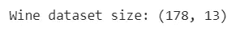

(图片由作者提供)

葡萄酒数据集有 178 个实例(数据点)。它的原始维数是 13，因为它有 13 个输入特征(变量)。此外，数据点被分为三个独立的类别，代表每一种葡萄酒。

# 将主成分分析应用于葡萄酒数据

我们将把主成分分析应用于葡萄酒数据，以实现以下目标。

*   构建 PCA 模型，该模型可用于与将在接下来的步骤中创建的 ld a 模型进行比较。
*   使用前两个主成分在 2D 散点图中可视化高维(13 维)葡萄酒数据。您可能已经知道 PCA 对于数据可视化非常有用。

## 特征标准化

在将 PCA 应用于葡萄酒数据之前，我们需要进行特征标准化，以将所有特征纳入同一尺度。

```
from sklearn.preprocessing import StandardScaler

X_scaled = StandardScaler().fit_transform(X)
```

缩放后的特征存储在 *X_scaled* 变量中，该变量将成为`pca.fit_transform()`方法的输入。

## 运行 PCA

我们将通过调用 Scikit-learn **PCA()** 函数对葡萄酒数据应用 PCA。我们希望保留的组件数量(在`n_components`中指定)严格限制为两个，因为我们对葡萄酒数据的 2D 可视化感兴趣，它只需要两个组件！

```
from sklearn.decomposition import PCA

pca = PCA(n_components=2)
X_pca = pca.fit_transform(X_scaled)
```

转换(简化)后的数据存储在 *X_pca* 变量中，该变量包含可以准确表示原始葡萄酒数据的二维数据。

## 制作散点图

现在，我们将使用存储在 *X_pca* 变量中的数据制作散点图。

```
import matplotlib.pyplot as plt
plt.figure(figsize=[7, 5])

plt.scatter(X_pca[:, 0], X_pca[:, 1], c=y, s=25, cmap='plasma')
plt.title('PCA for wine data with 2 components')
plt.xlabel('PC1')
plt.ylabel('PC2')
plt.savefig("PCA.png")
```

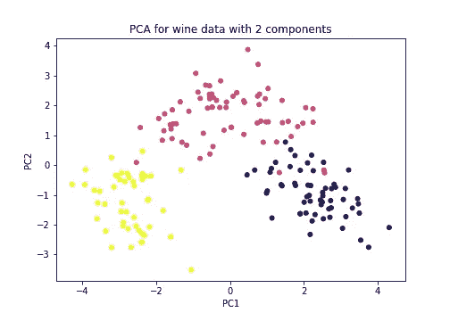

**2D 葡萄酒数据的 PCA 散点图**(图片由作者提供)

数据似乎可以用线性决策边界(即直线)进行线性分离。然而，一些数据点会被错误分类。由于 PCA 没有最大化类的可分性，类没有被很好地分离。

当通过仅保留两个成分将 PCA 应用于葡萄酒数据时，我们丢失了数据中的大量方差。

```
exp_var = sum(pca.explained_variance_ratio_ * 100)
print('Variance explained:', exp_var)
```

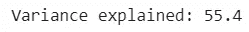

(图片由作者提供)

只有大约 55.4%的方差被我们的具有两个分量的 PCA 模型捕获。这么大的差异不足以准确地代表原始数据。

让我们通过创建下面的图来找到葡萄酒数据的主成分的最佳数量。该值应大于 2 但小于 13(输入要素的数量)。

```
import numpy as np

pca = PCA(n_components=None)
X_pca = pca.fit_transform(X_scaled)

exp_var = pca.explained_variance_ratio_ * 100
cum_exp_var = np.cumsum(exp_var)

plt.bar(range(1, 14), exp_var, align='center',
        label='Individual explained variance')

plt.step(range(1, 14), cum_exp_var, where='mid',
         label='Cumulative explained variance', color='red')

plt.ylabel('Explained variance percentage')
plt.xlabel('Principal component index')
plt.xticks(ticks=list(range(1, 14)))
plt.legend(loc='best')
plt.tight_layout()

plt.savefig("Barplot_PCA.png")
```

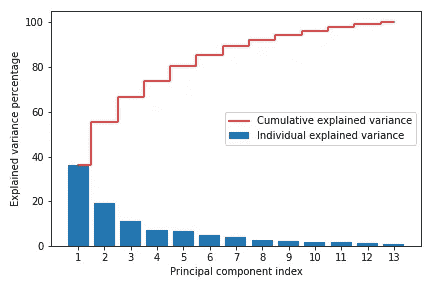

(图片由作者提供)

这种类型的图被称为*累积解释方差图*，在应用 PCA 时，这种图对于找到主成分的最佳数量非常有用。

前六个或七个分量捕获了数据中大约 85–90%的方差。因此，它们将准确地表示原始的葡萄酒数据。但是，对于 2D 可视化，我们严格地希望只使用两个组件，即使它们没有捕捉到数据中的大部分变化。

# 将 LDA 应用于葡萄酒数据

现在，我们将 LDA 应用于葡萄酒数据，并将 LDA 模型与之前的 PCA 模型进行比较。

## 特征标准化

LDA 不需要特征标准化，因为它对 LDA 模型的性能没有任何影响。

## 运行 LDA

我们将通过调用 Scikit-learn**LinearDiscriminantAnalysis()**函数对葡萄酒数据应用 LDA。我们希望保留的组件数量(在`n_components`中指定)严格限制为两个，因为我们对葡萄酒数据的 2D 可视化感兴趣，它只需要两个组件！

```
from sklearn.discriminant_analysis import LinearDiscriminantAnalysis

lda = LinearDiscriminantAnalysis(n_components=2)
X_lda = lda.fit_transform(X_scaled, y)
```

注意，对于 LDA，在`fit_transform()`方法中还需要类标签(y)。

转换(简化)后的数据存储在 *X_lda* 变量中，该变量包含可以准确表示原始葡萄酒数据的二维数据。

## 制作散点图

现在，我们将使用存储在 *X_lda* 变量中的数据制作散点图。

```
import matplotlib.pyplot as plt
plt.figure(figsize=[7, 5])

plt.scatter(X_lda[:, 0], X_lda[:, 1], c=y, s=25, cmap='plasma')
plt.title('LDA for wine data with 2 components')
plt.xlabel('Component 1')
plt.ylabel('Component 2')
plt.savefig("LDA.png")
```

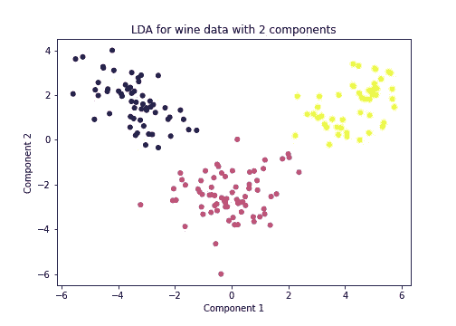

**2D 葡萄酒数据散点图与 LDA** (图片由作者提供)

现在，由于 LDA 除了降低维数之外还最大化了类别可分性，因此类别已经被清楚地分离。绘制线性决策边界时，数据点不会被错误分类。

LDA 可以为葡萄酒数据保留的最大组件数也是两个，因为数据中只有三个类。因此，这两个组件应该捕获数据中的所有差异。

让我们用数字和视觉来验证这一点！

```
exp_var = sum(lda.explained_variance_ratio_ * 100)
print('Variance explained:', exp_var)
```

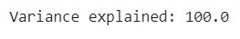

(图片由作者提供)

原始葡萄酒数据中的所有差异都由我们的 LDA 模型捕获，该模型包含两个部分。因此，这些组件将完全代表原始数据。

让我们为 LDA 模型创建累积解释方差图。

```
import numpy as np

lda = LinearDiscriminantAnalysis(n_components=None)
X_lda = lda.fit(X_scaled, y)

exp_var = lda.explained_variance_ratio_ * 100
cum_exp_var = np.cumsum(exp_var)

plt.bar(range(1, 3), exp_var, align='center',
        label='Individual explained variance')

plt.step(range(1, 3), cum_exp_var, where='mid',
         label='Cumulative explained variance', color='red')

plt.ylabel('Explained variance percentage')
plt.xlabel('Component index')
plt.xticks(ticks=[1, 2])
plt.legend(loc='best')
plt.tight_layout()

plt.savefig("Barplot_LDA.png")
```

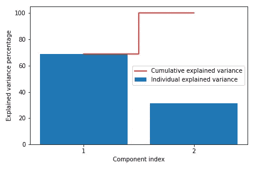

(图片由作者提供)

前两个组件捕获数据中的所有差异。所以，它们完全代表了原始的葡萄酒数据。

# LDA 模式的优势

我们的 LDA 模型具有以下优点。

*   减少数据的维度(特征数量)
*   在 2D 图中可视化高维数据
*   最大化类别可分性

# SVM 与 LDA

> 只有 LDA 可以在降低数据维数的同时最大化类别可分性。因此，在运行另一种分类算法(如支持向量机(SVM)或逻辑回归)之前，LDA 是降低维数的理想方法。

这可以想象如下。

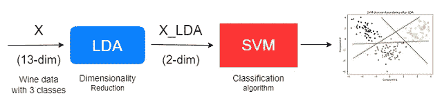

**SVM 与 LDA 的机器学习管道**(图片由作者提供)

LDA 模型将高维(13 维)葡萄酒数据(X)作为其输入，并在最大化类别可分性的同时降低数据的维度。作为 X_LDA 的变换数据(2-dim)与类别标签 y 一起用作 SVM 模型的输入。然后，由于葡萄酒数据具有 3 个类别，SVM 通过使用“一对其余”(ovr)策略来执行多类别分类，这将允许算法在考虑所有其他类别的情况下为每个类别绘制决策边界。

我们使用“线性”核作为支持向量机算法的核，因为数据似乎可以与线性决策边界(即直线)线性分离。

```
from sklearn.svm import SVC

svc = SVC(kernel='linear', decision_function_shape='ovr')
svc.fit(X_lda, y)
```

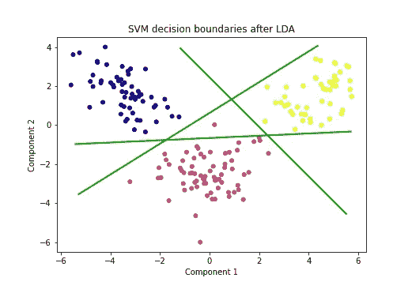

**使用 LDA 实现最大类别可分性的 SVM**(图片由作者提供)

类可以用线性决策边界清楚地分开。只有一个数据点被错误分类。将此与我们之前获得的 PCA 输出进行比较，如果我们绘制线性决策边界，许多点将被错误分类。

> 因此，在分类数据集中，LDA 比 PCA 具有更高的降维效率，因为 LDA 在降低数据维数的同时最大化了类的可分性。

请注意，绘制 SVM 决策边界(超平面)的代码不包括在上面的代码中，因为它需要对支持向量机如何在幕后工作有透彻的理解，这超出了本文的范围。

> **注意:**术语**‘超平面’**是在考虑高维数据时指代决策边界的正确方式。在二维空间中，超平面只是一条直线。同样，你可以想象高维空间中超平面的形状。

# 为 LDA 选择正确的组件数量

PCA 和 LDA 算法中最重要的[超参数](https://rukshanpramoditha.medium.com/parameters-vs-hyperparameters-what-is-the-difference-5f40e16e2e82)是 **n_components** ，其中我们指定了 LDA 或 PCA 应该找到的组件数量。

在我的文章 [*如何为数据集*](/how-to-select-the-best-number-of-principal-components-for-the-dataset-287e64b14c6d) 选择最佳数量的主成分中，已经讨论了为 PCA 选择最佳数量的准则。

同样的准则也适用于 LDA。

*   如果应用 LDA 的唯一目的是为了数据可视化，您应该保留 2 个(对于 2D 图)或 3 个(对于 3D 图)组件。我们只熟悉 2D 和 3D 情节，无法想象其他高维情节。
*   正如我前面解释的，累积解释方差图对于选择正确的成分数量非常有用。
*   LDA 可以找到的最大组件数等于分类数据集中的类数减一。

今天的帖子到此结束。

如果您有任何问题或反馈，请告诉我。

## 下一篇阅读:主成分分析和降维特辑

[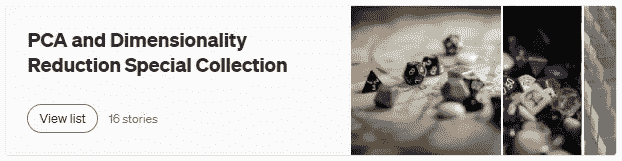](https://rukshanpramoditha.medium.com/list/pca-and-dimensionality-reduction-special-collection-146045a5acb5)

(作者截图)

## 人工智能课程怎么样？

[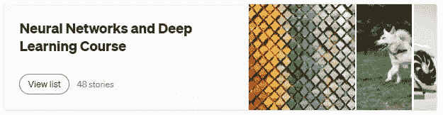](https://rukshanpramoditha.medium.com/list/neural-networks-and-deep-learning-course-a2779b9c3f75)

(作者截图)

## 支持我当作家

我希望你喜欢阅读这篇文章。如果你愿意支持我成为一名作家，请考虑 [***注册成为会员***](https://rukshanpramoditha.medium.com/membership) *以获得无限制的媒体访问权限。它只需要每月 5 美元，我会收到你的会员费的一部分。*

[](https://rukshanpramoditha.medium.com/membership)  

非常感谢你一直以来的支持！下一篇文章再见。祝大家学习愉快！

[鲁克山·普拉莫蒂塔](https://medium.com/u/f90a3bb1d400?source=post_page-----4489eade632--------------------------------)
**2022–12–29**