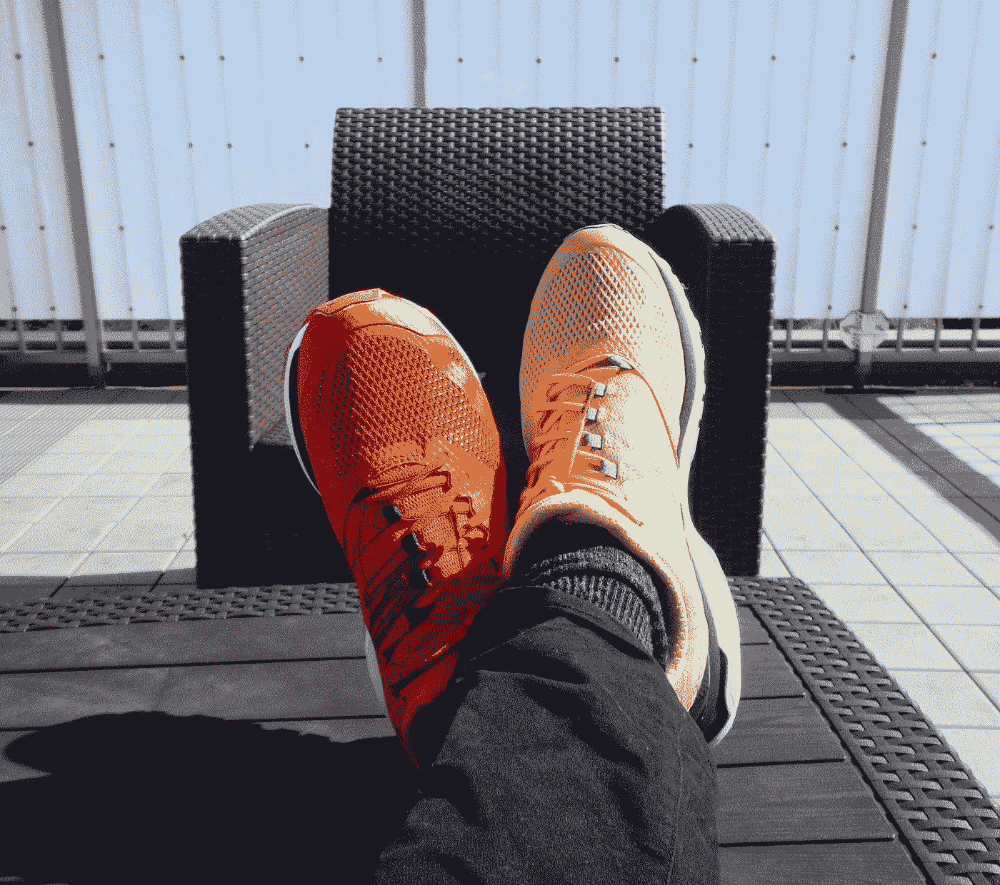

# LDA 主题模型不稳定性

> 原文：<https://towardsdatascience.com/lda-topic-model-instability-c2fedb77d249>

## 没有两个 LDA 主题模型是相同的。主题建模者应该做什么？



[附身摄影](https://unsplash.com/@possessedphotography?utm_source=medium&utm_medium=referral)在 [Unsplash](https://unsplash.com?utm_source=medium&utm_medium=referral) 上拍照

答在花费数小时调整 LDA 模型后，没有什么比意识到他们的模型运行与下一次有多么不同更能破坏主题建模者的一天了。LDA 算法是随机的，用相同的参数对相同的数据生成的模型会产生不同的结果。这是一个特征，而不是算法的错误(试着向你的老板解释一下)。这篇文章对 LDA 模型的不稳定性提供了一个实用的、深入的观察，并展示了对抗其不良影响的方法。

之前的两篇文章[此处](/use-metrics-to-determine-lda-topic-model-size-1a1feaa1ff3c)和[此处](/determining-the-right-lda-topic-model-size-part-ii-ff4312e9fd9)详细介绍了确定指定 LDA 模型的最佳主题数量的步骤。本系列使用的语料库是一个更大的公开许可数据集[新闻文章](https://www.kaggle.com/harishcscode/all-news-articles-from-home-page-media-house)的 [30，000 篇文章子集](https://www.kaggle.com/datasets/danrobinson707/newsdf)。前面文章中概述的分析导致了将主题模型大小设置为 20 的决定。本文着眼于使用 LDA 创建的模型有多不稳定，并通过调整指标和转向 LDA 的一种变体— [*集成 LDA*](https://radimrehurek.com/gensim/models/ensemblelda.html) *来解决这种不稳定性。*

(注:有关数据集、模型参数、技术细节和代码片段的更多信息，请参见附录。)

不幸的是，每次从具有相同参数的相同语料库中生成 LDA 模型时，结果模型将是不同的。这种差异在下面的图表中得到了说明，该图表将文档类别与两种模型进行了比较，我们希望这两种模型即使不相同，至少也是相似的:

相同的参数，相同的数据，不同的结果。图片作者。

每一列代表为模型 A 中的每个主题分类的所有文档。这显示了模型 A 中的每个主题分布在模型 b 中的每个主题上。最清晰的相关性由模型 A 的主题 13 和模型 b 的主题 15 之间的红色单元格表示。96%的模型 A 的主题 13 文档包含在模型 b 的单个主题中。但是，相关性从那里迅速下降。尽管其他一切都是平等的，但这两个模型显然是不一样的。而且问题不仅仅在两个模型之间，进一步的检查暗示着模型内部是相当嘈杂的。以下是 A 的主题列表:

```
0 government president people law country obama vote republican call right
1 people government kill attack official force cnn group report security
2 police court old charge home family case woman death leave
3 claim people london jackson muslim group last british child family
4 police car people officer road fire city family report man
5 french world first murray france last open set iran tennis
6 win right race goal free_kick leave second first minute real_madrid
7 bbc party labour last people pay uk vote election first
8 facebook user apple company google gun people phone device internet
9 team game win first sport play world last coach world_cup
10 people study high research cent patient researcher company increase risk
11 health virus patient people country ebola disease china case world
12 water hospital people home die area family care river boat
13 game player club season play team first last win goal
14 school police student university teacher report home church investigation officer
15 know life woman people think love want come family first
16 russia military country russian president force official government leader united_state
17 child school parent people health need report education service age
18 right police miss dog leave city free_kick attempt officer foot_shot
19 see first world animal people old know picture even come
```

总的来说，主题本身是合理的连贯和可理解的。然而，有很多重叠——单词出现在多个主题中，这无疑增加了分类问题。通过将每个模型的主题词与其他主题中的主题词进行比较，可以明显看出主题表示有多嘈杂:

模型主题词的重叠。图片作者。

如果每个主题词分组与模型中的其他分组有最小的重叠就好了。如果每个主题由一组独特的单词组成，那么整个图表将由被红色对角线整齐分开的深蓝色单元格组成。然而在这个图表中，我们可以看到有很多很多重复的单词。从主题 9 和 13 可以清楚地看出这个问题:

```
9 team game win first sport play world last coach world_cup
13 game player club season play team first last win goal
```

术语重叠的程度可以通过计算每列中匹配单词的平均值来表示，对于该模型，该平均值为 26.7，而如果每个主题集是唯一的，则该值为 10。

为了调整这个模型，我们可以增加*遍数*，在 Gensim 文档中描述为“在训练期间通过语料库的次数”，从而提供额外的回归来微调模型。碰撞*通过*从默认值 1 到 10，当分析所有主题的单词分布时，我们看到一个显著的差异:

碰撞通过后减少了主题词重叠。图片作者。

单个模型中的共享单词数量急剧减少。单程模型的平均值为 26.7，而该模型的平均值为 16.4。类似地，当比较跨两个模型的文档/主题分布时，模型相似性的改进是明显的:

跨两个模型的文档分布。图片作者。

向下阅读各列，很明显，与第一个例子相比，总噪声已经显著降低。不幸的是，除了*通道，*之外，在 LDA 基本算法中没有其他参数可以调整，我们可以在这种情况下使用这些参数来实现模型间的内聚性。然而，我们可以采用一种变体算法:集成 LDA。这种混合 LDA 实现直接解决了不稳定性问题。

*Ensemble LDA* 允许合并多个模型以创建单个混合模型。上面例子中的模型都是二十个主题模型。这是使用基于 PMI 的指标和试探法可以最好地确定的值(见以前的文章)。然而，除了合并多个 LDA 运行之外，集成 LDA 也不同于 LDA 算法，因为它在其处理期间确定最佳主题模型大小。在这种情况下，它选择代表十二个主题的语料库。对新生成的词汇表中重叠部分的分析产生:

集成模型中的主题词重叠。图片作者。

这个版本的平均 14.92 比之前的 16.4 有所提高，很明显，但没有*通过*干预那么引人注目。但是，当比较文档分布时，有一个显著的差异:

集成模型中两个模型之间的文档分布。图片作者。

这里我们看到了一个更有益的结果，在两个模型中的所有 12 个主题上都有广泛的一致。不仅大多数主题在每个模型中都有很好的表现，而且从一个主题到下一个主题几乎没有流血。八个主题从一个模型到下一个模型有 90%的镜像。三个在 80%以上，一个在 82%。

本文已经展示了 LDA 主题模型在不同的运行中可能会很不一致。它进一步检查了增加*通道*数量的影响，这提高了模型到模型的稳定性。然而，通过使用系综 LDA 可以看到显著的提升，它通过基本上消除重叠和噪声而显著地改善了最终输出。除了处理不稳定性问题，集成 LDA 还引入了为模型选择最佳主题大小的能力。有趣的是，12 个主题的选择，与使用指标表示的 20 个主题的大小明显不同，引入了关于基于 PMI 的指标和整体 LDA 过程的输出之间的差异的问题，但这是未来文章的素材。

## 附录:技术细节

这篇文章基于三种不同模型配置的三次迭代。为了测试 LDA 模型的每次运行是不同的，但是这些不一致性在每次运行中大致相等的前提，创建并比较了三个模型。文章中只显示了 A / B 的比较，但 B / C 和 A / C 实际上是相似的。

每个模型都是从三万个文档语料库中创建的，这里的和这里的进行了更详细的讨论。语料库是小写的，去掉了停用词、数字和标点符号。进一步的修剪去除了所有不是名词、动词、副词或形容词的词类。一个定制的十几个单词的列表也被删除了:

```
say, year, make, find, use, get, mr, work, state, time, also, take, new, look. show, day, go, tell
```

最后，由此产生的超过 100，000 个单词的字典减少到 20，000 个。

生成系综模型时*道次*被设置为 15，*主题号*为 20，*模型*为 16。这些不能与基本的 LDA 算法直接比较。

Gensim [ldamulticore](https://radimrehurek.com/gensim/models/ldamulticore.html) 实现用于生成 LDA 模型。Gensim 的 [ensemblelda](https://radimrehurek.com/gensim/models/ensemblelda.html) 实现用于集合运行。在每次运行中，使用 0.05 的*α值和 0.5 的*β值。Thes 值是通过测试得出的。**

在第一次运行中，在调整*通道*参数之前，主题被设置为二十。在第二轮测试中，*通行证*从默认的一个增加到十个。整体 LDA 支持*通道、*通道，这与 LDA 模型中的效果相似。然而，集合其模型大小参数与基本 LDA 实现有意义地不同，并且它引入了 *num_models* 参数。对于第三组模型，通道设置为 15，主题设置为 20，模型设置为 16。需要注意的是，这并不意味着生成了二十个主题。相反，生成 16 个模型，每个模型有 20 个主题，然后分析全部 320 个主题，这导致模型为最终模型选择 12 个主题的混合。上述分析中不包括设置为 12 个主题和 240 个通道的三个基本 LDA 模型。选择高数量的通道来近似集合的多个模型的累积效果，以及测试减少主题数量可能影响模型稳定性的假设。也不是这种情况，并且结果非常类似于讨论中包括的十遍基本 LDA 运行。

在启用了 GPU 的 Colab+环境中，生成单遍模型大约需要 1 分钟，十遍模型需要 10 分钟，而整体模型大约需要 3 小时 45 分钟。240 次 pass base LDA 运行每次大约需要三个小时。

尽管事实上超过前五个单词的额外单词对文档分类的影响迅速减小，但还是选择了十个单词的词汇表用于示例和测试。比较五个单词和十个单词的统计差异可以忽略不计，增加的单词是为了使描述更容易理解。

词汇矩阵比较是使用以下代码生成的:

```
def CompareVocabs(model1, model2) :
  compareMatrix = pd.DataFrame()
  for x in range(len(model1)) :
    compRow = []
    for y in range(len(model2)) :
      compRow.append(len(set(model1[x]) & set(model2[y])))
    compareMatrix[x] = compRow
  return compareMatrix
```

其中*模型 1* 和*模型 2* 是主题的词汇列表。

生成矩阵的代码比较了一个模型和另一个模型中文档的主题分布，代码如下:

```
def getPercentDif(dfA, topicA, dfB, topicB) :
  aDF = dfA[dfA[0]==topicA]
  bDF = dfB[dfB[0]==topicB]
  if aDF.shape[0] == 0 :
    return 0
  else :
    return aDF[aDF.index.isin(bDF.index)].shape[0] / aDF.shape[0]resultDF = pd.DataFrame()
for y in range(aDF.shape[1]) :
  vals = []
  for x in range(bDF.shape[1]) :
    vals.append(getPercentDif(aDF, y, bDF, x))
  resultDF[y] = vals# See note below regarding aDF and bDF
```

*aDF* 和 *bDF* 是从 LDA 输出中计算出的矩阵，这些矩阵产生主导主题(对于给定文档具有最高可能性的主题)。生成这些矩阵的代码太长了，无法在这里发布，但可以在由 *ModelMonster 生成的[笔记本](https://github.com/drob-xx/TopicModelTuning/blob/main/TopicModelTuning.ipynb)的 *ModelMonster* 类中找到。_ GenerateMatricies()。*矩阵可以通过*ModelMonster . topiciddfs*字典从实例化的 model monster 类中访问。

## 文献学

布莱博士，Ng，A. Y .，&乔丹，M. I. (2003 年)。潜在狄利克雷分配。*机器学习研究杂志:JMLR* 。[https://www.jmlr.org/papers/volume3/blei03a/blei03a.pdf?ref=https://githubhelp.com](https://www.jmlr.org/papers/volume3/blei03a/blei03a.pdf?ref=https://githubhelp.com)

布里格尔，托拜厄斯(2019)。使用系综潜在狄利克雷分配提取可靠主题[学士论文]。英戈尔施塔特技术学校。慕尼黑:数据回复有限公司。[https://www.sezanzeb.de/machine_learning/ensemble_LDA/](https://www.sezanzeb.de/machine_learning/ensemble_LDA/)

丹尼尔·罗宾逊(2022)。潜在狄利克雷分配的主题建模:潜在狄利克雷分配的自然语言处理技术及其在主题建模任务中的应用的实践探索。 [*走向数据科学*](https://medium.com/towards-data-science) *。*[https://towards data science . com/use-metrics-to-determine-LDA-topic-model-size-1a 1 feaa 1 ff 3c](/use-metrics-to-determine-lda-topic-model-size-1a1feaa1ff3c)

丹尼尔·罗宾逊(2022)。确定正确的 LDA 主题模型大小，第二部分。 [*走向数据科学*](https://medium.com/towards-data-science) *。*[https://towards data science . com/determining-the-right-LDA-topic-model-size-part-ii-ff 4312 e 9 FD 9](/determining-the-right-lda-topic-model-size-part-ii-ff4312e9fd9)

## 附加参考

对于我经常用来指导分析的 LDA 模型参数的详细信息，我推荐 Haaya Naushan 的优秀的 [*主题建模和潜在的狄利克雷分配*](/topic-modeling-with-latent-dirichlet-allocation-e7ff75290f8) *。*