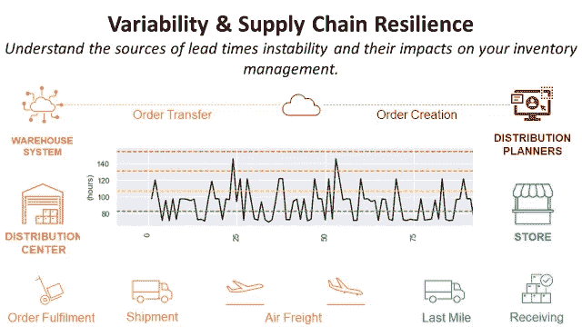
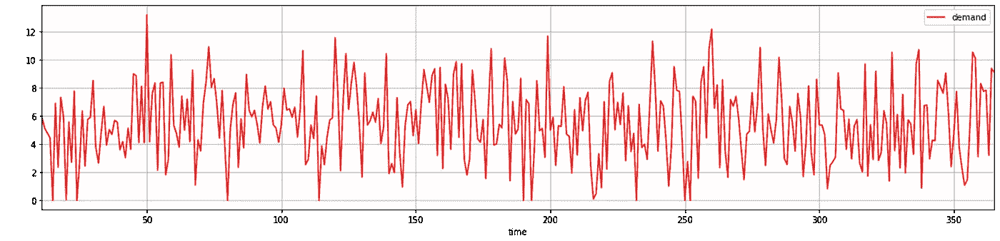
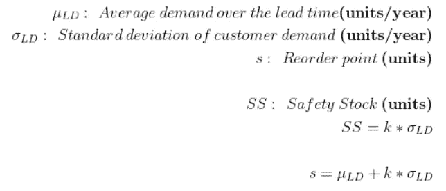
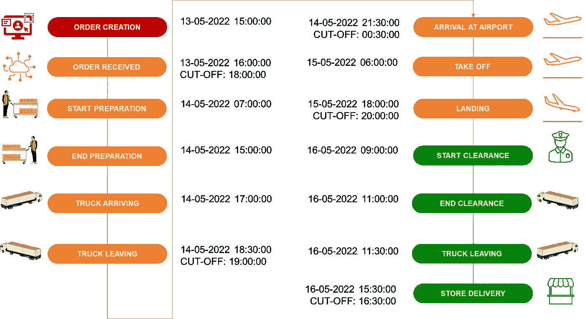
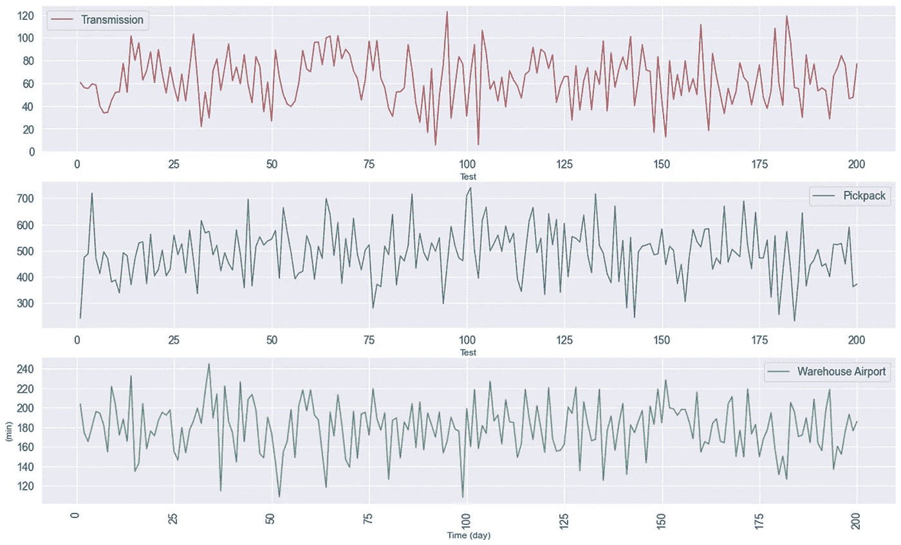
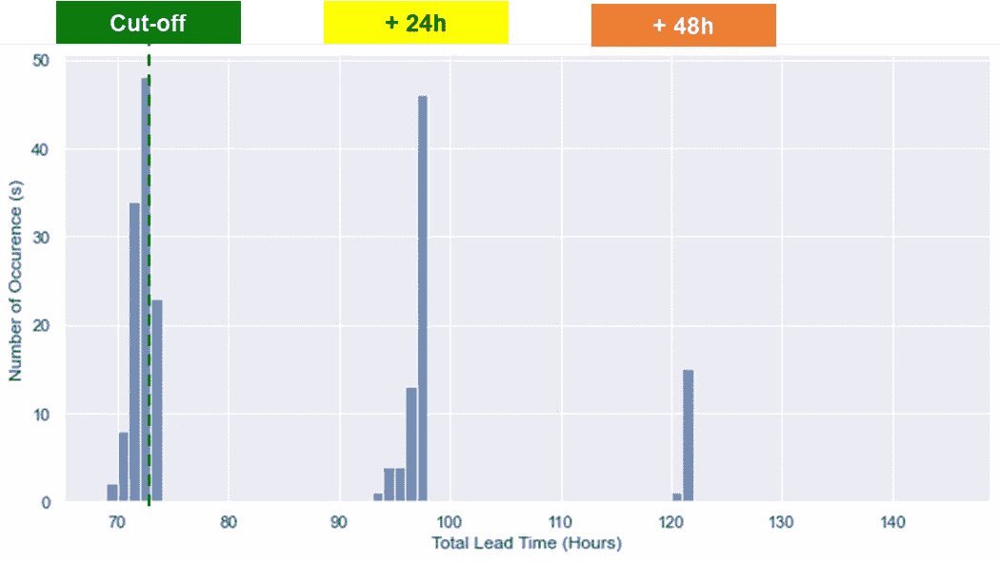
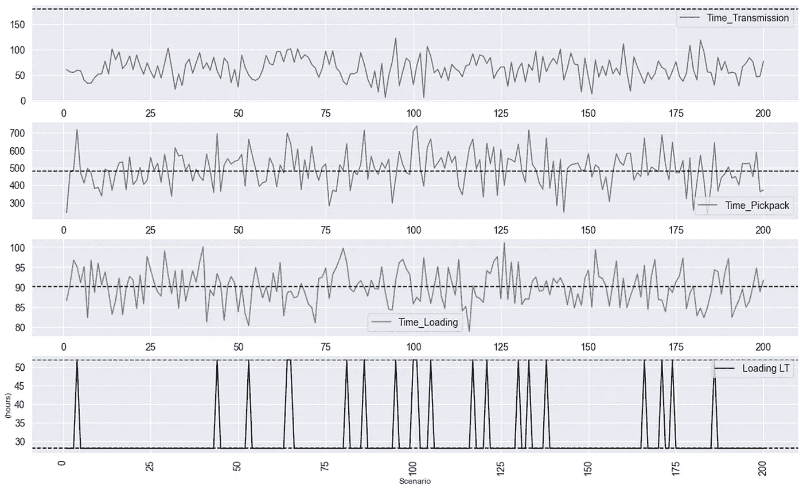
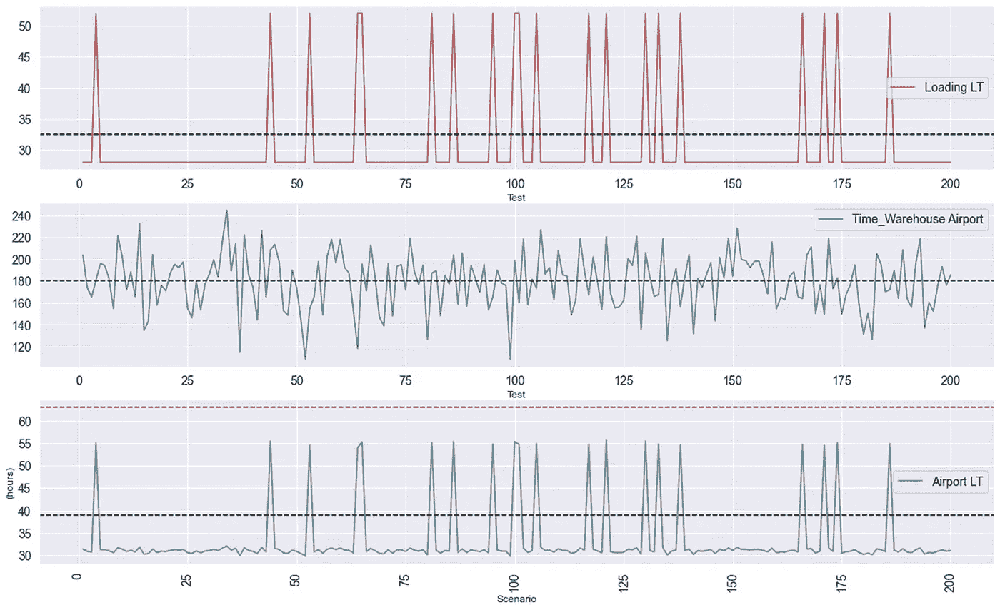
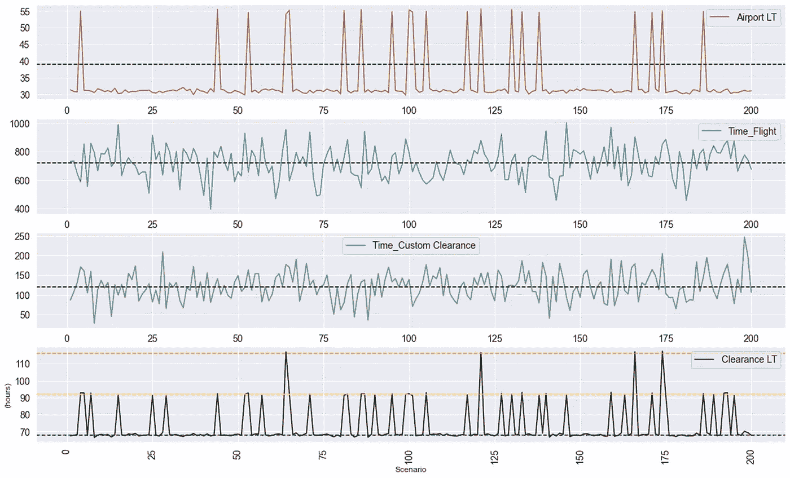
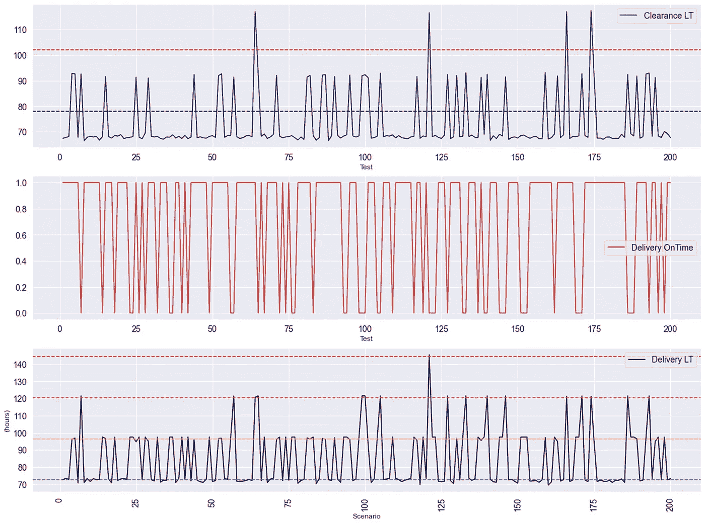

# 什么是供应链弹性？

> 原文：<https://towardsdatascience.com/lead-times-variability-and-supply-chain-resilience-f8f57f10e6f6>

## 使用 Python 来了解提前期可变性的来源及其对库存管理策略稳健性的影响。



(图片由作者提供)

**目的** 模拟流程可变性对国际物流网络性能的影响。

**库存管理** 对于一个零售集团，库存经理制定补货政策**最大限度地降低库存水平**并降低订购成本，同时**避免商店缺货**。

他们需要考虑需求的分布和**补货的提前期**。

然而，他们通常根据供应商和物流团队确定的**目标**假定**恒定的交付周期**。

在本文中，我们将了解**流程可变性**如何极大地影响这些**交付周期**并破坏供应链的**弹性。**

💌新文章直接免费放入你的收件箱:[时事通讯](https://www.samirsaci.com/#/portal/signup)

如果你愿意，你可以观看这篇文章的视频版本

# 库存管理和交付时间

作为一家**国际时装零售连锁店**的库存经理，你负责在 ERP 中设置补货规则。

**需求可变性** 你可以看到每个商店每天满足的需求。在这个例子中，我们假设需求遵循正态分布。



图 0:1 家 SKU 店的销售分布—(图片由作者提供)

**连续评审策略** 您使用:订购点、订购数量(s，Q)实施了一个**连续评审策略**。

如果水平低于最低阈值 **s，**称为安全库存**，**你再订购 **Q** 件。

**安全库存计算** 安全库存不仅要满足补货期间的需求，还要补偿需求的波动。



图 1:安全库存—(图片由作者提供)

这里的一个关键因素是**补货提前期**。如果它被低估，你可能会面临商店缺货。

有关更多信息，

<https://www.samirsaci.com/inventory-management-for-retail-stochastic-demand-2/>  

# 交付周期:期望与现实

补货提前期是订单创建和商店发货之间的时间。

## 目标交付周期(LT)

当您设计补充规则时，您使用了由**后勤团队**提供的目标提前期。

**一系列复杂的流程**
他们的职责是确保从订单创建到商场交付的任务得到最佳执行，


图 2:端到端分发—(图片由作者提供)

*   步骤 1:在 ERP 中创建补货订单
*   步骤 2:订单被传送到仓库管理系统
*   第三步:订单由仓库团队[准备和打包](https://www.youtube.com/watch?v=XejgbF2m_8g)
*   第四步:运输团队组织从配送中心到商店的[运输](https://www.youtube.com/watch?v=PYkN24PMKd8)

**截止时间** 每个步骤都有一个**目标提前期**和一个**截止时间**。



图 3:从订单创建到商店交付—(图片由作者提供)

这些截止时间会极大地影响总提前期(LT):

*   订单接收:如果在 18:00:00 之后收到订单，则无法在**(LT+24 小时)**之后的第二天准备订单
*   卡车离开:如果订单没有在 19:00:00 之前装箱，则无法在当天装货**(LT+24 小时)**
*   到达机场:如果您的货物在 00:30:00 后到达，它将错过航班 **(+24 小时 LT)**
*   落地:如果您的航班在 20:00:00 后落地，您需要多等一天才能通关 **(+24 小时 LT)**
*   商店送货:如果您的卡车在 16:30:00 之后到达，商店团队无法收到您的货物 **(+24 小时 LT)**

**💡截止时间定义**

*   订单接收、卡车离开和商店交付截止时间通常是内部约束，如果需要，可以进行调整
*   抵达机场和着陆截止时间由机场运营和海关确定

## **引入一些可变性**

在下面的例子中，不同的步骤被平滑地协调，并且截止时间被考虑，因为目标被考虑。

现在让我们引入一些围绕目标的可变性，以更好地符合物流运作的实际情况。

**💡方法** 在本次模拟中，我们不会关注这种可变性的根本原因，因为我们只想模拟其影响。

在结论中，我们将看到，我们可以通过使用数字双胞胎来影响特定于过程的参数，以坚持真实的过程，从而改进这种方法。

<http://samirsaci.com>  

# 如何用 Python 模拟供应链风险？

## 随机提前期

对于每个过程，我们在目标周围添加一些可变性来模拟操作的现实。



随机传输、提货包装和运输提前期—(图片由作者提供)

在下面的例子中，我使用正态分布变量模拟了提前期目标的变化。

以下是使用的参数:提前期(分钟)，COV (%)

```
{'Transmission': [60, 0.4], 'Pickpack': [480, 0.2], 'Loading': [90, 0.05], 'Warehouse Airport': [180, 0.15], 'Flight': [720, 0.15], 'Custom Clearance': [120, 0.3], 'Truck Preparation': [45, 0.2], 'Airport Store': [240, 0.25]}
```

## 场景模拟:结果

在正常情况下，总交付周期为 **72.5 小时。**

现在让我们测量一下这一理想结果与200 个提前期可变性模拟场景之间的差距。



模拟结果—(图片由作者提供)

结果分为四类:

*   遵守所有截止时间:交付时间非常接近 **72.5 小时**
*   +24 小时:错过 1 个截止时间
*   +48 小时:错过了 2 个截止时间

**💡截止时间影响** 由于两个截止时间之间的 24 小时时间窗口，流程中的两个小时延迟可以转化为交货时的 24 小时。

**根本原因分析** 我们很幸运，5 个截止点中只有 2 个被遗漏。现在，让我们深入了解运输的各个环节，找出根本原因。

**装货提前期**



加载提前期—(图片由作者提供)

> 对于 **20 个场景**，我们错过了装货截止时间(19:00:00 ),主要是因为拣货和包装过程中的延迟。

**💡每个流程** 订单传输延迟容差的影响:传输一个订单平均需要 1 个小时，但我们在截止时间*之前有多达 3 个小时的时间(平均时间的 300%)。*

所以错过这个截止时间的概率很低。

**提前起飞时间**



起飞—(图片由作者提供)

> 我们有**同样的 20 个场景**有很大的延迟(24 小时以上)。因此，从仓库**运输到机场没有造成任何迟到**。

**💡关注仓库运营** 我们可以看到，从中心仓库到机场的第一段行程绩效主要受装货提前期的影响。

绩效管理流程应重点关注

*   准备能力:每天可以准备多少订单？
*   开票流程:确保您的包裹一打包好就可以装货。

**提前期通关**



提前清关时间—(图片由作者提供)

> 我们现在有 **48 小时以上**的场景，以及 **24 小时以上**的附加场景。由于飞行时间造成的延误，几批货物在清关截止日期后到达**。**

**端到端分析**



端到端分析—(图片由作者提供)

在上图中，我们分析了总交付提前期:

*   **红线以上**:LT 的> 96h，因为错过了 3 个截止
*   **橙色线以上**:>LT 72h，因为错过了 2 个截止
*   **黄线上方** : >因错过 1 个切断，LT 48h
*   **绿线上方**:所有的截止点都得到尊重

我们可以在红色图中看到,**商店交付中断影响了几个场景**并增加了 24 小时以上。

**💡调整您的截止时间** 如果您只是因为最后一英里送货而延误了时间，您的卡车会在送货截止时间后几分钟到达，您可以与商场运营部讨论调整时间或安排上午送货。

# 结论

*关注我的 medium，了解更多与供应链数据科学相关的见解。*

在本例中，我们展示了目标提前期无法保证。

这些延迟交付的情况给供应链带来了不稳定性，并消耗了运营团队的大量精力。

如果您的公司正在开发先进的端到端供应链分析功能，这种分析可以实现自动化。

## 用数字双胞胎模拟这些场景

数字孪生是物理对象或系统的数字复制品。

供应链数字模型是一种计算机模型，代表供应链中涉及的各种组件和流程，如仓库、运输网络和生产设施。


使用 Python 的数字孪生示例—(图片由作者提供)

您可以模拟实际流程参数的可变性，而不是设置我们使用正态分布生成的任意流程提前期

*   准备交付时间:仓库劳动力减少 20%会有什么影响？
*   运输提前期:每辆卡车有两个司机会有什么影响？
*   发货提前期:预开发票流程的影响是什么？

然后，您可以将业务或运营计划转化为影响模型行为的参数。

对于每个场景，您可以操作与计划相关联的参数，并查看您的整体性能会降低多少。

这个数字双胞胎可以用来

*   模拟销量增长或对你的分销网络进行压力测试:我们准备好承受下个黑色星期五 50%的销售增长了吗？
*   评估你的持续改进团队设计的几个解决方案:如果我们从商店附近的当地仓库发货会怎么样？

欲知详情，

<https://www.samirsaci.com/what-is-a-supply-chain-digital-twin/>  

# 关于我

让我们连接上 [Linkedin](https://www.linkedin.com/in/samir-saci/) 和 [Twitter](https://twitter.com/Samir_Saci_) ，我是一名供应链工程师，正在使用数据分析来改善物流运作和降低成本。

如果你对数据分析和供应链感兴趣，可以看看我的网站

<https://samirsaci.com> 